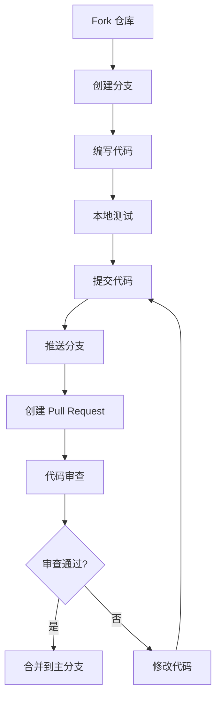

# CONTRIBUTING

感谢你对 Neoverse-Doc 项目的关注！本文档将帮助你了解如何为项目做出贡献。

## 目录

- [行为准则](#行为准则)
- [如何贡献](#如何贡献)
- [开发环境设置](#开发环境设置)
- [项目结构](#项目结构)
- [代码规范](#代码规范)
- [提交规范](#提交规范)
- [文档规范](#文档规范)
- [Pull Request 流程](#pull-request-流程)
- [国际化指南](#国际化指南)

## 行为准则

本项目采用开放、友好的协作方式。参与贡献即表示你同意遵守以下原则：

- 尊重所有贡献者
- 接受建设性的批评和建议
- 关注对社区最有利的事情
- 对他人保持同理心

## 如何贡献

### 报告 Bug

如果你发现了 Bug，请通过 [GitHub Issues](https://github.com/SSJ-ZYJ/Neoverse-Doc/issues) 提交报告。提交前请：

1. 检查是否已有相同问题的 Issue
2. 使用清晰的标题描述问题
3. 提供复现步骤、预期结果和实际结果
4. 附上相关环境信息（Node.js 版本、操作系统等）

### 提出新功能

欢迎提出新功能建议！请通过 [GitHub Issues](https://github.com/SSJ-ZYJ/Neoverse-Doc/issues) 提交，并详细描述：

- 功能的用途和价值
- 可能的实现方式
- 是否有替代方案

### 提交代码

通过 Pull Request 提交代码贡献，详见 [Pull Request 流程](#pull-request-流程)。

## 开发环境设置

### 前置要求

- **Node.js** >= 20
- **Bun** >= 1.0
- **Git**

### 安装步骤

```bash
# 1. Fork 并克隆项目
git clone https://github.com/<your-username>/Neoverse-Doc.git
cd Neoverse-Doc

# 2. 添加上游仓库
git remote add upstream https://github.com/SSJ-ZYJ/Neoverse-Doc.git

# 3. 安装依赖
bun install

# 4. 启动开发服务器
bun dev
```

浏览器打开 `http://localhost:3000` 即可预览。

### 可用命令

| 命令 | 说明 |
| :--- | :--- |
| `bun dev` | 启动开发服务器 (Turbopack) |
| `bun run build` | 生产构建 |
| `bun run typecheck` | TypeScript 类型检查 |
| `bun run lint` | Biome Lint 检查 |
| `bun run format` | Biome 格式化 |
| `bun run check` | Biome 格式化 + Lint + 自动修复 |

## 项目结构

```text
Neoverse-Doc/
├── content/docs/              # 文档内容（MDX），按语言子目录组织
│   ├── zh/                    # 中文文档
│   └── en/                    # 英文文档
├── src/
│   ├── app/                   # Next.js App Router 页面
│   ├── components/            # React 组件
│   ├── dictionaries/          # i18n 语言包
│   └── lib/                   # 工具函数和配置
├── source.config.ts           # fumadocs-mdx 配置
├── next.config.ts             # Next.js 配置
├── biome.json                 # Biome 格式化与 Lint 规则
└── tsconfig.json              # TypeScript 配置
```

## 代码规范

### 编码原则

1. **禁止硬编码**：所有用户可见的文本必须使用 i18n 本地化处理
2. **添加注释**：新增代码需添加功能描述注释
3. **遵循技术栈**：使用 `package.json` 中定义的依赖版本
4. **类型安全**：充分利用 TypeScript 类型系统

### 代码风格

本项目使用 Biome 进行代码格式化和 Lint 检查：

```bash
# 格式化代码
bun run format

# 检查并自动修复
bun run check
```

### 命名规范

| 类型 | 规范 | 示例 |
| :--- | :--- | :--- |
| 文件名 | 小写 + 连字符 | `guestbook.tsx` |
| 组件名 | PascalCase | `Guestbook` |
| 函数名 | camelCase | `getDictionary` |
| 常量 | UPPER_SNAKE_CASE | `DEFAULT_LOCALE` |
| CSS 类 | 小写 + 连字符 | `liquid-glass` |

## 提交规范

提交信息格式：`<修改类型>(<作用域>): <修改的内容>`

### 修改类型

| 类型 | 说明 |
| :--- | :--- |
| `feat` | 新增功能 |
| `fix` | 修复 Bug |
| `docs` | 文档变更 |
| `style` | 格式化变更（不影响代码运行） |
| `refactor` | 代码重构（不影响功能） |
| `test` | 测试变更 |
| `chore` | 构建过程或辅助工具变更 |
| `ci` | 持续集成相关变更 |
| `revert` | 回滚到之前的版本 |

### 示例

```text
feat(i18n): 新增日语语言支持
fix(search): 修复搜索结果高亮显示异常
docs(readme): 更新安装步骤说明
refactor(components): 重构 Mermaid 组件渲染逻辑
```

### 提交信息规则

- 摘要使用中文描述
- 摘要控制在 10 个英文单词以内
- 如改动较多，在正文部分详细列出其他内容
- 正文与摘要之间保留一个空行

## 文档规范

### 文档命名

- 使用英文命名，与文档内容相关
- 使用下划线分隔单词，例如：`getting_started.md`
- 大小写敏感

### 文档语言

- 首期文档仅提供简体中文版本
- 英文版本使用 `_en.md` 后缀，例如：`README_en.md`
- 代码注释保留中英双语习惯（英文在上、中文在下）

### 文档格式

- 使用 Markdown 格式编写
- 流程图使用 Mermaid 语法
- 代码块使用适当的语言标识
- 中英文之间使用半角空格分隔
- 英文关键字、命令、文件名使用反引号包裹

### 添加新文档

1. 在 `content/docs/zh/` 对应目录下创建 `.md` 或 `.mdx` 文件
2. 添加 frontmatter：

   ```md
   ---
   title: 页面标题
   description: 页面描述
   ---
   ```

3. 在对应目录的 `meta.json` 中注册新页面
4. 如需英文版本，在 `content/docs/en/` 创建对应文件

## Pull Request 流程

### 提交前检查

- [ ] 已更新相关文档
- [ ] 已更新 `meta.json`（如新增文档）
- [ ] 代码通过类型检查：`bun check`
- [ ] 代码通过 Lint 检查：`bun lint`
- [ ] 代码已格式化：`bun format`
- [ ] 本地构建成功：`bun run build`

### 流程步骤



1. **Fork 仓库**：在 GitHub 上 Fork 本项目

2. **创建分支**：从 `main` 分支创建功能分支

   ```bash
   git checkout -b feat/your-feature-name
   ```

3. **编写代码**：按照代码规范进行开发

4. **本地测试**：确保所有检查通过

   ```bash
   bun run typecheck
   bun run check
   bun run build
   ```

5. **提交代码**：按照提交规范编写提交信息

   ```bash
   git add .
   git commit -m "feat(scope): 功能描述"
   ```

6. **推送分支**：

   ```bash
   git push origin feat/your-feature-name
   ```

7. **创建 Pull Request**：
   - 在 GitHub 上创建 Pull Request
   - 填写 PR 模板，描述改动内容
   - 关联相关 Issue（如有）

8. **代码审查**：等待维护者审查，根据反馈修改

### PR 标题规范

PR 标题应遵循与提交信息相同的格式：

```text
feat(i18n): 新增日语语言支持
```

## 国际化指南

### 添加新语言（示例）

1. 在 `src/lib/i18n.ts` 中添加语言配置：

   ```typescript
   export const i18n = defineI18n({
     locales: ['zh', 'en', 'ja'],  // 新增 'ja'
     defaultLocale: 'zh',
   });
   ```

2. 在 `src/dictionaries/` 创建语言包文件 `ja.ts`

3. 在 `src/dictionaries/index.ts` 中导入并注册

4. 在 `content/docs/` 创建 `ja/` 目录并翻译文档

5. 在 `src/lib/layout.shared.tsx` 添加 fumadocs UI 翻译

### 翻译原则

- 保持专业术语的一致性
- 尊重目标语言的表达习惯
- 代码示例中的注释也需翻译
- 保持 Markdown 格式不变

---

再次感谢你对 Neoverse-Doc 的贡献！如有任何问题，欢迎通过 [GitHub Issues](https://github.com/SSJ-ZYJ/Neoverse-Doc/issues) 或 [Email](mailto:me@shenshijun.space) 与我们交流。
