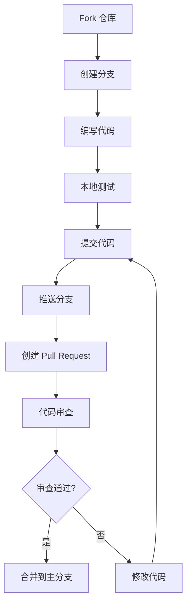

# 参与贡献

首先,感谢你对 Neoverse-Docs 项目的关注！本文档将帮助你了解如何为项目做出贡献。

## 目录

- [行为准则](#行为准则)
- [如何贡献](#如何贡献)
- [开发环境设置](#开发环境设置)
- [项目结构](#项目结构)
- [代码规范](#代码规范)
- [提交规范](#提交规范)
- [文档规范](#文档规范)
- [Pull Request 流程](#pull-request-流程)
- [国际化指南](#国际化指南)

## 行为准则

本项目采用开放、友好的协作方式。参与贡献即表示你同意遵守以下原则：

- 尊重所有贡献者
- 接受建设性的批评和建议
- 关注对社区最有利的事情
- 对他人保持同理心

## 如何贡献

### 报告 Bug

如果你发现了 Bug，请通过 [GitHub Issues](https://github.com/SSJ-ZYJ/Neoverse-Doc/issues) 提交报告。提交前请：

1. 检查是否已有相同问题的 Issue
2. 使用清晰的标题描述问题
3. 提供复现步骤、预期结果和实际结果
4. 附上相关环境信息（Node.js 版本、操作系统等）

### 提出新功能

欢迎提出新功能建议！请通过 [GitHub Issues](https://github.com/SSJ-ZYJ/Neoverse-Doc/issues) 提交，并详细描述：

- 功能的用途和价值
- 可能的实现方式
- 是否有替代方案

### 提交代码

通过 Pull Request 提交代码贡献，详见 [Pull Request 流程](#pull-request-流程)。

## 开发环境设置

### 前置要求

- **Node.js** >= 20
- **Bun** >= 1.0
- **Git**

### 安装步骤

```bash
# 1. Fork 并克隆项目
git clone https://github.com/<your-username>/Neoverse-Doc.git
cd Neoverse-Doc

# 2. 添加上游仓库
git remote add upstream https://github.com/SSJ-ZYJ/Neoverse-Doc.git

# 3. 安装依赖
bun install

# 4. 启动开发服务器
bun dev
```

浏览器打开 `http://localhost:3000` 即可预览。

### 可用命令

| 命令 | 说明 |
| :--- | :--- |
| `bun dev` | 启动开发服务器 (Turbopack) |
| `bun run build` | 生产构建 |
| `bun run typecheck` | TypeScript 类型检查 |
| `bun run lint` | Biome Lint 检查 |
| `bun run format` | Biome 格式化 |
| `bun run check` | Biome 格式化 + Lint + 自动修复 |

## 项目结构

```text
Neoverse-Doc/
├── content/docs/              # 文档内容（MDX），按语言子目录组织
│   ├── zh/                    # 中文文档
│   └── en/                    # 英文文档
├── src/
│   ├── app/                   # Next.js App Router 页面
│   ├── components/            # React 组件
│   │   ├── home/              # 首页业务组件（含学习导航与计算主题背景）
│   │   ├── react-bits/        # 本地化底层动效（不得直接充当页面业务 API）
│   │   ├── transition/        # 集中式页面转场策略、Provider、Layer 与 Link
│   │   ├── mdx/               # MDX 内容渲染组件
│   │   ├── search.tsx         # 静态搜索对话框
│   │   ├── guestbook.tsx      # Giscus 评论组件
│   │   ├── immersive-interaction-controller.tsx # 点击 / 拖拽粒子预算、节流与清理
│   │   └── sidebar-provider.tsx # 侧栏折叠状态持久化
│   ├── dictionaries/          # i18n 语言包
│   ├── lib/                   # 工具函数和配置
│   │   ├── motion-config.ts   # JavaScript 动效时长、缓动与降级检测
│   │   ├── home-sections.ts   # 首页章节树提取
│   │   └── ...                # 其他工具
│   └── styles/                # 模块化 CSS 样式表
│       ├── theme.css          # 主题变量与色彩系统
│       ├── tokens.css         # 语义设计 Token
│       ├── motion.css         # 统一动效与降级
│       ├── immersive-interactions.css # 控件光感、点击粒子与降级
│       ├── glass.css          # 玻璃基础、业务表面与控件
│       ├── fumadocs-glass.css # Fumadocs 表面玻璃化覆盖
│       ├── typography.css     # 排版样式
│       ├── pages/             # 首页、文档与特殊页面样式
│       ├── transitions.css    # 页面转场样式
│       └── a11y.css           # 无障碍样式
├── source.config.ts           # fumadocs-mdx 配置
├── next.config.ts             # Next.js 配置
├── biome.json                 # Biome 格式化与 Lint 规则
└── tsconfig.json              # TypeScript 配置
```

## 代码规范

### 编码原则

1. **禁止硬编码**：所有用户可见的文本必须使用 i18n 本地化处理
2. **添加注释**：新增代码需添加功能描述注释
3. **遵循技术栈**：使用 `package.json` 中定义的依赖版本
4. **类型安全**：充分利用 TypeScript 类型系统
5. **动效隔离**：命令式挂载的视觉特效必须使用宿主直属层，禁止覆盖业务组件已有的定位、布局属性或接管内部控件的指针事件
6. **设计 Token**：业务组件不得散落颜色、圆角、阴影和动效时长，优先使用 `src/styles/tokens.css` 中的语义变量
7. **转场集中**：内部导航使用 `TransitionLink` 或交由 `TransitionProvider` 捕获，禁止在业务按钮中重复实现路由分类、DOM 快照和点击坐标协议；由 Provider 管理的客户端导航必须在目标模板挂载前写入 pending 标记，目标模板不得再次播放直达加载动画；包含固定模糊环境层的长页面不得执行整页 `transform`，应将入场收束限定在轻量内容区域
8. **效果分层**：页面使用 `HeroTitle`、`ChapterGrid`、`DocCard` 等业务组件；React Bits 本地化组件只作为底层实现，并必须提供触摸、移动端与 `prefers-reduced-motion` 降级
9. **滚动动效**：优先使用支持渐进增强的 CSS 视图时间线；必须保留无时间线浏览器的静态背景，并提供 `prefers-reduced-motion` 降级
10. **Fumadocs 属性**：标题锚点使用空 `data-card`，真正卡片使用 `data-card="true"`；样式和粒子选择器必须区分二者，禁止给 Markdown 标题添加卡片背景
11. **文本与容器层级**：品牌文字、Markdown 标题和代码标签页文字保持无框；玻璃背景、描边与圆角由其外层导航、卡片或标签栏容器统一提供
12. **圆角层级**：Markdown 卡片、TOC、悬浮栏与二级弹层复用 `--radius-md`；按钮、菜单项与头像复用 `--radius-xs`。宽屏 TOC 保持无侧边分隔线，避免额外切割阅读画布
13. **缩放与粒子宿主**：Mermaid 必须保留各图型渲染器提供的原生 `viewBox`，仅在绘制内容确实越界时扩展边界；初始画布按阅读宽度与浏览器视口高度中更严格的约束等比适配，且自动适配比例必须独立于用户交互比例，确保工具栏初始及重置状态始终为 `100%`。影响标签字体、字重、行高或边界的样式必须通过 Mermaid `themeCSS` 在测量阶段提供，禁止在 SVG 注入后再改变文字度量；所有 HTML 标签的 `foreignObject` 必须保持溢出可见，Git Graph 分支文字应根据实际字形与背景边界进行居中。Git Graph 必须通过图型专属 class 映射全部八个分支槽、特殊提交和标签样式，禁止让通用 `.label` 或 `darkMode` 派生色把分支、提交点与文字覆盖成同一种颜色。代码视图必须使用与渲染画布相同的可用宽度，按源码自然高度展示，并以对应渲染图的实际显示高度作为长源码滚动上限；全屏态不得另设源码宽度上限。工具栏缩放只能改变画布内部 SVG，禁止使用交互缩放值改变画布布局尺寸；滚轮缩放只能在全屏渲染视图中拦截，并必须通过同步补偿平移量将缩放中心锚定在鼠标位置，页面内图表与代码视图保留原生滚动。工具栏必须按视图、缩放和画布操作组织为共享底板的紧凑分段，统一复用项目圆角与按压尺度，不得混用圆形按钮和孤立分隔线；分组不得单独描边，整条工具栏只保留最外层发丝边。按钮悬浮、激活与激活悬浮状态必须使用 Mermaid 专属语义 Token，并在深浅玻璃表面上保持逐级增强且可辨识的对比度；悬浮与激活底色必须保留透明度，使后方图表或代码仍可透出。组合工具栏需要以共享外层作为粒子宿主，首批粒子应分散出生并直接展开，避免反馈被切碎或先叠成单点；紧凑 CTA 可使用更小的出生圆环，但不得退化为单点闪烁。Mermaid wrapper 的页面模糊必须由独立基底伪元素承载，wrapper 本身不得建立阻断工具栏采样的 Backdrop Root；普通与全屏工具栏必须复用同一套强模糊 Token，并将玻璃背景与交互控件拆分为独立合成层；工具栏容器自身不得承担 `backdrop-filter`，背景层仍需复用共享玻璃类以保留减少透明度降级，且其定位祖先不得使用 `transform` 建立额外合成层；普通模式复用标准玻璃底色、折射描边和主题阴影，全屏模式通过语义 Token 使用更轻透的玻璃底色，且不得在工具栏祖先上执行 `opacity` 入场动画以免延迟背景采样
14. **代码 Tabs 层级**：代码 Tabs 仅允许根容器保留 `--radius-md`，内部 tablist、tabpanel、文件栏与代码块不得重复设置圆角；Tab 标签 hover 保持透明，整个 Tabs 根容器作为统一粒子宿主，粒子层需要同时覆盖语言栏与代码面板
15. **内缩表面交互**：使用 `::before` 绘制的内缩玻璃条必须以伪元素的实际几何范围作为粒子命中、hover 与裁剪边界；移动端悬浮标题栏由圆角外层承载 hover、active 与粒子反馈，内部按钮不得重复着色或缩放
16. **悬浮轮廓**：卡片与控件的锐利 hover 描边必须由宿主真实 border 提供，外层阴影仅负责柔光；伪元素描边不得使用负 inset 扩大边界，避免其圆角轮廓与实际内容边缘错位
17. **Giscus 主题与布局**：宿主在 `src/styles/giscus.css` 中保持透明无框并仅负责宽度约束；文档评论区必须通过 `DocsCommunity` 作为 `#nd-docs-layout` 的独立 Grid 子节点呈现，社区卡片与正文卡片共享边框、圆角、背景和阴影规则，但 Giscus 内容必须跟随页面自然高度，禁止使用固定高度、内部滚动或 `overscroll-behavior` 截断页面滚动，也禁止重新放入 `DocsPage` 或 `DocsBody`。跨域 iframe 主题维护在 `public/giscus-light.css` 与 `public/giscus-dark.css`。宿主 `iframe` shadow part 的 `color-scheme` 必须与站点最终主题同步，两套 iframe 主题必须显式清空 `html`、`body` 与 `.gsc-main` 根画布，禁止系统主题在半透明表面后产生黑底串色。表情汇总区保持透明无框；评论卡片 / 弹层、输入组合、按钮 / 头像分别映射 `--radius-md`、`--radius-sm`、`--radius-xs` 对应尺寸。文本区与 Markdown 提示栏只允许一个 `--radius-sm` 外壳，内部不得重复设置圆角，滚动条也不得破坏右侧圆角。深色评论外框必须使用平面色阶和中性冷色内描边，禁止方向性高亮渐变或大面积蓝色外发光；表情弹层应使用更低不透明度的独立折射表面和更强背景模糊，保持文档背景可感知；深色主按钮必须使用低亮度表面、浅色文字和克制的折射高光，不得复用浅色主题的高亮渐变。宿主可禁止误选，但不得通过 `pointer-events` 阻断 iframe 内部交互
18. **阅读宽度**：常规视口使用 `--reading-max`，仅在侧栏、正文与目录之间空间充足的宽屏断点切换到 `--reading-wide-max`；`#nd-page`、正文和移动 TOC 必须共用同一响应式宽度变量，并通过自动外边距与 `justify-self` 保持居中。桌面 `#nd-toc` 容器必须通过 `justify-self: end` 与逻辑外边距贴齐最右网格列，目录文字仍保持起始对齐
19. **长文档性能**：MDX 组件必须通过共享注册表维护；纯展示主体优先保持服务端渲染，交互只保留最小客户端边界；Mermaid 等重型依赖必须动态导入并按视口激活；复杂离屏内容块使用 `content-visibility` 时必须通过稳定的 `[data-docs-body]` 标记限定范围，并提供固有尺寸与打印回退；禁止让每个内容块各自执行未合并的滚动状态更新；主题切换必须由 `next-themes` 临时停用 CSS 过渡，避免代码块与高亮节点随文章长度线性增加动画开销；嵌套玻璃不得重复执行 `backdrop-filter`，持续动画优先使用 `transform` / `opacity` 合成；首页无限环境动效必须复用 `MOTION_FRAME_RATE.homepageAmbient` 的共享时钟，不得分别按显示器刷新率持续提交；触摸粒子等高频反馈必须按帧批量读写
20. **首页页脚**：外层必须保持透明或使用与首页画布同源的渐变延续，禁止使用独立通栏纯色切断场景；项目元信息统一放入使用语义 Token 的悬浮玻璃面，版权作者与项目修订信息保持上下两行，行内间距由结构化分组控制，并分别验证深色、浅色与移动端布局
21. **Markdown 任务清单**：标准 `- [ ]` / `- [x]` 语法由共享 MDX 列表项组件渐进增强；普通列表必须继续保持服务端原生渲染，任务状态按页面与任务文本持久化，并在读取浏览器存储时校验数据；勾选动画只允许在直接交互时触发，优先使用 `transform` 与 `opacity`，并为粗指针设备及 `prefers-reduced-motion` 提供降级；仅当文章 frontmatter 配置 `todoProgress: true` 时，文档正文顶部才使用项目卡片样式汇总当前页面已完成项与任务总数，并提供定位到文末任务清单对应章节标题的键盘可访问操作；该操作必须使用 Fumadocs 自动生成的标题 Hash，禁止重复计算滚动坐标或使用 `scrollIntoView` 接管定位，普通点击仅临时启用遵循 `prefers-reduced-motion` 的 CSS 平滑滚动；TODO 深跳转后必须保持当前文档的延迟正文区块实体化，直至页面卸载，任务跳转不得依赖评论区高度或加载状态
22. **块内内容对齐**：折叠块等内容面板中的直属有序列表标记及代码块外边缘应与相邻正文的内容边缘对齐；代码块保留自身圆角与内部滚动，嵌套列表继续保留层级缩进，禁止通过全局选择器改变普通正文布局
23. **DocCard 信息层级**：资源卡片使用语义图标、标题、描述、目标域名与跳转反馈组成紧凑层级，禁止以固定大高度制造无效留白；外部资源优先懒加载目标官网声明的透明 SVG 图标，无矢量资源时使用官网 favicon，加载失败必须保留默认矢量图标，并通过原生链接在新标签页安全打开；移动端必须取消单卡实时 `backdrop-filter`，并为 `prefers-reduced-motion` 移除位移动画
24. **MDX 编辑器预览**：文档新增项目自定义组件时，必须同步从 `src/components/mdx/mdx-preview-shims.tsx` 导出，并在 `.mdx-previewrc.json` 中注册组件名，避免 VS Code MDX Preview 将其识别为未知组件
25. **搜索范围**：章节级搜索筛选必须使用 Fumadocs 原生 `tag` 能力；索引标签取页面首级 slug，筛选项从当前语言页面树生成并通过单个可滚动下拉菜单展示；菜单必须使用项目语义 Token 适配深浅主题，禁止额外硬编码章节名称、维护重复映射、依赖系统原生菜单配色或使用会随章节数量横向增长的控件
26. **阅读返回点**：仅正文内普通的同源跨文档链接可以记录阅读返回点；外链、新窗口、下载、同页 Hash 与 Fumadocs 前后篇导航必须保留原生行为。返回数据需要经过类型校验、限制有效期，并记录来源链接的正文元素路径与视口相对位置；绝对滚动位置只能作为路径失效时的兜底。返回时必须暂时关闭原生滚动恢复与滚动锚定，展开 `content-visibility` 延迟区块，并在不可见状态完成位置校正，禁止向用户展示程序化视口滚动。悬浮操作使用 Portal 挂载到页面根节点，避免改变 `DocsPage` 网格结构

### 代码风格

本项目使用 Biome 进行代码格式化和 Lint 检查：

```bash
# 格式化代码
bun run format

# 检查并自动修复
bun run check
```

### 命名规范

| 类型 | 规范 | 示例 |
| :--- | :--- | :--- |
| 文件名 | 小写 + 连字符 | `guestbook.tsx` |
| 组件名 | PascalCase | `Guestbook` |
| 函数名 | camelCase | `getDictionary` |
| 常量 | UPPER_SNAKE_CASE | `DEFAULT_LOCALE` |
| CSS 类 | 小写 + 连字符 | `liquid-glass` |

## 提交规范

提交信息格式：`<修改类型>(<作用域>): <修改的内容>`

### 修改类型

| 类型 | 说明 |
| :--- | :--- |
| `feat` | 新增功能 |
| `fix` | 修复 Bug |
| `docs` | 文档变更 |
| `style` | 格式化变更（不影响代码运行） |
| `refactor` | 代码重构（不影响功能） |
| `test` | 测试变更 |
| `chore` | 构建过程或辅助工具变更 |
| `ci` | 持续集成相关变更 |
| `revert` | 回滚到之前的版本 |

### 示例

```text
feat(i18n): 新增日语语言支持
fix(search): 修复搜索结果高亮显示异常
docs(readme): 更新安装步骤说明
refactor(components): 重构 Mermaid 组件渲染逻辑
```

### 提交信息规则

- 摘要使用中文描述
- 摘要控制在 10 个英文单词以内
- 如改动较多，在正文部分详细列出其他内容
- 正文与摘要之间保留一个空行

## 文档规范

### 文档命名

- 使用英文命名，与文档内容相关
- 使用下划线分隔单词，例如：`getting_started.md`
- 大小写敏感

### 文档语言

- 首期文档仅提供简体中文版本
- 英文版本使用 `_en.md` 后缀，例如：`README_en.md`
- 代码注释保留中英双语习惯（英文在上、中文在下）

### 文档格式

- 使用 Markdown 格式编写
- 流程图使用 Mermaid 语法
- 数学公式使用 LaTeX 语法，行内公式写作 `$...$`，块级公式写作 `$$...$$`
- 代码块使用适当的语言标识
- 中英文之间使用半角空格分隔
- 英文关键字、命令、文件名使用反引号包裹

### 添加新文档

1. 在 `content/docs/zh/` 对应目录下创建 `.md` 或 `.mdx` 文件
2. 添加 frontmatter：

   ```md
   ---
   title: 页面标题
   description: 页面描述
   author:
     - "主要作者(https://github.com/your-name)"
   contributors:
     - "贡献者(https://github.com/contributor-name)"
   ---
   ```

   `author` 会在文档开头显示为主要编写者；`contributors` 会在正文末尾显示为本文档贡献者，并兼容单数写法 `contributor`。两者均支持 `Name(https://github.com/name)` 格式以自动显示 GitHub 头像。

3. 在对应目录的 `meta.json` 中注册新页面
4. 如需英文版本，在 `content/docs/en/` 创建对应文件

### 多语言代码块（Tabs）

当同一段逻辑需要以多种编程语言呈现时（例如 C++ / Python / Java 三份等价实现），使用 Fumadocs 内置的 `<Tabs>` 组件。该写法需要文件后缀为 `.mdx`（普通的 `.md` 仍可继续使用，二者并存）。

最小模板：

````mdx
<Tabs groupId="language" persist items={['C++', 'Python', 'Java']}>

<Tab value="C++">

```cpp
// src/algo/sort.cpp
#include <algorithm>
void demo() {}
```

</Tab>

<Tab value="Python">

```python
# src/algo/sort.py
def demo():
    pass
```

</Tab>

<Tab value="Java">

```java
// src/algo/Sort.java
class Sort { static void demo() {} }
```

</Tab>

</Tabs>
````

要点：

- `groupId="language"` 让同页面所有同 `groupId` 的 Tabs 联动；加上 `persist` 后用户选择会被写入 `localStorage`，跨页面、跨刷新均保留。
- `items` 数组顺序决定 Tab 顺序，`<Tab value="...">` 必须与 `items` 中的字符串完全一致。
- 每个 `<Tab>` 内可放任意 Markdown 内容，并不限定代码块；代码块首行注释（如 `// src/foo.cpp`）仍会被自动提取为文件路径标题，复制按钮、Shiki 高亮等装饰与普通代码块完全一致。
- 多语言代码块的语言选择条与内部代码块共用一个点击粒子表面，内部复制操作不会形成独立的粒子区域。
- 完整的运行示例见 [`content/docs/zh/about/code-tabs-demo.mdx`](content/docs/zh/about/code-tabs-demo.mdx)。

### AI 摘要折叠块

当需要收纳 AI 生成的摘要内容时，使用 `[!DETAILS-AI]` 变体。它继承普通折叠块语法，并在读者展开后以自适应打字机效果分批显示正文；内容较长时会自动加快显示速度。

```md
> [!DETAILS-AI] AI 生成摘要
>
> 这里填写 AI 生成的摘要正文。
```

## Pull Request 流程

### 提交前检查

- [ ] 已更新相关文档
- [ ] 已更新 `meta.json`（如新增文档）
- [ ] 代码通过类型检查：`bun check`
- [ ] 代码通过 Lint 检查：`bun lint`
- [ ] 代码已格式化：`bun format`
- [ ] 本地构建成功：`bun run build`

### 流程步骤


```mermaid
flowchart TD
    A[Fork 仓库] --> B[创建分支]
    B --> C[编写代码]
    C --> D[本地测试]
    D --> E[提交代码]
    E --> F[推送分支]
    F --> G[创建 Pull Request]
    G --> H[代码审查]
    H --> I{审查通过?}
    I -->|是| J[合并到主分支]
    I -->|否| K[修改代码]
    K --> E
```

1. **Fork 仓库**：在 GitHub 上 Fork 本项目

2. **创建分支**：从 `main` 分支创建功能分支

   ```bash
   git checkout -b feat/your-feature-name
   ```

3. **编写代码**：按照代码规范进行开发

4. **本地测试**：确保所有检查通过

   ```bash
   bun run typecheck
   bun run check
   bun run build
   ```

5. **提交代码**：按照提交规范编写提交信息

   ```bash
   git add .
   git commit -m "feat(scope): 功能描述"
   ```

6. **推送分支**：

   ```bash
   git push origin feat/your-feature-name
   ```

7. **创建 Pull Request**：
   - 在 GitHub 上创建 Pull Request
   - 填写 PR 模板，描述改动内容
   - 关联相关 Issue（如有）

8. **代码审查**：等待维护者审查，根据反馈修改

### PR 标题规范

PR 标题应遵循与提交信息相同的格式：

```text
feat(i18n): 新增日语语言支持
```

## 国际化指南

### 添加新语言（示例）

1. 在 `src/lib/i18n.ts` 中添加语言配置：

   ```typescript
   export const i18n = defineI18n({
     locales: ['zh', 'en', 'ja'],  // 新增 'ja'
     defaultLocale: 'zh',
   });
   ```

2. 在 `src/dictionaries/` 创建语言包文件 `ja.ts`

3. 在 `src/dictionaries/index.ts` 中导入并注册

4. 在 `content/docs/` 创建 `ja/` 目录并翻译文档

5. 在 `src/lib/layout.shared.tsx` 添加 fumadocs UI 翻译

### 翻译原则

- 保持专业术语的一致性
- 尊重目标语言的表达习惯
- 代码示例中的注释也需翻译
- 保持 Markdown 格式不变

---

再次感谢你对 Neoverse-Docs 的贡献！如有任何问题，欢迎通过 [GitHub Issues](https://github.com/SSJ-ZYJ/Neoverse-Doc/issues) 或 [Email](mailto:me@shenshijun.space) 与我们交流。
