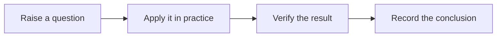

> [!DETAILS-AI] AI Summary of This Chapter
> This page targets document authors, presenting the Frontmatter, Markdown, GFM, alert and collapsible blocks, task progress, code titles, file trees, doc cards, code Tabs, LaTeX, and Mermaid currently supported by this project. New pages must be registered in `meta.json`; new MDX components also require maintaining the site registration table and the VS Code preview configuration.

## 1. Starting from a Page Skeleton

Site content lives in `content/docs/{locale}/`. You can create `.md` files when only Markdown is needed; use `.mdx` when JSX components such as `Files`, `DocGrid`, `Tabs` are needed.

### Frontmatter

Pages must provide Frontmatter conforming to `source.config.ts`. The common fields are as follows:

```yaml
---
title: Page Title
description: One sentence describing what problem the page solves
author:
  - "Main Author(https://github.com/your-name)"
contributors:
  - "Contributor(https://github.com/contributor-name)"
draft: false
todoProgress: false
---
```

| Field | Required | Description |
| :--- | :---: | :--- |
| `title` | Yes | Page title, rendered by the layout; the body does not need a first-level heading |
| `description` | Yes | Used for page metadata and content summary |
| `author` | No | Main author, accepts a string or an array of strings |
| `contributor` / `contributors` | No | Contributors, accept a string or an array of strings |
| `draft` | No | Defaults to `false`; shows a draft notice when enabled |
| `todoProgress` | No | Defaults to `false`; summarizes task progress before the body when enabled |

Do not add fields not declared by the Schema. When new content semantics are needed, extend `source.config.ts` uniformly first instead of guessing from file names, URLs, or the body.

### Headings and Paragraphs

The Frontmatter already provides the page title, so the body starts from `##`:

```md
## 1. Main Section

Keep a blank line between ordinary paragraphs.

### 1.1 Subsection

Continue writing the body.
```

## 2. Basic Markdown and GFM

### Text, Links, and Inline Code

```md
Plain text, *italic*, **bold** and ~~strikethrough~~.

Run `bun typecheck` and check `content/docs/zh/about/meta.json`.

[In-site page](/en/docs/ch0)
[External resource](https://example.com/)

```

Wrap commands, paths, config options, APIs, environment variables, and short code in backticks. Link text should state the target; do not use "click here" as the only description; images must provide meaningful alt text.

### Lists and Quotes

```md
- Use unordered lists for parallel information
- Keep the same syntactic structure for each item

1. Use ordered lists for steps with a sequence
2. State the action and the verifiable result for each step

> Quotes are used to cite or supplement context and should not replace alert boxes.
```

### Tables

| Alignment | Syntax | Suitable for |
| :--- | :---: | :--- |
| Left-aligned | `:---` | General descriptions |
| Centered | `:---:` | Short statuses |
| Right-aligned | `---:` | Numbers |

```md
| Capability | Status |
| :--- | :---: |
| Markdown | Available |
| MDX | Available |
```

Tables are suitable for side-by-side comparison; if a cell needs a long paragraph or complex steps, use subsections or lists instead.

### Task Lists

- [x] Define the page goal
- [ ] Complete the body
- [ ] Run content validation

```md
- [x] Define the page goal
- [ ] Complete the body
- [ ] Run content validation
```

This site enhances standard GFM task items into interactive tasks, with state saved per page in the current browser. If you want completion progress to appear at the top of the page, set `todoProgress: true` in the Frontmatter.

## 3. Alerts and Collapsible Content

### GitHub Alert Callouts

Choose callouts by semantics, not just by color:

> [!NOTE]
> Information needed to understand the body.

> [!TIP]
> A more efficient or safer approach.

> [!IMPORTANT]
> Conditions that must be satisfied before continuing.

> [!WARNING]
> Operations that may cause errors or data impact.

> [!CAUTION]
> Operations with destructive, security, or irreversible consequences.

> [!INFO] Custom Title
> `INFO` suits general information that does not fit the types above.

```md
> [!WARNING] Back up the config first
> The following operations will overwrite existing files.
```

Text on the marker line replaces the default title. One alert should carry one key point; avoid putting all ordinary body text into colored containers.

### Basic Collapsible Blocks

> [!DETAILS] Collapsed by default
> Suitable for supplementary explanations, advanced content, or longer examples.

> [!DETAILS+] Expanded by default
> Add `+` after `DETAILS` to make the content initially expanded.

```md
> [!DETAILS] Collapsed by default
> Supplementary content.

> [!DETAILS+] Expanded by default
> Content that is visible by default and can still be collapsed.
```

### Semantic Collapsible Blocks

| Marker | Default semantics | Suitable for |
| :--- | :--- | :--- |
| `[!DETAILS-FAQ]` | FAQ | Questions and explanations |
| `[!DETAILS-ANSWER]` | Answer | Exercise answers or reference conclusions |
| `[!DETAILS-EXAMPLE]` | Example | Longer code or complete cases |
| `[!DETAILS-HINT]` | Hint | Clues for solving problems or operating |
| `[!DETAILS-AI]` | AI Summary | AI-assisted summaries verified by humans |

> [!DETAILS-FAQ] Do I need to expand all collapsible content?
> No. The main learning path should stay in the default-visible body; collapsible content only carries optional supplements.

> [!DETAILS-HINT] Search shortcut
> Press `Ctrl + K`, or `Cmd + K` on macOS, to open this site's search.

AI summaries are content labels, not sources of truth. Summaries should be verified by the author and must not replace the necessary prerequisites, risks, and conclusions in the body.

## 4. Code Blocks

### Language Identifiers and Copying

Code fences must declare the correct language to enable syntax highlighting and language identifiers:

````md
```typescript
export function double(value: number) {
  return value * 2;
}
```
````

### File Path Titles

When the first line of a code block looks like a file name or path comment, the project extracts it into the title bar and removes it from the code body.

| Comment form | Example |
| :--- | :--- |
| Double slash | `// src/components/button.tsx` |
| Block comment | `/* src/styles/page.css */` |
| Hash | `# scripts/check.ps1` |
| HTML comment | `<!-- public/index.html -->` |

```typescript
// src/lib/example.ts
export const answer = 42;
```

Only the first-line path comment becomes a title. Ordinary explanatory comments, comments on later lines, or text that does not look like a path remain in the code.

## 5. File Trees and Doc Cards

### File Trees

Use `Files`, `Folder`, and `File` to express directory structure instead of drawing character trees by hand:

<Files>
  <Folder name="content" defaultOpen>
    <Folder name="docs" defaultOpen>
      <Folder name="zh" disabled title="Chinese content" />
      <Folder name="en" disabled title="English content" />
    </Folder>
  </Folder>
  <File name="source.config.ts" title="Content Schema" />
</Files>

```mdx
<Files>
  <Folder name="content" defaultOpen>
    <Folder name="docs" defaultOpen>
      <Folder name="zh" disabled title="Chinese content" />
      <Folder name="en" disabled title="English content" />
    </Folder>
  </Folder>
  <File name="source.config.ts" title="Content Schema" />
</Files>
```

`defaultOpen` means expanded by default; directories without children can use `disabled`; `title` provides supplementary explanation.

### Doc Cards

Cards are suitable for organizing a small number of high-value entries and should not replace ordinary links in the body:

<DocGrid>
  <DocCard title="Get Started" href="/en/docs/ch0" description="Learn about the project and choose a reading style" />
  <DocCard title="Contributing Guide" href="/en/docs/about/contributing" description="Co-build content and code" />
</DocGrid>

```mdx
<DocGrid>
  <DocCard
    title="Get Started"
    href="/en/docs/ch0"
    description="Learn about the project and choose a reading style"
  />
  <DocCard
    title="Contributing Guide"
    href="/en/docs/about/contributing"
    description="Co-build content and code"
  />
</DocGrid>
```

`DocCard` requires `title` and `href`; `description` is optional. External `http` / `https` links open in a new tab; in-site links go through the site's navigation flow. `FeatureCard` and `ResourceLink` are semantic aliases of the same visual component, and `LearningPath` is a semantic alias of `DocGrid`.

## 6. Multilingual Code Tabs

`Tabs` are used to show multiple language or tool variants of the same logic:

<Tabs groupId="example-language" persist items={['C++', 'Python']}>

<Tab value="C++">

```cpp
// examples/hello.cpp
#include <iostream>

int main() {
  std::cout << "Hello, Neoverse!\n";
}
```

</Tab>

<Tab value="Python">

```python
# examples/hello.py
print("Hello, Neoverse!")
```

</Tab>

</Tabs>

````mdx
<Tabs groupId="example-language" persist items={['C++', 'Python']}>
  <Tab value="C++">

```cpp
// examples/hello.cpp
std::cout << "Hello, Neoverse!\n";
```

  </Tab>
  <Tab value="Python">

```python
# examples/hello.py
print("Hello, Neoverse!")
```

  </Tab>
</Tabs>
````

- `items` declares the labels and their order and must correspond to the inner `Tab value`s;
- Tabs with the same `groupId` sync their available selections;
- `persist` stores the preference in browser local storage;
- When a group does not include the synced-over option, it keeps its own valid selection.

## 7. LaTeX and Mermaid

### LaTeX

Inline formulas use a single dollar sign, for example $a^2 + b^2 = c^2$. Block-level formulas occupy their own line:

$$
\int_{-\infty}^{\infty} e^{-x^2}\,dx = \sqrt{\pi}
$$

```md
Inline formula: $a^2 + b^2 = c^2$

$$
\int_{-\infty}^{\infty} e^{-x^2}\,dx = \sqrt{\pi}
$$
```

### Mermaid

Mermaid suits scenarios where flows, relationships, sequences, or states are significantly easier to understand than plain text:



After modifying Mermaid content or the diagram count, run `bun run generate:content` and check the generated SVGs and `src/features/mermaid/generated/assets.ts`; `bun run build` only verifies asset integrity and does not render.

## 8. In-Site Links and Heading Anchors

In-site links include the locale and target the actual section as precisely as possible:

```md
[File Management](/en/docs/ch1/1.1-File-Management)
[First Script](/en/docs/ch1/1.12-Shell-Basics#91-第一个脚本)
```

Heading anchors must correspond one-to-one with the rendered output: remove punctuation, replace spaces with hyphens, and keep Chinese, English, and numbers as-is. After changing a heading, check all links pointing to the old anchor.

## 9. Adding New MDX Components

When adding a new site MDX component, maintain at least the following in sync:

1. `src/components/mdx/index.ts`: register the site runtime component;
2. `src/components/mdx/mdx-preview-shims.tsx`: export the component usable in the VS Code preview;
3. `.mdx-previewrc.json`: map the component name to the preview Shim;
4. This page: provide minimal, accurate author usage.

Do not create a second set of components for mere visual differences; new components should express new content or teaching semantics.

## 10. Pre-Commit Self-Check

- [ ] Page goal, title, and description are consistent; the body starts from `##`
- [ ] All Frontmatter fields are declared in the Schema
- [ ] New pages are registered in the corresponding `meta.json`
- [ ] Code block languages, commands, paths, versions, and links have been checked
- [ ] Spacing between Chinese/English, numbers, and abbreviations is consistent
- [ ] Alerts, collapsible blocks, tables, and Mermaid each have a clear informational purpose
- [ ] Language versions that need maintenance have been synced
- [ ] `bun typecheck`, Mermaid generation, or the production build has been run per the modification scope