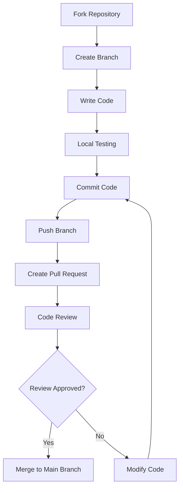

## Code of Conduct

This project adopts an open and friendly collaboration approach. By contributing, you agree to abide by the following principles:

- Respect all contributors
- Accept constructive criticism and suggestions
- Focus on what is best for the community
- Show empathy towards others

## How to Contribute

### Reporting Bugs

If you find a bug, please submit a report through [GitHub Issues](https://github.com/SSJ-ZYJ/Neoverse-Doc/issues). Before submitting:

1. Check if there is already an Issue for the same problem
2. Use a clear title to describe the problem
3. Provide reproduction steps, expected results, and actual results
4. Attach relevant environment information (Node.js version, operating system, etc.)

### Proposing New Features

New feature suggestions are welcome! Please submit them through [GitHub Issues](https://github.com/SSJ-ZYJ/Neoverse-Doc/issues) with detailed descriptions of:

- The purpose and value of the feature
- Possible implementation approaches
- Whether there are alternative solutions

### Submitting Code

Submit code contributions via Pull Request. See [Pull Request Workflow](#pull-request-workflow) for details.

## Development Environment Setup

### Prerequisites

- **Node.js** >= 20
- **Bun** >= 1.0
- **Git**

### Installation Steps

```bash
# 1. Fork and clone the repository
git clone https://github.com/<your-username>/Neoverse-Doc.git
cd Neoverse-Doc

# 2. Add upstream repository
git remote add upstream https://github.com/SSJ-ZYJ/Neoverse-Doc.git

# 3. Install dependencies
bun install

# 4. Start development server
bun dev
```

Open `http://localhost:3000` in your browser to preview.

### Available Commands

| Command | Description |
| :--- | :--- |
| `bun dev` | Start development server (Turbopack) |
| `bun run build` | Production build |
| `bun run typecheck` | TypeScript type checking |
| `bun run lint` | Biome Lint check |
| `bun run format` | Biome formatting |
| `bun run check` | Biome format + Lint + auto-fix |

## Project Structure

```text
Neoverse-Doc/
├── content/docs/              # Documentation content (MDX), organized by language subdirectories
│   ├── zh/                    # Chinese documentation
│   └── en/                    # English documentation
├── src/
│   ├── app/                   # Next.js App Router pages
│   ├── components/            # React components
│   ├── dictionaries/          # i18n language packs
│   └── lib/                   # Utility functions and configuration
├── source.config.ts           # fumadocs-mdx configuration
├── next.config.ts             # Next.js configuration
├── biome.json                 # Biome formatting and Lint rules
└── tsconfig.json              # TypeScript configuration
```

## Code Standards

### Coding Principles

1. **No Hardcoding**: All user-visible text must use i18n localization
2. **Add Comments**: New code should include functional description comments
3. **Follow Tech Stack**: Use dependency versions defined in `package.json`
4. **Type Safety**: Make full use of the TypeScript type system

### Code Style

This project uses Biome for code formatting and Lint checking:

```bash
# Format code
bun run format

# Check and auto-fix
bun run check
```

### Naming Conventions

| Type | Convention | Example |
| :--- | :--- | :--- |
| Filenames | lowercase + hyphen | `guestbook.tsx` |
| Component names | PascalCase | `Guestbook` |
| Function names | camelCase | `getDictionary` |
| Constants | UPPER_SNAKE_CASE | `DEFAULT_LOCALE` |
| CSS classes | lowercase + hyphen | `liquid-glass` |

## Commit Standards

Commit message format: `<type>(<scope>): <subject>`

### Type

| Type | Description |
| :--- | :--- |
| `feat` | New feature |
| `fix` | Bug fix |
| `docs` | Documentation changes |
| `style` | Formatting changes (does not affect code execution) |
| `refactor` | Code refactoring (does not affect functionality) |
| `test` | Test changes |
| `chore` | Build process or auxiliary tool changes |
| `ci` | CI/CD related changes |
| `revert` | Revert to a previous version |

### Examples

```text
feat(i18n): add Japanese language support
fix(search): fix search result highlight display issue
docs(readme): update installation steps
refactor(components): refactor Mermaid component rendering logic
```

### Commit Message Rules

- Summary should be described in English
- Summary should be within 10 English words
- If there are many changes, list other items in detail in the body
- Leave a blank line between the body and summary

## Documentation Standards

### Document Naming

- Use English naming, relevant to document content
- Use hyphens to separate words, e.g.: `getting-started.md`
- Case sensitive

### Document Language

- Initial documents provide Simplified Chinese version only
- English versions use corresponding English filenames
- Code comments maintain bilingual convention (English above, Chinese below)

### Document Format

- Written in Markdown format
- Flowcharts use Mermaid syntax
- Math formulas use LaTeX syntax, inline formulas written as `$…$`, block formulas written as `$$…$$`
- Code blocks use appropriate language identifiers
- Use half-width spaces between Chinese and English
- English keywords, commands, filenames are wrapped in backticks

### Adding New Documents

1. Create `.md` or `.mdx` files in the corresponding directory under `content/docs/zh/`
2. Add frontmatter:

   ```md
   ---
   title: Page Title
   description: Page Description
   author:
     - "Main Author(https://github.com/your-name)"
   contributors:
     - "Contributor(https://github.com/contributor-name)"
   ---
   ```

   `author` will be displayed at the beginning of the document as the primary writer; `contributors` will be displayed at the end of the document body as contributors to this document, and is compatible with the singular form `contributor`. Both support the `Name(https://github.com/name)` format to automatically display GitHub avatars.

3. Register the new page in `meta.json` of the corresponding directory
4. If an English version is needed, create the corresponding file in `content/docs/en/`

## Pull Request Workflow

### Pre-submission Checklist

- [ ] Related documentation has been updated
- [ ] `meta.json` has been updated (if adding new documents)
- [ ] Code passes type checking: `bun check`
- [ ] Code passes Lint check: `bun lint`
- [ ] Code has been formatted: `bun format`
- [ ] Local build succeeds: `bun run build`

### Workflow Steps



1. **Fork Repository**: Fork this project on GitHub

2. **Create Branch**: Create a feature branch from the `main` branch

   ```bash
   git checkout -b feat/your-feature-name
   ```

3. **Write Code**: Develop according to code standards

4. **Local Testing**: Ensure all checks pass

   ```bash
   bun run typecheck
   bun run check
   bun run build
   ```

5. **Commit Code**: Write commit messages according to commit standards

   ```bash
   git add .
   git commit -m "feat(scope): feature description"
   ```

6. **Push Branch**:

   ```bash
   git push origin feat/your-feature-name
   ```

7. **Create Pull Request**:
   - Create a Pull Request on GitHub
   - Fill in the PR template, describing the changes
   - Link related Issues (if any)

8. **Code Review**: Wait for maintainer review, modify based on feedback

### PR Title Standards

PR titles should follow the same format as commit messages:

```text
feat(i18n): add Japanese language support
```

## Internationalization Guide

### Adding a New Language (Example)

1. Add language configuration in `src/lib/i18n.ts`:

   ```typescript
   export const i18n = defineI18n({
     locales: ['zh', 'en', 'ja'],  // add 'ja'
     defaultLocale: 'zh',
   });
   ```

2. Create language pack file `ja.ts` in `src/dictionaries/`

3. Import and register in `src/dictionaries/index.ts`

4. Create `ja/` directory in `content/docs/` and translate documents

5. Add fumadocs UI translation in `src/lib/layout.shared.tsx`

### Translation Principles

- Maintain consistency of professional terminology
- Respect the expression habits of the target language
- Comments in code examples should also be translated
- Keep Markdown format unchanged

---

Thank you again for contributing to Neoverse-Doc! If you have any questions, feel free to communicate with us via [GitHub Issues](https://github.com/SSJ-ZYJ/Neoverse-Doc/issues) or [Email](mailto:me@shenshijun.space).
