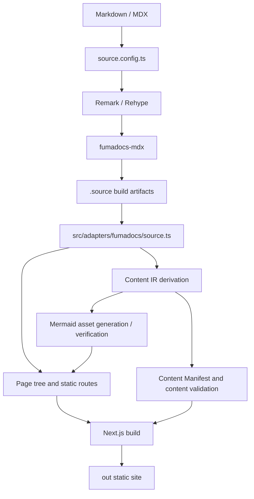

> [!DETAILS-AI] AI Summary of This Chapter
> The project clearly layers content, site components, parsing logic, generation scripts, and styling. Fumadocs compiles `content/docs/{locale}/` into a type-safe content source, Next.js generates all locales and slugs from the page tree, and the production environment outputs the `out/` static site through `output: 'export'`. Search, document sources, Mermaid assets, and site-level constants are also completed at build time or in centralized configuration. Dependency directions between architecture layers form a strict single-direction DAG, checked automatically before each build.

## 1. Directory responsibilities

```text
Neoverse-Doc/
├── content/docs/
│   ├── zh/                       # Chinese content tree
│   └── en/                       # English content tree
├── public/
│   └── mermaid/                  # Generated Mermaid SVGs
├── scripts/
│   ├── content-pipeline.ts        # Content pipeline: IR derivation, validation, and Mermaid generate / verify
│   ├── check-architecture.ts
│   └── verify-build-output.ts
├── src/
│   ├── app/                      # Routes, data reads, and page composition
│   ├── content/                  # Schema, MDX plugins, IR, search index, SEO, and Manifest
│   ├── features/                 # Docs-shell, Search, Reading, Tasks, Mermaid, Transition, Community
│   ├── runtime/                  # Navigation, Motion, and Interaction external stores
│   ├── adapters/fumadocs/        # Source, Layout config, and third-party DOM adapters
│   ├── ui/                       # Tokens, surfaces, and global styles
│   ├── components/               # Remaining shared components and MDX registry
│   ├── dictionaries/             # Project UI dictionaries
│   └── lib/                      # i18n and business-agnostic pure utilities
├── source.config.ts              # Content source, Schema, and MDX Pipeline assembly
├── next.config.ts                # Static export and Next.js configuration
└── package.json                  # Dependencies and project commands
```

### Content and implementation separation

`content/docs/` is the single primary entry point for content. Page navigation is explicitly declared by `meta.json` at each level, and per-page metadata is declared in the Frontmatter; React components and parsing plugins are not scattered across the content directory.

`src/components/mdx/` is the unified enhancement layer. Every document obtains code blocks, Mermaid, task items, Tabs, document cards, and file hierarchies through the same component registry, without per-page imports.

Mature product capabilities live under `src/features/`; navigation, motion, and interaction state shared across features is provided by `src/runtime/`. The Fumadocs Loader, Layout, TOC, and complex DOM selectors are isolated in `src/adapters/fumadocs/`. Generated artifacts go to `public/mermaid/`, `src/features/mermaid/generated/`, `.source/`, and `out/`.

### Dependency directions and the architecture check

Dependency directions between the top-level directories are guarded automatically by `scripts/check-architecture.ts` (`bun run check:architecture`, also the first step of `prebuild`). The script scans every TypeScript import under `src/` (including dynamic `import(...)`) and flags layer violations against this matrix:

| Source layer | Allowed dependencies |
| :--- | :--- |
| `app` | all lower layers (`ui` is consumed only via CSS `@import` in `globals.css`) |
| `components` | `features` `runtime` `content` `lib` `dictionaries` |
| `features` | `runtime` `content` `adapters` `lib` `dictionaries` |
| `runtime` | `adapters` |
| `content` | `adapters` `lib` `dictionaries` |
| `adapters` | `lib` |
| `lib` | none (pure utility leaf layer) |
| `dictionaries` | `lib` |

The matrix is a **strict single-direction DAG**: no two layers may reference each other. Before scanning, the script validates the matrix itself with a topological sort — any cycle fails immediately. After scanning, allowed edges with zero real imports trigger a warning so the matrix gets pruned back to the actual dependency graph (the CSS-consumed `app → ui` edge is exempted via `CSS_CONSUMED_EDGES`). `ui` and `styles` must stay CSS-only; any `.ts` / `.tsx` file there fails the check immediately.

Four additional rules:

- **Barrel rule**: any import crossing a feature boundary — from another layer or from another feature — must target the feature's `index.ts` public entry; importing an internal file under `features/A/` directly is rejected, while imports inside the feature itself are unrestricted. Public entries only expose capabilities genuinely needed across boundaries — no whole-directory re-exports.
- **Feature boundary**: feature→feature dependencies are denied by default; a direct dependency that is itself the correct business relationship is kept by registering a reason in the checker's `FEATURE_ALLOWLIST` (currently a single entry: `community → transition`, where the guestbook return navigation reuses the transition-aware `BackLink`). Real dependency edges must stay acyclic — even when every edge is allowlisted. When several features need the same piece, extract it into the layer it truly belongs to (`runtime` / `content` / `lib`) instead of copying code or creating a `shared/` junk drawer.
- **Exception list**: the `EXCEPTIONS` mechanism is kept but currently empty — the four historical bridge exceptions were eliminated through proper boundaries (the `features/docs-shell` migration and `baseOptions` dependency injection). New exceptions require a strong documented reason.
- **Adapter purity**: `adapters` only holds third-party seams (Fumadocs configuration, the source, DOM accessors); product content (nav title, dictionary copy) is injected by app-layer callers, and adapters never compose upper-layer modules in reverse.

New top-level directories must be registered in the `ALLOWED` matrix, otherwise the check fails as an "unknown layer". The full decision records live in `docs/adr/0001-architecture-boundary-check.md`, `docs/adr/0005-strict-layer-dag.md`, and `docs/adr/0006-feature-boundary.md` in the repository.

## 2. Routing and layout

```text
src/app/[lang]/
├── (home)/
│   ├── (index)/page.tsx          # Home page
│   ├── guestbook/page.tsx        # Guestbook
│   └── learn/
│       ├── page.tsx              # Learning path entry
│       └── [track]/page.tsx      # Track learning path
├── docs/
│   ├── layout.tsx                # DocsLayout
│   └── [...slug]/page.tsx        # Article body
└── docs-source/
    └── [...slug]/route.ts        # Markdown source endpoint
```

Route groups let the home page and document pages share a locale while using different layouts:

- the home page uses the top navigation and content portal, without loading the document sidebar;
- `/learn` reuses the home layout, with routes derived from the Taxonomy Registry and Learn Projection;
- document pages use the Fumadocs `DocsLayout`, including the sidebar, article body, and on-page TOC;
- the guestbook reuses the home page layout but lives on its own page;
- Track navigation inside an article is a lightweight product entry and does not replace Fumadocs Chapter Navigation;
- `docs-source` generates statically accessible raw Markdown for every piece of content.

The root path is the static language routing entry: the browser chooses Chinese or English based on `navigator.languages`, falling back to English for unknown languages; script-free environments can still use the two explicit entries on the page. Automatic detection happens only at `/` and never rewrites `/zh` or `/en` visited deliberately by readers. The project does not use Middleware to determine the locale at request time, because the production deployment has no long-running Next.js server.

## 3. Content source and page tree

`source.config.ts` only assembles the content source, `src/content/schema/docs.ts`, and `src/content/plugins/mdx-options.ts`. `fumadocs-mdx` compiles content into `.source/`, and `loader()` in `src/adapters/fumadocs/source.ts` assembles it into the page tree.

`src/lib/i18n.ts` is used by both the content loader and the Fumadocs UI, serving as the single source for the locale list and the default language. The directory resolver buckets by top-level directories such as `zh` and `en`, so the same slug can hold independent content under different locales. Content fallback is explicitly disabled: when an English translation is missing, the Chinese page is not re-served under the English URL.

The page tree is also responsible for:

- chapter titles, icons, groupings, and order in `meta.json`;
- previous / next page relationships;
- page slugs and locales required by the search index;
- all static route parameters required by `generateStaticParams()`.

## 4. Document page assembly

`src/app/[lang]/docs/[...slug]/page.tsx` remains a Server Component and centrally assembles:

1. the title, description, authors, contributors, and lifecycle state from the Frontmatter;
2. Markdown source and GitHub file actions;
3. the optional task progress card;
4. the shared MDX component registry;
5. lifecycle notices and draft gating;
6. the Fumadocs TOC and pagination;
7. canonical, `hreflang` for real translations, share metadata, and structured data;
8. the Giscus community module outside the article body.

The community module is not embedded in the Fumadocs article container, so height changes of the third-party iframe cannot affect the article cards, TOC, and pagination layout.

## 5. Compilation and output pipeline



`src/content/ir.ts` derives the Content IR in one pass from the compiled Source (including mermaid diagram detection) — the single normalized content data plane. `src/content/generated/manifest.ts` is its consumer view; stable IDs come from the required frontmatter `id` prefixed with `docs:`, so localized versions of one page share an identity. The Manifest carries lifecycle and maintenance metadata, while the page, sitemap, and content checks consume their respective contracts; there is no second hand-maintained content source. The production build also generates `robots.txt`, an indexable-only `sitemap.xml`, and a unified PNG social share image.

Different commands cover different verification scopes:

| Command | Pipeline role |
| :--- | :--- |
| `bun dev` | Runs the content prepare pipeline (IR derivation, validation, incremental Mermaid generation) before starting the development server |
| `bun typecheck` | Generates route types, compiles Fumadocs content, and runs the TypeScript check |
| `bun run check:architecture` | Scans the import graph and verifies architecture layer boundaries (also the first `prebuild` step) |
| `bun run generate:content` | Content prepare: updates the static SVGs and asset map (the only command that may launch Puppeteer) |
| `bun run check:content` | Content validation and Mermaid asset hash reconciliation, zero Puppeteer |
| `bun run build` | Runs the architecture check, content validation, and the Next.js production build (no Mermaid rendering) |
| `bun run start` | Previews an existing `out/` |

## 6. Constraints and benefits of static export

Static export introduces several explicit constraints: core features cannot depend on request-time Server Actions, Middleware, databases, or user sessions; all page parameters must be enumerable at build time; images and third-party capabilities must also be compatible with serverless hosting.

These constraints buy a simpler deployment and failure boundary:

- `out/` can be deployed to any static hosting platform;
- reading the article body does not depend on backend availability;
- pages, search, and diagrams are generated before publishing;
- lightweight state lives in the browser, without an account system;
- a third-party comment failure does not affect the document body.

The development environment temporarily disables `output: 'export'`, preserving Next.js' normal 404 behavior for unknown paths; the production build still enables the full static export.

## 7. Site-level constants and dual licenses

`src/lib/site-config.ts` is the single source for repository information, authors, licenses, and Giscus configuration:

| Constant | Purpose |
| :--- | :--- |
| `REPO_URL` | GitHub repository URL, used for source links, the Issue entry, and the Giscus repo configuration |
| `PROJECT_START_YEAR` | Project start year shown in the Footer |
| `AUTHOR_GITHUB_ID` | Main author's GitHub ID, used for the author avatar and links |
| `CODE_LICENSE_URL` | URL of the code MIT license |
| `DOCS_LICENSE_URL` | URL of the documentation CC BY-NC-SA 4.0 license |
| `GISCUS_CONFIG` | Giscus `repo` / `repoId` / `category` / `categoryId` |
| `GISCUS_THEME_PATHS` | Public paths of the custom theme CSS (`/giscus-light.css`, `/giscus-dark.css`) |
| `GISCUS_THEME_URLS` | Production theme URLs, using the jsDelivr CDN mirror to ensure cross-origin accessibility |

The project adopts dual licenses: code uses MIT, and documentation content uses CC BY-NC-SA 4.0. License URLs are centralized in configuration rather than hardcoded repeatedly on each page.

Giscus themes use the jsDelivr CDN mirror in production (`https://cdn.jsdelivr.net/gh/${repo}@main/public`), because static hosting platforms may not provide cross-origin response headers for CSS files, while the Giscus iframe needs to load themes cross-origin.

## 8. MDX Preview and editor alignment

VS Code's MDX Preview extension cannot automatically recognize the project's custom components; it only ships shims for Docusaurus, Starlight, Nextra, and Next.js. The project aligns the editor preview with the build pipeline through three configuration points:

| File | Purpose |
| :--- | :--- |
| `.mdx-previewrc.json` | Registers `remarkPlugins: ["remark-math"]` and `rehypePlugins: ["rehype-katex"]`, and maps custom component names to the shims |
| `src/components/mdx/mdx-preview-shims.tsx` | Re-exports `DocCard`, `DocGrid`, `FeatureCard`, `LearningPath`, `ResourceLink`, `File`, `Files`, `Folder` |
| `mdx.plugins` in `tsconfig.json` | Configures `remark-math` so the vscode-mdx language service can parse LaTeX expressions |

In this way, when authors preview MDX in VS Code, they see math rendering and custom component styles consistent with the build output. New site MDX components must keep these three places in sync; otherwise the preview will treat them as unknown components.

## 9. Deployment skew guard

`src/components/deployment-skew-guard.tsx` listens for `error` and `unhandledrejection` events to detect deployment skew errors:

- module loading failures such as `ChunkLoadError`, `dynamically imported module`, and `RSC payload`;
- SCRIPT / LINK resource loading failures under the `/_next/static/` path.

Once skew is detected, the component forces a page refresh through the `__reload` parameter to bypass the cache, and sets a 30-second cooldown in `sessionStorage` to avoid an infinite reload loop when the refresh fails. This is the last fallback when old pages hold references that have been invalidated after a static site update.

## 10. Route loading scene

`src/styles/loading.css` defines the loading visuals for Next.js App Router route transitions:

- a viewport-wide data stream banner with the Orbitron font brand mark, signal dots, marquee text, and a progress track;
- the `route-loading-shell--handoff` and `--release` classes cooperate with App Router's clone and release mechanism, avoiding ghosting between two independent marquees;
- mobile adjustments to the band height and text size.

The loading scene only appears in the brief window of a route transition and does not affect the first paint.

## 11. Key files

| File | Responsibility |
| :--- | :--- |
| `source.config.ts` | Content source, Schema, and MDX Pipeline assembly |
| `src/content/schema/docs.ts` | Frontmatter Schema |
| `src/content/plugins/` | Remark / Rehype, code title, and icon configuration |
| `src/content/generated/manifest.ts` | Typed Content Manifest derived from Source |
| `next.config.ts` | Production static export, image, and development response configuration |
| `src/adapters/fumadocs/` | Fumadocs Source, Layout, TOC, and DOM adapters |
| `src/features/` | Eight mature feature boundaries (each with a public entry + the cross-feature allowlist) |
| `src/runtime/` | Navigation, Motion, and Interaction coordination |
| `src/lib/i18n.ts` | Single source for locales |
| `src/lib/site-config.ts` | Repository, author, license, and Giscus configuration |
| `src/app/[lang]/docs/layout.tsx` | Locale page tree and DocsLayout |
| `src/app/[lang]/docs/[...slug]/page.tsx` | Document page assembly |
| `src/app/[lang]/docs-source/[...slug]/route.ts` | Static Markdown source endpoint |
| `src/components/deployment-skew-guard.tsx` | Deployment skew detection and recovery |
| `scripts/content-pipeline.ts` | Content pipeline: Content IR consumption, content validation, and Mermaid generate / verify |
| `scripts/check-architecture.ts` | Architecture layer boundary check |
| `scripts/verify-build-output.ts` | Build output integrity verification |
