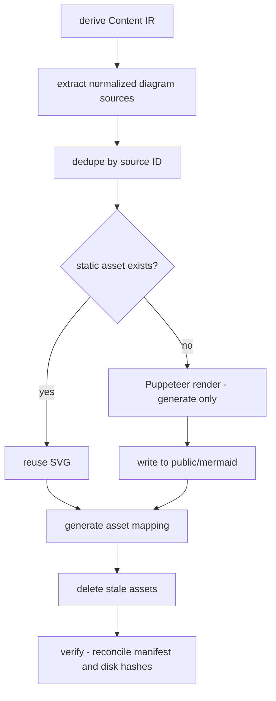

> [!DETAILS-AI] AI Summary of This Chapter
> Mermaid diagrams are pre-rendered by Puppeteer into deduplicated static SVGs during content preparation, while production builds only hash-check the assets and never launch a browser. The normal browser path doesn't load the Mermaid runtime; the client only handles view switching, zoom, drag, and maximize. The performance strategy focuses on Server-first, on-demand loading, off-screen deferred painting, and client boundary control. The design system and accessibility degradation are covered separately in the [dedicated topic](./design-system).

## 1. Build-Time-First Rendering Strategy

Mermaid needs to parse syntax, compute graph layouts, measure text, and generate SVG. If every reader repeated this work when opening a page, it would bring:

- downloading Mermaid and layout engine JavaScript;
- CPU spikes from parsing many diagrams simultaneously in long documents;
- incorrect measurement and re-layout when fonts aren't ready;
- skeleton waiting before diagrams appear;
- more noticeable interaction jank on mobile devices.

The project therefore adopts "build-time first, runtime fallback": SVGs that can be displayed directly are generated before release, and the browser only dynamically imports Mermaid when static assets are missing.

## 2. Static Asset Generation and Verification

Mermaid assets are managed by the content pipeline `scripts/content-pipeline.ts`; diagram detection comes from the Content IR (see [Content Pipeline and MDX Enhancements](./content-engineering#content-ir-and-build-pipeline)) instead of an independent scan of `content/docs`. The pipeline has two modes:

- **generate** (`bun run generate:content`, auto-run by `predev`): derive IR → validate content → render incrementally. Puppeteer launches only when charts are actually pending; a full cache hit means zero browser launches;
- **verify** (`bun run check:content`, auto-run by `prebuild`): derive IR → validate content → recompute the expected filenames from the IR and reconcile them against the asset manifest and the files on disk. It **never imports Puppeteer and never launches a browser**; missing or hash-mismatched assets fail the build with a hint to run generate.



### Stable Identity and Caching

`src/lib/mermaid-id.ts` generates a source ID from the normalized Mermaid source (shared by the Content IR extractor, the build pipeline, and the browser runtime). The final filename is hashed from every renderer input (the Mermaid browser bundle, the metric-sensitive `styles.css`, and the shared config) — any change automatically produces a new filename, so no manual version string is maintained. Therefore:

- identical source generates only one asset;
- unchanged diagrams can be reused across builds;
- Mermaid upgrades, style, or measurement-affecting configuration changes re-render automatically;
- SVGs no longer referenced by any content can be safely cleaned up.

`src/features/mermaid/generated/assets.ts` is a read-only mapping from source IDs to filenames, generated by the pipeline's generate stage and never edited by hand.

### Consistent with Site Styles

The renderer (`scripts/mermaid-renderer.ts`, dynamically imported only by the generate stage) loads the project's Mermaid config, fonts, and `src/features/mermaid/styles.css` via Puppeteer. Styles affecting node size take effect during Mermaid's measurement phase, avoiding first laying out with default fonts and then applying site styles, which would cause clipping.

The rendered result keeps the Mermaid diagram's own `viewBox`, and only extends the bounds when actual content overflows. Generic measurement doesn't override the layout of specialized diagram types such as `gitGraph`.

## 3. Browser Rendering Path

`src/features/mermaid/hooks/use-mermaid-render.ts` first queries the static asset mapping:

1. loads the SVG directly when an asset is found;
2. defers non-essential work until the asset nears the viewport (`MERMAID_RENDER_ROOT_MARGIN = '1200px 0px'`, boosting priority in advance);
3. enters the scheduler when the static asset is missing;
4. the scheduler dynamically imports Mermaid by priority and reuses already-generated results.

The shared idle scheduler `mermaid-render-scheduler` only re-renders when the source changes. The normal release path doesn't make browsers download Mermaid / Dagre. The runtime fallback handles development deviations, out-of-sync asset deployments, or unexpected missing assets — it isn't the default rendering mode.

## 4. How Canvas Interaction Is Layered

A single `Mermaid` diagram splits capabilities into separate hooks:

| Hook | Responsibility |
| :--- | :--- |
| `useMermaidRender` | static assets and runtime fallback |
| `useFitCanvasScale` | auto-fit computed from container width and height |
| `useZoomAndPan` | user zoom, pan, and bounds |
| `useMermaidViewMode` | render / source view preference |
| `useMermaidMaximize` | Portal maximize, focus, and exit |

Auto-fit and user zoom are two separate scales. A large diagram may first shrink to fully fit the content, but the toolbar still treats this fitted result as `100%`; when the user then zooms in, out, or resets, only the internal canvas is affected. This avoids semantic confusion like "the page auto-shrinks to fit a large diagram, and the toolbar suddenly shows 63%".

### Drag Performance Optimization

During dragging, React scheduling is bypassed and the DOM is manipulated directly:

- cache the `.mermaid-zoom-target` element reference on `pointerDown`;
- remove the RAF throttling logic;
- update CSS variables (`--mermaid-pan-x/y`) directly in `pointerMove`, applying the transform immediately;
- sync React state only once when dragging ends.

This avoids the per-frame React scheduling and reconciliation overhead. When pinch-zoom conflicts, pending pan positions are synced first before switching state.

### In-Page and Maximized

- In-page diagrams allow button zoom, drag, and reset, while the wheel keeps scrolling the article;
- when maximized, the wheel zooms the diagram anchored at the pointer position;
- `Esc` exits maximize and restores focus;
- the source view has its own scroll area and doesn't stretch the whole page with long source;
- the `v` shortcut toggles the view only when the diagram area is focused and not inside an input control.

## 5. Toolbar and Accessibility

The toolbar groups buttons by "view, zoom, canvas operations", with button states derived from the diagram's actual capabilities:

- the corresponding button is disabled when a zoom boundary is reached;
- reset is only allowed when pan or zoom deviates from the baseline;
- the maximize button switches to restore inside the overlay;
- all visible text, Tooltips, and `aria-label`s come from the locale dictionary;
- keyboard operation and focus restoration don't depend on the mouse;
- reduced-motion preference lowers transition and particle feedback.

The toolbar is horizontally constrained within the mermaid wrapper bounds, using `minLeft` and `maxLeft` calculations to prevent overflow. The Portal toolbar additionally sets `max-width: calc(100vw - 1rem)` to prevent overflow on very narrow viewports.

Diagrams, code view, and toolbar share content dimensions but not unnecessary interaction state. Listeners, Portal, RAF, and temporary state are cleaned up when exiting maximize, switching pages, or unmounting components.

## 6. View Switching and Maximize

### View Switching

- render view and source view use conditional rendering (only the active view is mounted), avoiding double-crossfade flicker;
- switching uses a fade-in animation (no crossfade-out);
- source view `max-height: 28rem`, with an immersive scrollbar (hidden by default, appears on hover / focus);
- source view `padding-bottom: 3.5rem` keeps the toolbar from covering content;
- fullscreen source view `max-width: 60rem`, centered with `margin-inline: auto`.

### Maximize

- maximize mounts a Portal to `document.body`;
- animations only use opacity transitions (no scale), avoiding repaint flicker for complex SVGs and backdrop-filter;
- exiting maximize happens immediately (no delay and exit animation), avoiding perceived latency;
- the scrollbar removes transition, avoiding unreliable animation flicker.

## 7. Performance Strategy

### Let Content Appear First

- doc pages and most MDX shells stay server-rendered;
- Mermaid, the search index, and route data are generated at build time whenever possible;
- heavy capabilities like Giscus and the Mermaid fallback load on demand;
- off-screen high-cost MDX blocks use browser containment to defer layout and paint;
- `DocsCommunity` is isolated from the content, and iframe height changes don't trigger layout inside the content.

### Control Ongoing Work

- ongoing animations prefer `transform` and `opacity`;
- home page environment effects reuse a shared clock and frame budget;
- pointer movement and drag events are merged per frame;
- particles are written to the DOM in batches, not updated immediately on every raw event;
- timers, RAF, Observers, listeners, and temporary nodes are cleaned up when leaving the page or unmounting components.

### Control Client Boundaries

The project doesn't declare the whole doc page as `"use client"` just because of a task checkbox or copy button. Interaction state stays within the smallest components; data derivable from Props, DOM, URL, or the content source doesn't re-enter React State.

## 8. Mobile Degradation

Mobile prioritizes content width, navigation reachability, and touch targets:

- large-area environment effects and ongoing particles are reduced in density or turned off;
- diagrams first fully fit the container; complex operations can enter maximize;
- the toolbar stays compactly grouped and doesn't rely on Hover to complete operations;
- the comments iframe uses its natural height, avoiding nested scrolling;
- sidebar, TOC, and page actions use the corresponding triggers on small screens.

`prefers-reduced-motion` disables non-essential movement and ongoing animations; the reduced-transparency preference makes glass surfaces fall back to more solid backgrounds. Degradation only reduces decoration and transitions — it doesn't remove content, focus, button labels, or critical state. The full accessibility degradation rules are in [Design System and Theming](./design-system#7-accessibility-fallbacks).

## 9. Build and Troubleshooting

After modifying Mermaid source, count, theme measurement styles, or rendering config, run:

```bash
bun run generate:content
```

And check:

- IR entry and diagram counts plus generation, reuse, and cleanup counts in the console;
- additions and deletions in `public/mermaid/` match content changes;
- `src/features/mermaid/generated/assets.ts` contains only the generated mapping;
- nodes, labels, and bounds are complete under light / dark;
- large diagrams, small diagrams, source view, and maximize operations work correctly.

For larger changes, continue with `bun run build`: content validation, asset hash reconciliation, and static export all pass in the same production pipeline, which never launches Puppeteer. If assets are missing or stale, `check:content` names the affected diagrams and prompts a generate re-run.

## 10. Key Files

| File | Responsibility |
| :--- | :--- |
| `scripts/content-pipeline.ts` | content pipeline: IR consumption, validation, and Mermaid generate / verify |
| `scripts/mermaid-renderer.ts` | Puppeteer renderer (dynamically imported by the generate stage only) |
| `src/lib/mermaid-id.ts` | stable source IDs and source normalization |
| `src/features/mermaid/generated/assets.ts` | static asset mapping |
| `src/features/mermaid/components/mermaid.tsx` | diagram shell and toolbar |
| `src/features/mermaid/hooks/use-mermaid-render.ts` | static assets and fallback |
| `src/features/mermaid/hooks/use-fit-canvas-scale.ts` | auto-fit |
| `src/features/mermaid/hooks/use-zoom-and-pan.ts` | canvas interaction |
| `src/features/mermaid/styles.css` | diagram theme |