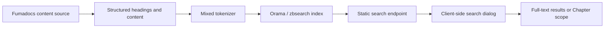

> [!DETAILS-AI] AI Summary of This Chapter
> The project statically generates the search index, page tree, and source endpoints, then adds Chapter scope filtering, a search result enhancement pipeline, a search spotlight, and cross-document reading return in the browser. Chinese search uses mixed Chinese-English tokenization and adds pinyin lookup only for titles and section headings. Giscus theme switches eliminate flashing through `useLayoutEffect` and a fixed 400ms fade. Route transitions are covered separately in a [dedicated topic](./transitions).

## 1. Static search architecture

`src/app/api/search/route.ts` uses Fumadocs `createFromSource()` to generate search data from the content source and sets `dynamic = 'force-static'`. Production builds output this Route Handler as a static endpoint, so no request-time Markdown scanning is needed.



Each index record contains the page URL, title, description, structured content, and first-level slug. The first-level slug is also written to the Fumadocs `tag`, so Chapter filtering directly reuses the content path without maintaining a second chapter mapping.

## 2. Mixed Chinese-English and pinyin search

Default English tokenization can't reliably handle continuous Chinese, while simply splitting by character would damage English words and phrases. `src/lib/search-tokenizer.ts` combines both behaviors:

- Chinese fragments use the dictionary tokenization of `@orama/tokenizers/mandarin`;
- English fragments are uniformly lowercased, keeping English queries case-insensitive;
- Chinese titles and section headings additionally get pinyin forms;
- The content isn't fully expanded to pinyin, avoiding index bloat and irrelevant matches;
- English locales continue to use the English language configuration.

### Namespace prefixes

The server index and client queries use different namespace prefixes to ensure pinyin is only searched when needed:

| Constant | Prefix | Purpose |
| :--- | :--- | :--- |
| `PINYIN_INDEX_PREFIX` | `\uE000` | The server only marks titles and section headings, generating pinyin aliases |
| `PINYIN_QUERY_PREFIX` | `\u0000pinyin:` | The browser only searches namespaced pinyin aliases during queries |

### Pinyin generation

`getPinyinAliases()` generates, for Chinese segments:

- Full pinyin forms;
- Initial-letter abbreviations;
- Bounded adjacent segments (`MAX_PINYIN_SEGMENT_SPAN = 8`) to avoid overly long segments producing irrelevant matches.

`addKeyboardUmlautVariant()` handles the `v → ü` variant, supporting pinyin diacritics typed from the keyboard.

Before building the index, the server collects the titles that need pinyin expansion; the client initializes the Chinese database with the same mixed tokenization logic, avoiding inconsistency between the "indexing approach" and the "querying approach".

Chinese search sets strict `threshold` and `tolerance` values, reducing short words and single characters being fuzzy-matched to many irrelevant pages. English search still relies on the English language configuration for word forms and normalization.

## 3. Search result enhancement

`withEnhancedSearch()` in `src/lib/search-client.ts` wraps the raw search client and processes results through the following pipeline:

```text
Raw search results
  → cleanSearchResultContent()       Strips pinyin index prefixes
  → rankSearchResultGroups()         Groups by page, sorts within groups by type priority
  → preferSearchResultAnchors()      The first page result of each group inherits the most relevant subsection URL
  → mergePinyinSearchResults()       Deduplicates and merges pinyin results
  → addSearchSpotlightParams()       Adds spotlight parameters to every result
```

### Group sorting

`rankSearchResultGroups()`:

- Groups by page, then sorts within each group by `type` priority (`page > heading > text`);
- Sorts groups by whether they contain `<mark>` highlights, with highlighted groups first.

### Anchor-first

`preferSearchResultAnchors()`: the first `page` result of each group inherits the most relevant subsection URL, letting search results land directly on a specific section.

### Pinyin merging

`mergePinyinSearchResults()`:

- Deduplicates and merges pinyin results;
- Skips `text` types and already-seen `id`s;
- Caps at 60 entries to avoid result bloat.

### Spotlight parameters

`addSearchSpotlightParams()` adds a `_searchSpotlight` parameter to every result, carrying the most relevant text fragment for spotlight positioning after navigation.

## 4. Search dialog and scope

`src/components/search.tsx` uses Fumadocs `useDocsSearch` and the static client:

- The Chinese locale uses `createMixedTokenizer()`, and others use `english`;
- Wrapped with `withEnhancedSearch(searchClient, locale === 'zh')`: pinyin fallback, grouped result sorting, chapter anchor inheritance;
- Chapter filter Popover: the lightweight `search-dialog__scope-trigger` keeps it at a secondary level.

Scope options come from the current locale's page tree:

- "All content" passes no `tag`;
- When a Chapter is selected, that root node's slug is used as `tag`;
- Scopes that are no longer valid are reset when the locale changes;
- Result and scope copy is read from the project dictionaries.

While the search dialog is closed, the component listens for Fumadocs' `Ctrl + K` / `Cmd + K` shortcuts in the capture phase. If the reader has kept a full selection inside the `#nd-page` content container, the selection is normalized into a single-line, space-separated query before the dialog opens, taking the first 200 characters (`MAX_SELECTED_SEARCH_LENGTH`); selections triggered by clicking the search entrance, selections extending outside the content, and selections inside editable controls all keep the original query behavior.

The scope menu is only a query constraint; it doesn't maintain separate content state. After a new Chapter is registered in the page tree, it naturally enters the search scopes.

## 5. Search spotlight

`src/components/search-spotlight.tsx` implements a short-lived global spotlight after navigating from a search result:

- Listens to click (link / `button[aria-selected]`), keydown Enter, hashchange, and popstate;
- `findTextRange()`: walks text nodes with a TreeWalker to find the target text after the anchor;
- `getRangeRect()`: merges multi-line rects;
- `clampSpotlightRect()`: 12px padding, clamped within the viewport;
- `centerSpotlightRect()`: scrolls to center the target;
- `ResizeObserver` + `MutationObserver` track layout changes;
- Closes after interaction (pointerdown / wheel / touchstart / Escape);
- `SPOTLIGHT_DURATION_MS = 3200` (1800 with reduced motion);
- `removeSpotlightParam()`: removes the parameter from the URL when done.

`src/lib/search-spotlight.ts` provides spotlight parameter handling:

- `SEARCH_SPOTLIGHT_PARAM = '_searchSpotlight'`;
- `getSpotlightScrollDelta()`: aligns the target rect's center with the viewport center;
- `cleanSpotlightText()`: strips HTML tags and markdown decorations, truncating to 120 characters;
- `getResultGroupTarget()`: prefers the `<mark>` highlighted text, and `page` types borrow the target from a subsection.

## 6. Page tree and navigation

`content/docs/{locale}/meta.json` and subdirectory `meta.json` files together form the Fumadocs page tree. The docs layout uses the tree for the current locale, so Chinese and English can have different coverage without needing empty pages to maintain perfect symmetry.

The Fumadocs page tree provides:

- Left-side Chapter, Stage, and page navigation;
- Previous / next relationships for the current page;
- The current page's TOC and scroll position;
- The source of homepage chapter entrances and search scopes.

Section headings are recorded in the `pages` array in `---title---` form. Page order comes from the explicit configuration rather than relying on filesystem sorting.

## 7. Cross-document reading return

Plain browser history can only go back to the source page; it can't reliably restore the context the reader had when clicking a link. If a long document has images, code, or deferred-layout content near the top, restoring the absolute `scrollY` can also drift.

`DocsReadingReturn` records, when a content link is clicked:

- The source and target pathnames;
- The source page title;
- The link's element path relative to `data-docs-body`;
- The viewport position when leaving the link;
- An absolute scroll position as fallback.

After reaching the target document, the page shows the "return to reading position" action. When returning to the source, the component first finds the same link by element path, then restores it to the screen height at which the reader left; only when the element path fails does it use the absolute position.

This metadata is kept in `sessionStorage`, and the content is never saved or cloned. External links, new-window links, download links, same-page hashes, and previous / next navigation keep their native behavior.

### Document refresh restore

`src/lib/docs-reading-restore.ts` handles scroll restoration after a page refresh:

- `DOCS_REFRESH_RESTORE_BOOTSTRAP` is an inline script that runs before hydration;
- Runs only when `navigation.type === 'reload'` and a valid anchor exists in sessionStorage;
- Sets the `data-nd-reading-restore` attribute so the client restores the scroll position.

## 8. Documentation source and GitHub actions

Documentation pages derive the GitHub file URL from the content source's `fullPath`, and also generate `docs-source` URLs by locale and slug.

`src/app/[lang]/docs-source/[...slug]/route.ts` enumerates all pages at build time and returns the raw Markdown / MDX content. Output paths use the `.md` suffix to avoid conflicts between page directories and identically named files in static hosting.

`DocsPageActions` places "View source" and "Open in GitHub" on the same line as the author info. When readers find an issue, they can directly locate the source file without manually guessing the repo directory from the page URL.

## 9. i18n boundaries

`src/lib/i18n.ts` is the single source for supported languages and the default language. It drives:

- The locale buckets of the Fumadocs content loader;
- The language parameters of `generateStaticParams()`;
- The language context of the Fumadocs UI;
- The language of custom error pages, loading pages, and comments.

UI translations are split into two layers:

- `src/lib/layout.shared.tsx` extends Fumadocs' built-in UI translations (including keys added in 16.13.x such as `Ask AI`, `Close Sidebar`, `Layout Tab`);
- `src/dictionaries/` holds the project's custom copy, with the key structure constrained by a TypeScript interface.

The UI supporting Chinese and English doesn't mean every article is translated. Whether a page exists is decided by the actual files in `content/docs/{locale}/`; English pages don't use empty-shell placeholders to simulate full coverage.

## 10. Community modules

The guestbook and doc comments use Giscus with GitHub Discussions. `DocsCommunity` places the comment area outside the content card, and `Guestbook` chooses Giscus language and theme based on the locale and theme.

### Giscus configuration

- `slugKey` serves as the discussion identifier, and Chinese and English pages share the same discussion thread;
- `mapping="specific"`, `inputPosition="top"`, `reactionsEnabled="1"`;
- `GISCUS_LANG_MAP`: zh → zh-CN, en → en;
- Theme URL: jsDelivr CDN in production, site origin joined with relative paths in development.

### Eliminating theme-switch flashing

Giscus runs in a cross-origin iframe. When the theme switches, the iframe reloads the theme CSS, causing a brief unstyled flash in between. The project eliminates it in the following ways:

- `useLayoutEffect` (instead of `useEffect`) synchronously sets the `data-switching` attribute after React commit and before paint, ensuring `opacity:0` takes effect before the browser draws;
- A `prevThemeUrl` ref tracks the previous theme, triggering only when switching between two valid URLs;
- A fixed 400ms fade duration, without waiting for the `resizeHeight` message (which is only sent back when the height changes, and theme switches usually don't change the height);
- CSS coordination: `transition: none` hides immediately, `opacity 240ms` fades back in.

`useEffect` runs after the browser paint, leaving a paint window where unstyled content flashes; `useLayoutEffect` moves the `opacity:0` application ahead of paint, eliminating this window.

Giscus remains an external enhancement: when the network is unavailable or the user has no GitHub account, the document content, search, and navigation are unaffected.

## 11. Where interactive state lives

| State | Storage location | Lifecycle |
| :--- | :--- | :--- |
| Theme preference | Browser local storage | Across pages and revisits |
| Motion preference | Browser local storage | Across pages and revisits |
| Sidebar collapse | Browser local storage | Across pages and revisits |
| Task completion state | Local storage keyed by pathname | Across pages and revisits |
| Tabs preference | Browser local storage | When `persist` is enabled |
| Reading return point | `sessionStorage` | Current tab session |
| Transition DOM clone | Memory | Single transition |

None of this state needs an account or a database, and it doesn't sync across devices. Static-first doesn't mean rejecting state; it keeps light, private, collaboration-free data in the browser.

## 12. Key files

| File | Responsibility |
| :--- | :--- |
| `src/app/api/search/route.ts` | Static search index |
| `src/lib/search-tokenizer.ts` | Mixed Chinese, English, and pinyin tokenization |
| `src/lib/search-client.ts` | Search result enhancement pipeline |
| `src/lib/search-selection.ts` | Content selection validation and search query normalization |
| `src/lib/search-spotlight.ts` | Spotlight parameter handling |
| `src/components/search.tsx` | Query and Chapter scope UI |
| `src/components/search-spotlight.tsx` | Search result spotlight |
| `src/app/[lang]/docs/layout.tsx` | Locale page tree and navigation layout |
| `src/components/docs-reading-return.tsx` | Cross-document context restoration |
| `src/lib/docs-reading-restore.ts` | Scroll restoration on document refresh |
| `src/app/[lang]/docs-source/[...slug]/route.ts` | Markdown source endpoint |
| `src/lib/layout.shared.tsx` | Fumadocs UI i18n |
| `src/components/guestbook.tsx` | Giscus locale and theme sync |
| `src/components/docs-community.tsx` | Documentation comment section isolation |