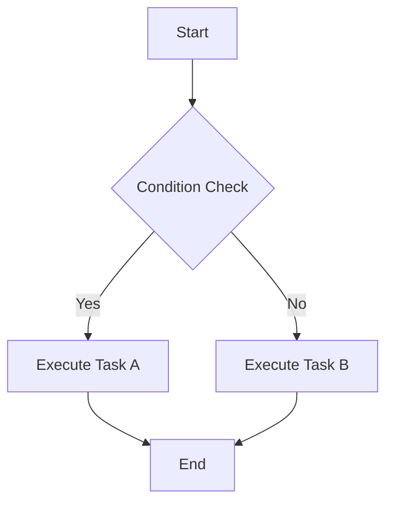
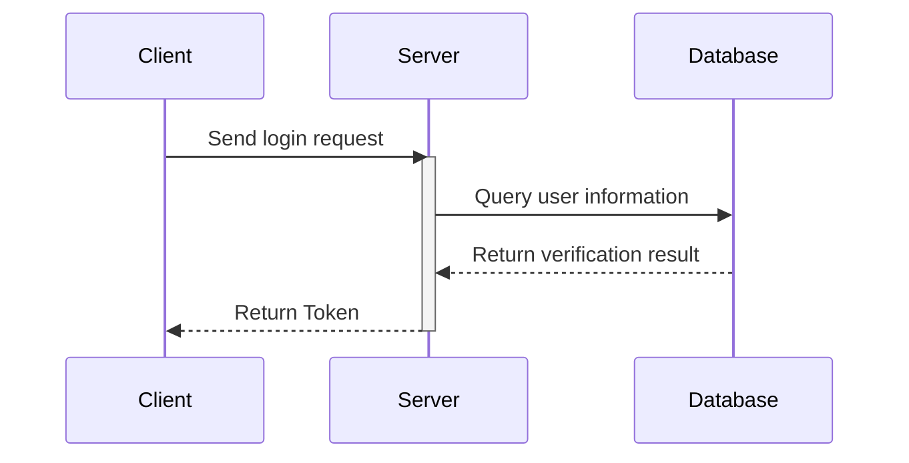
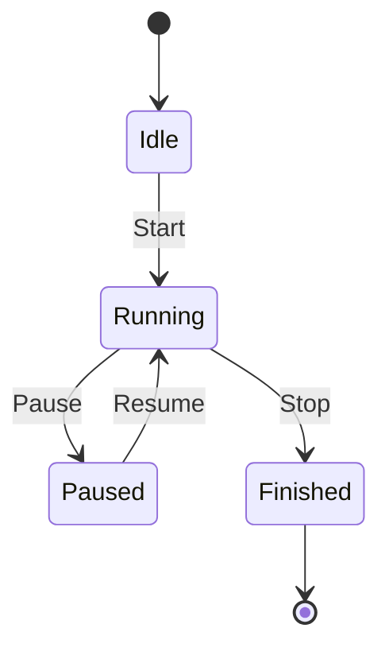

This document showcases the Markdown syntax supported by this project, organized by feature category. Basic content is suitable for daily document writing, while project-enhanced syntax is suitable for pages requiring callouts, collapsible blocks, code titles, mathematical formulas, or diagrams.

## Syntax Quick Reference

| Category | Syntax Capabilities | Use Cases |
| :--- | :--- | :--- |
| [Basic Markdown](#1-basic-markdown) | [Headings & Paragraphs](#11-headings--paragraphs), [Text Emphasis](#12-text-emphasis--line-breaks), [Lists](#14-lists), [Links & Images](#15-links-images--horizontal-rules), [Inline Code](#13-inline-code), [Horizontal Rules](#15-links-images--horizontal-rules) | General body structure |
| [GFM Extensions](#2-github-flavored-markdown) | [Task Lists](#21-task-lists), [Tables](#22-tables), [Strikethrough](#23-strikethrough--autolinks), [Autolinks](#23-strikethrough--autolinks), [Blockquotes](#24-blockquotes) | Collaboration instructions and structured information |
| [Project Enhancements](#3-project-enhanced-syntax) | [GitHub Alert Callouts](#31-github-alert-callouts), [Basic Collapsible Blocks](#32-basic-collapsible-blocks), [Semantic Collapsible Blocks](#33-semantic-collapsible-blocks) | Tips, supplementary notes, summary content |
| [Code Blocks](#4-code-blocks) | [Syntax Highlighting](#41-basic-code-blocks), [File Path Title Bar](#42-file-path-title-bar), [Code Blocks Without Path](#43-code-blocks-without-file-path), Copy Button | Code examples and configuration snippets |
| [Math & Diagrams](#5-latex-formulas) | [LaTeX Formulas](#5-latex-formulas), [Mermaid Flowcharts](#61-flowcharts), [Sequence Diagrams](#62-sequence-diagrams), [State Diagrams](#63-state-diagrams) | Formulas, flowcharts, sequence diagrams, state diagrams |

## 1. Basic Markdown

### 1.1 Headings & Paragraphs

Document page titles come from the `title` field in frontmatter. Body headings are recommended to start from `##` to keep the page table of contents structure clear.

```md
## Heading Level 2

Separate regular paragraphs with blank lines.

### Heading Level 3

Continue writing body content.
```

### 1.2 Text Emphasis & Line Breaks

*Italic text*

**Bold text**

***Bold italic text***

```md
*Italic text*

**Bold text**

***Bold italic text***

When forced content separation is needed, prefer splitting into independent paragraphs or list items.
```

### 1.3 Inline Code

When referencing commands, variables, filenames, or short code snippets in text, wrap them in backticks, e.g., `bun run check`, `src/app/globals.css`, `console.log()`.

```md
Run `bun run check` to complete formatting and checks.
```

### 1.4 Lists

Unordered lists are suitable for parallel information, ordered lists for step-by-step instructions.

```md
* Install dependencies
* Start development server
  * Default address is `http://localhost:3000`

1. Fork repository
2. Create feature branch
3. Submit Pull Request
```

### 1.5 Links, Images & Horizontal Rules

```md
[SSJ's Blog](https://blog.shenshijun.space/)


---
```

---

## 2. GitHub Flavored Markdown

### 2.1 Task Lists

* [x] Complete requirements analysis
* [x] Write example documentation
* [ ] Submit Pull Request

```md
* [x] Complete requirements analysis
* [x] Write example documentation
* [ ] Submit Pull Request
```

### 2.2 Tables

| Feature | Support | Notes |
| :--- | :---: | ---: |
| Tables | Full | Supports left, center, right alignment |
| Task lists | Full | Uses GFM syntax |
| Strikethrough | Full | Uses `~~text~~` |

```md
| Feature | Support | Notes |
| :--- | :---: | ---: |
| Tables | Full | Supports left, center, right alignment |
```

### 2.3 Strikethrough & Autolinks

This is a paragraph with ~~deleted text~~.

Autolink example: <https://blog.shenshijun.space/>

```md
This is a paragraph with ~~deleted text~~.
Autolink example: <https://blog.shenshijun.space/>
```

### 2.4 Blockquotes

> This is a first-level blockquote.
> > This is a nested blockquote.
> > **Tip:** Emphasis, links, and inline code can also be used in blockquotes.

```md
> This is a first-level blockquote.
> > This is a nested blockquote.
```

## 3. Project Enhanced Syntax

### 3.1 GitHub Alert Callouts

Callouts are suitable for highlighting supplementary information, suggestions, important context, risk warnings, or dangerous operations. Text on the same line after the marker will be displayed as a custom title, e.g., `[!INFO] Custom Title`.

> [!NOTE]
> Note: Provides supplementary information.

> [!TIP]
> Tip: Provides suggestions or shortcuts.

> [!IMPORTANT]
> Important: Highlights key context.

> [!WARNING]
> Warning: Reminds about operations requiring caution.

> [!CAUTION]
> Danger: Informs about operations that may cause destructive consequences.

> [!INFO] Custom Title
> `INFO` can be used for general information tips; the title replaces the default type text.

```md
> [!NOTE]
> Note: Provides supplementary information.

> [!WARNING]
> Warning: Reminds about operations requiring caution.

> [!INFO] Custom Title
> `INFO` can be used for general information tips; the title replaces the default type text.
```

### 3.2 Basic Collapsible Blocks

Collapsible blocks are suitable for hiding supplementary notes, advanced content, or longer comments.

> [!DETAILS] Collapsible Description
> This is a details block that is collapsed by default. Readers can expand it to view as needed.

> [!DETAILS+] Expanded by Default Collapsible Description
> Append `+` after `DETAILS` to make the collapsible block expanded by default.

```md
> [!DETAILS] Collapsible Description
> This is a details block that is collapsed by default.

> [!DETAILS+] Expanded by Default Collapsible Description
> Append `+` after `DETAILS` to make the collapsible block expanded by default.
```

### 3.3 Semantic Collapsible Blocks

Semantic collapsible blocks use the `[!DETAILS-XXX]` syntax, and the title line can directly follow the marker.

| Syntax | Default Title | Purpose |
| :--- | :--- | :--- |
| `[!DETAILS-FAQ]` | FAQ | Question-type content |
| `[!DETAILS-ANSWER]` | Answer | FAQ answers |
| `[!DETAILS-EXAMPLE]` | Example | Code or usage examples |
| `[!DETAILS-HINT]` | Hint | Quick tips |
| `[!DETAILS-AI]` | AI Summary | AI-generated summaries |

#### FAQ & Answers

> [!DETAILS-FAQ] What is Neoverse?
> Neoverse is a future-oriented documentation platform dedicated to providing an elegant document reading experience.

> [!DETAILS-ANSWER] How to contribute?
> You can contribute to the project by submitting Pull Requests, reporting Issues, or improving documentation.

#### Examples & Hints

> [!DETAILS-EXAMPLE] Organizing Code Examples with Collapsible Blocks
> Longer code examples can be placed in collapsible blocks for readers to expand as needed.
>
> ```cpp
> // src/example.cpp
> #include <iostream>
> int main() {
>     std::cout << "Hello, Neoverse!" << std::endl;
>     return 0;
> }
> ```

> [!DETAILS-HINT] Keyboard Shortcut Tip
> Use `Ctrl + K` to quickly open the search dialog.

#### AI Summary

AI summary collapsible blocks are suitable for placing AI-generated summary content. When expanded, the content will display in batches with a typewriter effect; when typeable characters reach `360`, it enters medium-length speed mode, and when reaching `900`, it enters long content speed mode to avoid readers waiting too long.

> [!DETAILS-AI] AI Generated Summary
> This type of collapsible block is suitable for placing AI-generated summary content. When expanded, the body text will gradually display in short segments, and the cursor will follow the newly generated text.

```md
> [!DETAILS-AI] AI Generated Summary
> Place the AI-generated summary body text here.
```

## 4. Code Blocks

### 4.1 Basic Code Blocks

Code fences should include language identifiers to enable syntax highlighting.

```javascript
// src/utils/helper.js
export function greet(name) {
  return `Hello, ${name}!`;
}
```

````md
```javascript
// src/utils/helper.js
export function greet(name) {
  return `Hello, ${name}!`;
}
```
````

### 4.2 File Path Title Bar

File path comments at the top of code blocks are automatically extracted to the title bar and removed from the body code.

| Language Type | Supported Top Comments |
| :--- | :--- |
| JavaScript / TypeScript / C++ | `// src/example.ts` |
| CSS | `/* src/styles/example.css */` |
| Shell / Python | `# scripts/example.sh` |
| HTML | `<!-- public/index.html -->` |

```typescript
// src/components/Button.tsx
type ButtonProps = {
  label: string;
};

export function Button({ label }: ButtonProps) {
  return <button type="button">{label}</button>;
}
```

### 4.3 Code Blocks Without File Path

Code blocks without top file path comments will also highlight normally, just without displaying the path title.

```css
.container {
  display: flex;
  align-items: center;
  justify-content: center;
  padding: 20px;
}
```

## 5. LaTeX Formulas

### 5.1 Inline Formulas

Inline formulas are written in `$...$`, e.g., the Pythagorean theorem $a^2 + b^2 = c^2$.

```md
Inline formulas are written in `$...$`, e.g., the Pythagorean theorem $a^2 + b^2 = c^2$.
```

### 5.2 Block Formulas

Block formulas are written in standalone `$$...$$`, suitable for displaying derivations or key formulas.

$$
\int_{-\infty}^{\infty} e^{-x^2}\,dx = \sqrt{\pi}
$$

```md
$$
\int_{-\infty}^{\infty} e^{-x^2}\,dx = \sqrt{\pi}
$$
```

## 6. Mermaid Diagrams

### 6.1 Flowcharts



### 6.2 Sequence Diagrams



### 6.3 State Diagrams


