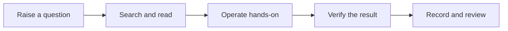

> [!DETAILS-AI] AI Summary of This Chapter
> This page introduces the site features most frequently used by ordinary readers: navigation and TOC, full-text search, theme, motion, and language, code blocks, alerts and collapsible content, task progress, Mermaid diagrams, page actions, and comments. There is a checklist of operations at the end of the page that you can try while reading.

## 1. Navigation and Page Structure

On wide-screen devices, a document page usually consists of three parts: chapter navigation, the main content, and the page TOC. When screen space is limited, the navigation and the TOC collapse into their corresponding menus, and the main content remains the reading focus.

- **Chapter navigation**: view the order of Chapters, Stages, and pages, and switch between different content.
- **Main content**: holds the current document, examples, and interactive tasks.
- **Page TOC**: jump quickly to the sections of the current page by heading, and updates as you read.

The bottom of the page provides previous-page and next-page entries that suit sequential learning. After jumping to another document from a body link, the site also offers an entry to return to your original reading position; you can dismiss it when it is not needed.

## 2. Search

Open the search entry in the sidebar, or press `Ctrl + K` (`Cmd + K` on macOS) to bring up full-text search.

- Type a concept, a command, a tool name, or a key phrase from an error message; you do not need to know which chapter it is in first.
- Chinese page titles and section headings support toneless full Pinyin and Pinyin initials: you can type the continuous full Pinyin, space-separated Pinyin, or initials of the target title; literal matches are displayed first.
- The search scope can be set to all content or limited to a specific Chapter.
- Groups with a direct page-title match are displayed first, followed by section-heading matches and then body-only matches; within each group, entries are ordered by "article title, section heading, body match". When the page title matches directly, it opens at the article title; otherwise, the top article entry jumps to the most relevant section first. After landing, the matched text is precisely centered and briefly spotlighted while the rest of the viewport is dimmed.
- Use the arrow keys to select a result, press `Enter` to open it, and press `Esc` to close the search.

When nothing shows up, trim overly long natural-language phrasing and keep the most distinctive keywords. For example, shorten "why can't I see the names after the files on Windows" to "Windows file extensions".

## 3. Theme, Motion, and Language

The theme menu offers Light, Dark, and System modes. Choose according to your reading environment; switching the theme does not change the document content.

Use the gear button at the bottom of the documentation sidebar to open motion settings. On mobile devices, open the sidebar first to find the same entry. Regular motion has High, Medium, and Low levels, while experimental motion can be enabled independently. Low keeps only essential, immediate state feedback and disables experimental motion. When switching from Low or Medium to High, experimental motion is enabled at the same time if the current environment supports the required capabilities. The default is High with experimental motion enabled.

Motion settings are saved in the current browser and apply to other pages on this site. If your operating system requests reduced motion, the site temporarily runs at Low and disables experimental motion without overwriting your saved site preference. When the current browser or graphics environment lacks the required capabilities, the settings panel marks experimental motion as unavailable and stops the related effects. This does not affect the main content or core operations.

The language menu switches the interface language and gives access to existing translations, but "the interface supports Chinese and English" does not mean every piece of content is already available in both versions. English content is still under construction; when a Chinese page has no corresponding translation, please continue with the Chinese version.

## 4. Code Blocks

The top of a code block shows the language and a copy button. If the first line looks like a comment containing a file name or path, the corresponding location is shown as well.

```js
// examples/hello.js
console.log('Hello, Neoverse-Docs!');
```

Click the copy button to copy the whole code block. Some examples use language tabs to switch between different versions of the same logic; the tabs only change which example is currently displayed, and do not mean you must learn all the languages at once.

> [!WARNING] Copying does not mean it can run directly
> First confirm the code language, the runtime environment, the path, and any data that may be affected. When deletion, overwriting, permissions, network downloads, or account operations are involved, understand the command before running it.

## 5. Alerts and Collapsible Content

The body uses different alert blocks to distinguish supplementary information, suggestions, important prerequisites, and risks. Colors and icons help you identify the semantics; what really matters is the title and the content.

Collapsible content tucks away optional explanations, frequently asked questions, or longer examples. Click the title to expand or collapse it.

> [!DETAILS-FAQ] Do I have to expand all the collapsible content?
> No. Follow the main content to complete your primary reading first; expand only when you need extra explanations, want to troubleshoot, or want to see the answer.

## 6. Tasks and Progress

Task items in the documents can be checked directly. With the page progress overview enabled, the top of the body summarizes the completed items and the total number of tasks, and provides an entry to jump to the task checklist.

Task state is saved in the current browser and does not sync to your account or other devices. It suits recording "what I have completed and verified", and should not replace your own saved experiment records, code, or notes.

## 7. Mermaid Diagrams

Mermaid diagrams describe flows, relationships, or sequences in text. When reading a diagram, first understand the relationships expressed by the nodes and edges, then use the toolbar as needed.



Common operations include:

- Switch between the render view and the source code view; with the diagram focused, you can also press `v`.
- Zoom the diagram in or out, drag the canvas to inspect parts, and use the reset button to restore the initial position.
- Maximize the diagram to inspect details; in the maximized state you can use the mouse wheel to zoom around the pointer position, and press `Esc` to exit.

The "100%" in the page indicates the baseline after the diagram fully fits the current container; it does not necessarily equal the original pixel size.

## 8. Page Actions and Feedback

Pages with author information show the author before the main content. The page action menu lets you view the Markdown source, or go to GitHub to view and edit the corresponding file.

The discussion section below each document is powered by Giscus; loading it depends on GitHub and your network environment, and posting requires a GitHub account. If the discussion section is temporarily unavailable, you can also report issues via [GitHub Issues](https://github.com/SSJ-ZYJ/Neoverse-Doc/issues).

Visiting a nonexistent address shows a localized 404 page with an entry to return. Pages marked as drafts first show an "under construction" notice, indicating that the content is not yet stable and should not be treated as a finished chapter.

The component syntax, `Frontmatter`, and contribution workflow for documentation authors are out of scope for this page; continue with the [Syntax Examples](/en/docs/about/contributing/syntax-example) and the [Contribution Guide](/en/docs/about/contributing).
