> [!DETAILS-AI] AI Summary of This Section
> This section introduces the Mermaid charting tool: the syntax and usage of common chart types such as Flowchart, Sequence, Class, State, Entity Relationship (ER), Git Graph, Gantt, Pie, Mindmap, and Timeline, and provides an overview of the remaining types. After finishing, you will be able to draw various structured charts in plain text and write documents with both text and graphics using Markdown.

> [!INFO]
> [Mermaid](https://mermaid.js.org/) uses text syntax to describe chart structure, and a renderer generates the graphics. Chart source can be version-controlled together with Markdown, and structural changes can be reviewed through text diffs. Combined with [1.8 Markdown](/en/docs/ch1/1.8-Markdown), you can maintain flows, interactions, and state relationships in your documents; for math formulas and typeset documents, refer to [1.9 LaTeX](/en/docs/ch1/1.9-LaTeX).

## 1. What Is Mermaid

Mermaid is a tool that describes charts in text: through keywords such as `flowchart` and `sequenceDiagram`, you define flowcharts, sequence diagrams, class structures, and other charts in plain text, and a renderer then generates the corresponding graphics. The chart source is just ordinary text, usually written directly in a Markdown code block.

Precisely because charts are described in text, compared with dragging in drawing software (Visio, draw.io), it has several natural advantages:

- **Plain text**: it can be written into Markdown and versioned with Git
- **Maintainable**: updating a chart only requires editing text, not re-taking screenshots
- **Searchable**: chart content can be found with grep
- **Reusable**: GitHub, GitLab, and many documentation tools can render common charts

> [!INFO] What Mermaid Is For
> Mermaid suits structured information such as flows, interactions, relationships, and states. When you need precise layout control, free drawing, or UI sketches, canvas tools such as draw.io or Excalidraw are usually more suitable; clearly structured architecture relationships can still use Mermaid.

## 2. Using It in Markdown

Just put Mermaid code in a ` ```mermaid ` code block:

````markdown
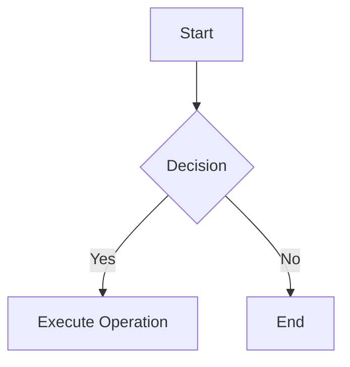
````

Effect:


> [!TIP] Rendering Support
> This project's documentation site and GitHub support Mermaid; VS Code's built-in preview capabilities and extension configurations may differ. If a chart does not render, first check the code block language, then confirm that the target platform supports the current chart type and syntax version.

Mermaid provides more than twenty chart types; the common ones are listed below:

| Chart Type | Keyword | Main Use |
| :--- | :--- | :--- |
| Flowchart | `flowchart` | Processes, decisions, and steps |
| Sequence Diagram | `sequenceDiagram` | Order of message interactions between objects |
| Class Diagram | `classDiagram` | Object-oriented class structures and class relationships |
| State Diagram | `stateDiagram-v2` | State transitions and state machines |
| Entity Relationship Diagram | `erDiagram` | Database entities and relationships |
| Git Graph | `gitGraph` | Commit history, branches, and merges |
| Gantt | `gantt` | Project plans and time schedules |
| Pie | `pie` | Proportion of individual parts |
| Mindmap | `mindmap` | Topic breakdown hierarchies and brainstorming |
| Timeline | `timeline` | Events in chronological order |
| Journey | `journey` | User interaction flows and experience |
| Quadrant Chart | `quadrantChart` | Four-quadrant positioning and comparison |

Beyond the table, there are domain-specific types such as Requirement diagrams, C4 architecture diagrams, ZenUML, Sankey, XY charts, and Kanban, which appear less often in this documentation. The common types are introduced one by one below.

## 3. Flowchart

The flowchart is the most commonly used chart type, for representing processes, decisions, and steps.

### 3.1 Direction

| Keyword | Direction |
| :--- | :--- |
| `TB` / `TD` | Top to Bottom |
| `BT` | Bottom to Top |
| `LR` | Left to Right |
| `RL` | Right to Left |

### 3.2 Node Shapes

Different brackets denote different shapes:

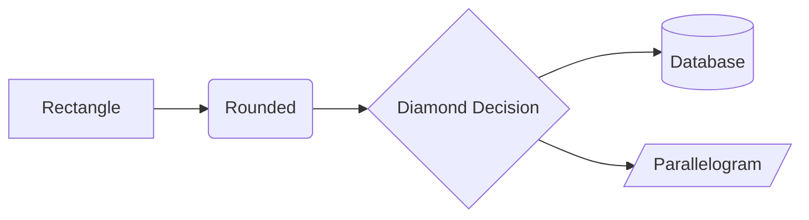

| Syntax | Shape | Common Use |
| :--- | :--- | :--- |
| `A[text]` | Rectangle | Normal step |
| `A(text)` | Rounded rectangle | Start / End |
| `A{text}` | Diamond | Conditional decision |
| `A[(text)]` | Cylinder | Database |
| `A[/text/]` | Parallelogram | Input / Output |
| `A((text))` | Circle | Connection point |

### 3.3 Connecting Lines

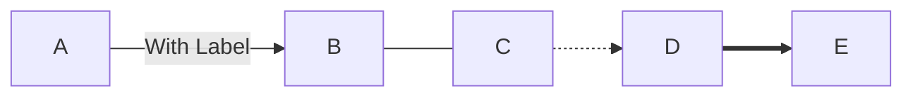

| Syntax | Style |
| :--- | :--- |
| `-->` | Solid line with arrow |
| `---` | Solid line without arrow |
| `-.->` | Dotted line with arrow |
| `==>` | Thick line with arrow |
| `-->\|text\|` | Arrow with label |

### 3.4 Subgraphs

Use `subgraph` to group related nodes:

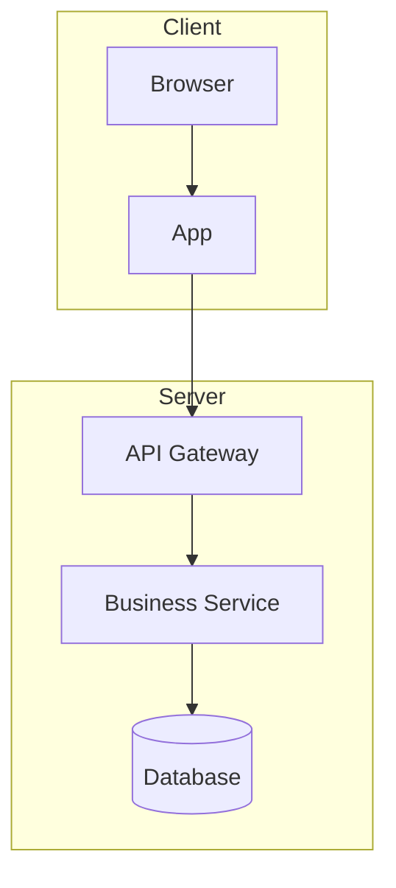

## 4. Sequence Diagram

A sequence diagram describes the message interactions and their order between multiple objects, suitable for expressing API calls and request-response flows:

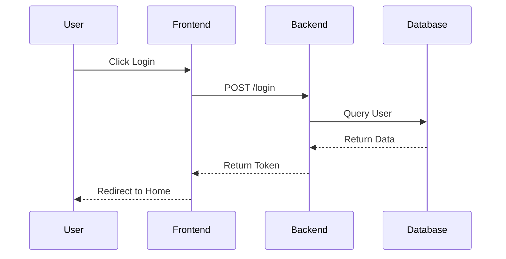

### 4.1 Message Types

| Syntax | Meaning |
| :--- | :--- |
| `A->>B:` | Solid line with filled arrowhead, commonly used for sending messages |
| `A-->>B:` | Dotted line with filled arrowhead, commonly used for returning responses |
| `A-)B:` | Solid line with open arrowhead, can be used for async |
| `A--xB:` | Dotted line with an x at the end, can be used for failures or termination |

### 4.2 Adding Notes

Use `Note over` to add an annotation to an interaction:

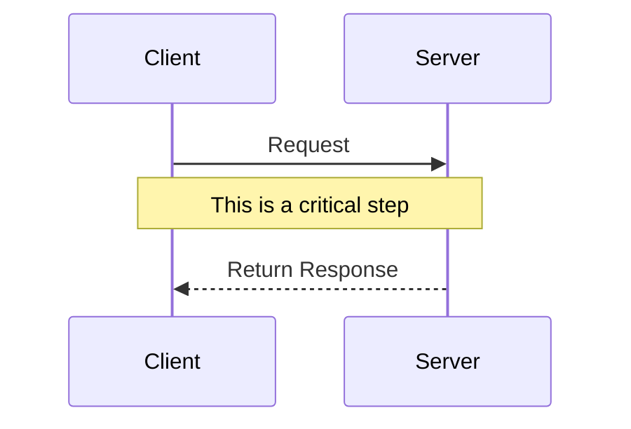

Class diagrams can be used to describe the members of a type and the relationships between classes in object-oriented design.

## 5. Class Diagram

Used to describe the class structure, fields, methods, and relationships between classes of objects:

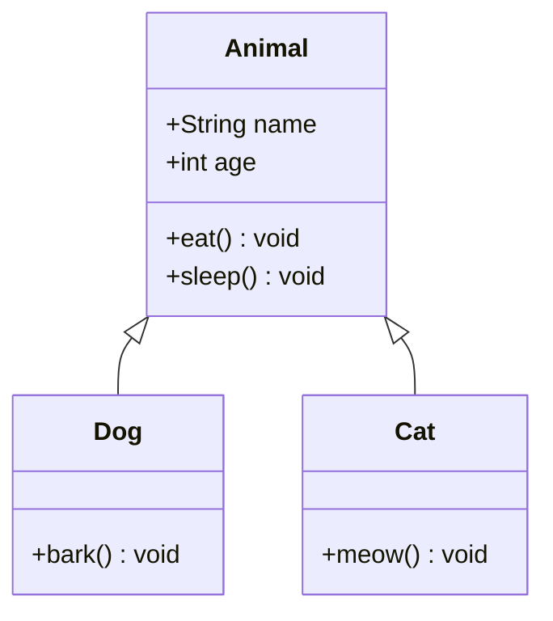

### 5.1 Relationship Symbols

| Syntax | Meaning |
| :--- | :--- |
| `\<\|--` / `--\|>` | Generalization / inheritance (solid line, hollow triangle) |
| `*--` | Composition (solid line, filled diamond) |
| `o--` | Aggregation (solid line, hollow diamond) |
| `-->` | One-way association (solid line with arrow) |
| `..\|>` | Implementation (dotted line, hollow triangle) |

Mermaid also provides Gantt charts, pie charts, and state diagrams, suitable for expressing plans, proportions, and state transitions respectively.

## 6. Gantt

Gantt charts suit project planning and scheduling timelines:

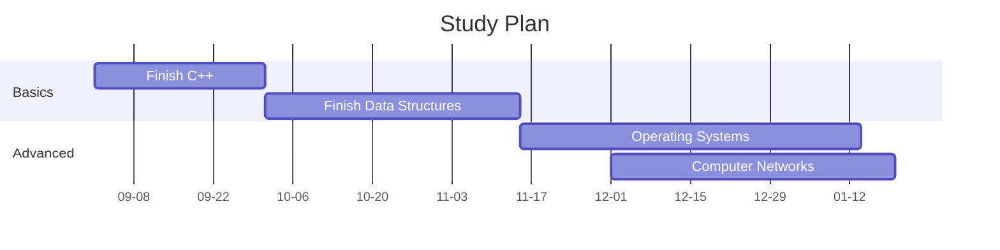

> [!TIP] Practical Scenarios for Gantt Charts
> A Gantt chart is not just a "project management tool"; it also suits planning your study progress for a semester. Drawing courses, labs, and review time as a Gantt chart shows at a glance which period has the heaviest workload, so you can reserve time in advance.

## 7. Pie

Used to show each part's proportion of the whole:

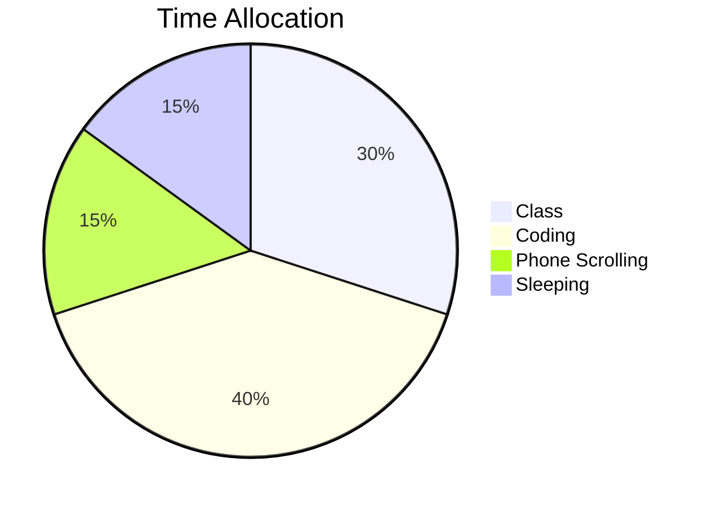

## 8. State Diagram

Used to describe the state transitions of an object, suitable for expressing protocols, state machines, and so on:

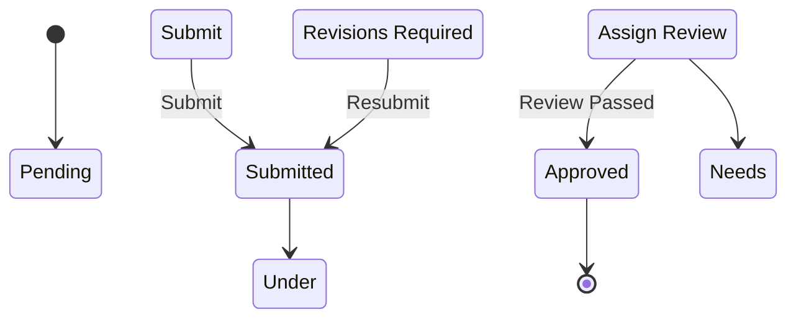

## 9. Other Chart Types

Besides the high-frequency types introduced above, Mermaid has a few more chart types that are also used often.

### 9.1 Entity Relationship (ER) Diagram

Describes entities (such as database tables) and the cardinality relationships between them; commonly used in database courses:

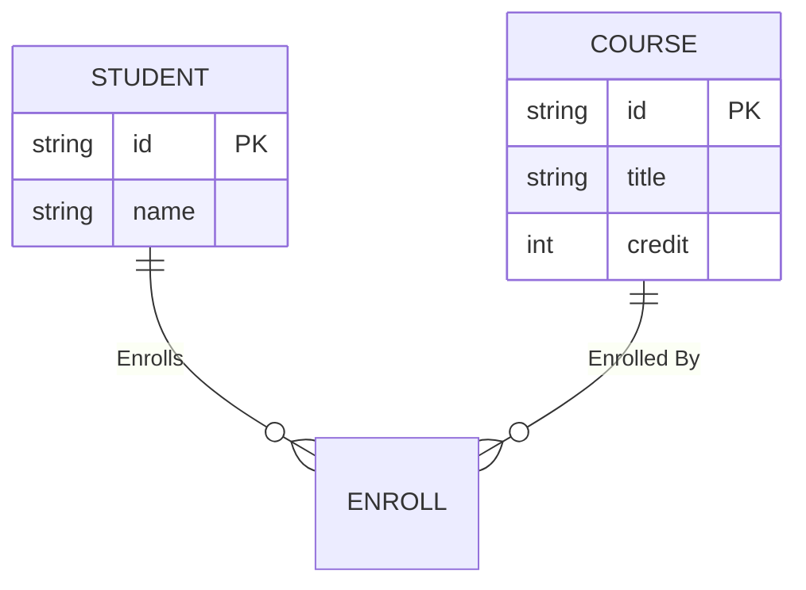

The symbols at the two ends of a relationship denote cardinality constraints: `||` means exactly one, and `o{` means zero or more; read together, "one student can enroll in many courses, and one course can be enrolled by many students". Entity attributes are written inside the braces, and `PK` denotes the primary key.

### 9.2 Git Graph

Use commits, branches, and merges to visualize repository history; you can read it together with [1.15 Version Control and Git](/en/docs/ch1/1.15-Version-Control-Git):

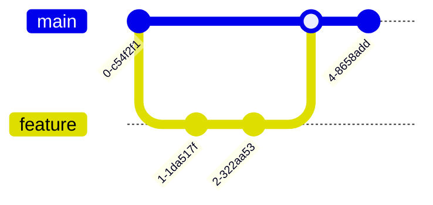

### 9.3 Mindmap

Expand layer by layer from a central topic, suitable for organizing a knowledge system and study notes:

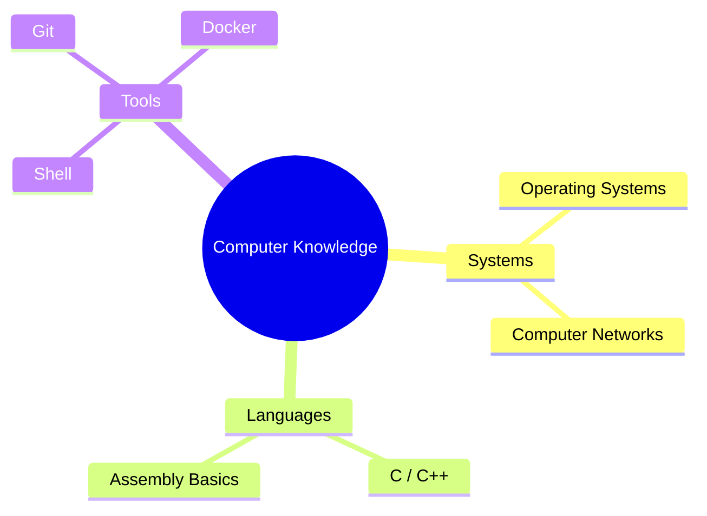

### 9.4 Timeline

Arranges events in chronological order, suitable for course plans, project milestones, and personal records:

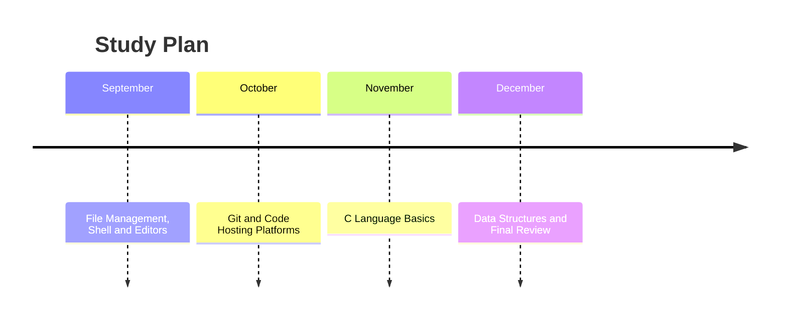

The types above already cover most scenarios in daily study and work; for other domain-specific types, consult the official documentation when you need them. After mastering the common types, a few practical tips will make your charts more professional.

## 10. Practical Tips

### 10.1 Separating Node IDs from Text

A node can be defined in the form `id[text]`; later references only need to write `id`, without repeating the text:

```text
flowchart TD
    A[Start] --> B[Process]
    B --> A
```

### 10.2 Comments

Use `%%` to write comments, which are not rendered in the chart:

```text
flowchart TD
    %% This is a comment; it will not appear in the chart
    A --> B
```

### 10.3 Style Customization

Use `classDef` to define a style, then apply it to nodes with `:::`:

```text
flowchart LR
    A:::highlight --> B
    classDef highlight stroke-width:3px
```

Check specific colors in both light and dark themes; if the publishing platform provides theme variables or site-level styles, reuse them first, so that node text does not lose contrast with the background.

### 10.4 Avoiding Overly Complex Charts

> [!CAUTION] Control Chart Complexity
> Whether a chart is readable depends on the number of nodes, crossing lines, label lengths, and display size; there is no unified upper limit on nodes. When readers struggle to follow the main flow, split it into several smaller charts, group them with subgraphs, or omit branches irrelevant to the current question.

## 11. Online Editing and Debugging

| Tool | Purpose |
| :--- | :--- |
| [Mermaid Live Editor](https://mermaid.live/) | Official online editor with real-time preview, supports PNG / SVG export |
| VS Code + Markdown Preview Mermaid Support | Preview Mermaid in the editor |
| GitHub | Native support; renders automatically after committing |

> [!NOTE] No Need to Memorize Syntax
> Mermaid's syntax and supported scope change with versions. Rely on the [official documentation](https://mermaid.js.org/intro/) and the actual rendering results of the target platform; complex charts can be verified first in the [Mermaid Live Editor](https://mermaid.live/).

## 12. TODO Checklist

- [ ] Can choose the appropriate chart type according to the nature of the information (flow, interaction, structure, state, time, proportion, etc.)
- [ ] Can write clear node text and IDs, keeping the structure clear
- [ ] Can split and simplify complex charts while keeping the main flow clear
- [ ] Can draw charts with AI assistance

## 13. Questions Worth Thinking About

> [!DETAILS-FAQ] What is the difference between Mermaid and hand-drawn charts?
> The core difference between text-described charts (such as Mermaid) and hand-drawn charts lies in "maintainability": text can enter version control, be diffed line by line, searched, and reused, and can also be generated in batches by scripts.
>
> Hand-drawn charts excel at free layout and detailed control, so using Mermaid for structured charts and draw.io or Excalidraw for free-form layout is a sensible combination.
