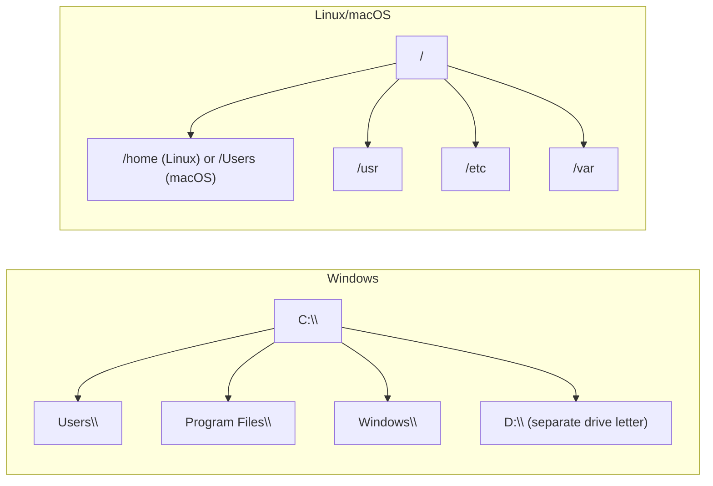
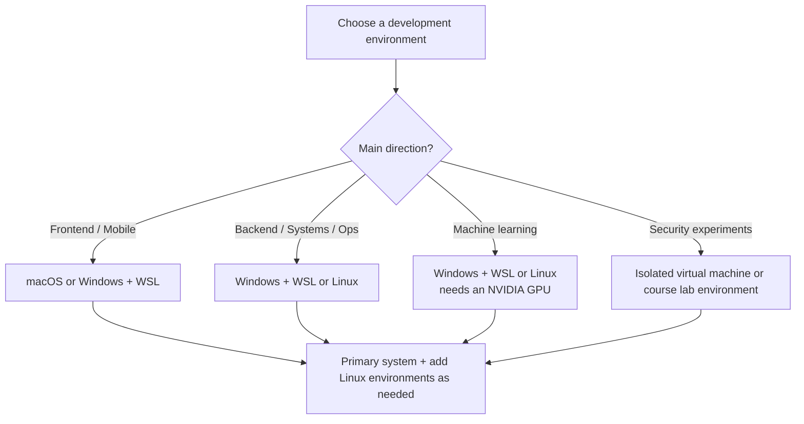

> [!DETAILS-AI] AI Summary of This Section
> Starting from the responsibilities of the operating system, this section compares the three major systems — Windows, Linux, and macOS — and introduces the relationship between the Linux kernel and distributions, as well as common distribution categories. After finishing, we can choose appropriate solutions based on courses, toolchains, and deployment environments.

> [!INFO]
> In daily use, the differences between operating systems often show up in the interface and software ecosystem; once we get into development, deployment, and remote operation scenarios, paths, permissions, toolchains, and system interfaces also directly affect program behavior.

## 1. What Does an Operating System Do

An operating system (OS) is a program that manages the hardware and software resources of a computer. Every time we click the mouse, type on the keyboard, or open software, it is scheduled by the operating system.

| Reason | Explanation |
| :--- | :--- |
| Development experience differs | The same code may behave differently on different systems |
| Deployment environments differ | Linux is widely used on servers and cloud platforms, and often comes up during deployment |
| Toolchains differ | Some tools are only available on specific systems |
| Course requirements | Courses such as Operating Systems and Computer Networks involve Linux |

> [!INFO] Where Do Differences in Development Environments Come From
> Desktops, mobile devices, servers, and embedded devices have different system ecosystems. Developers don't need to insist on using only one system, but should understand which environment the target program runs in, and what differences exist in file systems, permissions, and toolchains.

## 2. The Three Major Systems

### 2.1 Windows

Windows has a mature ecosystem of desktop software, games, and hardware, and can also offer a modern development experience through PowerShell, Windows Terminal, and WSL.

| Advantages | Caveats |
| :--- | :--- |
| Broad compatibility with desktop software and hardware | Some tutorials assume Linux commands and directory structures |
| Mature integration of tools such as Visual Studio and Office | Windows and Linux have different rules for permissions, paths, and line endings |
| WSL can provide a Linux development environment | You need to tell apart tools installed in Windows and those in WSL |

Suitable for: daily use, document work, desktop development, gaming and entertainment, and cross-platform development with WSL.

### 2.2 Linux

Linux is a kernel; distributions such as Ubuntu, Debian, and Fedora combine system tools, software packages, and desktop environments on top of it. It is widely used on servers, in containers and embedded devices, and in development environments.

| Advantages | Caveats |
| :--- | :--- |
| Mature command-line, automation, and server toolchains | Different distributions may differ in software packages and configuration methods |
| Rich open-source ecosystem, making it easy to understand how the system is put together | Support for some commercial desktop software or hardware is limited |
| Common in container and cloud environments | Permission and system configuration mistakes can also create security risks |

Suitable for: servers, system development, cloud-native, embedded systems, and operating system course practice.

### 2.3 macOS

macOS runs on Apple hardware, providing a Unix user space and a mature desktop experience; many programmers also use it for web, backend, and everyday development, while developing Apple platform apps requires macOS and Xcode.

| Advantages | Caveats |
| :--- | :--- |
| Unix command-line environment; common development tools are easy to use | Limited choice of hardware and systems |
| Tight integration of the Apple software and hardware ecosystem | Some games, drivers, and industry software are supported differently |
| Suitable for Apple platform development | The default file system usually does not distinguish file name case; cross-platform issues still need attention |

Suitable for: Apple platform development, everyday development, design and video editing, music creation, and daily use.

> [!TIP] Selection Principles
> The choice of system depends on course requirements, the target platform, toolchains, and available hardware. Many developers use Linux servers, containers, WSL, or virtual machines alongside a desktop system, but you don't need to maintain all environments at once just for learning.

## 3. Linux Distributions

Linux is not a single system, but a series of distributions (Distribution, short for distro) built on the Linux kernel. Below, they are grouped into three categories by purpose: desktop / beginner, server, and advanced / special-purpose.

### 3.1 Desktop / Beginner

| Distribution | Characteristics | Best for |
| :--- | :--- | :--- |
| Ubuntu | Large community and rich tutorials; offers long-term support releases | First contact with Linux |
| Linux Mint | Based on Ubuntu; the default desktop layout is close to traditional desktop systems | Migrating from Windows |
| Fedora | Faster release cadence; provides newer software earlier | Wanting to try newer Linux technologies |

### 3.2 Server

| Distribution | Characteristics |
| :--- | :--- |
| Ubuntu Server | One of the common options on cloud platforms; rich documentation and community resources |
| Debian | The upstream distribution of Ubuntu; values stability and free software |
| Rocky Linux / AlmaLinux | Community enterprise distributions compatible with RHEL |
| CentOS Stream | A continuous-delivery distribution between Fedora and RHEL; not a direct replacement for the discontinued CentOS Linux |
| Alpine | Uses musl libc and BusyBox; small in size and commonly used in containers; compatibility needs to be verified separately |

### 3.3 Advanced / Special-Purpose

| Distribution | Characteristics |
| :--- | :--- |
| Arch Linux | Rolling release, highly customizable; the Arch Wiki is a rich resource |
| openSUSE | Leap and Tumbleweed use different release models; complete set of administration tools |
| Manjaro | Based on Arch; provides graphical installation and an independent software package release cadence |

> [!NOTE] Advice for Beginners
> For your first time learning, you can choose the distribution specified by your course; when none is required, Ubuntu LTS usually has the most resources. Kali Linux is aimed at security testing scenarios and is not suitable as a general-purpose beginner desktop system.

## 4. File System Comparison

The three major systems have different file system structures; understanding the differences helps with cross-platform development.

| Concept | Windows | Linux / macOS |
| :--- | :--- | :--- |
| Root directory | `C:\` (multiple drive letters) | `/` (single tree) |
| Path separator | `\` (backslash) | `/` (forward slash) |
| User directory | `C:\Users\username` | `/home/username` (Linux) / `/Users/username` (macOS) |
| Case sensitivity | Usually not case-sensitive by default | Linux is usually case-sensitive; macOS is usually not case-sensitive by default |
| How executables work | Executable formats such as `.exe` and `.com`, and scripts such as `.bat` and `.cmd` | Executable file formats or interpreter scripts combined with execute permission; the extension is usually not what decides executability |

> [!WARNING] Case Sensitivity Pitfall
> Linux file systems usually distinguish case; the default file systems of Windows and macOS usually do not. Cross-platform projects should use consistent naming rules and ensure the case of import paths and file names matches exactly.

> [!DETAILS-HINT] Path Conversion Tips
> You can use the `/mnt/c/` prefix to access Windows files in WSL; for example, `C:\Users\username` corresponds to `/mnt/c/Users/username`. In Windows Explorer, you can access the WSL file system via `\\wsl$` or `\\wsl.localhost`. Before accessing across systems, first confirm which side the current command runs on.

## 5. System Selection Suggestions

For many students who use Windows, **Windows + WSL** is a combination with low maintenance cost:

- Use Windows for daily tasks (Office, games, communication apps)
- Use WSL for development (Linux environment with a powerful command line)
- One machine covers both worlds

Students using macOS can learn the Unix command line directly; when Linux-specific behavior needs to be verified, use containers, virtual machines, or a remote Linux environment.

## 6. TODO Checklist

- [ ] Can explain the difference between an operating system, the Linux kernel, and Linux distributions
- [ ] Can choose an appropriate distribution based on environments such as desktop, server, and container, and maintenance cost
- [ ] Can choose a Windows, Linux, or macOS environment based on course or project requirements
- [ ] Can explain the cross-platform issues caused by path separators and file name case

## 7. Questions Worth Thinking About

> [!DETAILS-FAQ] When should you NOT choose WSL?
> When an experiment depends on a full desktop, specific kernel modules, complex network topologies, strict isolation, or a system configuration identical to production, a virtual machine, a physical machine, or a cloud host is usually more suitable.

> [!DETAILS-FAQ] Why are server environments almost always Linux?
> Linux can be trimmed down as needed, has a mature ecosystem of command-line, automation, network services, and containers, and is widely supported by cloud platforms and server hardware. Many distributions are freely available, and enterprise versions with commercial support and certification also exist, which is why it is commonly used for long-running servers.
>
> The desktop ecosystem, on the other hand, is more determined by software and hardware compatibility, where Windows and macOS each have their own strengths. Understanding the difference between a "development environment" and a "deployment environment" is an important basis for choosing a combination of systems.
