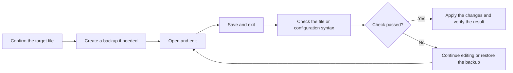
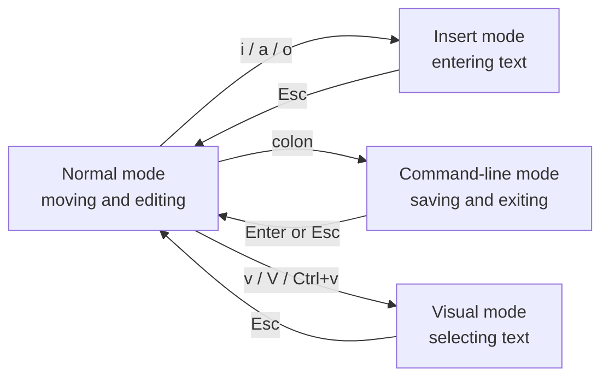

> [!DETAILS-AI] AI Summary of This Section
> This section follows the "open, edit, save, exit, verify" flow to introduce the basic operations of `nano` and `Vim`, and uses a configuration modification example to illustrate the order of backup, syntax checking, and applying changes.

> [!INFO]
> When logging into a server over `SSH`, graphical remote development tools may not be available, but terminal editors often work directly. Modifying configuration, writing Git commit messages, or reviewing temporary scripts all require the most basic open, save, and exit operations.



> [!INFO] Prerequisites
> This section assumes you already know paths, permissions, and common Shell commands. If you are not familiar with them yet, please read [1.12 Shell Basics](/en/docs/ch1/1.12-Shell-Basics) first.

> [!IMPORTANT] Learn to Exit First
> Before opening a terminal editor for the first time, remember how to exit:
>
> `nano` uses `Ctrl + X`;
>
> `Vim`: press `Esc` to return to normal mode, then type `:q`.

## 1. Choosing an Editor

Both `nano` and `Vim` can handle terminal text editing, but they differ in learning cost and suitable use cases.

| Dimension | `nano` | `Vim` |
| :--- | :--- | :--- |
| Learning difficulty | Low; common shortcuts are shown at the bottom | Higher; you need to understand modes |
| Suitable for | Quick edits, first contact with terminal editing | Frequent editing, remote development, keyboard workflows |
| Way of working | Close to a normal text editor | Works through modes such as normal, insert, and command-line |
| Learning advice | First master save, search, and exit | First master a minimal command set, then expand gradually |

> [!NOTE] The Editor May Not Be Installed
> Different distributions and server images ship different tools. A minimal system may only have `vi`, or may have neither `nano` nor full `Vim`. You can check by running `command -v nano`, `command -v vim`, and `command -v vi`.

## 2. Quick Editing with `nano`

### 2.1 Open a File

`nano`'s interface is intuitive and suits readers who are new to terminal editors.

```bash
nano notes.txt
nano ~/.gitconfig
```

If the file does not exist, it will be created when you save; if it already exists, `nano` loads its current content.

> [!WARNING] Be Careful When Editing System Files
> Only use administrator privileges after confirming the target path and the changes to be made. When editing system files, prefer `sudoedit /path/to/file`: it edits a temporary copy, then writes it back with administrator privileges, reducing the time the editor itself runs with high privileges.

### 2.2 Reading the Shortcut Hints

The bottom of the interface shows the currently available actions, for example:

```text
^G Help      ^O Write Out      ^W Where Is      ^K Cut
^X Exit      ^R Read File      M-R Replace      ^U Paste
```

Here, `^` stands for `Ctrl`, and `M-` stands for `Meta`; on most keyboards and terminals, `Meta` maps to `Alt`.

### 2.3 Common Shortcuts

| Shortcut | Action |
| :--- | :--- |
| `Ctrl + O` | Write the file; press `Enter` afterwards to confirm the file name |
| `Ctrl + X` | Close the current buffer; asks whether to save if there are unsaved changes |
| `Ctrl + W` | Search forward |
| `Alt + W` | Find the next match |
| `Alt + R` | Start the replace flow |
| `Ctrl + K` | Cut the current line or the selected area |
| `Ctrl + U` | Paste the content of the cut buffer |
| `Alt + G` | Jump to a specific line and column |
| `Ctrl + G` | Open help |

> [!DETAILS-HINT] What if the `Alt` Shortcuts Do Not Work?
> Some terminals intercept `Alt` key combinations. You can press `Esc` once, release it, then press the corresponding letter; for example, pressing `Esc` and then `G` in sequence also triggers the jump action.

> [!DETAILS-EXAMPLE] Practice: Create and Check Your First Terminal Note
> Run `nano shell-note.txt`, write three lines of the commands you just learned, save, and exit. Then run `cat shell-note.txt` to check the content, open the file again, and try using `Ctrl + W` to search for one of the commands.

## 3. `Vim` Modes

The core of `Vim` is not memorizing a large number of shortcuts, but understanding that "different modes handle different tasks". After opening a file, you are in normal mode by default; keys are then interpreted as editing commands rather than typed text directly.



| Mode | Main purpose | Common way to enter |
| :--- | :--- | :--- |
| Normal mode | Moving, deleting, copying, pasting, and composing commands | Entered by default on startup, or by pressing `Esc` |
| Insert mode | Entering and modifying text | Press `i`, `a`, or `o` in normal mode |
| Command-line mode | Saving, quitting, replacing, and setting options | Press `:` in normal mode |
| Visual mode | Selecting text by character, line, or rectangular block | Press `v`, `V`, or `Ctrl + V` in normal mode |

> [!TIP] Treat Normal Mode as a "Safe Spot"
> When you are not sure which mode you are in, press `Esc` first. Sometimes you need to press it twice; if you are already in normal mode, `Vim` will at most beep and won't modify the file.

## 4. Basic `Vim` Operations

### 4.1 Open, Save, and Exit

```bash
vim notes.txt
vim +10 notes.txt
```

The second command opens the file and places the cursor on line `10`.

Enter the following commands in normal mode:

| Command | Action | When to use |
| :--- | :--- | :--- |
| `:w` | Write the file | Continue editing after saving |
| `:q` | Close the current window | The content is unchanged or already saved |
| `:wq` | Write and quit | Quit while keeping your changes |
| `:q!` | Discard unsaved changes and quit | You clearly don't need the current changes |
| `ZZ` | Write and quit | A quick action in normal mode |
| `ZQ` | Discard changes and quit | A quick action in normal mode |

> [!CAUTION] `:q!` Discards Your Changes
> `!` means force. Before using `:q!`, make sure the current unsaved content is truly no longer needed.

### 4.2 Entering Insert Mode

| Key | Where insert mode starts |
| :--- | :--- |
| `i` | Before the current character |
| `a` | After the current character |
| `I` | Before the first non-whitespace character of the current line |
| `A` | At the end of the current line |
| `o` | Open a new line below |
| `O` | Open a new line above |

After finishing your input, press `Esc` to return to normal mode.

### 4.3 Moving the Cursor

| Key | Movement |
| :--- | :--- |
| `h` / `j` / `k` / `l` | Left / down / up / right |
| `w` / `b` | Beginning of the next / previous word |
| `0` / `$` | Start / end of the line |
| `gg` / `G` | Start / end of the file |
| `Number + G` | Jump to a specific line, e.g. `20G` |
| `Ctrl + D` / `Ctrl + U` | Scroll down / up by half a page |

Arrow keys usually work too; don't force yourself to master all movement commands on the first day. First get familiar with `i`, `Esc`, `:w`, and `:q`, then gradually add `hjkl`.

### 4.4 Editing, Undo, and Repeat

| Key | Action |
| :--- | :--- |
| `x` | Delete the current character |
| `dd` | Delete the current line and save it to a register |
| `dw` | Delete from the cursor to the end of the word |
| `yy` | Copy the current line |
| `p` | Paste after the cursor; whole lines are pasted on the next line |
| `u` | Undo |
| `Ctrl + R` | Redo |
| `.` | Repeat the last change |

`Vim` commands can be combined with numbers. For example, `3dd` deletes three lines, and `5j` moves down five lines. This "count + action" combination is the key to improving efficiency.

### 4.5 Searching and Replacing

| Command | Action |
| :--- | :--- |
| `/keyword` | Search downward for `keyword` |
| `?keyword` | Search upward for `keyword` |
| `n` / `N` | Jump to the next / previous match |
| `:%s/old/new/g` | Replace `old` with `new` throughout the file |
| `:%s/old/new/gc` | Replace throughout the file, confirming before each change |

In `:%s/old/new/g`, `old` is a Vim regular expression and `new` is the replacement text; their escaping rules are not the same. Under Vim's default regex syntax, "one or more digits" can be written as `\d\+`; with very magic mode enabled, it can be written as `\v\d+`. For details, run `:help pattern` inside Vim; for regex basics, see [1.7 Text Editing](/en/docs/ch1/1.7-Text-Editing#53-regular-expressions).

> [!DETAILS-EXAMPLE] Practice: Complete a Minimal `Vim` Loop
> 1. Run `vim vim-note.txt`.
> 2. Press `i` to enter insert mode and type a line of text.
> 3. Press `Esc` to return to normal mode.
> 4. Type `:w` and press `Enter` to save.
> 5. Use `/text` to search for the content you just typed.
> 6. Type `:q` and press `Enter` to quit.

### 4.6 Selecting Text with Visual Mode

| Key | Selection |
| :--- | :--- |
| `v` | By character |
| `V` | By whole lines |
| `Ctrl + V` | By rectangular block |

After entering visual mode, you can extend the selection with movement commands, then press `y` to copy or `d` to delete.

## 5. The `vimtutor` Interactive Tutorial

Instead of memorizing all the commands at once, use the interactive tutorial that ships with `Vim`:

```bash
vimtutor
```

The tutorial guides you through moving, deleting, inserting, undoing, and searching in an editable practice file. The content and the time required may vary between versions; it is recommended to practice through it once in full.

> [!TIP] Can't Find `vimtutor`
> `vimtutor` is usually installed with the full `Vim` package. If the system says the command does not exist, first check whether you only installed the minimal `vi`, then install `Vim` using your distribution's package management.

## 6. `.vimrc` Configuration

After mastering the basics, you can add a few settings to `~/.vimrc` to improve the default experience:

```vim
" ~/.vimrc
set number
set expandtab
set tabstop=4
set shiftwidth=4
set autoindent
set hlsearch
set incsearch
set ignorecase
set smartcase
syntax enable
```

These settings show line numbers, unify the base indentation width, and improve searching and syntax highlighting. For a specific project, the indentation rules should still follow the formatter and editor configuration in its repository.

After changing the configuration, you can reload it in an already-open `Vim`:

```vim
:source ~/.vimrc
```

> [!DETAILS-HINT] Keep the Configuration Simple First
> Plugins and complex mappings increase the cost of migration and troubleshooting. First build stable habits with default features; only introduce the corresponding configuration or plugins when you clearly keep running into the same problem.

## 7. The Default Terminal Editor

Some commands open an editor on their own, such as `git commit` without `-m`. You can set the editor for `Git` only:

```bash
git config --global core.editor "nano"
git config --global --get core.editor
```

If you choose `Vim`, change `"nano"` to `"vim"` in the first command.

You can also set the generic `VISUAL` and `EDITOR` environment variables in your Shell configuration:

```bash
# ~/.bashrc
export VISUAL=nano
export EDITOR="$VISUAL"
```

It takes effect after reopening the terminal or running `source ~/.bashrc`.

> [!NOTE] Graphical Editors Need a Wait Flag
> If you set a graphical program such as `VS Code` as the Git editor, the command needs to wait for the editing window to close, for example `git config --global core.editor "code --wait"`. Otherwise Git may continue before we finish editing.

## 8. TODO Checklist

- [ ] Can open, search, save, and exit files in `nano`
- [ ] Can explain the difference between `Vim` normal mode and insert mode
- [ ] Can open, edit, undo, save, and exit in `Vim`
- [ ] Tried practicing with `vimtutor`
- [ ] Create a backup before modifying important configuration

## 9. Questions Worth Thinking About

> [!DETAILS-FAQ] Why are terminal editors still irreplaceable today?
> Graphical editors already support remote development, but servers, containers, and emergency environments may not have a complete graphical toolchain. Mastering the minimal operations of `nano` or `Vim` allows you to make necessary changes in these environments, and also to understand the editing interfaces temporarily opened by programs such as Git.

## 10. Further Reading

- [GNU nano shortcut cheat sheet](https://www.nano-editor.org/dist/latest/cheatsheet.html)
- [Vim user manual: editing for the first time](https://vimhelp.org/usr_02.txt.html)
