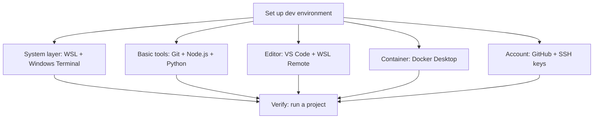

> [!DETAILS-AI] AI Summary of This Section
> This section installs WSL 2 on Windows and sets up Git, Node.js, Python, the C / C++ toolchain, VS Code remote development, SSH keys, and Docker inside Ubuntu, with verification commands at every step. If you only need Windows-native tools, see [1.14 Windows Environment Setup](/en/docs/ch1/1.14-Environment-Setup-Windows).

> [!INFO]
> The previous sections covered file management, the shell, and editors. This section ties them together into a minimal, verifiable Linux development environment on Windows + WSL. The full version-control workflow is covered in [1.15 Version Control and Git](/en/docs/ch1/1.15-Version-Control-Git); for the native Windows environment (scoop, MSYS2, etc.), see [1.14 Windows Environment Setup](/en/docs/ch1/1.14-Environment-Setup-Windows).

## 1. Overall Plan



Principle: **keep it minimal, add as you go**. Don't install dozens of tools at once; start with a minimal usable set and extend it as needs appear. Tools keep updating, so the goal is to know "how to install, how to verify, and how to redo it when something breaks", rather than a one-time setup that never changes.

> [!TIP] Verify step by step
> Verify each tool immediately after installing it with a version command. If you install everything first and test later, you won't be able to tell which step went wrong.

## 2. Step 1: WSL + Windows Terminal

Prepare WSL on Windows when your courses or projects need the Linux toolchain; projects that only use Windows tools don't need it for the sake of form.

### 2.1 Install WSL 2

First check [Microsoft's WSL installation prerequisites](https://learn.microsoft.com/windows/wsl/install). On a supported Windows 10 / 11, open PowerShell as administrator:

```powershell
wsl --install
```

On systems without WSL, this command enables the required components and installs Ubuntu with WSL 2 by default; you can also run `wsl --list --online` to see other distributions, then use `wsl --install -d distro-name` to pick one. If WSL already exists, the command may behave differently, so run `wsl --status` first to see the current state.

After rebooting and completing the distribution initialization, confirm the version in PowerShell:

```powershell
wsl --list --verbose
```

The `VERSION` of your distribution should be `2`. If not, check the system prerequisites against Microsoft's current docs, then convert with `wsl --set-version distro-name 2`. On first launch you'll create a Linux username and password; the password input is not echoed in the terminal.

> [!NOTE] WSL vs. virtual machines
> WSL 2 runs the Linux kernel inside a lightweight virtual machine, but Windows integrates files, networking, and the lifecycle. It suits local development but is not the same as a standalone Linux host identical to your production environment.

**Verify the installation:**

```bash
# Run in the Ubuntu terminal
cat /etc/os-release     # view the Ubuntu version
uname -r                # view the kernel version
```

### 2.2 Install Windows Terminal

Windows 11 usually ships with Windows Terminal; other supported systems can install it from the Microsoft Store. You can set your WSL distribution as the default profile, or keep PowerShell as the default entry and switch as needed.

**Verification:** open Windows Terminal — your installed WSL distribution should be selectable in the profile list.

> [!TIP] macOS users can skip WSL
> macOS is a Unix system and doesn't need WSL; use the system terminal. Its package management, system interfaces, and default command versions differ from Linux, so follow the platform-specific instructions when installing.

## 3. Step 2: Basic Toolchain

Enter the WSL Ubuntu terminal and install the essential development tools.

### 3.1 Update the system

```bash
sudo apt update
```

### 3.2 Git

```bash
# Install Git
sudo apt install git -y

# Verify the installation
git --version
```

You only install Git once. Identity configuration (username, email) and everyday usage are covered in the "Initial Configuration" section of [1.15 Version Control and Git](/en/docs/ch1/1.15-Version-Control-Git).

### 3.3 Node.js (front-end / JS development)

Different projects may require different Node.js versions. First check the `.nvmrc`, `package.json`, or README in the repository; when you need to switch versions between projects, install a version manager per the [nvm official README](https://github.com/nvm-sh/nvm). Install scripts and version numbers change, so this section won't paste a remote script that goes stale.

```bash
command -v nvm

# When the project already has a .nvmrc
nvm install
nvm use

# No project version constraint; just want the current LTS
nvm install --lts
```

Reopen the terminal after installing, then run the commands above. `nvm install` installs the version declared in a `.nvmrc` found in the current directory; team projects should commit the version constraint to the repository rather than relying on the default version of each person's machine.

**Verify the installation:**

```bash
nvm current
node --version
npm --version
```

### 3.4 Python

Ubuntu provides Python for system tools, so **do not delete or replace the system Python**. Install virtual environment support first, then create an isolated environment for each project:

```bash
sudo apt install -y python3 python3-venv
python3 --version
```

If you truly need multiple interpreter versions, follow the [pyenv official docs](https://github.com/pyenv/pyenv) to install the build dependencies and pyenv, and choose the exact version your project requires. pyenv manages interpreter versions while virtual environments isolate project dependencies; they solve different problems.

```bash
python3 -m venv .venv
source .venv/bin/activate
python --version
python -m pip --version
```

The prompt usually shows `(.venv)`. Run `deactivate` when you're done. Install dependencies according to the project README and lock files; don't install packages straight into the system Python.

### 3.5 C/C++ toolchain

```bash
sudo apt install -y build-essential gdb cmake
```

**Verify the installation:**

```bash
gcc --version
g++ --version
```

> [!NOTE] Use clangd for completion in VS Code
> The VS Code C/C++ extension relies on Microsoft's IntelliSense; if you switch to the clangd language server (`sudo apt install clangd`), disable `C_Cpp.intelliSenseEngine` the same way as in the Windows article — see the C/C++ part of [1.14 Windows Environment Setup](/en/docs/ch1/1.14-Environment-Setup-Windows).

### 3.6 Common small utilities

```bash
sudo apt install -y curl wget tree htop jq
```

### 3.7 Optional: zsh, fish, and Starship

After practicing Bash basics, you can install zsh or fish according to your interaction preferences; scripts should still declare their interpreter with a shebang. Ubuntu / Debian can install them from the distribution repositories:

```bash
sudo apt update
sudo apt install zsh fish
zsh --version
fish --version
```

Run `zsh` and `fish` first to try them out; you don't need to change the default shell right away. Once the configuration and toolchain work, if you want to change the login shell, run `command -v zsh` or `command -v fish` to get the real path, check that it's listed in `/etc/shells`, then use `chsh -s actual-path`. WSL, containers, remote hosts, and managed devices may not allow or need a changed login shell.

[Starship](https://starship.rs/) gives Bash, zsh, and fish a consistent prompt. Install it using the package method for your OS described in the [official guide](https://starship.rs/guide/), and avoid running unvetted remote install scripts. After installing, add the init statement to `~/.bashrc`, `~/.zshrc`, or `~/.config/fish/config.fish` depending on your shell; examples are in [1.12 Shell Basics](/en/docs/ch1/1.12-Shell-Basics).

```bash
starship --version
mkdir -p ~/.config
```

The shared Starship config lives at `~/.config/starship.toml` by default; this secret-free file can be managed as dotfiles, while shell-specific init statements stay in each shell's config file.

> [!INFO] Why use nvm / pyenv
> Different projects may need different Node.js or Python versions. nvm / pyenv switch interpreter versions per directory, and Python virtual environments additionally isolate project dependencies; whether to adopt them depends on team conventions, OS, and project requirements.

## 4. Step 3: VS Code and Remote Development

### 4.1 Install VS Code

Install [VS Code](https://code.visualstudio.com/) on Windows (the Windows article shows the scoop way). It runs on Windows and can connect to code inside WSL.

### 4.2 Install extensions per project

| Extension | Purpose |
| :--- | :--- |
| **WSL** | Needed to connect VS Code to WSL |
| C/C++ | C/C++ development support (disable IntelliSense when using clangd) |
| Python | Python development support |
| GitLens | Optional, when you want enhanced Git history browsing |
| Prettier | For front-end projects that already adopt it |
| Live Server | For local preview of simple static pages |

### 4.3 Remote development with WSL

1. Enter the project directory in the WSL terminal: `cd ~/projects/my-app`
2. Type `code .` (it opens VS Code on Windows and connects to WSL automatically)
3. "WSL: Ubuntu" in the bottom-left corner means you are connected

The UI runs on Windows while workspace extensions, the terminal, and project commands run inside WSL; you can check which side an extension is installed on in the Extensions panel.

**Verification:** run `uname` in the VS Code terminal — it should print Linux, not Windows.

> [!WARNING] Keep projects in the WSL filesystem
> When working with many files using Linux toolchains, keep projects in the WSL filesystem (e.g. `~/projects/`) for better performance, file watching, and permission semantics. If a project is mainly processed by Windows tools, choose its location based on the actual workflow, so the same project isn't repeatedly rewritten by both sides with different permissions and line endings.

## 5. Step 4: GitHub and SSH Keys

The full flow of registering a GitHub account, generating SSH keys, adding the public key to GitHub, and testing the connection is covered in the "Registration and Configuration" section of [1.16 Code Hosting Platforms](/en/docs/ch1/1.16-Code-Hosting-Platform) and won't be repeated here. Two things worth remembering on the environment side:

> [!CAUTION] Key file permissions
> SSH private keys are credentials — never send them to anyone or upload them to any repository. Keep the default file permissions; on Linux, if you see `UNPROTECTED PRIVATE KEY FILE`, restore the restricted permissions on `~/.ssh` and the key, e.g. `chmod 700 ~/.ssh` and `chmod 600 ~/.ssh/id_ed25519`.

## 6. Step 5: Docker

Docker records application dependencies and startup as images and configuration, but you still manage the host, architecture, data, and key differences. On Windows / macOS install **Docker Desktop** (on Linux, install Docker Engine per the [Docker docs](https://docs.docker.com/)), then enable **WSL integration** in Docker Desktop so the `docker` command also works inside WSL.

**Verify Docker:**

```bash
docker --version
docker compose version
docker run --rm hello-world
```

If `hello-world` can't be pulled, check the network and mirror configuration before moving on.

> [!TIP] Mirror registry issues
> If Docker Hub is unreachable, first check the network, proxy, and organization policy. If you need a mirror proxy, use a trusted service explicitly provided by your organization or course and verify the image namespace and digest; Docker Desktop and the Linux Docker Engine have different configuration entry points and restart methods. See [1.17 Docker Basics](/en/docs/ch1/1.17-Docker-Basics).

## 7. Putting It Together: Run a Project in WSL

The goal of environment setup is to define the run conditions clearly, so anyone meeting the same prerequisites can reproduce them.

### 7.1 Clone a project

Replace `repository-url` below with the HTTPS or SSH URL the project provides:

```bash
cd ~/projects
git clone repository-url my-app
cd my-app
```

### 7.2 Start dependency services with Docker

```yaml
# compose.yaml
services:
  db:
    image: postgres:16-alpine
    restart: unless-stopped
    environment:
      POSTGRES_USER: app
      POSTGRES_PASSWORD: ${POSTGRES_PASSWORD:?set POSTGRES_PASSWORD in an uncommitted .env or the current environment}
      POSTGRES_DB: app
    ports:
      - "5432:5432"
    volumes:
      - pgdata:/var/lib/postgresql/data

volumes:
  pgdata:
```

Set `POSTGRES_PASSWORD` in an uncommitted `.env` or the current shell, then inspect and start the services:

```bash
docker compose config
docker compose up -d
docker compose ps
```

### 7.3 Verify the environment is ready

Run the project's dev commands (per its README), for example:

```bash
npm install
npm run build
```

Then run the app on a local `localhost` port and verify it in the browser. Once it works without errors, write the full steps into the `README`, and the environment becomes a reproducible asset.

### 7.4 Clean up

```bash
docker compose down        # stop the containers
docker compose down -v     # also remove volumes (data will be lost; confirm first)
```

## 8. Directory Planning

Once the environment is ready, decide where files and tools live in the system:

```text
~/.ssh/                 # SSH keys and connection config; not committed wholesale
~/.config/              # app config directory; check per item for accounts, tokens, or machine state
~/.gitconfig            # user-level Git config
~/projects/             # project directory
~/projects/my-app/.nvmrc # project-scoped Node.js version declaration
~/notes/                # personal notes and docs (managed per your backup strategy)
```

The value of planning is predictability: where new projects go, where config files live, and what to clean up when unused all have clear answers.

## 9. Recovering on a New Computer

Environments break and migrate. The core idea: **config goes into repositories, keys are managed separately**.

| Config | Where to manage |
| :--- | :--- |
| `~/.gitconfig` | Record the key fields manually, or put them in a personal config repo |
| Shell config (`~/.bashrc`, `~/.zshrc`, `~/.config/fish/config.fish`) | Put secret-free common parts in a private or public config repo; manage real tokens and machine-specific values separately |
| SSH keys | Generate new keys with `ssh-keygen`; never copy private keys |
| `~/projects/` | Push all projects to a remote and restore with `git clone` |
| `~/notes/` | Push to a repo or use a personal cloud drive |

```bash
# Example steps on a new machine (Ubuntu)
sudo apt update && sudo apt install -y git
ssh-keygen -t ed25519 -C "new machine"
cat ~/.ssh/id_ed25519.pub   # add the public key to the hosting platform
eval "$(ssh-agent -s)"
ssh-add ~/.ssh/id_ed25519
git clone git@github.com:your-username/dotfiles.git ~/dotfiles
cd ~/dotfiles
git status                 # review the source, README, and install scripts before following the repo instructions
```

> [!IMPORTANT] Never copy keys
> SSH private keys are credentials, not ordinary config files. On a new machine, usually generate a fresh key and register its public key so access can be revoked independently; if your organization uses managed or hardware keys, follow its migration and recovery policy.

After migrating the config, run through the verification checklist above item by item and the new environment is ready for work.

## 10. Summary

```text
OS          -> WSL / native terminal
Version control -> Git + GitHub/CNB
Languages   -> nvm/pyenv + virtual environments
Editor      -> VS Code + WSL Remote
Container   -> Docker + Compose
SSH keys    -> credentials
```

The essence of environment setup isn't "get it right once", but **being able to rebuild and verify it from records**. Putting non-sensitive config, version constraints, and steps under appropriate version control reduces migration and debugging costs.

## 11. TODO Checklist

- [ ] Understand the difference between WSL and a virtual machine
- [ ] Try installing WSL and initializing Ubuntu (set up a password login)
- [ ] Choose Node.js / Python versions per the project declaration, and learn how Python virtual environments isolate dependencies
- [ ] Try connecting VS Code to WSL to edit and run code
- [ ] Try deploying a database or an interesting app service with Docker Compose
- [ ] Complete the full "clone, install, run, use" loop inside a container or project
- [ ] Try to set up a usable development environment on your own computer

## 12. Questions Worth Thinking About

> [!DETAILS-FAQ] When do you need a version manager?
> When one machine must maintain multiple Node.js or Python versions, tools like nvm or pyenv can switch interpreters per project; with only one version needed, the system package or official installer may be simpler. Either way, teams should declare versions in the repository, and Python projects should isolate dependencies with virtual environments.

> [!DETAILS-FAQ] Is it risky to put config in a repository?
> Repositories keep the full history; once tokens, passwords, or private keys are committed they are very hard to fully remove. If a config file needs sensitive variables, commit only a template without real values and inject them via environment variables or a dedicated secrets manager, excluding local files with `.gitignore`. Never commit private key contents to a repository.


