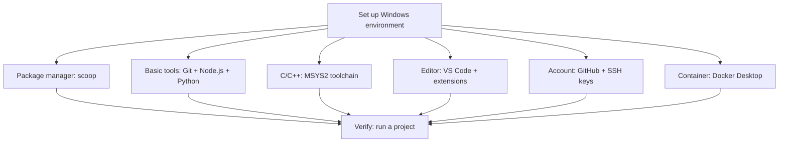

> [!DETAILS-AI] AI Summary of This Section
> This section installs Git, Node.js, Python, and VS Code on Windows with scoop, then follows [Shenshijun's C/C++ setup guide](https://blog.shenshijun.space/posts/tutorials/vscode-cpp-setup/) to install the MSYS2 toolchain and configure the VS Code plugins, finishing with SSH keys and Docker. Every step has a verification command. If you need the Linux toolchain, see [1.14 WSL Environment Setup](/en/docs/ch1/1.14-Environment-Setup-WSL).

> [!INFO]
> Projects that only rely on Windows tools can be set up directly on Windows without installing WSL for the sake of form. This section uses **scoop**, a package manager, to install tools: no admin rights needed, PATH handled automatically, and clean uninstalls. The C / C++ toolchain follows [Shenshijun's C/C++ setup guide](https://blog.shenshijun.space/posts/tutorials/vscode-cpp-setup/) (Windows only, aimed at algorithmic contest / practice problems). If you need the Linux toolchain, see [1.14 WSL Environment Setup](/en/docs/ch1/1.14-Environment-Setup-WSL) first.

## 1. Overall Plan



Principle: **keep it minimal, add as you go**. Start with a minimal usable set and extend it as needs appear.

> [!TIP] Verify step by step
> Verify each tool immediately after installing it with a version command. If you install everything first and test later, you won't be able to tell which step went wrong.

## 2. Why scoop

scoop is a command-line package manager for Windows, similar to `apt` or `brew`: one command installs software, adds it to PATH automatically, and upgrades don't leave scattered install directories on the system.

The main differences from traditional installers:

| Comparison | Traditional installer | scoop |
| :--- | :--- | :--- |
| Install location | Each program decides; most end up in `C:\Program Files` | Unified in the user directory `%USERPROFILE%\scoop` |
| Admin rights | UAC prompts often appear | Usually not needed |
| PATH setup | Some require manual additions, some even add them wrong | Handled automatically |
| Uninstall | Some uninstallers leave residue behind | `scoop uninstall` removes it cleanly |
| Upgrades | Update each program manually | One command with `scoop update *` |

## 3. Install scoop

Run the following in PowerShell (not CMD):

```powershell
Set-ExecutionPolicy -ExecutionPolicy RemoteSigned -Scope CurrentUser
irm get.scoop.sh | iex
```

The first line allows local scripts (which scoop needs); the second downloads and runs the install script. Verify in PowerShell after installing:

```powershell
scoop --version
```

**Common commands:**

| Command | Purpose |
| :--- | :--- |
| `scoop search keyword` | Search for software |
| `scoop install app-name` | Install |
| `scoop update *` | Upgrade all software |
| `scoop status` | See which software has new versions |
| `scoop list` | List installed software |
| `scoop uninstall app-name` | Uninstall |
| `scoop cleanup` | Clean up old version caches |

**What is a bucket:** scoop groups software by "source", called a bucket. Only `main` (core tools) is present by default; add the community-maintained `extras` bucket with `scoop bucket add extras` when you need more software, and `scoop bucket add versions` can install multiple versions (such as different Node.js versions).

> [!NOTE] Where scoop installs
> The default install directory is `%USERPROFILE%\scoop\apps`; the shims (command entry points) live in `%USERPROFILE%\scoop\shims` and are added to PATH automatically during installation, so you don't need to configure environment variables manually.

## 4. Basic Tools: Git, Node.js, and Python

Install in PowerShell:

```powershell
scoop install git
scoop install nodejs-lts
scoop install python
```

> [!NOTE] Node.js version
> `nodejs-lts` is the current LTS (long-term support) version. If a project needs another version, check the `.nvmrc`, `package.json`, or README in the repository; when you need multiple versions to coexist, look into `scoop bucket add versions` or nvm-windows — don't install a pile of versions by default.

**Verify the installation:**

```powershell
git --version
node --version
npm --version
python --version
```

You only install Git once. Identity configuration (username, email) and everyday usage are covered in the "Initial Configuration" section of [1.15 Version Control and Git](/en/docs/ch1/1.15-Version-Control-Git).

## 5. C/C++ Toolchain (per Shenshijun's Guide)

For C/C++ on Windows, this section directly follows [Shenshijun's C/C++ environment setup guide](https://blog.shenshijun.space/posts/tutorials/vscode-cpp-setup/) (Windows only, aimed at algorithmic contest / practice problems). Below are the essential parts; the original guide (with screenshots) is authoritative for details.

### 5.1 Install MSYS2

Go to the [MSYS2 website](https://www.msys2.org/) and download the installer for your processor architecture:

| Architecture | How to check | Installer |
| :--- | :--- | :--- |
| x64 | `Settings` → `System` → `System info` → System type shows "x64-based" | x86_64 version |
| ARM64 | Same, shows "ARM-based" | ARM64 version |

Click "Next" to complete the installation; the default path is `C:\msys64` — remember it. After installing, open the `MSYS2 MSYS` terminal and update the packages first:

```bash
pacman -Syu
```

### 5.2 Install the C/C++ toolchain

Run this in the **MSYS2 UCRT64** terminal (open `MSYS2 UCRT64` from the Start menu):

```bash
pacman -S --needed --noconfirm mingw-w64-ucrt-x86_64-toolchain mingw-w64-ucrt-x86_64-clang-tools-extra mingw-w64-ucrt-x86_64-cmake mingw-w64-ucrt-x86_64-ninja
```

What each package does:

| Package | Purpose |
| :--- | :--- |
| `mingw-w64-ucrt-x86_64-toolchain` | Core tools: GCC / G++ compilers, GDB debugger, etc. |
| `mingw-w64-ucrt-x86_64-clang-tools-extra` | Clangd language server (code completion, syntax checking) |
| `mingw-w64-ucrt-x86_64-cmake`, `mingw-w64-ucrt-x86_64-ninja` | Build tools (only needed for large projects) |

**Verify the installation:**

```bash
clangd --version   # success if a version is printed
where clangd       # should print a path, not "not found"
where g++          # should print a path, not "not found"
```

### 5.3 Configure the environment variable

Add `C:\msys64\ucrt64\bin` to the system environment variable `Path` (replace it with your actual path if you changed the install location):

1. Press `Win + I` to open Settings → `System` → `System info` → `Advanced system settings`
2. Click `Environment Variables` → find `Path` under `System variables` → `Edit` → `New`
3. Paste `C:\msys64\ucrt64\bin` → `OK` to save
4. Reopen the terminal

**Verification:** in a new terminal, run `clangd --version` and `g++ --version`; a version printed means the configuration is correct. The principles of environment variables are in [1.2 Windows Settings](/en/docs/ch1/1.2-Windows-Settings#七环境变量).

### 5.4 Common problems

| Error | Fix |
| :--- | :--- |
| `The 'clangd' language server was not found on your PATH` | Check whether the environment variable is configured correctly, or set the absolute path of the clangd executable in the clangd plugin settings |
| `fatal error: 'iostream' file not found` | The environment variable isn't configured correctly, or the toolchain wasn't fully installed per the instructions above; recheck steps 5.2 and 5.3 |
| Garbled Chinese output | Add the compile flag `-fexec-charset=GBK` in the `C/C++ Compile Run` plugin settings |

## 6. VS Code and C/C++ Plugins

### 6.1 Install VS Code

Install it with scoop (from the `extras` bucket):

```powershell
scoop bucket add extras
scoop install vscode
```

You can also download and install the System Installer from the [VS Code website](https://code.visualstudio.com/). Basic VS Code usage is covered in [1.7 Text Editing](/en/docs/ch1/1.7-Text-Editing).

### 6.2 Install plugins

Install the following plugins per [Shenshijun's C/C++ guide](https://blog.shenshijun.space/posts/tutorials/vscode-cpp-setup/):

| Plugin | Purpose |
| :--- | :--- |
| C/C++ | Microsoft's official C/C++ support |
| C/C++ Compile Run | One-click compile and run (default shortcut `F6`) |
| clangd | Language server providing completion and syntax checking |
| Clang-Format | Code formatting (`Shift + Alt + F`) |
| Chinese (Simplified) language pack | Optional Simplified Chinese UI |

### 6.3 Configure clangd and disable IntelliSense

After opening any `.cpp` file, clangd usually prompts about a conflict with the Microsoft C/C++ plugin's IntelliSense — click **Disable IntelliSense**; if you clicked it away by accident, add this to the VS Code settings (JSON):

```json
"C_Cpp.intelliSenseEngine": "disabled"
```

### 6.4 Compile, run, and debug

- **Compile and run:** the run button in the top-right corner or the `F6` shortcut (provided by C/C++ Compile Run)
- **Debug:** set a breakpoint first, then press `F5` to start debugging
- **Format:** `Shift + Alt + F`; on first use, pick Clang-Format in the popup

> [!NOTE] Detailed steps
> The full plugin configuration flow, `.clang-format` style files, contest helper plugins like CPH / Luogu, theme customization, and recommended settings are all in [Shenshijun's C/C++ environment setup guide](https://blog.shenshijun.space/posts/tutorials/vscode-cpp-setup/) — not repeated here.

## 7. GitHub and SSH Keys

The full flow of registering a GitHub account, generating SSH keys, adding the public key to GitHub, and testing the connection is covered in the "Registration and Configuration" section of [1.16 Code Hosting Platforms](/en/docs/ch1/1.16-Code-Hosting-Platform) and won't be repeated here. One thing worth remembering on the environment side:

> [!CAUTION] Key file permissions
> SSH private keys are credentials — never send them to anyone or upload them to any repository. Keep the default file permissions and don't copy key files into shared drives or repositories.

## 8. Docker

Container development environments are covered in [1.17 Docker Basics](/en/docs/ch1/1.17-Docker-Basics). Install **Docker Desktop** on Windows / macOS and enable the WSL 2 backend (if you use WSL 2, set up WSL first per [1.14 WSL Environment Setup](/en/docs/ch1/1.14-Environment-Setup-WSL)).

**Verify Docker:**

```powershell
docker --version
docker compose version
docker run --rm hello-world
```

If `hello-world` can't be pulled, check the network and mirror configuration first.

> [!TIP] Mirror registry issues
> If Docker Hub is unreachable, first check the network, proxy, and organization policy. If you need a mirror proxy, use a trusted service explicitly provided by your organization or course and verify the image namespace and digest; Docker Desktop and the Linux Docker Engine have different configuration entry points and restart methods. See [1.17 Docker Basics](/en/docs/ch1/1.17-Docker-Basics).

## 9. Directory Planning

Decide where files and tools live in the system:

```text
%USERPROFILE%\.ssh\    # SSH keys; not committed wholesale
%USERPROFILE%\scoop\   # software installed by scoop; reinstalled if broken
D:\Projects\           # project directory (all-English, no spaces; see 1.1 File Management)
D:\Notes\              # personal notes and documents
```

The value of planning is predictability: where new projects go, where config files live, and what to clean up when unused all have clear answers.

## 10. Recovering on a New Computer

**Record first, then migrate.** When switching to a new computer:

1. Record the installed software list with `scoop list`
2. Push all projects to a remote repository and restore them on the new machine with `git clone`
3. **Don't copy** SSH keys — generate new ones with `ssh-keygen` and re-register the public key
4. Put config files (e.g. `.clang-format`, Starship config) in a personal config repository

```powershell
# Example steps on a new computer
Set-ExecutionPolicy -ExecutionPolicy RemoteSigned -Scope CurrentUser
irm get.scoop.sh | iex
scoop install git nodejs-lts python
# install the MSYS2 toolchain and VS Code plugins per sections 5 and 6 above
ssh-keygen -t ed25519 -C "new machine"
git clone git@github.com:your-username/dotfiles.git ~/dotfiles
```

> [!IMPORTANT] Never copy keys
> SSH private keys are credentials, not ordinary config files. On a new machine, usually generate a fresh key and register its public key so access can be revoked independently; if your organization uses managed or hardware keys, follow its migration and recovery policy.

After migrating the config, run through the verification checklist above item by item and the new environment is ready for work.

## 11. Summary

```text
Package manager -> scoop
Version control -> Git + GitHub/CNB
Languages       -> nodejs-lts / python (managed by scoop)
C/C++          -> MSYS2 + clangd
Editor         -> VS Code + plugins
Container      -> Docker Desktop
SSH keys       -> credentials
```

The essence of environment setup isn't "get it right once", but **being able to rebuild and verify it from records**. Putting non-sensitive config, version constraints, and steps under appropriate version control reduces migration and debugging costs.

## 12. TODO Checklist

- [ ] Understand the difference between scoop and manual installation
- [ ] Install scoop and use `scoop install` to install Git, Node.js, and Python
- [ ] Install the MSYS2 toolchain and configure the environment variable; `clangd --version` and `g++ --version` pass
- [ ] Configure clangd and C/C++ Compile Run in VS Code; compile, run, and debug a C++ program
- [ ] Generate SSH keys, add them to GitHub, and verify with `ssh -T git@github.com`
- [ ] Try running a container with Docker Desktop
- [ ] Try to set up a usable development environment on your own computer

## 13. Questions Worth Thinking About

> [!DETAILS-FAQ] What's the difference between scoop and downloading installers directly?
> With manual installation, each program decides its own install location, PATH, and uninstall behavior, so over time the system fills with "directories of unknown origin". scoop unifies software in the user directory, handles PATH automatically, and uninstalls cleanly. The trade-offs: one more tool to learn, reliance on community-maintained buckets, and some software (such as programs needing a GUI install wizard or deep system integration) isn't a good fit for scoop.

> [!DETAILS-FAQ] Why use MSYS2 for C/C++ instead of scoop?
> scoop can install some C/C++ tools itself, but the complete MinGW-w64 toolchain + clangd combo commonly used for algorithmic contests / practice problems is more conveniently managed with MSYS2's pacman, which is also what [Shenshijun's guide](https://blog.shenshijun.space/posts/tutorials/vscode-cpp-setup/) adopts. The two package managers can coexist: scoop handles everyday tools and pacman handles the C/C++ toolchain.

> [!DETAILS-FAQ] Is it risky to put config in a repository?
> Repositories keep the full history; once tokens, passwords, or private keys are committed they are very hard to fully remove. If a config file needs sensitive variables, commit only a template without real values and inject them via environment variables or a dedicated secrets manager, excluding local files with `.gitignore`. Never commit private key contents to a repository.


