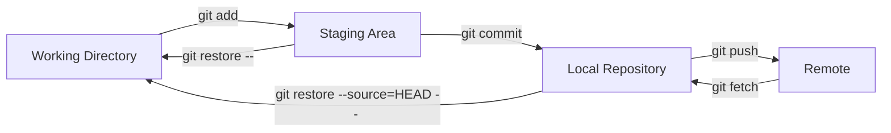
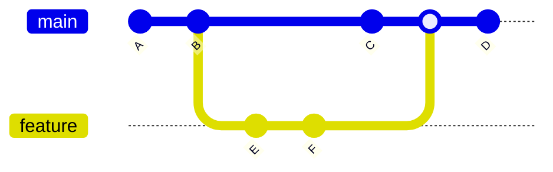
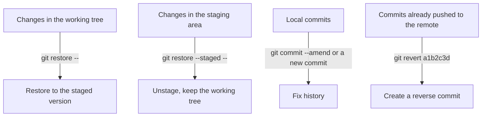
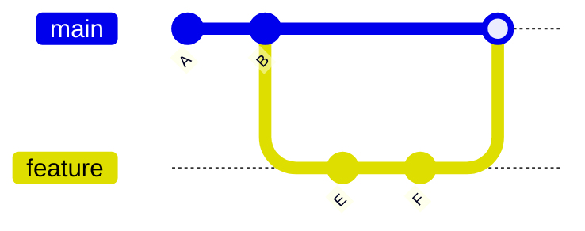
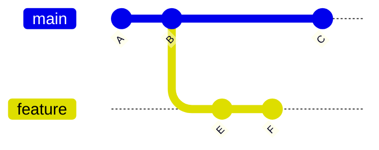
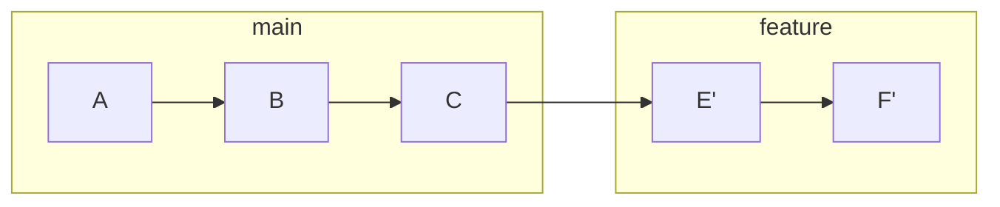

> [!DETAILS-AI] AI Summary of This Section
> This section starts with the working tree, the staging area, and the commit history, and introduces Git's everyday committing, branch collaboration, conflict handling, and undo methods. The key point is to first determine where changes live, then choose a command that won't accidentally damage other content.

## 1. Version Control

Version control records the file states we deliberately commit, making it easy to compare, go back, and collaborate. It does not automatically save every keystroke, nor can it replace backups of uncommitted files.

### 1.1 Evolution of Version Control

| Stage | Representative tools | Features |
| :--- | :--- | :--- |
| Manual | Copying folders and renaming them `v1`, `v2` | Crude and easy to mess up |
| Local version control | RCS | Single machine, no collaboration |
| Centralized | SVN, CVS | Main history stored on a central server, limited offline capability |
| Distributed | Git, Mercurial | Everyone has the full history, usable offline |

### 1.2 What Is Git

Version control is a concept; Git is the most popular concrete implementation of it.

Git was created in 2005 by Linus Torvalds, the founder of the Linux kernel, and was originally used to manage a large codebase like the Linux kernel. It belongs to the "distributed" category in the table above and has two main characteristics:

- **Everyone has the full history**: when you clone a repository, you get not only the latest files but the entire commit history. You can commit, view history, and create branches without a network, then sync when you are online.
- **Snapshot-based recording**: each commit saves a snapshot of the files at that moment, rather than only recording diffs between files. That is why switching branches and returning to any historical version is fast.

Compared with centralized systems (such as SVN), clients no longer depend on a central server to view history or commit; a server outage does not make you lose your local history either. These features make Git the most widely used version control system today. The rest of this section focuses on Git's core workflow.

> [!NOTE] Why Use Git?
> Actually, you don't have to use Git, or any source control system. You just need to meet these requirements:
>
> - Enough brainpower to know what you're doing, what you did a week ago, and why you did it that way
> - Enough patience to rewrite a whole day's code after accidentally deleting it
> - Enough ability to develop independently without deep collaboration, or you can accept syncing changes by sending code to each other over WeChat, email, and so on
>
> These requirements are obviously very easy to meet ~~just kidding~~.
>
> Git offers us a better solution, such as:
>
> - `git blame`: see who wrote each line of code and when it changed
> - `git log` / `git cherry-pick`: roll back changes, or apply certain changes to other branches
> - `git branch`: develop different features on different branches so multiple people can work without interfering

## 2. Git Core Concepts

### 2.1 Three Areas

Git divides files into three areas; understanding these three areas is the key to mastering Git.



| Area | Description | Where it lives |
| :--- | :--- | :--- |
| Working tree | The directory we are editing | Actual files |
| Staging area | The snapshot ready to be committed | `.git/index` |
| Local repository | Committed version history | `.git/` directory |
| Remote | A repository hosted on a server | GitHub / CNB, etc. |

> [!INFO]
> The staging area lets us precisely control which changes are committed together. One round of work may touch several features; we can stage and commit several times so the history stays clear and readable.

### 2.2 Commits

A commit is the basic unit of Git; each commit records a full snapshot and contains:

- The changed content
- The author and the time
- The commit message
- References to parent commits; merge commits can have multiple parents

Commits form a directed acyclic graph through parent-child relationships. Without branching and merging, the history looks like a single timeline; once branches diverge and merge again, it becomes multiple interrelated lines of history.

### 2.3 Branches

A branch is a movable reference pointing to a commit. Developers can create a branch from the current commit, work on an independent line of history, and then merge or rebase it according to the project's workflow.



`main` is the main branch; `feature` forks from B, develops commits E and F independently, and is merged back into `main` when done.

> [!TIP] Branches Are Cheap
> A Git branch is just a reference, so creating one costs very little. Whether to create a branch for each piece of work should follow the repository's collaboration workflow; team projects usually use short-lived branches to isolate features, fixes, or experimental changes.

## 3. Initial Configuration

After installing Git (see [1.14 Environment Setup](/en/docs/ch1/1.14-Environment-Setup) for installation), the first thing is to configure your identity:

```bash
# Configure the user name and email (included in every commit)
git config --global user.name "<Your Name>"
git config --global user.email "<Your Email>"
```

The integration strategy of `git pull` — merge, rebase, or fast-forward only — should be chosen by the team's convention; don't write it into the global configuration before you understand the difference. These options are explained later in this section.

**Verify the configuration:**

```bash
git config --list --show-origin
```

### 3.1 Three Levels of Configuration and Precedence

Git configuration can come from system-level, global-level, and repository-level files. A more specific configuration usually overrides a broader one:

| Level | Common files | Scope |
| :--- | :--- | :--- |
| System | `/etc/gitconfig` or a config file in the Git installation directory | All users and repositories on the machine |
| Global | `~/.gitconfig` or `~/.config/git/config` | All repositories of the current user |
| Local | The current repository's `.git/config` | The current repository |

View the source of a configuration level:

```bash
git config --system --list --show-origin
git config --global --list --show-origin
git config --local --list --show-origin
```

`--system` may require administrator privileges; the command can fail if the file is missing or you lack permission. Project-specific settings should go into the local-level configuration, and personal defaults into the global level. When identity, proxy, or credentials are involved, confirm the current source before changing anything.

> [!WARNING] Associating Your Commit Email with an Account
> If you want commits to be associated with your GitHub account, use an email verified in your GitHub account or the `noreply` email provided by GitHub (not recommended if you haven't added your personal email to your account). The commit identity and login credentials are two different things; before changing anything, you can check the locally configured email with `git config --global --get user.email`.

## 4. Basic Workflow

### 4.1 Method One: Start a Project from Scratch

> [!DETAILS-EXAMPLE] Initialize and Push a Project from Scratch
> First create an empty repository without an initial commit on a code hosting platform (such as GitHub or CNB), then run locally:
>
> ```bash
> # Create a new directory and initialize the repository
> mkdir my-project && cd my-project
> git init
>
> # Create a file
> printf '# My Project\n' > README.md
>
> # Check the status
> git status
>
> # Stage
> git add README.md         # Stage a specific file
>
> # Commit
> git commit -m "Initial commit"
>
> # Add the remote and push
> git remote add origin https://github.com/YourUsername/ProjectName.git
> git branch -M main
> git push -u origin main
> ```

**Verify:** run `git log --oneline`; you should see the commit you just made.

### 4.2 Method Two: Clone an Existing Project

```bash
# Clone the remote repository locally
git clone https://github.com/User/ProjectName.git
cd ProjectName
```

**Verify:** run `git remote -v`; you should see the `origin` remote URL.

### 4.3 The Daily Loop

Most of the time we repeat this loop:

```bash
# Edit code...
git status              # See what changed
git diff                # See the specific changes
git add <file>             # Stage
git commit -m "<message>"     # Commit
git push                # Push to the remote
```

## 5. Viewing History and Diffs

### 5.1 git log: Viewing the Commit History

```bash
git log                 # Full history
git log --oneline       # One line per commit, concise
git log --oneline --graph  # Show branches as a graph (recommended)
git log -5              # The latest 5 commits
git log --author="SSJ"  # Filter by author
```

Every commit gets a unique hash (SHA-1); the `a1b2c3d` at the start of each line of `git log --oneline` is its abbreviation. The `a1b2c3d` in later command examples is just a placeholder — replace it with a real hash you find with `git log`.

### 5.2 git diff: Viewing Diffs

```bash
git diff               # Working tree vs staging area
git diff --staged      # Staging area vs latest commit
git diff HEAD          # Working tree vs latest commit
git diff v1 v2         # Diff between two commits
```

> [!TIP] About the `--graph` Option
> `git log --oneline --graph --all` shows the commit relationships between references as a text graph. If you use it often, set an alias: `git config --global alias.lg "log --oneline --graph --all"`, then run `git lg`.

## 6. Selective Staging

You don't have to stage all changes at once; you can stage only part of them:

```bash
git add file1.txt file2.txt      # Stage specific files
git add -- '*.py'                # Stage .py files in the repository by Git pathspec
git add -p                       # Interactively choose hunks to stage (recommended)
```

> [!TIP] About `git add -p`
> `git add -p` (patch mode) splits the diff into hunks and asks per hunk whether to stage it. When one round of work mixes several purposes, you can use it to split commits; if a single hunk still contains two kinds of changes, you can split it further or go back to the editor and tidy up first.

## 7. Commit Message Conventions

Good commit messages keep the history readable and traceable. The Conventional Commits specification is recommended:

```text
<type>: <short description>

<optional detailed description>
```

Common types:

| Type | Meaning | Example |
| :--- | :--- | :--- |
| `feat` | New feature | `feat: add user login` |
| `fix` | Bug fix | `fix: fix login page flickering` |
| `docs` | Documentation change | `docs: update README installation steps` |
| `style` | Formatting (does not change logic) | `style: use 2-space indentation consistently` |
| `refactor` | Refactoring (not a feature or bug fix) | `refactor: extract user validation logic` |
| `test` | Tests | `test: add login unit tests` |
| `chore` | Maintenance such as build and dependencies | `chore: update build config` |

Example:

```text
feat: add user login

Implement JWT authentication and add the /login endpoint
```

> [!NOTE] This Project's Commit Conventions
> This project also follows a similar convention; see [Commit Messages](/en/docs/about/contributing#commit-messages).

Changes may need fixing before or after a commit. First determine whether the content is in the working tree, the staging area, or the commit history.

## 8. Undoing and Reverting

Run `git status` and `git diff` first to determine whether the changes are in the working tree, the staging area, or the commit history, then choose a command. Commands with similar names act on different scopes; don't rely on trial and error.



| Scenario | Suggested command | Rewrites history? |
| :--- | :--- | :--- |
| Unstage while keeping the working tree | `git restore --staged -- <file>` | No |
| Discard unstaged changes to a file | `git restore -- <file>` | No, but the file content is lost |
| Fix the most recent commit that hasn't been shared | `git commit --amend` | Yes |
| Undo a commit already pushed to the remote | `git revert a1b2c3d` | No, it creates a reverse commit |

> [!CAUTION] `git restore` Can Also Lose Content
> `git restore -- <file>` overwrites uncommitted working tree changes. Check `git diff -- <file>` first; if you're not sure, copy a patch, create a temporary branch, or commit a recognizable temporary version first.

> [!DETAILS-HINT] When Should You Use `reset --hard`?
> `git reset --hard` moves the branch and overwrites both the working tree and the staging area at the same time; beginners usually don't need it. If you really need it, confirm the target commit, back up uncommitted content, and understand which references it rewrites; for history already pushed to the remote, prefer `git revert`.

## 9. Branching

### 9.1 Basic Branch Commands

```bash
git branch                    # List local branches
git branch -a                 # List all branches (including remote)
git branch feature            # Create the feature branch
git checkout feature          # Compatibility with old tutorials: switch to feature
git checkout -b feature       # Compatibility with old tutorials: create and switch
git switch feature            # Switch with the dedicated command
git switch -c feature         # Create and switch

git branch -d feature         # Delete a merged branch
git branch -D feature         # Force delete
```

### 9.2 Merging

Merge a branch's changes into the current branch:

```bash
git switch main               # Switch to the target branch first
git merge feature             # Merge feature
```

If the branch being merged already contains all of the current branch's commits, Git may perform a **fast-forward**: it only moves the current branch reference and creates no merge commit. If both branches have new commits after the fork point, Git usually performs a **three-way merge** based on the fork point and may create a merge commit; files that cannot be resolved automatically cause conflicts (see the next section). Whether to force a merge commit can follow the project convention with `--no-ff`.

```bash
git merge --ff-only feature   # Fast-forward only; fails if it can't, no merge commit
git merge --no-ff feature     # Create a merge commit even when fast-forwarding is possible
```

**Fast-forward: when `main` has no new commits after the fork point**



`main` simply moves its reference directly to the tip of `feature` (F), creating no merge commit.

**Three-way merge: both branches have new commits after the fork point**


The two branches advance separately after the fork point B; Git does a three-way merge based on the fork point and produces merge commit M.

### 9.3 Rebasing

`rebase` is another way to integrate changes: it "moves" our commits onto the tip of the target branch, keeping the history linear.

```bash
git switch feature
git rebase main               # Reapply feature's commits on top of main
```

**Before rebase: `feature` forks from B, and `main` already has a new commit C**



**After rebase: E and F are moved and reapplied after C; the history changes from a fork to a straight line**



After the rebase, `feature` looks as if it was developed from the tip of `main` (C); E' and F' are newly generated commits (their IDs differ from the original E and F). That's why you shouldn't rebase branches already pushed to the remote on your own.

| Method | History | Conflict handling |
| :--- | :--- | :--- |
| merge | Keeps the branch structure with merge nodes | Resolved once |
| rebase | Linear and cleaner history | May need resolving per commit |

> [!CAUTION] Don't Rewrite Shared History on Your Own
> `rebase` generates new commit IDs for the replayed commits. Branches that others have already built work on should not be rebased and force-pushed without coordination. Whether you may tidy up a personal branch and push with `--force-with-lease` depends on the project convention. As a beginner, practice on local branches that have not been pushed yet.

### 9.4 detached HEAD

Normally `HEAD` points to the current branch; after `git checkout a1b2c3d` or `git switch --detach a1b2c3d`, `HEAD` points directly at a commit and you are in **detached HEAD** state. You can inspect history or run temporary tests here, but new commits created directly don't belong to any branch; create a branch to save them before you leave:

```bash
git switch --detach a1b2c3d
# Inspect or test temporarily

git switch -c experiment       # Create a branch from the current commit and keep subsequent commits
# Or go back to an existing branch
git switch main
```

Check the current status:

```bash
git status
```

## 10. Resolving Conflicts

When two people change the same line of code, Git can't decide automatically which one to keep during a merge, so a conflict occurs.

```text
$ git merge feature
Auto-merging main.py
CONFLICT (content): Merge conflict in main.py
```

Open the conflicted file, and you will see:

```text
def hello():
<<<<<<< HEAD
    print("Hello from main")
=======
    print("Hello from feature")
>>>>>>> feature
```

- From `<<<<<<< HEAD` to `=======` is the current branch's content
- From `=======` to `>>>>>>> feature` is the incoming branch's content

To resolve: edit the file manually to keep the version you want (or combine both), delete the conflict markers, then:

```bash
git add main.py        # Mark the conflict as resolved
git commit             # Finish the merge
```

> [!TIP] Resolving Conflicts Visually in VS Code
> VS Code recognizes conflict markers and offers a merge editor or inline actions. Button names and the interface vary with the version and language settings; whichever interface you use, check the final file when you're done to confirm the conflict markers are gone, then run tests and `git add`.

## 11. Working with Remotes

> [!DETAILS-EXAMPLE] Quick Reference for Common Remote Commands
> ```bash
> # View remotes
> git remote -v
>
> # Add a remote (note: GithubName here is the real username, not a nickname!)
> git remote add origin https://github.com/GithubName/ProjectName.git
>
> # Change the remote URL
> git remote set-url origin <new-url>
>
> # Push
> git push origin main           # Push the main branch
> git push -u origin feature     # First push and set up tracking
> git push --force-with-lease origin feature  # Carefully overwrite a remote branch; check remote-tracking state first
>
> # Pull
> git pull                       # Fetch remote updates, then merge, rebase, or fast-forward only per config
> git fetch                      # Only update remote-tracking references; doesn't integrate the current branch
> ```

| Command | Behavior | When to use |
| :--- | :--- | :--- |
| `git fetch` | Updates remote-tracking references without integrating the current branch | When you want to inspect remote changes first |
| `git pull` | Fetches first, then integrates the current branch per flags or config | When the merge, rebase, or fast-forward-only strategy is clear |
| `git push` | Pushes local commits to the remote | To sync after committing |
| `git remote -v` | Shows the remote URLs | To confirm the remote configuration |

> [!TIP] Fetch First, Then Merge
> When you're not sure about remote changes, `fetch` first, then inspect branch differences with `git log --oneline --graph --all` or `git diff`. Before using `git pull`, make sure you know the repository's agreed integration strategy, to avoid accidentally creating merge commits or rewriting local commits.

## 12. Ignoring Files: .gitignore

Some files shouldn't be under version control (temporary files, secrets, build artifacts); use `.gitignore` to specify them:

> [!DETAILS-EXAMPLE] Common .gitignore Template
> ```text
> # .gitignore
> # Build artifacts
> *.o
> *.exe
> build/
>
> # Dependencies
> node_modules/
> __pycache__/
>
> # IDE local state; whether to ignore shared config is up to the team
> .idea/
>
> # System files
> .DS_Store
> Thumbs.db
>
> # Sensitive information
> .env
> .env.*
> !.env.example
> *.pem
> ```

> [!IMPORTANT] Don't Commit Sensitive Information
> Private keys, passwords, access tokens, and config files containing them (such as `.env`) should never enter version control. Once sensitive information is committed, it may still exist in history, branches, caches, or clones even after being deleted; if you discover a leak, revoke or rotate the credentials immediately, then clean up the history following the platform's guidance. Template files without sensitive information (such as `.env.example`) can be committed as the project requires.

`.gitignore` only affects paths that aren't tracked yet; it can't automatically remove already-tracked files from version control. You can reference the github/gitignore templates and adjust them for your project's actual artifacts and editor configuration.

## 13. Useful Tricks

### 13.1 stash: Temporarily Save Changes

You're in the middle of work, need to switch branches to handle an urgent issue, and don't want to commit a half-finished state:

```bash
git stash push         # Save working tree and staging area changes of tracked files; untracked files are not included by default
git switch main        # Switch away to handle something else
# ...done...
git switch feature     # Switch back
git stash list         # Confirm the entry to restore
git stash pop          # Apply the latest entry and remove it from the stash list on success
```

### 13.2 tag: Tagging Releases

Tag versions when releasing:

```bash
git tag v1.0.0                 # Lightweight tag
git tag -a v1.0.0 -m "Release note"  # Annotated tag (recommended)
git push origin v1.0.0         # Push the tag to the remote
```

### 13.3 cherry-pick: Picking a Single Commit

When you want just one commit from a branch instead of merging it entirely:

```bash
git cherry-pick a1b2c3d
```

### 13.4 reflog: Finding Where References Pointed

`reflog` records where local references have pointed, which helps locate commits from before a mistake:

```bash
git reflog                         # View the local change history of HEAD
git show HEAD@{2}                  # Check the target content first
git branch recovery HEAD@{2}      # Create a recovery branch without touching the working tree
```

> [!TIP] reflog Is Local Evidence, Not a Backup
> Reachable reflog entries are usually kept for 90 days by default and unreachable entries for 30 days, though the actual retention is affected by configuration and garbage collection. It doesn't record content that was never committed, nor does it sync to the remote; important work still needs to be committed and backed up in time.

## 14. TODO Checklist

- [ ] Can use `git status` and the two kinds of `git diff` to tell which area changes are in
- [ ] Try using `git add -p` to organize a focused commit
- [ ] Understand creating and merging branches and explain what conflict markers mean
- [ ] Understand the purposes of `restore`, `revert`, `reset`, and `reflog`
- [ ] Check the commit history, remote URL, and the branch to be pushed before pushing
- [ ] Try creating or reading a project's `.gitignore` and identify sensitive files that should not be committed

## 15. Questions Worth Thinking About

> [!DETAILS-FAQ] What is the difference between rebase and merge? When should I use each?
> `merge` keeps the branch structure and creates a merge commit, so the history faithfully records when branches joined; `rebase` reapplies commits on top of the target branch, producing a linear history but generating new commit hashes.
>
> The main deciding factor is whether the history has already been shared: for branches that have been pushed or are being worked on by multiple people, prefer `merge` instead of rewriting history; for local branches that have not been pushed, choose according to the project convention — use `rebase` when you want a clean linear history. Conflicts are also handled differently: `merge` resolves them once, while `rebase` may require resolving them commit by commit as each one is replayed. The final choice still depends on the project's convention.

## 16. Further Reading

- [Pro Git](https://git-scm.com/book/en/v2)
- [Git official documentation](https://git-scm.com/docs)
- [Conventional Commits specification](https://www.conventionalcommits.org/)
- [github/gitignore templates](https://github.com/github/gitignore)

## 17. Videos Worth Watching

The Bilibili collection "从零开始深入 git" (UP: 寰宇牛奶unimilk, [collection link](https://space.bilibili.com/3706985490942278/lists/8128583?type=season), in Chinese) mapped to the structure of this section:

| Episode | Topic | Related sections on this page |
| :--- | :--- | :--- |
| 01 | Git design philosophy and the history of version control | 1. Version Control; 2. Git Core Concepts |
| 02 | Git installation and configuration; the three levels of config files | 3. Initial Configuration |
| 03 | Basic repository usage, commits, file changes, and staging | 4. Basic Workflow; 6. Selective Staging |
| 04 | Using Git in the IDE; commit message conventions | 5. Viewing History and Diffs; 7. Commit Message Conventions |
| 05 | Multi-branch development: branching and the DAG | 2. Git Core Concepts; 9. Branching |
| 06 | Multi-branch development: merging, conflicts, three-way, and fast-forward | 9. Branching; 10. Resolving Conflicts |
| 07 | Git workflows, semantic versioning, branch models | 9. Branching; 13. Useful Tricks |
| 08 | Rebase: tracking a branch with merge or rebase | 9. Branching |
| 09 | amend, stash, detached HEAD, gitignore, revert, reset | 8. Undoing and Reverting; 12. Ignoring Files: .gitignore; 13. Useful Tricks |
| 10 | Remote, clone, simple push/pull, and preparation for collaboration | 4. Basic Workflow; 11. Working with Remotes |
| 11 | fetch, push, pull, force push, force-with-lease | 11. Working with Remotes |
| 12 | Collaboration workflows for small teams, enterprises, and large open source projects | 11. Working with Remotes; 15. Questions Worth Thinking About |
| 13-A | GitHub account authorization, branch protection, PR, Issue, Releases | [1.16 Code Hosting Platform](/en/docs/ch1/1.16-Code-Hosting-Platform) |
| 13-B | Contributing to large open source projects | [1.16 Code Hosting Platform](/en/docs/ch1/1.16-Code-Hosting-Platform) |
