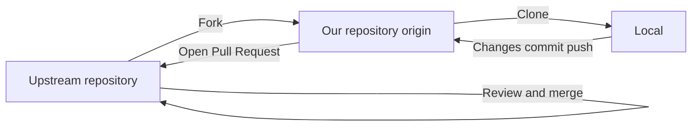

> [!DETAILS-AI] AI Summary of This Section
> This section introduces repository hosting and collaboration workflows on GitHub and CNB, including account authorization, Pull Requests, branch protection, Issues, Pages, Releases, CI/CD, and multi-platform sync. Platform features and quotas may change; follow the current UI and official documentation for exact steps.

## 1. Code Hosting Platforms

A local Git repository can already preserve history; code hosting platforms add remote repositories, permission control, code review, Issues, and automation, making it convenient to back up pushed commits and collaborate.

[1.15 Version Control and Git](/en/docs/ch1/1.15-Version-Control-Git) covers local operations; code hosting platforms add permission, review, and automation capabilities around remote repositories. Common features include:

- **Remote repository storage**: stores pushed Git objects and refs; uncommitted files still need separate backups
- **Collaboration**: multi-person development, code review, Issue management
- **Project discovery**: find and join public projects through Stars, Forks, topics, and search
- **Continuous integration**: automated testing, building, and deployment (CI/CD)
- **Project showcase**: document the purpose and results of a project through README, Releases, and Pages

[1.6 Community and Related Platforms](/en/docs/ch1/1.6-Community-Platforms) briefly introduced GitHub; this section goes deeper into practical usage and introduces the domestic platform CNB.

> [!NOTE] Platform Choice
> There are many code hosting platforms. This section picks one well-known platform from each of domestic and international contexts — GitHub and CNB — which is not a recommendation list. Other platforms may have different steps and features, but similar features work in much the same way; always follow each platform's official documentation.

## 2. GitHub

### 2.1 Common GitHub Use Cases

[GitHub](https://github.com/) hosts a large number of open source projects and provides repository hosting, Pull Requests, Issues, Actions, Pages, and other collaboration capabilities. Specific plans, quotas, and student benefits change over time; check the current official documentation before use. Common use cases include:

- Hosting public or private Git repositories
- Joining open source projects through Issues, Forks, and Pull Requests
- Using GitHub Actions to run automated workflows
- Publishing static sites with GitHub Pages
- Applying for GitHub Education benefits when eligible

### 2.2 Registration and Configuration

#### 2.2.1 Create an Account

Register an account at [github.com](https://github.com/); an English username is recommended because it appears in repository URLs.

> [!WARNING] Username Is Bound to Public Links
> The username appears in personal repository URLs (`github.com/username/project`) and user Pages domains (`username.github.io`). GitHub supports renaming a username, but old links, Git remotes, Pages addresses, and integrations that depend on the username may need updating. Choose a name that is easy to recognize, intended for long-term use, and does not leak unnecessary personal information.

After registering, enable [two-factor authentication (2FA)](https://docs.github.com/authentication/securing-your-account-with-two-factor-authentication-2fa/configuring-two-factor-authentication) and store recovery codes in a password manager or another controlled location. Recovery codes, like SSH private keys, are sensitive credentials and should not be uploaded to repositories or public cloud drives.

#### 2.2.2 Configure an SSH Key

Configuring an SSH key avoids typing a password on every push:

```bash
# Generate a key; confirm the save location and set a secure passphrase
ssh-keygen -t ed25519 -C "your-email@example.com"

# View the public key
cat ~/.ssh/id_ed25519.pub
```

Copy the public key content and paste it at GitHub → Settings → SSH and GPG keys → New SSH key. On first connection, also verify the host fingerprint shown by the terminal against [GitHub's published SSH fingerprints](https://docs.github.com/authentication/keeping-your-account-and-data-secure/githubs-ssh-key-fingerprints).

**Verify the connection:**

```bash
ssh -T git@github.com
# "Hi username! You've successfully authenticated" means success
```

When the test succeeds, GitHub also states that it does not provide shell access; the command may return exit code `1`, so judge by the account name and authentication result in the message.

> [!TIP] SSH vs HTTPS
> Both SSH and HTTPS can access repositories securely. SSH uses key authentication; if the private key has a passphrase, you may need to enter it or let `ssh-agent` manage it. HTTPS usually works with GitHub CLI, a Personal Access Token, or a credential manager. Choose the remote URL based on network restrictions, organization SSO, and how credentials are managed on your machine.

### 2.3 Create a Repository

Click `New repository` on the web page; the options are:

| Option | Description | Suggestion |
| :--- | :--- | :--- |
| Repository name | English name, separated by hyphens | `my-awesome-project` |
| Description | One-line description | Recommended; makes the repository purpose easy to identify |
| Public / Private | Public / private | Choose per course, organization, confidentiality, and open source requirements |
| Add README | Automatically create an initial commit | Can check for new projects; usually leave unchecked when you have local history ready to push |
| .gitignore | Choose a language or tool template | Optional for new projects; existing projects should review their current rules |
| License | Open source license | Only choose when you are sure you are authorized and the license fits the project |

### 2.4 README: The Project Entry

The README is the first thing people see when opening our repository. A good README should include:

> [!DETAILS-EXAMPLE] README Template Example
>
> ```markdown
> <!-- README.md -->
> # Project name
>
> One sentence about what this is.
>
> ## Features
> - Feature 1
> - Feature 2
>
> ## Installation
> ```bash
> git clone https://github.com/you/project.git
> cd project
> ```
>
> ## Usage
> ```bash
> npm start
> ```
>
> ## License
> MIT
> ```

> [!INFO] The README Is the Project Entry
> A README should let the target reader quickly judge the project's purpose, prerequisites, installation, and usage. Complex projects can also add screenshots, examples, documentation links, contribution guidelines, and maintenance status; the content should stay consistent with the current version.

### 2.5 Open Source Licenses

Open source does not mean "use it however you like"; the license defines how others may use our code:

| License | Characteristics | Suitable for |
| :--- | :--- | :--- |
| MIT | Permissive; redistribution must retain the copyright and license notice | Wanting to allow closed-source redistribution with minimal obligations |
| Apache 2.0 | Permissive; includes an explicit patent grant, and requires retaining notices and marking modifications | Projects needing explicit patent terms |
| GPLv3 | Strong copyleft; distributing GPL-covered programs or modified versions usually requires providing corresponding source and keeping the GPL terms | Projects that want downstream distributions to keep providing source |
| No license | Default copyright rules apply; the public usually has no right to copy, modify, or distribute | Not yet licensing externally or license decision not final |

Choose at [choosealicense.com](https://choosealicense.com/), or directly when creating the repository.

> [!NOTE] Default Rules Without a License
> Without a license, default copyright rules still apply: publishing source does not authorize others to copy, modify, or distribute it. License obligations are also affected by dependencies, how the code is combined, and how it is distributed; when unsure, refer to Choose a License, the license text, or ask the project maintainer. The table here is not legal advice.

### 2.6 Account Authorization

SSH keys are not the only way to access GitHub. Besides the SSH key configured in 2.2, common methods include:

| Method | Purpose | Notes |
| :--- | :--- | :--- |
| SSH key | Command-line push and pull | Configured in 2.2; the private key stays on your machine, the public key is registered to the account |
| Personal Access Token (PAT) | HTTPS push, scripts, and CLI | Replaces the password; can restrict permission scope and expiration |
| OAuth / GitHub App authorization | Third-party tools access the account | Granted when tools like VS Code or GitHub CLI request permissions |

When generating a PAT for scripts or CLI, use fine-grained tokens, grant only the minimum permissions needed for the task, and set an expiration. Before authorizing a third-party app, confirm the permissions it requests; unused authorizations can be revoked under `Settings` → `Applications`. If an SSH private key, token, or other credential leaks, revoke and regenerate it immediately.

> [!TIP] GitHub CLI
> [GitHub CLI](https://cli.github.com/) (`gh`) can handle repositories, Issues, PRs, and more from the command line without clicking through web pages. Run `gh auth login` once to authorize, then use commands like `gh pr create` and `gh issue list` directly.

### 2.7 Releases

The `tag` introduced in 1.15 marks versions; GitHub Releases adds a release page on top of a tag:

- Create a Release from an existing tag, filling in the version number and release notes
- Attach assets such as installers and binaries
- Mark pre-release versions as `Pre-release` and stable versions as `Latest`
- After publishing, the Releases entry appears on the repository home page so users can view notes and downloads

CNB's version management offers similar capabilities (see 5.3); names and operation paths follow the current UI.

### 2.8 GitHub Actions and CI/CD

**CI (continuous integration)**: automatically run builds and tests on every push or Pull Request to catch problems early.

**CD (continuous delivery / deployment)**: automatically publish to the target environment after tests pass.

The two are often combined as CI/CD.

GitHub Actions is GitHub's automation service. Workflow files live in the `.github/workflows/` directory of the repository, are triggered by events (`push`, `pull_request`, schedules, etc.), and run in order through `jobs` and `steps`. Minimal example:

```yaml
# .github/workflows/test.yml
name: Test
on: [push, pull_request]
jobs:
  test:
    runs-on: ubuntu-latest
    steps:
      - uses: actions/checkout@v4
      - run: npm test
```

The Actions marketplace offers many ready-made Actions that can be assembled into pipelines as needed. Running quotas are free for public repositories and billed per account plan for private ones; follow the current billing documentation for exact limits. The CI/CD entry files, runtime environment, and dependency installation should follow what the repository declares — don't trust workflows copied from the web. CNB's cloud-native build offers similar capabilities (see 5.3).

## 3. Fork + Pull Request Collaboration Workflow

Many open source projects accept external contributions through Fork + Pull Request; teams with write access to the repository may also open Pull Requests from branches in the same repository. Before submitting, read the project's `CONTRIBUTING`, code of conduct, and branch requirements.



### 3.1 Full Workflow

> [!DETAILS-EXAMPLE] Full Fork + Pull Request Workflow
>
> ```bash
> # 1. On the web page, Fork someone's repository to your own account
>
> # 2. Clone your fork
> git clone https://github.com/you/project.git
> cd project
>
> # 3. Add the upstream repository (for syncing updates)
> git remote add upstream https://github.com/original-author/project.git
>
> # 4. Create a branch for development
> git switch -c fix-typo
>
> # 5. Make changes and commit
> git add .
> git commit -m "docs: fix typo in README"
>
> # 6. Push to your fork
> git push origin fix-typo
>
> # 7. Open a Pull Request on the GitHub web page
> ```

**Verify:** after pushing the branch, confirm the base repository, base branch, head repository, and head branch on the Pull requests page, then fill in the title, description, and verification results. Whether quick hints appear depends on repository state and UI version.

### 3.2 Syncing Upstream Updates

After the upstream repository is updated, sync the changes into your fork:

```bash
git fetch upstream
git switch main
git merge upstream/main
git push origin main
```

> [!TIP] Sync Upstream
> Before developing a new feature, sync upstream first to avoid building on stale code and to reduce conflicts.

### 3.3 Branch Protection

Branch protection is a repository-level rule that prevents changes from going directly into protected branches (usually `main`) or bypassing required checks. Configuration location: repository `Settings` → `Branches` → `Add branch protection rule`.

| Common rule | Purpose |
| :--- | :--- |
| Require a pull request before merging | Forbid direct pushes; changes must enter through a PR |
| Require approvals | Require at least N approvals before merging |
| Require status checks to pass | Require CI checks (tests, builds, etc.) to pass before merging |
| Restrict who can push | Restrict which members and teams can push to the protected branch |
| Do not allow bypassing the above settings | Administrators also cannot bypass the above rules |

Branch protection solves a process problem: without it, anyone with push permission can bypass review and change `main` directly. Whether to enable it, and which rules to enable, depends on the team's collaboration conventions, not on platform requirements.

## 4. Issues and Pages

### 4.1 Issues: Task and Bug Tracking

Issues are used to report bugs, suggest improvements, or discuss problems. A complete Issue usually includes (see [1.5 How to Ask Questions](/en/docs/ch1/1.5-Asking-Questions)):

- Problem description
- Reproduction steps
- Expected behavior and actual behavior
- Environment information

Repository maintainers add labels (bug, enhancement, good first issue, etc.) and assign them for processing.

> [!TIP] `good first issue` Is an Entry Point for Beginners
> Use `label:"good first issue"` to find entry-level tasks marked by maintainers, but the label does not guarantee small workload or that no one is working on it. Before starting, read the Issue discussion and contribution guidelines, confirm the task is still open, and communicate in the way the project expects.

### 4.2 GitHub Pages: Free Website Hosting

GitHub Pages can publish static websites; whether private repositories are supported and how Actions usage is counted depends on the account plan. User site repositories use the `username.github.io` name; project sites can also be published from ordinary repositories:

1. Create or select a repository for the site; user sites must be named `username.github.io`
2. Prepare `index.html`, `index.md`, `README.md`, or an entry file produced by a static site generator
3. Configure the branch/directory or GitHub Actions publish source under repository Settings → Pages
4. Check the deployment workflow result, then verify through the site link in Pages settings

The visibility of a Pages site depends on the account plan and organization policy; do not assume a site stays private just because the source repository is private. Published artifacts should never contain tokens, internal addresses, or other sensitive content.

Documentation sites commonly use frameworks such as [VitePress](https://vitepress.dev/), [Docusaurus](https://docusaurus.io/), or this project's [Fumadocs](https://fumadocs.vercel.app/).

### 4.3 GitHub Education Student Benefits

Eligible enrolled students can apply for [GitHub Education](https://docs.github.com/education). Applications usually require a GitHub personal account, proof of current enrollment, and meeting age requirements; whether a school email is required depends on the verification flow.

After approval, view current benefits in the Education Portal. The content, quotas, and validity of GitHub's own benefits and third-party offers may change; follow the application page and each provider's terms.

## 5. CNB

### 5.1 CNB Overview

[CNB](https://cnb.cool/) is a collaboration platform for cloud-native development; code hosting is one of its core capabilities. According to CNB's official documentation, repositories support Git version control, code browsing, Pull Request review, Issues, version management, and branch protection.

Platform features, free quotas, and billing rules change over time; before using cloud-native development, build, or artifact repositories, check the current pricing and usage documentation.

### 5.2 CNB vs GitHub

| Feature | GitHub | CNB |
| :--- | :--- | :--- |
| Repositories & community | Many international open source projects and third-party integrations | Provides Git repositories and code collaboration; project scale and community distribution differ |
| Automated builds | GitHub Actions | CNB cloud-native build / pipelines |
| Extensibility | Actions, Apps, etc. | Cloud-native development, build, and artifact repositories, etc. |
| Benefits & quotas | Education benefits applied for by eligibility | Follow current pricing and activity pages |

### 5.3 CNB's Cloud-Native Capabilities

Besides code hosting, CNB provides an integrated set of cloud-native development capabilities (feature list and naming follow the current version of CNB's official documentation):

| Capability | Description |
| :--- | :--- |
| Cloud-native build | Pipelines + plugin marketplace; run builds, tests, and releases in the cloud through `.cnb.yml` and similar configs |
| Cloud-native development | WebIDE for editing code online; default and custom development environments; preview of business ports; cloud agents; workspace recycling |
| Artifact repository | Host build artifacts and complete the release flow together with pipelines |
| Code collaboration | Line-by-line diff and comments in Pull Requests, Issues, version management, and branch protection |
| Other platform capabilities | WebIDE, AI, CLI, Open API, etc., subject to current official docs, account permissions, and plans |

> [!NOTE] Boundaries of Cloud Capabilities
> WebIDE, pipelines, and artifact repositories are cloud services with quotas, recycling policies, and billing rules, and they do not behave exactly like local environments. Before formal use, read the current official documentation and pricing pages to confirm quotas, retention periods, and migration paths.

> [!TIP] Combine Platform Capabilities as Needed
> You can use code hosting only, or combine build, development environment, and artifact repository capabilities per project needs. Whether each capability can be enabled independently, how billing works, and how data migrates should follow your current account and official documentation.

## 6. Multi-Platform Sync

### 6.1 Hosting Code on CNB

After registering a [cnb.cool](https://cnb.cool/) account, the flow is similar to GitHub:

```bash
# Create a repository (web operation)

# Clone
git clone https://cnb.cool/your-org/project-name.git

# Or add it as a second remote (push to both GitHub and CNB)
git remote add cnb https://cnb.cool/your-org/project-name.git
git push cnb main
```

### 6.2 Method One: Push Separately

The simplest way is to configure two remotes and push to each manually:

```bash
git remote add origin https://github.com/your-username/project.git
git remote add cnb https://cnb.cool/your-org/project.git

git push origin main    # Push to GitHub
git push cnb main       # Push to CNB
```

### 6.3 Method Two: Push to Multiple Platforms at Once

Configure Git so a single `push` goes to multiple remotes:

```bash
# Add a remote named all and explicitly set two push URLs
git remote add all https://github.com/your-username/project.git
git remote set-url --add --push all https://github.com/your-username/project.git
git remote set-url --add --push all https://cnb.cool/your-org/project.git

# Push afterwards
git push all main
```

**Verify:** run `git remote get-url --all --push all`; you should see two push URLs. One push tries each address in turn, but it is not a cross-platform transaction: if one address succeeds and another fails, the successful platform is not automatically rolled back.

> [!TIP] Boundaries of Multi-Platform Mirroring
> Multiple remotes improve the availability of pushed Git objects, but they do not replace backups of local uncommitted files, Issues, Releases, CI secrets, or platform settings. Make clear the primary repository, sync direction, and the re-push flow after failure, to avoid accepting conflicting changes on both platforms at the same time.

## 7. TODO Checklist

- [ ] Register accounts on GitHub and CNB, and upload the SSH **public key**
- [ ] Enable multi-factor authentication (MFA) for the account and safely store recovery methods
- [ ] Try creating a repository with a README, `.gitignore`, and a suitable license
- [ ] Distinguish SSH, PAT, and OAuth authorization methods and follow the principle of least privilege
- [ ] Understand what common branch protection rules solve
- [ ] Understand the role of CI/CD and read a minimal GitHub Actions workflow
- [ ] Create a tag and a Release for a release
- [ ] When syncing across platforms, clarify the primary repository, sync direction, and backup scope
- [ ] Understand what CNB cloud-native build, cloud-native development, and artifact repositories each solve

## 8. Further Reading

- [Choose a License](https://choosealicense.com/)
- [GitHub Docs](https://docs.github.com/zh)
- [About protected branches](https://docs.github.com/zh/repositories/configuring-branches-and-merges-in-your-repository/managing-protected-branches/about-protected-branches)
- [About releases](https://docs.github.com/zh/repositories/releasing-projects-on-github/about-releases)
- [GitHub Actions documentation](https://docs.github.com/zh/actions)
- [GitHub Education](https://docs.github.com/education)
- [CNB documentation](https://docs.cnb.cool/zh/)
- [CNB pricing and usage](https://docs.cnb.cool/zh/pricing.html)

