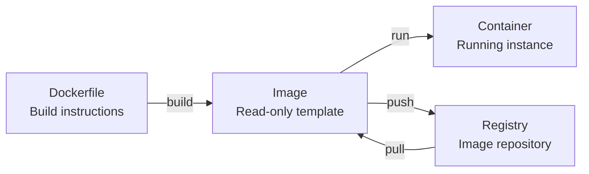

> [!DETAILS-AI] AI Summary of This Section
> This section introduces images, containers, Dockerfile, Compose, and data mounting. The examples focus on local development, while also clarifying the boundaries of image sources, version tags, permissions, and persistent data.

## 1. Docker's Purpose and Boundaries

> SSJ: "It works on my machine, why doesn't it work on yours?"
>
> SSSJ: "I don't know, the error says some library is missing..."
>
> SSSSJ: ~~"You can't even install this? You're missing... you %￥#\*...?"~~

The cause of such problems is usually not the code itself but the environment — the operating system, CPU architecture, dependency library versions, configuration, and environment variables; a difference in any of them can lead to different results. Docker can solidify and package a significant part of the runtime environment, but it cannot solve all differences.

Docker is an open-source containerization platform. It packages "application + runtime environment" into an **image**, distributes it through a **registry**; others pull the image and run it as a **container** on machines with Docker installed, saving the step of installing dependencies and configuring the environment. This mechanism is explained one by one in 2.2.

An image packages the application and its user-space dependencies, at least solving problems like "dependency version mismatch". But containers share the host's Linux kernel; CPU architecture, mounted files, environment variables, networking, and external services still affect the results, so "using the same image" does not mean "the results are guaranteed to be identical".

> [!INFO] What Docker Solves
> - **Describable environments**: use Dockerfile and Compose to spell out the application's dependencies and startup method
> - **Unified startup**: one command or one Compose file brings up a whole set of services
> - **Process isolation**: reduces dependency conflicts between projects, but don't treat it as a natural security boundary
> - **Easy distribution**: images carry user-space dependencies, but before running you still need to ensure the architecture, configuration, data, and external services fit the target environment

## 2. Core Concepts

### 2.1 Containers vs Virtual Machines

| Feature | Virtual Machine | Container |
| :--- | :--- | :--- |
| Kernel | The guest OS usually runs its own kernel | Linux containers share the Linux kernel they run on; Docker Desktop provides a Linux environment through virtualization |
| Isolation mechanism | Virtualizes hardware and runs a guest OS | Uses namespaces, cgroups, and other mechanisms to isolate processes and resources |
| Startup & size | Usually includes a full guest OS, higher overhead | Usually only contains the application and user-space dependencies, lower overhead |
| Use cases | Need different kernels, full systems, or stronger boundaries | Application packaging, development environments, service deployment, and task isolation |

Containers generally don't include a full guest OS, so startup and footprint are usually smaller than VMs.

How big the difference actually is still depends on the image, workload, and which machine it runs on.

### 2.2 Four Core Concepts



| Concept | Description |
| :--- | :--- |
| Dockerfile | A text file describing the steps to build an image |
| Image | A distributable, reusable artifact made of read-only layers and metadata |
| Container | A running instance created from an image, with its own writable layer and runtime configuration |
| Registry | A service that stores and distributes images; Docker Hub is one of them |

> [!NOTE] The Relationship Between Images and Containers
> One image can create multiple independent containers. Stopping a container doesn't delete the image, and deleting a container doesn't casually remove named volumes.
>
> The lifecycles of images, containers, and persistent data should be understood separately.

## 3. Installing Docker

### 3.1 Windows / macOS

Just install [Docker Desktop](https://www.docker.com/products/docker-desktop/); it bundles the GUI, Docker CLI, Compose, and more. Before installing, check the system requirements, organization license, and the virtualization backend you plan to use.

> [!IMPORTANT] Windows Backend
> Docker Desktop uses the WSL 2 backend by default on Windows; some versions and scenarios also support the Hyper-V backend. If using WSL 2, install WSL first per [1.14 WSL Environment Setup](/zh/docs/ch1/1.14-Environment-Setup-WSL), and confirm that WSL integration is enabled in Docker Desktop.

### 3.2 Linux

Different distributions have different installation and upgrade methods. For Ubuntu, follow the [official Docker Engine installation docs](https://docs.docker.com/engine/install/ubuntu/) to configure Docker's `apt` repository, then install Engine, Buildx, and the Compose plugin.

Don't mix distribution-bundled packages, third-party scripts, and official repositories.

> [!CAUTION] The `docker` Group Has High Privileges
> Adding a user to the `docker` group basically grants them near-root privileges on the host through the Docker daemon. On a personal development machine, understand the risk before configuring it.
>
> On shared servers, an administrator should manage permissions, or evaluate rootless mode.

### 3.3 Verify the Installation

```bash
docker --version          # Check the version
docker run --rm hello-world # Run the test image; the test container is removed after it exits
```

If the container exits normally and prints the welcome message, the chain of Docker client, daemon, and image pulling is working.

## 4. Basic Operations

### 4.1 Image Operations

```bash
# Search for images
docker search nginx

# Use the version tag chosen by the project; avoid accidentally following latest
docker pull python:3.12
docker pull python:3.12-slim     # Slim variant, smaller size

# List local images
docker images

# Delete an image
docker rmi python:3.12
```

### 4.2 Container Operations

> [!DETAILS-EXAMPLE] Container Command Cheat Sheet
> ```bash
> # Run containers
> docker run hello-world                # Run and exit
> docker run -it ubuntu:24.04 bash          # Interactively enter Ubuntu
> docker run -d nginx:1.28-alpine           # Run in the background
> docker run --name myweb nginx:1.28-alpine # Name the container
> docker run -p 8080:80 nginx:1.28-alpine   # Port mapping (host 8080 -> container 80)
> docker run --rm -v "$(pwd):/app" node:22 node --version # Bind-mount the current directory and run an explicitly versioned image
>
> # View containers
> docker ps                # Running containers
> docker ps -a             # All containers (including stopped ones)
>
> # Control containers
> docker start <name/id>    # Start
> docker stop <name/id>     # Stop
> docker restart <name/id>  # Restart
> docker rm <name/id>       # Delete a container
>
> # Enter a running container
> docker exec -it <name> sh              # The image may not include bash
>
> # View logs
> docker logs <name>
> docker logs -f <name>       # Follow the output
> ```

### 4.3 Detailed Explanation of `run` Parameters

`docker run` is the most commonly used command; here are the parameter meanings:

| Parameter | Purpose | Example |
| :--- | :--- | :--- |
| `-d` | Run in the background (detached) | `docker run -d nginx` |
| `-it` | Interactive + allocate a terminal | `docker run -it ubuntu bash` |
| `--name` | Name the container | `--name mydb` |
| `-p host:container` | Port mapping | `-p 8080:80` |
| `-v host:container` | Volume or bind mount | `-v ./data:/var/lib/mysql` |
| `-e var` / `--env-file` | Pass variables from the current environment or a file | `-e MYSQL_ROOT_PASSWORD` |
| `--rm` | Automatically delete the container after it exits | Good for temporary containers |

> [!TIP] The Difference Between `-it` and `-d`
> `-i` keeps standard input open, `-t` allocates a pseudo-terminal; the two are often used together for interactive debugging.
>
> `-d` runs the container in the background. Whether it's production-ready depends on health checks, restart policies, logging, resource limits, secrets, networking, and monitoring — you can't tell from `-d` alone.

**Verify:** run `docker run --rm -p 127.0.0.1:8080:80 nginx:1.28-alpine` and open `http://localhost:8080` in a browser; seeing the nginx welcome page means it works. Binding to `127.0.0.1` avoids exposing this practice service to the LAN.

Press `Ctrl + C` to stop the container when done.

## 5. Dockerfile: Building Your Own Image

### 5.1 Basic Structure

A Dockerfile is a text instruction manual that tells Docker how to assemble our own image on top of a base image. Example:

> [!DETAILS-EXAMPLE] Python App Dockerfile Example
> ```dockerfile
> # Dockerfile
> # Base image
> FROM python:3.12-slim
>
> # Set the working directory
> WORKDIR /app
>
> # Copy the dependency file and install (use layer caching)
> COPY requirements.txt .
> RUN pip install --no-cache-dir -r requirements.txt
>
> # Copy the project code
> COPY . .
>
> # Declare the port
> EXPOSE 8000
>
> # Startup command
> CMD ["python", "app.py"]
> ```

The example assumes `requirements.txt` and `app.py` already exist in the build context, and only illustrates the instruction order. It runs as the base image's default user, with no health checks, non-root user, dependency hashes, or production-grade server, so it should not be used directly as a production template.

### 5.2 Common Instructions

| Instruction | Purpose |
| :--- | :--- |
| `FROM` | Base image |
| `WORKDIR` | Set the working directory |
| `COPY` | Copy host files into the image |
| `RUN` | Execute commands during the build (install dependencies, etc.) |
| `ENV` | Set environment variables |
| `EXPOSE` | Declare a port (documentation only; does not actually map it) |
| `CMD` | Provide the default command or default arguments; `docker run image ...` can override it |
| `ENTRYPOINT` | Configure the main executable; runtime arguments are usually appended after it, and it can also be overridden with `--entrypoint` |

### 5.3 Build and Run

```bash
# Build the image (-t sets the name, . is the context directory)
docker build -t myapp:1.0 .

# Run
docker run -p 8000:8000 myapp:1.0
```

**Verify:** after `docker images`, you should see `myapp`. Then visit `http://localhost:8000`; if the app responds, both the build and the run are working.

### 5.4 Build Tips

#### 5.4.1 Use Layer Caching

Put the steps that change rarely first. Put `COPY requirements.txt` + `RUN pip install` before `COPY . .`, so that changing code doesn't reinstall dependencies and the build is much faster.

#### 5.4.2 Use .dockerignore

Same idea as `.gitignore`: keep files that shouldn't enter the image out:

```text
# .dockerignore
node_modules
.git
__pycache__
.env
.venv
```

> [!TIP] Optimizing Image Size
> Variants like `slim` usually remove quite a few unneeded packages.
>
> `alpine` uses musl libc and is smaller, but native dependencies, debugging tools, and compatibility need separate verification. A multi-stage build can copy the final artifact to be run into a clean image; how much size you save depends on the specific project.

> [!DETAILS-HINT] Dockerfile Best Practices
> - Merge installation and cache cleanup that must happen in the same layer, but don't sacrifice readability and cache hits just to save a few layers
> - Put rarely-changing layers first (install dependencies) and frequently-changing layers later (copy code)
> - Use `.dockerignore` to exclude irrelevant files and speed up builds
> - Base images should balance compatibility and security updates; when byte-level reproducibility is needed, record the image digest

## 6. Docker Hub: The Image Registry

[Docker Hub](https://hub.docker.com/) is Docker's official public image registry, containing official images, images from verified publishers, and plenty of community images. Before pulling, check the namespace, maintainer, tags, supported architectures, and update frequency — a good name doesn't mean it can be trusted.

```bash
# Log in
docker login

# Tag the image (username/image-name:version)
docker tag myapp:1.0 your-username/myapp:1.0

# Push
docker push your-username/myapp:1.0

# Pull
docker pull your-username/myapp:1.0
```

> [!TIP] Slow Pulls in Some Regions
> Pull speed is affected by network and company policy. Prefer an organization-approved Registry or mirror proxy, and verify the image source, namespace, and digest.
>
> Don't write unknown mirror sites found online directly into the daemon configuration.

## 7. Data Persistence

Once a container is deleted, its writable layer is gone too. Data that must survive across container lifecycles should go into a **volume**, a **bind mount**, or external storage, and be backed up separately.

> [!CAUTION] Deleting a Container Loses Data
> Deleting a container takes its writable layer with it.
>
> Named volumes generally aren't removed by a plain `docker rm`, but they can be explicitly cleaned up. Stateful services like databases should use volumes or external storage and have separate backups and recovery drills — a volume is not a backup.

```bash
# Named volume (managed by Docker)
docker volume create mydata
docker run -d --name mysql-demo \
  -e MYSQL_ROOT_PASSWORD="$MYSQL_ROOT_PASSWORD" \
  -v mydata:/var/lib/mysql \
  mysql:8.4

# Bind mount (mount the current project read-only into the container)
docker run --rm -v "$PWD:/app:ro" -w /app node:22 ls
```

Before running the database example, set a non-empty `MYSQL_ROOT_PASSWORD` in the current Shell. A password written directly on the command line also stays in the shell history.

Passing it in through an existing environment variable is only for local practice; in a real environment, use the platform's secret management.

| Method | Description | Suitable for |
| :--- | :--- | :--- |
| Named volume | Docker manages the storage location, independent of the container lifecycle | Application data such as databases |
| Bind mount | Maps a specified host path directly into the container, writable by default | Syncing code or config during development |

## 8. Docker Compose: Multi-Container Orchestration

Real projects are usually made up of multiple services (web + database + cache); running `docker run` one by one is tedious. Docker Compose describes all services in one YAML file and brings up the whole stack with a single command.

### 8.1 Example: `compose.yaml`

> [!DETAILS-EXAMPLE] Web + Database Orchestration Example
> ```yaml
> # Define a web service and a database with persistent storage.
> services:
>   web:
>     build: .
>     ports:
>       - "8000:8000"
>     depends_on:
>       db:
>         condition: service_healthy
>     environment:
>       DB_HOST: db
>
>   db:
>     image: mysql:8.4
>     environment:
>       MYSQL_ROOT_PASSWORD: ${MYSQL_ROOT_PASSWORD:?Set MYSQL_ROOT_PASSWORD}
>     volumes:
>       - dbdata:/var/lib/mysql
>     healthcheck:
>       test: ["CMD-SHELL", "mysqladmin ping -h localhost -p\"$$MYSQL_ROOT_PASSWORD\""]
>       interval: 5s
>       timeout: 5s
>       retries: 10
>       start_period: 20s
>
> volumes:
>   dbdata:
> ```

### 8.2 Operation Commands

```bash
docker compose up -d        # Start all services (background)
docker compose ps           # Check status
docker compose logs -f      # View logs
docker compose down         # Stop and remove containers and the default network
docker compose build        # Rebuild
```

Set `MYSQL_ROOT_PASSWORD` in an uncommitted `.env` or secure secret management before running; don't write real passwords into the Compose file.

`depends_on` with `service_healthy` waits for the example database's health check to pass before continuing. The short form only controls startup order; it doesn't guarantee the service is usable. **Verify:** first check the config with `docker compose config --quiet`, then start and check the status with `docker compose ps`. `docker compose down` doesn't remove the named volumes here by default; only explicitly adding `--volumes` clears the data along with them.

> [!NOTE] Docker Desktop Includes Compose
> Current Docker Desktop ships with the Compose plugin; the command is `docker compose`. Some older environments only have the standalone `docker-compose`, whose version, features, and maintenance status may differ.
>
> The examples here follow the current plugin.

## 9. Common Student Scenarios

### 9.1 Start a Course Lab Environment from Config

When a course provides a Dockerfile or `compose.yaml`, build or bring up the environment according to the config; it saves the effort of manually installing a lot of user-space dependencies:

```bash
docker compose up
```

When the image version, config, architecture, and input data match, the lab environment is easier to reproduce.

But you should still check the results against the course requirements.

### 9.2 Install Databases Without Polluting Your Machine

Want to learn MySQL, Redis, or PostgreSQL without installing a bunch of them on your machine:

```bash
docker volume create mysql-data
docker run -d --name mysql \
  -p 127.0.0.1:3306:3306 \
  -e MYSQL_ROOT_PASSWORD="$MYSQL_ROOT_PASSWORD" \
  -v mysql-data:/var/lib/mysql \
  mysql:8.4
```

Set `MYSQL_ROOT_PASSWORD` in the current Shell before running. When done, stop the process with `docker stop mysql` — a stopped container no longer consumes runtime CPU and memory, but the container metadata, writable layer, image, and volume still occupy disk. Deleting `mysql-data` removes the database content along with it.

### 9.3 Deploy a Personal Project

After building the project into an image and pushing it to a Registry, the server can run it at a fixed image version. But production deployment also involves access control, secrets, networking, data migration, health checks, logging, monitoring, resource limits, and rollback — Docker itself won't handle these for you.

> [!IMPORTANT] Scope for Beginners
> At the beginner stage, first master image sources, container lifecycle, Dockerfile, Compose, and data persistence. Learn networking, security, resource limits, and orchestration systems when projects actually need them.
>
> Treat unknown images like unknown installers: verify the source and contents before use.

## 10. TODO Checklist

- [ ] Understand the relationships between images, containers, Registry, and volumes
- [ ] Try running an image with an explicit version tag and check the logs and exit status
- [ ] Try writing a simple Dockerfile that includes a `.dockerignore`
- [ ] Try checking the Compose config with `docker compose config`
- [ ] Make sure passwords and tokens aren't written into images, Dockerfiles, or repositories
- [ ] Make sure important data has a backup plan independent of containers and volumes

## 11. Questions Worth Thinking About

> [!DETAILS-FAQ] "It works on my machine, why doesn't it work on yours?" — what does Docker actually solve, and what doesn't it solve?
> An image packages the application and its user-space dependencies (libraries, runtime, config files), so problems like "missing library" or "version mismatch" are indeed solved. But an image doesn't package everything. These things are not in the image:
>
> - Kernel: the image shares the host's kernel; programs that rely on specific kernel modules or system calls may behave differently on a machine with a different kernel.
> - Architecture: an `amd64` image can't run on an `arm64` machine.
> - Runtime environment: volumes, ports, environment variables, DNS, and external services are provided by the deployment side; the image can't control them.
> - System settings: the container's timezone, `/etc/hosts`, and certificate trust use the image's own configuration, which may not match the host.
>
> So "it runs on my machine" only means the dependency problem is solved; it doesn't guarantee it will run on another machine. When delivering across machines, check the architecture, data, network, and configuration separately.

> [!DETAILS-FAQ] Why are images layered? "I deleted a file, why didn't the image get smaller?"
> An image is made of read-only layers stacked together; each layer only records the difference from the previous one, and a writable layer is added on top when running a container. Layers have two characteristics:
>
> - Layers can be reused: when multiple images share the same base layer, the disk only stores one copy and pulls are faster; unchanged layers hit the build cache directly, which is why "put rarely-changing layers first" noticeably speeds up builds.
> - Layers are immutable: deleting a file only records "deleted" in a higher layer; the deleted content still remains in the historical layer. So "install dependencies then delete caches" doesn't shrink the image unless the install and cleanup happen in the same layer, or you use a multi-stage build to copy the final artifact into a clean image.
>
> To make images smaller, the key is to avoid putting unneeded things in in the first place, rather than deleting them afterward. Multi-stage builds, smaller base images, and adding `--no-install-recommends` when installing packages all work better than "deleting files".

> [!DETAILS-FAQ] Can the `latest` tag be used in production? What is a "reproducible" image identifier?
> `latest` is just a pointer to "the most recent push" and can be re-pointed at any time; regular version tags (like `python:3.12`) can also be overwritten or deleted. A tag only expresses a rough range, not specific content, so pulling the same tag twice may not give you the same image.
>
> For precise reproduction, lock the image with its digest (Digest). The digest is computed from the image content; as long as the content doesn't change, the digest doesn't change.
>
> But the digest is only one piece. The base image's source, the dependency lockfile used at build time, build parameters, and even the runtime volumes and environment variables all affect the final result. It's best to record all of this so you can still get the same environment on another machine or at another time.

> [!DETAILS-FAQ] Is a container a safe isolation boundary by default? What does sharing the kernel mean?
> No. Containers share the same kernel as the host; namespaces isolate the process view, cgroups limit resource usage, which is different from an "independent operating system". Containers still run as root by default; once there's a kernel vulnerability, or mounts and permissions are misconfigured, the isolation can be broken.
>
> To reduce the risk, you can run as a non-root user, make the root filesystem read-only, drop unneeded capabilities, limit resources and networking, and update base images promptly. If you really need to run untrusted code or do multi-tenant isolation, a virtual machine or a dedicated host is more reliable.

> [!DETAILS-FAQ] Data is gone once a container is deleted — do volumes solve everything?
> Volumes make data independent of the container lifecycle; data survives deleting and recreating containers, solving the "containers can be swapped anytime" problem. But a volume is not a backup:
>
> - The volume itself lives on the host; if the host breaks, `docker volume rm` deletes the wrong volume, or `docker compose down -v` clears volumes, the data is lost all the same.
> - Volumes and bind mounts behave differently in permissions and paths; mixing them can trip you up.
> - Stateful services like databases also involve initialization, migration, and backup recovery, which Docker won't handle for you.
>
> To confirm a backup is reliable, don't experiment on the volume in use. First restore the backup to a temporary volume or a new directory, check that the data is complete, then decide on a formal backup plan. Deleting the volume to "test" it means the data is really gone.

## 12. Further Reading

- [Docker official documentation](https://docs.docker.com/)
- [Docker Hub](https://hub.docker.com/)
- [Dockerfile reference](https://docs.docker.com/reference/dockerfile/)
- [Compose documentation](https://docs.docker.com/compose/)
- [Docker Engine installation docs](https://docs.docker.com/engine/install/)
