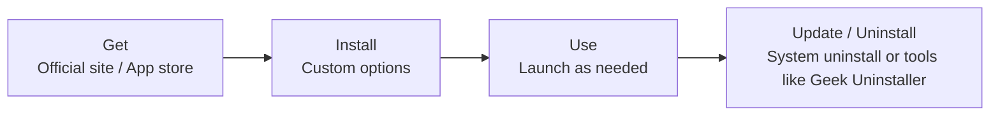

> [!DETAILS-AI] AI Summary of This Section
> This section is aimed at daily use and lists common Windows tools and software: software acquisition and safe installation (official website downloads, proper uninstallation), input and text tools (input methods, text editing, PDF reading), document and note-taking tools (office suites, Markdown notes), screenshots and screen recording (system screenshots, PixPin, clipboard history), file and media tools (compression, search, format conversion, players), along with a quick official-website reference list. After learning this, you can install common software on demand and improve daily efficiency.

> [!INFO]
> This section mainly introduces software and tools that assist daily use; it does not cover development environment setup — for environment configuration, see [1.14 Windows Environment Setup](/en/docs/ch1/1.14-Environment-Setup-Windows) or [1.14 WSL Environment Setup](/en/docs/ch1/1.14-Environment-Setup-WSL).
>
> Software selection should follow the principle of "good enough is enough, install on demand"; please download installers from official websites.
>
> 
***Never download programs from third-party download sites!*** ***Never download programs from third-party download sites!*** ***Never download programs from third-party download sites!***

## 1. Getting and Installing Software

A piece of software roughly goes through such a lifecycle from installation to uninstallation:

### 1.1 Acquisition Channels

| Channel | Description | Best for |
| :--- | :--- | :--- |
| Official website | Official site of the software, complete files, trustworthy source | Almost all software |
| System app store | Microsoft Store, automatic updates, isolated operation | Software available in the store |
| Third-party download sites | Often bundle "high-speed downloaders" and software bundles | Not recommended |

> [!CAUTION] Beware of "downloaders" and bundled installation
> The "high-speed download" buttons on some third-party download sites are actually rogue downloaders that silently install a whole bundle of rogue software.
>
> When downloading software, make sure to use the official website; when installing, select "custom installation", install to a data drive (e.g. `D:`), and uncheck the bundled software options.

### 1.2 Installation and Uninstallation

- **Install**: install large software to a data drive (e.g. `D:`) to avoid bloating the system drive; uncheck bundled options at any time.
- **Uninstall**: find the app in `Settings` → `Apps` → `Installed apps` and uninstall it; never delete the installation folder directly, and don't think that deleting the shortcut counts as uninstalling.
- **Residual cleanup**: [Geek Uninstaller](https://www.geekuninstaller.com/) is recommended — free and portable; after uninstalling, it can clean up registry entries and leftover directories.

> [!TIP] Check for leftovers after uninstalling
> After uninstalling, use the path knowledge from [1.1 File Management](/en/docs/ch1/1.1-File-Management#113-paths-absolute-paths-and-relative-paths) to check `%APPDATA%`, `%LOCALAPPDATA%`, and `Program Files` for leftover directories.

> [!NOTE] More installation notes
> For more details such as installation path selection, startup item management, and the risks of cracked versions, see "App Management" in [1.2 Windows Settings](/en/docs/ch1/1.2-Windows-Settings#5-app-management) (including installation notes and security reminders).

## 2. Input and Text Tools

### 2.1 Input Methods

| Input method | Features |
| :--- | :--- |
| Microsoft Pinyin | Built into the system, no ads, good privacy, enough for daily use |
| Sogou / WeChat Input | Richer dictionaries and features, but watch out for promotional pop-ups and privacy terms |

> [!IMPORTANT] Input methods can see everything we type
> Input methods use cloud dictionaries and sync by default, which theoretically can record what we type. In sensitive situations, it is recommended to turn off cloud sync or switch to the built-in system input method.

### 2.2 Text Editing

- **Notepad**: Windows 11 includes multi-tab support and unsaved-change prompts; it's enough for everyday jotting.
- [Notepad3](https://github.com/rizonesoft/Notepad3): open source and lightweight, with syntax highlighting; good for quickly viewing and modifying text.
- [Notepad--](https://github.com/cxasm/notepad--): a domestic open-source, cross-platform (Windows/Linux/macOS) text editor with multi-tab support; one of the alternatives to Notepad++.
- **VS Code**: a free, open-source code editor and the main tool for future development; installation steps are in [1.7 Text Editing](/en/docs/ch1/1.7-Text-Editing), and environment configuration is in [1.14 Windows Environment Setup](/en/docs/ch1/1.14-Environment-Setup-Windows).

### 2.3 PDF Reading

- **Edge's built-in PDF reader**: no extra installation needed; open and read immediately.
- **Acrobat Reader**: Adobe's official free PDF reader, feature-complete, with support for annotations, signatures, and form filling.
- **WPS PDF**: supports annotations, signatures, PDF conversion, and more, with a clean interface; integrated into WPS Office (some features require membership).

## 3. Documents and Note-taking Tools

### 3.1 Office Suites

| Suite | Description |
| :--- | :--- |
| [WPS Office](https://www.wps.cn/) | Domestic alternative with fairly complete features; most universities offer education-version membership |
| Microsoft 365 | Most universities offer genuine student licenses |

### 3.2 Note-taking Apps

[Obsidian](https://obsidian.md/): open source, local Markdown notes, with support for backlinks and knowledge graphs.
Good for recording study notes, project documentation, personal thoughts, etc.; for related syntax, see [1.8 Markdown](/en/docs/ch1/1.8-Markdown#2-basic-syntax).

## 4. Screenshots and Screen Recording

### 4.1 Built-in Screenshots

| Method | Action | Features |
| :--- | :--- | :--- |
| Shortcut `Win + Shift + S` | Brings up the screenshot bar | Screenshot is automatically copied to the clipboard and can be pasted directly |
| `PrtSc` key | Full-screen capture | Copies to the clipboard |
| `Alt + PrtSc` | Capture the current active window | Copies to the clipboard |

> [!TIP] The most commonly used way to screenshot
> `Win + Shift + S` is the most commonly used: after capturing, paste directly with `Ctrl + V` in chat apps or editors, without saving it as a file first.

### 4.2 Recommended Tool: PixPin

[PixPin](https://pixpin.cn/) is a domestic screenshot tool; most features are free and require no registration.
Besides screenshots and pinning images, it also integrates long screenshots, GIF recording, screen recording, and OCR text recognition, which is very helpful for writing documents and comparing reference images.

> [!DETAILS-HINT] How to use the pinning feature
> Press `Ctrl + 1` to select a screenshot area, then press `Ctrl + 2`, and the screenshot will be "pinned" to the screen; you can freely drag and resize it. `Esc` exits the screenshot selection. Very convenient for referring while writing documents.

### 4.3 Clipboard History

Press `Win + V` to open clipboard history and paste content you copied before; click the `📌` button to pin frequently used items.

> [!NOTE] Clipboard history and cross-device sync
> Clipboard history is saved locally by default; if you enable "sync across devices" in settings, the content will be synced to other devices through your Microsoft account.
> Be careful when copying sensitive information, and remember to clear history in settings.

### 4.4 Screen Recording

- [OBS Studio](https://obsproject.com/) (recommended): free and open source, feature-complete, supports recording on multiple platforms.
- `Win + G` (Xbox Game Bar): built-in screen recording in Windows, suitable for recording windows and operation demos.
- PixPin: supports GIF (GIF/WebP) and video (MP4) recording, suitable for creating tutorial GIFs, recording operation demos, and reproducing errors.

## 5. File and Media Tools

### 5.1 Compression Tools

[Bandizip](https://www.bandisoft.com/bandizip/): modern interface, supports smart extraction, etc.;

[7-Zip](https://www.7-zip.org/): open-source alternative with a light and clean interface.

For detailed usage, see the "Compression and Extraction" section in [1.1 File Management](/en/docs/ch1/1.1-File-Management#6-file-compression-and-extraction).

### 5.2 Full-disk Search

[Everything](https://www.voidtools.com/): "instantly" scans all files on the disk; results appear as you type keywords, and it can replace Windows' built-in search.
For detailed usage, see [1.1 File Management](/en/docs/ch1/1.1-File-Management#152-everything-a-full-drive-search-tool).

### 5.3 Format Conversion

[Format Factory](https://www.pcgeshi.com/): a free audio, video, and image format conversion tool, e.g. converting `.mkv` to `.mp4`, `.flac` to `.mp3`, etc.

### 5.4 Video Playback

| Player | Features |
| :--- | :--- |
| [PotPlayer](https://potplayer.daum.net/) | Free, strong decoding capability |
| [MPV](https://mpv.io/) | Open source, minimalist; the "Swiss army knife" of players |

> [!NOTE]
> Besides local software, many lightweight tasks can be done directly in the browser; for search tips and online tools, see [1.3 Browser](/en/docs/ch1/1.3-Browser#6-efficient-search).

## 6. Random Thoughts

> [!NOTE] Better to have fewer apps than too many
> One app per category is enough: the fewer you install, the faster the boot, and the easier it is to troubleshoot problems. Install the software in the list on demand; you don't have to install everything at once.

Below is a quick reference of official websites for the software recommended in this article; all are recommended to be downloaded from official sites:

<DocGrid>
  <DocCard href="https://pixpin.cn/" title="PixPin" description="Screenshots, pinning, long screenshots, and OCR" />
  <DocCard href="https://www.bandisoft.com/bandizip/" title="Bandizip" description="A user-friendly compression tool" />
  <DocCard href="https://www.7-zip.org/" title="7-Zip" description="Open-source, ad-free compression tool" />
  <DocCard href="https://www.voidtools.com/" title="Everything" description="Instant full-disk file search" />
  <DocCard href="https://obsidian.md/" title="Obsidian" description="Local Markdown notes" />
  <DocCard href="https://www.wps.com/" title="WPS" description="Domestic office suite" />
  <DocCard href="https://www.geekuninstaller.com/" title="Geek Uninstaller" description="Uninstall software and clean up leftovers" />
  <DocCard href="https://potplayer.daum.net/" title="PotPlayer" description="A video player with strong decoding" />
</DocGrid>

## 7. TODO Checklist

- [ ] Can distinguish official websites from third-party download sites; select "custom installation" when installing, install programs on a data drive (e.g. `D:`) and uncheck bundled options
- [ ] Can uninstall programs correctly; try using tools like [Geek Uninstaller](https://www.geekuninstaller.com/) to uninstall
- [ ] Try installing and using [PixPin](https://pixpin.cn/) to complete screenshots, pinning, and long screenshots
- [ ] Enabled clipboard history (`Win + V`) and pinned frequently used items
- [ ] Completed one screen recording with `Win + G`, `OBS Studio`, or similar software
- [ ] Try installing and using [Bandizip](https://www.bandisoft.com/bandizip) or [7-Zip](https://www.7-zip.org/) to complete one compression and extraction operation
- [ ] Try opening a PDF file with Microsoft Edge or another PDF reader, and explore features such as annotations and highlighting
- [ ] Try performing one search with [Everything](https://www.voidtools.com/)

## 8. Questions Worth Thinking About

> [!DETAILS-FAQ] Why can `Everything` "instantly" search all files on the disk, while Windows' built-in search takes so long?
> The key is that the two search completely different objects.
>
> - `Everything` directly reads the **MFT (Master File Table)** of the NTFS file system and uses the **USN change journal** for real-time incremental updates; it only searches file names and metadata, not file contents, which is why it is extremely fast;
> - Windows Search builds a full-text index by default (which analyzes file contents); the indexing scope and update timing are affected by policies, so the first search over many files often requires an "on-the-spot scan".
>
> This tells us: a tool being "fast" is usually not magic, but **a change to a more precise search target**. When you need to search by content, Windows Search or full-text-indexing tools are more appropriate.

> [!DETAILS-FAQ] Why is directly deleting a software's installation folder not considered "uninstalling"?
> The information written during software installation goes far beyond the files themselves, including:
>
> - Registry: installation info, uninstall entry, startup items, context menus, file associations;
> - System services and startup items;
> - Environment variables (such as `PATH`).
>
> If you only delete the folder, these "traces" still remain: startup items still run, context menu entries remain, and the software still shows up in `Installed apps`. This is exactly the value of tools like [Geek Uninstaller](https://www.geekuninstaller.com/) — they first run the official uninstaller, then scan and clean up leftover registry entries and directories.

> [!DETAILS-FAQ] Why do input methods need to be online? What exactly does the "cloud dictionary" upload?
> Input methods connect to the internet mainly for three kinds of features: **cloud dictionary / cloud candidates** (suggestions combined with popular input), **dictionary and configuration sync** (consistency across devices), and **updates and promotions**.
>
> These features need to send the currently typed content (or the processed pinyin string) to the server in exchange for candidate words while working, so **there is theoretically a risk that your input is recorded**. In sensitive situations (account passwords, papers, work secrets), it is recommended to: turn off cloud sync and online dictionaries, use an input method in pure local mode, or switch to the built-in system input method — this is also what the `IMPORTANT` note in this section emphasizes: **the "cloud" features of free tools are essentially a data exchange**.

> [!DETAILS-FAQ] Does the content in the clipboard really belong only to us?
> The clipboard is a **system-level global shared area**; any program running in the foreground can read it, and malware that specifically monitors the clipboard has existed in history (commonly called "clipboard hijacking", e.g. silently replacing a copied wallet address). Windows clipboard history is stored encrypted on the local machine, but if "sync across devices" is enabled, the content is transferred between devices via your Microsoft account.
>
> Therefore: after copying sensitive information such as passwords and card numbers, promptly overwrite it with unrelated content; don't enable clipboard sync on public computers. Just like input methods — **anything we have ever copied can become data for software**.
