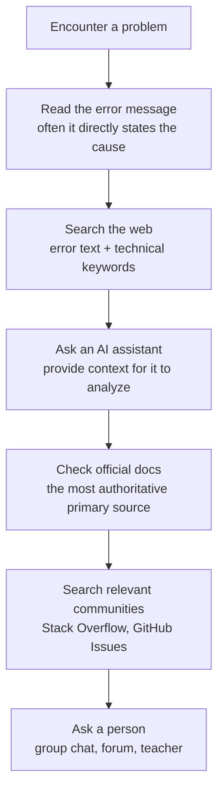

> [!DETAILS-AI] AI Summary of This Section
> This section explains how to ask questions effectively: the principle of searching before asking, a self-check list before asking, a structured question template (environment, problem, attempts, expectations), building minimal reproducible examples, question etiquette, and common misconceptions. After learning it, you can reduce communication costs and get help faster.

> [!INFO]
> Asking questions is something we do every day, but whether we "ask well" often decides whether others are willing to spend time helping us.
>
> The content of this section is largely derived from the long-standing classic open source article [How To Ask Questions The Smart Way](https://github.com/ryanhanwu/How-To-Ask-Questions-The-Smart-Way); we reorganized it for common scenarios and added AI-related content. If you are interested, we strongly recommend reading the original in full.

## 1. Search First, Then Ask

### 1.1 Why Search First

Before we run into a problem, chances are someone else has already run into the same problem and gotten an answer. Searching directly is often faster than asking, and the process of "finding the answer yourself" is itself learning.

> [!NOTE] Put Yourself in Their Shoes
> Asking a question essentially takes up other people's time. Searching and reading the documentation yourself first is both an efficient way to learn and a sign of respect for the answerer's time.
>
> Think of it the other way: if someone asked us without looking anything up first, wouldn't we also want them to do a little homework?

> [!TIP] "You Are Probably Getting RTFM and STFW Mixed Up":
> In tech communities, we may see two long-standing acronyms — `RTFM` (Read The Fucking Manual) and `STFW` (Search The Fucking Web).
>
> A milder way to say them is `Read The Friendly Manual` and `Search The Friendly Web`.
>
> Though the wording is a bit crude, this is actually the most straightforward reminder in How To Ask Questions The Smart Way: before asking, be sure to read the relevant manual and search the web yourself first.

### 1.2 The Order of Searching

When you run into a problem, you can look it up level by level along the following ladder:



Each step takes no more than 10 minutes; only move to the next step when no answer is found. Most problems can be solved within the first three steps.

### 1.3 Search Tips

The full explanation of search techniques is in the "search operators" part of [1.3 Browser](/en/docs/ch1/1.3-Browser); here we emphasize a few points:

| Tip | Explanation | Example |
| :--- | :--- | :--- |
| Copy the full error | Don't just search "my program errored"; paste the whole key error text into the search box | `Segmentation fault (core dumped)` |
| Search technical problems in English | The quality of technical content in Chinese communities varies; English searches often hit the answer in one shot | `c++ segmentation fault linked list` |
| Add the version number | Including the software version filters out outdated answers | `Node.js 20 EACCES error` |
| Restrict to a site | Add `site:stackoverflow.com` for higher-quality answers | `python csv garbled site:stackoverflow.com` |

## 2. The Structure of a Question

You've searched, you've tried, and it's still not solved — only then do you need to ask a person. But "how to ask" also matters.

### 2.1 Good Questions vs. Bad Questions

First, look at two comparisons to feel the gap directly:

> [!DETAILS-EXAMPLE] A Common Bad Question in Group Chats
> Are you there? My code won't run, can anyone take a look?
>
> ``
>
> Urgent, waiting online!

What's wrong:

- "Are you there" is useless filler that wastes people's time
- Doesn't say what language, environment, or error it is
- The screenshot hides the key information (full code, full error)
- "Urgent" is not a reason for people to prioritize us

> [!DETAILS-EXAMPLE] A Structured Good Question
> I'm writing a C++ linked list deletion function and hit a compile error; I've searched but couldn't find a solution.
>
> **Environment**: Windows 11, g++ 13.2, VS Code
> **Goal**: delete the node with a given value from the linked list
> **Error**: `error: no match for 'operator!=' (operand types are 'Node' and 'int')`
> **Relevant code**:
>
> ```cpp
> void remove(Node* head, int val) {
>     while（head != val） {  // error here
>         head = head->next;
>     }
> }
> ```
>
> **My understanding**: I thought `head != val` could compare the node's value, but the error says the types don't match. Should it be `head->data != val`?
>
> **What I've tried**: I searched "C++ linked list remove", but the examples all use `head->val`; the field in my struct is called `data`, and it still errors after the change.

What makes it good: the goal, environment, and problem are stated in one sentence; the full error is given; relevant code is pasted; and it explains the asker's understanding and what they've tried, so the answerer can see where the problem is at a glance.

| Aspect | Bad question | Good question |
| :--- | :--- | :--- |
| Opening | "Are you there?" "Help!" | State the goal and environment directly |
| Error | "It errored" "It won't run" | Full error text |
| Code | Screenshot / not pasted | A code block with the language marked |
| What was tried | Not mentioned | List what you searched and tried |
| Title | "Newbie needs help" | Tech stack + problem symptom + key error |
| Attitude | "Urgent, waiting online" | Equal communication, no rushing |

### 2.2 The Standard Template for Asking

Distill the good question above into a template and fill it in the next time you ask:

> [!DETAILS-EXAMPLE] Standard Template for Asking
>
> ```text
> 【Background】What I'm doing, what tech stack / version I'm using
> 【Goal】What effect I expect to achieve
> 【Current state】What actually happened, what the full error is
> 【Reproduction】How to retrigger the problem (minimal steps)
> 【Code】Minimal reproducible code (in a code block, not a screenshot)
> 【What I've tried】What I searched, what I tried, why it doesn't work
> 【My understanding】My current guess about the problem
> ```

> [!TIP] Four Items Are the Bottom Line
> You don't need to fill in every item, but the four — "background, current state, code, and what I've tried" — are the bottom line. Missing any one of them forces the answerer to keep asking follow-ups, tiring both sides.

## 3. Minimal Reproducible Example

The "minimal reproducible code" in the template is not a random snippet cut from your project; it is a verified example that lets others independently reproduce the problem. Stack Overflow currently uses **Minimal, Reproducible Example (MRE)**; in older material you may also see names like MCVE or MWE.

### 3.1 The Three Requirements of an MRE

| Requirement | Meaning | Self-check question |
| :--- | :--- | :--- |
| **Minimal** | Keep only what is necessary to trigger the problem | If this part is removed, does the problem still occur? |
| **Complete** | Include the code, data, dependencies, and commands needed to reproduce | Can someone run it independently in a fresh directory? |
| **Reproducible** | Re-tested; the described result is consistently produced | Are the actual result and expected result clearly written? |

> [!INFO] Trimming Is Debugging
> Progressively removing irrelevant code, fixing the input, and re-running often narrows down the problem — sometimes you find the cause even before asking. Even if you don't find an answer, you'll end up with a sample that is easier to discuss and test.

### 3.2 How to Build One

1. Copy the problem code into a new minimal directory; don't break the original project.
2. Record the runtime environment, dependency versions, and full commands.
3. Progressively remove irrelevant features, re-confirming each time after removal that the problem still exists.
4. Replace databases, network services, and personal files with fixed, non-sensitive inputs.
5. Run it again from a fresh directory or another device to confirm the steps don't depend on hidden state.

> [!WARNING] Clean Up Sensitive Information Before Publishing
> Remove access tokens, passwords, student IDs, real data, intranet addresses, and private repository links. Don't just replace a secret with asterisks and keep using the original secret; if a secret has been exposed, revoke and rotate it immediately.

### 3.3 Use Code Blocks, Not Screenshots

Code screenshots can't be copied, searched, or run directly, and they are also unfriendly to screen readers. Code, configuration, and logs should use code blocks with a language identifier; only problems that can't be expressed in text, such as UI layout or graphics rendering, need screenshots.

````markdown
```cpp
#include <iostream>

int main() {
    std::cout << "hello";
    return 0;
}
```
````

> [!DETAILS-EXAMPLE] MRE Pre-Publish Checklist
>
> - Can the example be run step by step from an empty directory?
> - Are the expected result and the actual result stated?
> - Is the complete error text and the first relevant stack trace kept?
> - Are all privacy and credentials removed?

### 3.4 Rubber Duck Debugging

Before building an MRE, there is an even lighter trick worth trying first: get a "rubber duck" and explain the problem to it.

Its origin can be traced back to *The Pragmatic Programmer*; the authors mocked how a programmer's confusion about a bug often disappears while they are "explaining it out loud":

> [!DETAILS-EXAMPLE] Rubber Duck Debugging
> Get a rubber duck (any toy or mug on the desk works), and put it next to your monitor.
>
> When debugging, explain your code to the duck line by line: what this line does, what we expect it to do, what actually happens. While explaining, we often find where the bug is before we even finish.

Why does this work? "Saying it out loud" and "thinking it in your head" are two different things: the brain easily "fills in" the parts it is unsure about, but when speaking, every line must be explicitly said, and any lazy assumption gets exposed.

> [!TIP] Explain It to the Duck Before Asking
> If you still can't say clearly where the problem is after explaining to the duck, that often means you "haven't fully thought it through" — which is exactly the time to fill in the question template and write down the symptoms and expectations clearly. This also filters out most questions before asking, so the answerer receives genuinely well-thought-out confusion.

## 4. The Etiquette of Asking

The structure is right and the code is minimal enough — one last step remains: ask in the right place, with the right attitude.

### 4.1 Choose the Right Place

| Place | Suitable questions | Response speed |
| :--- | :--- | :--- |
| Search engines | Almost any question | Immediate |
| Stack Overflow | Specific technical questions | Hours to days |
| GitHub Issues | Bugs or questions about a specific project | Depends on the maintainers |
| Course / class group chat | Coursework-related, shared questions | Depends on group activity |
| Private message to teacher / TA | Course requirements, personal grades | 1-2 working days |
| Forums (Zhihu, V2EX) | Open-ended, discussion questions | Hours to days |

> [!TIP] Ask Publicly When You Can
> If you can ask in a public place, don't use private messages. Public questions benefit more people and are easier for later readers to search out the answers. Private messages are only for personal privacy or grades. For more platforms, see [1.6 Community Platforms](/en/docs/ch1/1.6-Community-Platforms).

### 4.2 Make the Title Specific

When asking on a forum or by email, the title is the first door that decides whether others click in.

| Bad title | Good title |
| :--- | :--- |
| Help! | Segmentation fault when deleting a node in a C++ linked list |
| Code won't run | Running `npm install` on Node.js 20 reports an EACCES permission error |
| Newbie question | Python CSV reads garbled Chinese; still broken after setting utf-8 |

A good title includes: **tech stack + problem symptom + key error**, so people can tell at a glance whether they can help.

### 4.3 Don't Be a "Hand-Out Seeker"

"Hand-out seekers" refers to those who only want to take without being willing to work themselves. Typical behavior:

- Posting assignments directly and demanding others give the answer
- Asking outright for source code, notes, or cracked software
- Asking "is there a tutorial for xxx" (a search engine would find one immediately)
- Never giving feedback or saying thanks after receiving answers

> [!TIP] Show the Effort We've Made
> Showing the effort we've already made when asking is the most basic respect for the answerer. Conversely, if others are willing to spend time helping us, it deserves to be taken seriously.

### 4.4 Respond to Answers

After getting an answer:

| Step | Explanation |
| :--- | :--- |
| Timely feedback | Tell them whether trying it worked |
| State the result | If it's solved, say it's solved; if not, say where you're stuck |
| Express thanks | A "thanks, solved it" is enough, but it matters |
| Share your experience | If you solved it another way, come back and add a follow-up to help later readers |

## 5. Common Misconceptions in Asking

With the right method in hand, you also need to know which pitfalls to avoid. The three below are the most common misconceptions in asking — they look like small issues, but in practice they will sink our question without a trace.

### 5.1 The XY Problem

The "XY problem" means: we want to solve X, we think method Y can solve it, so we ask "how do I do Y" — but Y is actually the wrong approach, and what we really should ask about is X.

> For example: we ask "how do I extract all `<div>` elements from HTML using regex", but the real goal is "parse the HTML and get the content of all `div`s". The former is highly error-prone with regex; the latter can be done in one line with an HTML parsing library.

The way to avoid the XY problem: when asking, state both "what I want to do (X)" and "how I plan to do it (Y)", so the answerer has a chance to point out a better solution.

### 5.2 "It Doesn't Work" Questions

"It doesn't work" questions only report the symptom "doesn't work" with no context — that is equivalent to dumping all the debugging responsibility on the answerer, as if they owe us an explanation. A better way to phrase it is "I expect A, but actually got B; where could the gap be", describing the problem clearly instead of asking others to debug for us.

### 5.3 Multiple Questions at Once

Asking five or six unrelated questions at once makes answerers balk. Ask one core question at a time, and move on to the next after it's solved.

## 6. Asking AI

Everything so far has been about "asking people", but today we also have an "answerer" who is available 24/7 — the AI assistant. The good news is that almost all of the principles above apply; the bad news is that AI has its own pitfalls — though many of them have already been filled in by stronger new models.

### 6.1 AI Is Also an "Answerer"

AI assistants (ChatGPT, Claude, etc.) are also "answerers", and the principles above apply to them as well. When asking AI:

| Principle | Explanation |
| :--- | :--- |
| Give context | Explain what we're doing and what tech stack we use |
| Give constraints | Explain what we can't use and what limits there are |
| Ask step by step | Break complex problems into small steps and confirm each one |
| Ask for explanations | Don't only ask "how to write it", also ask "why write it this way" |
| Verify | AI hallucinates; always run the code yourself |

### 6.2 The Boundaries of Capability and Attention

AI assistants' capabilities are updated quickly. The old common shortcomings — knowledge cutoff, no internet access by default, error-prone arithmetic, short context windows — have mostly been resolved in today's mainstream models: built-in web search, larger context windows, and stronger reasoning have become or are becoming the standard. Let's see how those former shortcomings stand today:

| Former shortcoming | Current state | Still worth noting |
| :--- | :--- | :--- |
| Knowledge cutoff | Training data still has a cutoff, but built-in web search can look up the latest content | When it involves new versions or features, explicitly ask it to search the web and cross-check the sources |
| No internet by default | Most mainstream assistants now have built-in web search | Confirm it really went online: ask it for cited sources, and check official docs for important content |
| Poor at arithmetic | New-generation reasoning models are quite reliable at math and logic | For precise information such as key numbers, line numbers, and file names, still double-check yourself |
| Limited context window | Windows have expanded to a hundred thousand tokens or more, easily fitting common code and logs | For very long material, still trim it and provide it in parts |

The shortcomings are being filled in, but there are two boundaries we always need to watch ourselves: **hallucination** (see 6.3) and **attention dilution**. About attention first: even if all the information is inside the context window, the longer the conversation and the more content there is, the less attention the model pays to each detail — especially the early content sandwiched in the middle, which is most easily "overlooked".

Chat with AI long enough and you'll meet the "customer-service tone" meme: it always opens with a soothing paragraph, giving the position of highest attention to promises —

> "I will reliably hold you, and analyze your problem for you in detail, seriously, item by item, and give you the most suitable solution!"
>
> "I will analyze this problem for you seriously and carefully."
>
> "My view is that it is completely feasible; let's solve it step by step."
>
> "Please rest assured and leave it to me; I will give you a step-by-step solution."

Not a single bit of information, yet every time we see it we can't help but smile — skip it and go straight to the real content after.

> [!TIP] Restate Key Information; Don't Expect It to Remember
> In long conversations, key details mentioned at the start (tech stack, directory, error text) may have been "forgotten" by the model.
>
> A more reliable practice in real use: start a new conversation and write the key information completely in the newest message. That doesn't mean our memory is bad; it's about accommodating the boundaries of the model's attention.

### 6.3 Hallucinations: Confidently Talking Nonsense

"Hallucination" refers to the model generating content that seems plausible but is actually nonexistent. Stronger models have reduced how often hallucination occurs, but have not eradicated it — because the model's job is to "continue writing the most plausible text", not to verify facts: when the information is not in the training data, it may not say "I don't know", but instead make up an answer that sounds professional.

Typical forms:

| Type of hallucination | Example |
| :--- | :--- |
| Fabricated function / API | Recommends a function that doesn't exist, with parameters written convincingly |
| Fabricated papers / citations | Gives references or links that look real but don't actually exist |
| Fabricated shortcuts / config options | Claims a version supports a feature that it actually doesn't |
| Confidently talking nonsense | States a wrong answer in a decisive tone, with no trace of "uncertainty" |

> [!WARNING] Confidence ≠ Correctness
> The most troublesome part of hallucination: when it errs, it is often very confident, reading exactly like a correct answer.
>
> Any important code, command, and configuration must be run and verified by yourself, and cross-checked against official docs. That is also why the "verify" principle exists in 6.1.

### 6.4 A Good Prompt Example for AI

> [!DETAILS-EXAMPLE+]
>
> ```text
> I'm learning C++ data structures and just started with linked lists.
> Environment: g++ 15.2, Windows 11.
> I wrote a function to reverse a singly linked list, but the output is wrong (it outputs the list unchanged).
> Here is the code:
> [paste code]
>
> Please help me:
> 1. Point out where the bug is
> 2. Explain why it outputs the list unchanged
> 3. Give the corrected code
> ```

> [!TIP] Let AI Be Our Teaching Assistant
> The best way to use it is to let AI "guide" rather than "do it for us". Explicitly tell it "give hints first, don't give the answer directly", so we can learn the reasoning from AI instead of building a dependency.

## 7. TODO Checklist

- [ ] When you run into a problem, work through it in the order "error message → search engine → AI assistant → official docs → community → a person"
- [ ] Take a recent problem you met and rewrite it into a complete question with the standard template
- [ ] Build an independently reproducible MRE and verify it in a fresh directory
- [ ] In a course group chat or community, help a friend answer a question we can answer
- [ ] Explain this section to a friend and check each other for the common misconceptions in asking 😉

## 8. Questions Worth Thinking About

> [!DETAILS-FAQ] Why do different people get different quality of results when asking AI?
> AI understands the need based on the question, background, and context we provide. The clearer the description and the more complete the information we give, the easier it is for it to give a response that meets expectations.
>
> Instead of deliberately studying fancy "prompt techniques", it's better to first explain clearly "what I want to do, what the current situation is, and what difficulties I'm facing". In many cases, the difference in question quality is essentially the difference in the quality of information expression.
>
> At the same time, AI generation has a certain randomness; different models, different contexts, and available tools also affect the final result.
