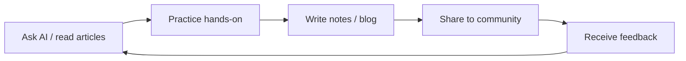

> [!DETAILS-AI] AI Summary of This Section
> This section introduces the community platforms we should care about: GitHub for code hosting and open source collaboration, the Stack Overflow Q&A community, academic resources, and "old-era ways" like blog platforms and RSS subscriptions. Asking AI questions belongs to [1.5 Asking Questions](/en/docs/ch1/1.5-Asking-Questions), so this section will not repeat it. After learning, you can build your own technical information sources and learning circle.

> [!INFO]
> For how to ask AI questions and how to verify AI's answers, see [1.5 Asking Questions](/en/docs/ch1/1.5-Asking-Questions).
>
> This section only introduces the communities AI can't replace: code hosting and open source collaboration, Q&A communities, academic resources, and content platforms.

## 1. GitHub: Code Hosting and Open Source Collaboration

The hosting, collaboration, history, and community of code are all concentrated on GitHub. It is a window into real-world engineering.

### 1.1 What Is GitHub

[GitHub](https://github.com/) is (one of) the largest code hosting platforms in the world, built on the Git version control system. Based on Git repositories, it provides code review, Issues, automation, and project collaboration features. A remote repository is not a regular cloud drive: only content that has been committed and pushed enters the version history.

Almost all well-known open source projects (Linux, VS Code, React, Vue...) are on GitHub. The basics of Git are in [1.15 Version Control and Git](/en/docs/ch1/1.15-Version-Control-Git).
But for now, we don't need to understand it.

### 1.2 Core Concepts

| Concept | Explanation |
| :--- | :--- |
| Repository | The code collection of a project, abbreviated as repo |
| Star | Like "like + bookmark", indicating we like this project |
| Fork | Copy someone else's repository into our own account; it can be modified independently |
| Pull Request (PR) | Request to merge our changes into the original repository; the core action of participating in open source |
| Issue | Report bugs, make suggestions, discuss problems |
| Watch | Subscribe to a repository's activity; we get notified of new issues / PRs |
| Gist | A place for code snippets, lighter than a repo |

### 1.3 GitHub Student Developer Pack

Students currently enrolled and verified through GitHub Education can apply for the [GitHub Student Developer Pack](https://education.github.com/pack).

Applying usually requires a school email or materials proving current enrollment; specific eligibility is subject to GitHub's official instructions.

> [!IMPORTANT]
> Third-party products, quotas, and durations in the Student Pack may be adjusted at any time. After your application succeeds, remember to reserve time and a plan for data export or migration when it expires.

## 2. Academic Resources

For engineering-heavy problems, rely on AI and communities — but as students in a formal program, we will sooner or later read papers and look up literature. Academic resources are knowledge sources of another dimension.

| Platform | Purpose |
| :--- | :--- |
| [Google Scholar](https://scholar.google.com/) | Academic search, cross-database |
| [arXiv](https://arxiv.org/) | Preprints in CS, physics, and math; read the latest papers for free |
| [DBLP](https://dblp.org/) | Computer science bibliography; check authors' publication records |
| [CNKI (知网)](https://www.cnki.net/) | Chinese academic literature |
| [IEEE Xplore](https://ieeexplore.ieee.org/) | IEEE conferences and journals |
| [ACM Digital Library](https://dl.acm.org/) | ACM conferences and journals |

## 3. Leftovers of the Previous Era

Stack Overflow, RSS subscriptions, traditional tech blogs... These ways are still running and still have value, but they are no longer the first choice in today's Agentic AI era.

### 3.1 Stack Overflow and Traditional Q&A Communities

[Stack Overflow](https://stackoverflow.com/) is a large programming Q&A community; its content is continuously maintained through voting, editing, and moderation, accumulating a huge amount of high-quality historical Q&A. Today its main value is: when an AI answer is in doubt, use it to look up "answers verified by humans".

> [!TIP] How to Use It More Efficiently
> - Search first, use English keywords, add the language / framework name, and look at highly voted answers
> - Pay attention to the answer's publication date and comments; check whether it applies to the current version
> - The bar for asking is high; first prepare complete information following [1.5 Asking Questions](/en/docs/ch1/1.5-Asking-Questions) before asking

### 3.2 Tech Blogs and Content Platforms

Blogs provide "surface-like" in-depth knowledge — tutorials, source code analysis, technology choices, personal opinions.

| Platform | Features |
| :--- | :--- |
| [Zhihu (知乎)](https://www.zhihu.com/), [Juejin (掘金)](https://juejin.cn/), [CNBlogs (博客园)](https://www.cnblogs.com/) | Mainstream domestic platforms; tutorials and experience sharing, quality varies and needs to be filtered |
| [CSDN](https://www.csdn.net/) | Lots of content but also lots of low-quality duplication; adopt cautiously |
| [Dev.to](https://dev.to/), [Medium](https://medium.com/) | International blog communities; good for reading and practicing English writing |
| [Hacker News](https://news.ycombinator.com/) | Tech news aggregator; an industry bellwether |

> [!CAUTION] Adopt CSDN Content Cautiously
> CSDN has a large amount of low-quality "copy-paste" content; when reading an article, first look at the author and the upvote count, and adopt cautiously.
> Adding `-site:csdn.net` to searches can filter it out for now, so you can prioritize better sources.

### 3.3 RSS Subscriptions

RSS is a subscription protocol that lets us actively "pull" updates from sites like blogs, instead of being pushed around by algorithm feeds.
If you want to control your information flow, you can use readers like Inoreader or Feedly to subscribe to a few high-quality blogs, and spend 10 minutes a day skimming the titles.
Or plug it into an AI agent to automatically summarize those blog posts every day.

> [!DETAILS-HINT] AI: RSS Is a Weapon Against Information Anxiety
> Instead of being pushed around by algorithm feeds, proactively subscribe to a few high-quality sources. RSS lets us "pull" information rather than "be pushed", making both time and attention more controllable.

## 4. Making Good Use of Communities

### 4.1 Set an "Information Budget"

| Frequency | Behavior |
| :--- | :--- |
| Daily | Only check a small number of sources related to the current course or project |
| Weekly | Use AI Vibe Coding ("atmosphere" programming) to build a project we're interested in |
| Periodic | Output notes, answer questions, or submit a contribution of appropriate scope |

### 4.2 Build an "Input → Output" Loop

Reading without practicing means what we learn is quickly forgotten, and it's hard to get positive feedback.

Even just sharing a small tip we just learned in a group chat is output. "Output" forces us to understand the knowledge clearly, and also lets others get to know us :) .

### 4.3 About "Information Anxiety"...

Seeing others who seem to know everything, with projects earning thousands of stars on GitHub (of course, stars can be "maliciously inflated" by tricks, but we won't discuss non-standard cases here), it's easy to feel anxious about "am I just too weak?".
Actually, there's no need to be that anxious, ~~because our weakness is an indisputable fact.~~ It is also a motivation that urges us to keep learning.

> [!IMPORTANT] AI: Don't Be Fooled by "Highlight Moments"
> What others show is often the "highlight moment"; the detours behind it we can't see. The tech field is vast — nobody knows everything; just find your own direction.
> Instead of worrying, spend the time on "doing something hands-on".

## 5. TODO Checklist

- [ ] Register a GitHub account; polish your avatar, Bio, and the README of your eponymous repository
- [ ] Star a few repositories we're interested in, and search for a beginner task once with `label:"good first issue"`
- [ ] On Stack Overflow, search in English for a question we're interested in, e.g. why sometimes `Ctrl + C` doesn't exit the program? [Related link](https://stackoverflow.blog/2017/05/23/stack-overflow-helping-one-million-developers-exit-vim/)
- [ ] Send the same question to AI in the same way, and compare the answers.

## 6. Questions Worth Thinking About

> [!DETAILS-FAQ] AI can answer everything now — why still learn about communities like Stack Overflow?
> AI's answers come from "probabilistic prediction"; they may hallucinate and may be outdated;
>
> while Stack Overflow's answers come from "verified humans" — wrong ones get downvoted and edited into correctness.
>
> But to be fair, AI's capabilities have grown strong enough today that it can already correctly answer most questions...
>
> [Stack Overflow is dying...](https://www.digit.in/features/general/stack-overflow-is-dying-blame-it-on-chatgpt-and-ai-coding-tools.html) (2026-01-06)
