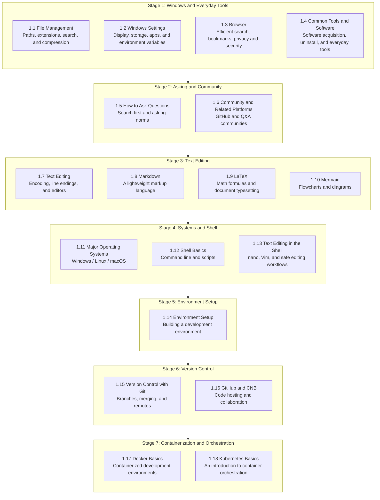

## 1. Preface

> As the saying goes — **"cultural workers must have culture"**, **"a tech alliance must understand technology"** — and CS students must be able to use computers.

It is true that most CS students in our country may never have touched a computer before college, and they may have entered this major for a variety of reasons. Yet most curricula assume that students already have basic computer operation skills, and they seldom include teaching of "modern content" such as environment setup, Git, Docker, and agentic programming.

> [!DETAILS-FAQ] Why is it called "The Missing Semester"?
> If you noticed the title of this chapter, you might wonder: why "The Missing Semester"?
>
> The inspiration originally came from an MIT course: [The Missing Semester of Your CS Education](https://missing.csail.mit.edu/). That course focuses on tools and practical skills that are rarely taught systematically in traditional classrooms, but that have a long-term impact on learning and development efficiency.
>
> On top of that, we added some foundational abilities that CS students rarely encounter in college yet genuinely need, based on the actual situation of our environment.

## 2. Chapter Map

## 3. Stage Goals

### Stage 1: Windows and Everyday Tools

| Section | Goal |
| :--------------------------------------- | :------------------------------- |
| [1.1 File Management](./ch1/1.1-File-Management) | Understand paths and extensions; learn to organize, search, and compress files |
| [1.2 Windows Settings](./ch1/1.2-Windows-Settings) | Configure display, storage, app management, and environment variables; keep the system updated |
| [1.3 Browser](./ch1/1.3-Browser) | Master search techniques, bookmark and tab management, privacy and security, and developer tools |
| [1.4 Common Tools and Software](./ch1/1.4-Common-Tools) | Install common Windows software on demand: input methods, PDF, notes, screenshots, compression, etc. |

### Stage 2: Asking and Community

| Section | Goal |
| :--------------------------------------- | :---------------------------------- |
| [1.5 How to Ask Questions](./ch1/1.5-Asking-Questions) | Learn to search before asking; master asking norms and templates |
| [1.6 Community and Related Platforms](./ch1/1.6-Community-Platforms) | Learn how to use community platforms such as GitHub and Stack Overflow |

### Stage 3: Text Editing

| Section | Goal |
| :------------------------------- | :--------------------- |
| [1.7 Text Editing](./ch1/1.7-Text-Editing) | Understand character encoding, line endings, and editor selection |
| [1.8 Markdown](./ch1/1.8-Markdown) | Master basic syntax: headings, lists, code blocks, tables, and links |
| [1.9 LaTeX](./ch1/1.9-LaTeX) | Master math formulas, document structure, cross-references, and the basic compilation workflow |
| [1.10 Mermaid](./ch1/1.10-Mermaid) | Draw flowcharts, sequence diagrams, and Gantt charts with text |

### Stage 4: Systems and Shell

| Section | Goal |
| :--------------------------------------------- | :------------------------------ |
| [1.11 Major Operating Systems](./ch1/1.11-Operating-Systems) | Understand the differences and use cases of Windows, Linux, and macOS |
| [1.12 Shell Basics](./ch1/1.12-Shell-Basics) | Master core commands: file operations, pipes, redirection, and permissions |
| [1.13 Text Editing in the Shell](./ch1/1.13-Shell-Text-Editing) | Safely edit and verify files with `nano` and `Vim` |

### Stage 5: Environment Setup

| Section | Goal |
| :------------------------------------ | :------------------------------------------------ |
| [1.14 WSL Environment Setup](/zh/docs/ch1/1.14-Environment-Setup-WSL) | Install WSL and the Linux toolchain, configure VS Code Remote Development, SSH, and Docker |
| [1.14 Windows Environment Setup](/zh/docs/ch1/1.14-Environment-Setup-Windows) | Use scoop to install Git, Node.js, Python, and the MSYS2 C/C++ toolchain |

### Stage 6: Version Control

| Section | Goal |
| :------------------------------------------ | :------------------------------------ |
| [1.15 Version Control with Git](./ch1/1.15-Version-Control-Git) | Understand the Git model; master branches, merging, undoing, and remote operations |
| [1.16 Code Hosting Platforms](./ch1/1.16-Code-Hosting-Platform) | Complete the account, SSH, repository, and Fork + Pull Request collaboration workflow |

### Stage 7: Containerization and Orchestration

| Section | Goal |
| :------------------------------------- | :----------------------------------- |
| [1.17 Docker Basics](./ch1/1.17-Docker-Basics) | Use images, containers, Dockerfile, and Compose to manage reproducible environments |
| [1.18 Kubernetes Basics](/zh/docs/ch1/1.18-Kubernetes-Basics) | Understand cluster architecture and orchestration concepts: Pod, Deployment, Service |

## 4. TODO Checklist

- [ ] Skim the chapter overview to understand the covered content and the learning path
- [ ] Complete Stage 1: [File Management](./ch1/1.1-File-Management), [Windows Settings](./ch1/1.2-Windows-Settings), [Browser](./ch1/1.3-Browser), and [Common Tools and Software](./ch1/1.4-Common-Tools)
- [ ] Complete Stage 2: [How to Ask Questions](./ch1/1.5-Asking-Questions) and [Community](./ch1/1.6-Community-Platforms)
- [ ] Complete Stage 3: [Text Editing](./ch1/1.7-Text-Editing), [Markdown](./ch1/1.8-Markdown), [LaTeX](./ch1/1.9-LaTeX), and [Mermaid](./ch1/1.10-Mermaid)
- [ ] Complete Stage 4: [Major Operating Systems](./ch1/1.11-Operating-Systems), [Shell Basics](./ch1/1.12-Shell-Basics), and [Text Editing in the Shell](./ch1/1.13-Shell-Text-Editing)
- [ ] Complete Stage 5: [WSL Environment Setup](/zh/docs/ch1/1.14-Environment-Setup-WSL) and [Windows Environment Setup](/zh/docs/ch1/1.14-Environment-Setup-Windows)
- [ ] Complete Stage 6: [Version Control with Git](./ch1/1.15-Version-Control-Git) and [Code Hosting Platforms](./ch1/1.16-Code-Hosting-Platform)
- [ ] Complete Stage 7: [Docker Basics](./ch1/1.17-Docker-Basics) and [Kubernetes Basics](/zh/docs/ch1/1.18-Kubernetes-Basics)
