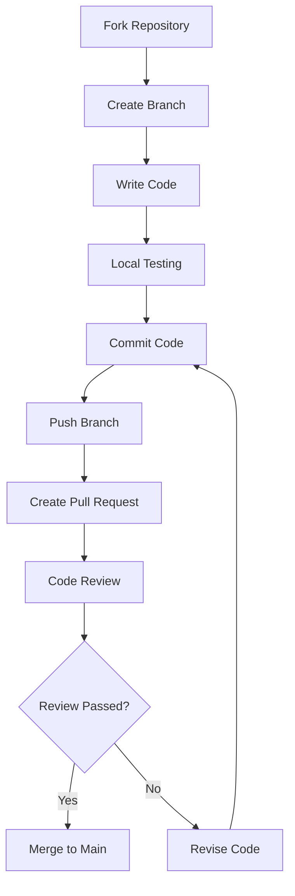

## Code of Conduct

This project adopts an open, friendly approach to collaboration. By participating, you agree to abide by the following principles:

- Respect all contributors
- Accept constructive criticism and suggestions
- Focus on what is best for the community
- Show empathy toward others

## How to Contribute

### Reporting Bugs

If you find a bug, please submit a report via [GitHub Issues](https://github.com/SSJ-ZYJ/Neoverse-Doc/issues). Before submitting, please:

1. Check if an Issue for the same problem already exists
2. Use a clear title to describe the issue
3. Provide reproduction steps, expected results, and actual results
4. Include relevant environment information (Node.js version, operating system, etc.)

### Proposing New Features

Feature suggestions are welcome! Please submit them via [GitHub Issues](https://github.com/SSJ-ZYJ/Neoverse-Doc/issues) with a detailed description of:

- The purpose and value of the feature
- Possible implementation approaches
- Whether there are alternative solutions

### Submitting Code

Submit code contributions via Pull Request. See [Pull Request Workflow](#pull-request-workflow) for details.

## Development Environment Setup

### Prerequisites

- **Node.js** >= 20
- **Bun** >= 1.0
- **Git**

### Installation Steps

```bash
# 1. Fork and clone the project
git clone https://github.com/<your-username>/Neoverse-Doc.git
cd Neoverse-Doc

# 2. Add upstream repository
git remote add upstream https://github.com/SSJ-ZYJ/Neoverse-Doc.git

# 3. Install dependencies
bun install

# 4. Start the dev server
bun dev
```

Open `http://localhost:3000` in your browser to preview.

### Available Commands

| Command | Description |
| :--- | :--- |
| `bun dev` | Start dev server (Turbopack) |
| `bun run build` | Production build |
| `bun run typecheck` | TypeScript type checking |
| `bun run lint` | Biome Lint check |
| `bun run format` | Biome formatting |
| `bun run check` | Biome format + lint + auto-fix |

## Project Structure

```text
Neoverse-Doc/
├── content/docs/              # Document content (MDX), organized by language subdirectories
│   ├── zh/                    # Chinese documentation
│   └── en/                    # English documentation
├── src/
│   ├── app/                   # Next.js App Router pages
│   ├── components/            # React components
│   ├── dictionaries/          # i18n language packs
│   └── lib/                   # Utility functions and configuration
├── source.config.ts           # fumadocs-mdx configuration
├── next.config.ts             # Next.js configuration
├── biome.json                 # Biome formatting and lint rules
└── tsconfig.json              # TypeScript configuration
```

## Code Standards

### Coding Principles

1. **No Hardcoded Strings**: All user-facing text must use i18n localization
2. **Add Comments**: New code should include functional description comments
3. **Follow the Tech Stack**: Use dependency versions defined in `package.json`
4. **Type Safety**: Make full use of the TypeScript type system

### Code Style

This project uses Biome for code formatting and lint checking:

```bash
# Format code
bun run format

# Check and auto-fix
bun run check
```

### Naming Conventions

| Type | Convention | Example |
| :--- | :--- | :--- |
| File names | lowercase + hyphens | `guestbook.tsx` |
| Component names | PascalCase | `Guestbook` |
| Function names | camelCase | `getDictionary` |
| Constants | UPPER_SNAKE_CASE | `DEFAULT_LOCALE` |
| CSS classes | lowercase + hyphens | `liquid-glass` |

## Commit Conventions

Commit message format: `<type>(<scope>): <description>`

### Commit Types

| Type | Description |
| :--- | :--- |
| `feat` | New feature |
| `fix` | Bug fix |
| `docs` | Documentation changes |
| `style` | Formatting changes (no code logic change) |
| `refactor` | Code refactoring (no feature change) |
| `test` | Test changes |
| `chore` | Build process or tooling changes |
| `ci` | Continuous integration changes |
| `revert` | Revert to a previous version |

### Examples

```text
feat(i18n): add Japanese language support
fix(search): fix search result highlight display issue
docs(readme): update installation instructions
refactor(components): refactor Mermaid component rendering logic
```

### Commit Message Rules

- Use brief descriptions
- Keep the summary within 10 English words
- If there are many changes, list additional details in the body
- Leave a blank line between the summary and body

## Documentation Standards

### Document Naming

- Use English names relevant to the document content
- Use underscores to separate words, e.g., `getting_started.md`
- Case-sensitive

### Document Language

- Initial documents are provided in Simplified Chinese only
- English versions use the `_en.md` suffix, e.g., `README_en.md`
- Code comments maintain a bilingual convention (English above, Chinese below)

### Document Formatting

- Use Markdown format
- Use Mermaid syntax for diagrams
- Use LaTeX syntax for formulas: `$...$` for inline formulas and `$$...$$` for block formulas
- Use appropriate language identifiers for code blocks
- Use a half-width space between Chinese and English text
- Wrap English keywords, commands, and file names in backticks

### Adding New Documents

1. Create a `.md` or `.mdx` file under the corresponding directory in `content/docs/zh/`
2. Add frontmatter:

   ```md
   ---
   title: Page Title
   description: Page Description
   author:
     - "Primary Author(https://github.com/your-name)"
   contributors:
     - "Contributor(https://github.com/contributor-name)"
   ---
   ```

   `author` is shown as the primary author at the top of the document; `contributors` is shown as document contributors at the end of the body, with singular `contributor` supported as a compatibility alias. Both support the `Name(https://github.com/name)` format for automatic GitHub avatars.

3. Register the new page in the corresponding directory's `meta.json`
4. For the English version, create the corresponding file under `content/docs/en/`

## Pull Request Workflow

### Pre-Submission Checklist

- [ ] Documentation has been updated
- [ ] `meta.json` has been updated (if new documents were added)
- [ ] Code passes type checking: `bun check`
- [ ] Code passes lint checking: `bun lint`
- [ ] Code has been formatted: `bun format`
- [ ] Local build succeeds: `bun run build`

### Workflow Steps



1. **Fork Repository**: Fork this project on GitHub

2. **Create Branch**: Create a feature branch from `main`

   ```bash
   git checkout -b feat/your-feature-name
   ```

3. **Write Code**: Develop according to code standards

4. **Local Testing**: Ensure all checks pass

   ```bash
   bun run typecheck
   bun run check
   bun run build
   ```

5. **Commit Code**: Write commit messages following commit conventions

   ```bash
   git add .
   git commit -m "feat(scope): description"
   ```

6. **Push Branch**:

   ```bash
   git push origin feat/your-feature-name
   ```

7. **Create Pull Request**:
   - Create a Pull Request on GitHub
   - Fill in the PR template describing the changes
   - Link related Issues if applicable

8. **Code Review**: Wait for maintainer review and revise based on feedback

### PR Title Convention

PR titles should follow the same format as commit messages:

```text
feat(i18n): add Japanese language support
```

## Internationalization Guide

### Adding a New Language (Example)

1. Add language configuration in `src/lib/i18n.ts`:

   ```typescript
   export const i18n = defineI18n({
     locales: ['zh', 'en', 'ja'],  // Add 'ja'
     defaultLocale: 'zh',
   });
   ```

2. Create a language pack file `ja.ts` under `src/dictionaries/`

3. Import and register it in `src/dictionaries/index.ts`

4. Create a `ja/` directory under `content/docs/` and translate documents

5. Add fumadocs UI translations in `src/lib/layout.shared.tsx`

### Translation Principles

- Maintain consistency of technical terminology
- Respect the expression habits of the target language
- Translate comments in code examples as well
- Keep Markdown formatting unchanged

---

Thank you again for contributing to Neoverse-Doc! If you have any questions, feel free to reach out via [GitHub Issues](https://github.com/SSJ-ZYJ/Neoverse-Doc/issues) or [Email](mailto:me@shenshijun.space).
