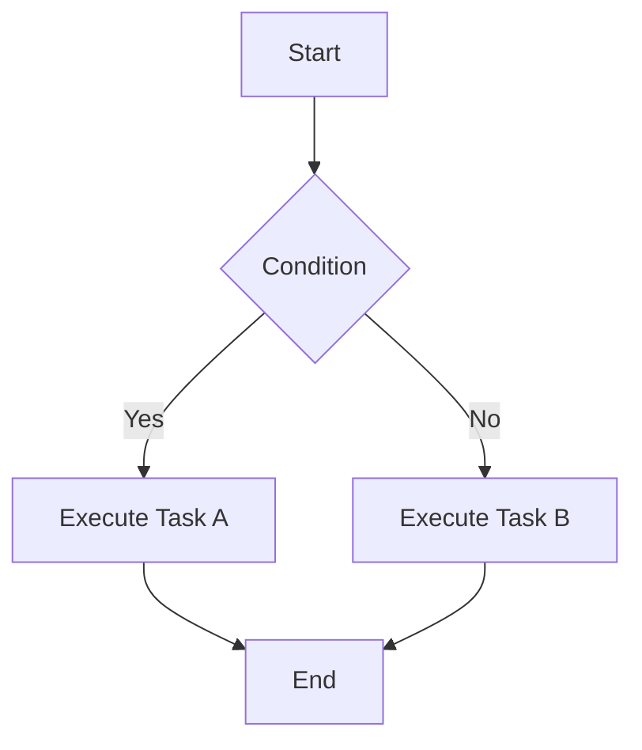
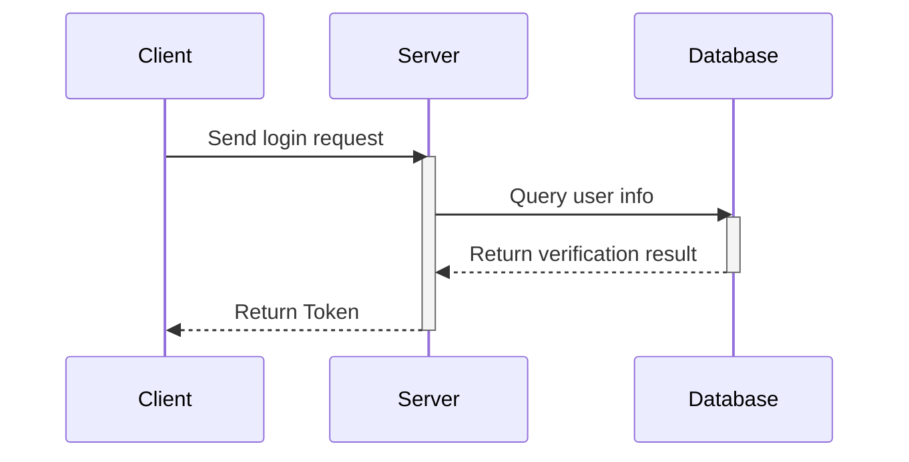
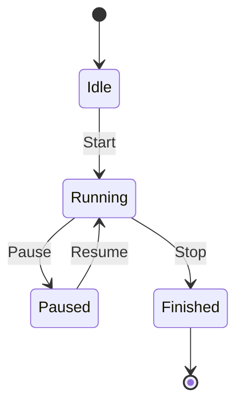

This document demonstrates basic Markdown, GitHub Flavored Markdown (GFM), and Mermaid diagram syntax.

## 1. Basic Markdown Syntax

### Headers

# Heading 1

## Heading 2

### Heading 3

#### Heading 4

```md
# Heading 1
## Heading 2
### Heading 3
#### Heading 4
```

### Emphasis

*Italic text*  
**Bold text**  
***Bold italic text***

```md
*Italic text*
**Bold text**
***Bold italic text***
```

### Lists

**Unordered list:**

* Item A
* Item B
  * Sub-item B.1
  * Sub-item B.2

**Ordered list:**

1. First item
2. Second item
3. Third item

### Links & Images

[SSJ's Blog](https://blog.shenshijun.space/)


### Inline Code

You can embed a small snippet of code in text, like `console.log('Hello World')`.

### Horizontal Rules

---

```md
---
```

## 2. GitHub Flavored Markdown (GFM) Syntax

### Task Lists

* [x] Complete requirements analysis
* [x] Write example documentation
* [ ] Submit code and deploy to production
3

### Tables

| Feature | Support | Notes |
| :--- | :---: | ---: |
| Table support | Perfect | Center and right alignment |
| Task lists | Perfect | GFM standard |
| Strikethrough | Perfect | `~~text~~` |

### Strikethrough

This is some ~~struck-through text~~.

### Autolinks

You can directly visit my blog: <https://blog.shenshijun.space/>

### Blockquotes

> This is a first-level blockquote.
> > This is a nested second-level blockquote.
> >
> > **Note:** Other Markdown syntax can also be used within blockquotes.

### Alerts

GitHub supports special blockquote syntax to render colored and iconified callout blocks:

> [!NOTE]
> This is a note providing useful supplementary information.

---

> [!TIP]
> This is a tip providing suggestions or shortcuts.

---

> [!IMPORTANT]
> This is important information highlighting key context.

---

> [!WARNING]
> This is a warning reminding you to proceed with caution to avoid issues.

---

> [!CAUTION]
> This is a caution informing you of actions that may lead to destructive consequences.

### Syntax-Highlighted Code Blocks

```python
def fibonacci(n):
    if n <= 0:
        return []
    elif n == 1:
        return [0]
    result = [0, 1]
    while len(result) < n:
        result.append(result[-1] + result[-2])
    return result

print(fibonacci(10))
```

## 2. Mermaid Diagram Syntax

### Flowchart



### Sequence Diagram



### State Diagram


