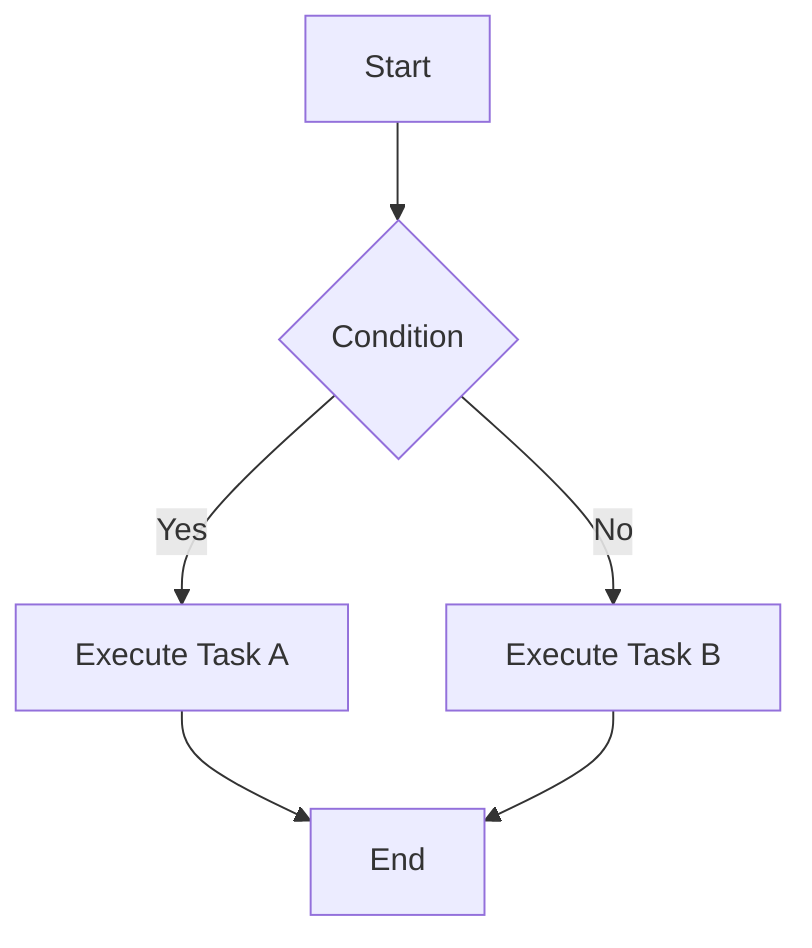
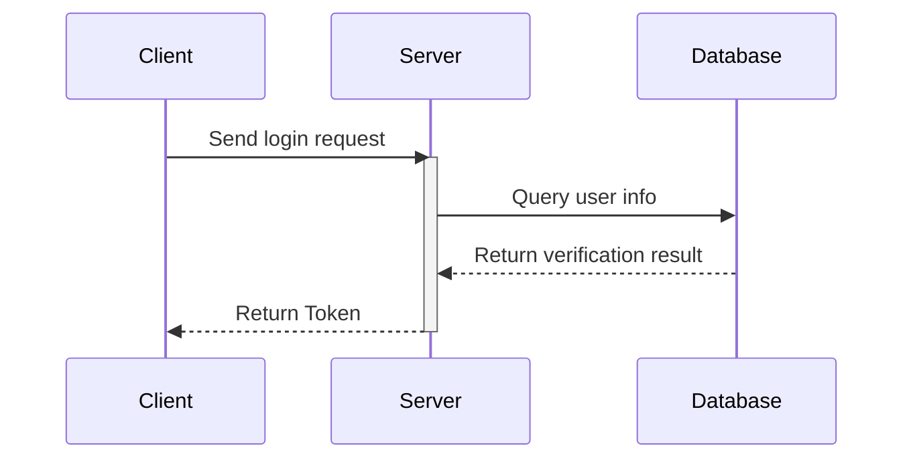
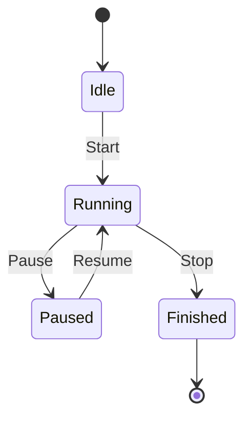

<!-- Markdown syntax guide rewrite: groups native Markdown, GFM, project extensions, code, math, and diagrams into stable sections.
     Markdown 语法指南重写：按原生 Markdown、GFM、项目增强、代码、数学与图表分组。 -->

This document groups the Markdown syntax supported by this project by function. Basic Markdown covers everyday writing, while project extensions cover alerts, collapsible blocks, code titles, math formulas, and diagrams.

## Syntax Overview

| Category | Features | Best For |
| :--- | :--- | :--- |
| [Basic Markdown](#1-basic-markdown) | [Headings & Paragraphs](#11-headings-and-paragraphs), [Emphasis](#12-emphasis-and-line-breaks), [Lists](#14-lists), [Links & Images](#15-links-images-and-rules), [Inline Code](#13-inline-code), [Horizontal Rules](#15-links-images-and-rules) | Regular document structure |
| [GFM Extensions](#2-github-flavored-markdown) | [Task Lists](#21-task-lists), [Tables](#22-tables), [Strikethrough](#23-strikethrough-and-autolinks), [Autolinks](#23-strikethrough-and-autolinks), [Blockquotes](#24-blockquotes) | Collaboration notes and structured content |
| [Project Extensions](#3-project-extensions) | [GitHub Alert Callouts](#31-github-alert-callouts), [Basic Collapsible Blocks](#32-basic-collapsible-blocks), [Semantic Collapsible Blocks](#33-semantic-collapsible-blocks) | Callouts, supplements, generated summaries |
| [Code Blocks](#4-code-blocks) | [Syntax Highlighting](#41-basic-code-blocks), [File-Path Title Bar](#42-file-path-title-bar), [Code Blocks Without Paths](#43-code-blocks-without-file-paths), Copy Button | Code examples and configuration snippets |
| [Math and Diagrams](#5-latex-formulas) | [LaTeX Formulas](#5-latex-formulas), [Mermaid Flowchart](#61-flowchart), [Sequence Diagram](#62-sequence-diagram), [State Diagram](#63-state-diagram) | Formulas, flowcharts, sequence diagrams, state diagrams |

## 1. Basic Markdown

### 1.1 Headings and Paragraphs

The page title comes from the frontmatter `title` field. Start body headings from `##` to keep the table of contents clean.

```md
## Level 2 Heading

Separate paragraphs with a blank line.

### Level 3 Heading

Continue writing body content.
```

### 1.2 Emphasis and Line Breaks

*Italic text*

**Bold text**

***Bold italic text***

```md
*Italic text*

**Bold text**

***Bold italic text***

When content needs strong separation, prefer separate paragraphs or list items.
```

### 1.3 Inline Code

Use backticks for commands, variables, file names, or short snippets, such as `bun run check`, `src/app/globals.css`, and `console.log()`.

```md
Run `bun run check` to format and check the project.
```

### 1.4 Lists

Use unordered lists for parallel information and ordered lists for procedures.

```md
* Install dependencies
* Start the development server
  * The default URL is `http://localhost:3000`

1. Fork the repository
2. Create a feature branch
3. Open a Pull Request
```

### 1.5 Links, Images, and Rules

```md
[SSJ's Blog](https://blog.shenshijun.space/)


---
```

---

## 2. GitHub Flavored Markdown

### 2.1 Task Lists

* [x] Complete requirements analysis
* [x] Write example documentation
* [ ] Open a Pull Request

```md
* [x] Complete requirements analysis
* [x] Write example documentation
* [ ] Open a Pull Request
```

### 2.2 Tables

| Feature | Support | Notes |
| :--- | :---: | ---: |
| Tables | Complete | Supports left, center, and right alignment |
| Task lists | Complete | Uses GFM syntax |
| Strikethrough | Complete | Uses `~~text~~` |

```md
| Feature | Support | Notes |
| :--- | :---: | ---: |
| Tables | Complete | Supports left, center, and right alignment |
```

### 2.3 Strikethrough and Autolinks

This is ~~deleted text~~.

Autolink example: <https://blog.shenshijun.space/>

```md
This is ~~deleted text~~.
Autolink example: <https://blog.shenshijun.space/>
```

### 2.4 Blockquotes

> This is a first-level blockquote.
> > This is a nested blockquote.
> > **Tip:** Blockquotes can also contain emphasis, links, and inline code.

```md
> This is a first-level blockquote.
> > This is a nested blockquote.
```

## 3. Project Extensions

### 3.1 GitHub Alert Callouts

Callouts are useful for supplementary information, suggestions, important context, warnings, and destructive actions.

> [!NOTE]
> Note: supplementary information.

> [!TIP]
> Tip: suggestions or shortcuts.

> [!IMPORTANT]
> Important: key context.

> [!WARNING]
> Warning: proceed carefully.

> [!CAUTION]
> Caution: actions that may lead to destructive results.

```md
> [!NOTE]
> Note: supplementary information.

> [!WARNING]
> Warning: proceed carefully.
```

### 3.2 Basic Collapsible Blocks

Collapsible blocks are useful for supplementary notes, advanced content, or long explanations.

> [!DETAILS] Collapsible Note
> This block is collapsed by default. Readers can expand it when needed.

> [!DETAILS+] Expanded by Default
> Add `+` after `DETAILS` to make the block expanded by default.

```md
> [!DETAILS] Collapsible Note
> This block is collapsed by default.

> [!DETAILS+] Expanded by Default
> Add `+` after `DETAILS` to make the block expanded by default.
```

### 3.3 Semantic Collapsible Blocks

Semantic collapsible blocks use `[!DETAILS-XXX]`. The summary can be written directly after the marker.

| Syntax | Default Title | Use Case |
| :--- | :--- | :--- |
| `[!DETAILS-FAQ]` | FAQ | Question-style content |
| `[!DETAILS-ANSWER]` | Answer | Answers for FAQ blocks |
| `[!DETAILS-EXAMPLE]` | Example | Code or usage examples |
| `[!DETAILS-HINT]` | Hint | Short tips |
| `[!DETAILS-AI]` | AI Summary | AI-generated summaries |

#### FAQ and Answer

> [!DETAILS-FAQ] What is Neoverse?
> Neoverse is a future-oriented documentation platform committed to an elegant reading experience.

> [!DETAILS-ANSWER] How can I contribute?
> You can contribute by submitting Pull Requests, reporting Issues, or improving documentation.

#### Example and Hint

> [!DETAILS-EXAMPLE] Organizing Code Examples with Collapsible Blocks
> Longer code examples can be placed inside collapsible blocks so readers can expand them when needed.
>
> ```cpp
> // src/example.cpp
> #include <iostream>
> int main() {
>     std::cout << "Hello, Neoverse!" << std::endl;
>     return 0;
> }
> ```

> [!DETAILS-HINT] Keyboard Shortcut Tips
> Use `Ctrl + K` to quickly open the search dialog.

#### AI Summary

AI summary blocks are designed for AI-generated summaries. After expansion, the body appears with a typewriter effect; when the typable character count reaches `360`, it switches to the medium-length speed tier, and when it reaches `900`, it switches to the long-content speed tier to avoid making readers wait too long.

> [!DETAILS-AI] AI-generated Summary
> This variant is designed for AI-generated summaries. After expansion, the body text appears in short batches, and the cursor follows the latest generated text.

```md
> [!DETAILS-AI] AI-generated Summary
> Put the AI-generated summary body here.
```

## 4. Code Blocks

### 4.1 Basic Code Blocks

Use a language identifier on fenced code blocks to enable syntax highlighting.

```javascript
// src/utils/helper.js
export function greet(name) {
  return `Hello, ${name}!`;
}
```

````md
```javascript
// src/utils/helper.js
export function greet(name) {
  return `Hello, ${name}!`;
}
```
````

### 4.2 File-Path Title Bar

Top comments that look like file paths are extracted into the code block title bar and removed from the rendered code body.

| Language Type | Supported Top Comment |
| :--- | :--- |
| JavaScript / TypeScript / C++ | `// src/example.ts` |
| CSS | `/* src/styles/example.css */` |
| Shell / Python | `# scripts/example.sh` |
| HTML | `<!-- public/index.html -->` |

```typescript
// src/components/Button.tsx
type ButtonProps = {
  label: string;
};

export function Button({ label }: ButtonProps) {
  return <button type="button">{label}</button>;
}
```

### 4.3 Code Blocks Without File Paths

Code blocks without top file-path comments are still highlighted normally, but no path title is shown.

```css
.container {
  display: flex;
  align-items: center;
  justify-content: center;
  padding: 20px;
}
```

## 5. LaTeX Formulas

### 5.1 Inline Math

Inline formulas are written inside `$...$`, for example the Pythagorean theorem $a^2 + b^2 = c^2$.

```md
Inline formulas are written inside `$...$`, for example $a^2 + b^2 = c^2$.
```

### 5.2 Block Math

Block formulas are written in standalone `$$...$$` blocks and are useful for derivations or important formulas.

$$
\int_{-\infty}^{\infty} e^{-x^2}\,dx = \sqrt{\pi}
$$

```md
$$
\int_{-\infty}^{\infty} e^{-x^2}\,dx = \sqrt{\pi}
$$
```

## 6. Mermaid Diagrams

### 6.1 Flowchart


```mermaid
graph TD;
    A[Start] --> B{Condition};
    B -- Yes --> C[Execute Task A];
    B -- No --> D[Execute Task B];
    C --> E[End];
    D --> E;
```

### 6.2 Sequence Diagram


```mermaid
sequenceDiagram
    participant Client
    participant Server
    participant Database

    Client->>Server: Send login request
    activate Server
    Server->>Database: Query user info
    Database-->>Server: Return verification result
    Server-->>Client: Return Token
    deactivate Server
```

### 6.3 State Diagram


```mermaid
stateDiagram-v2
    [*] --> Idle
    Idle --> Running : Start
    Running --> Paused : Pause
    Paused --> Running : Resume
    Running --> Finished : Stop
    Finished --> [*]
```
