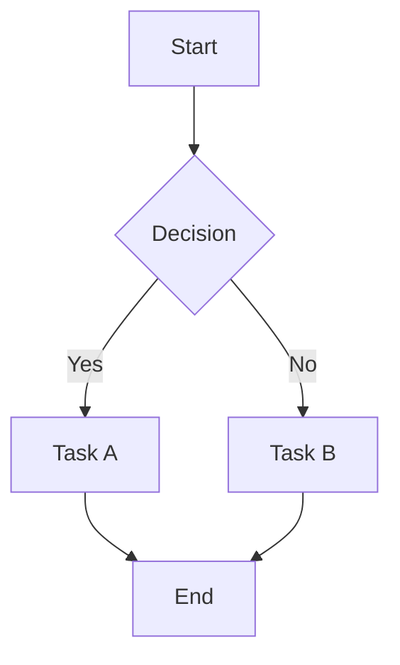
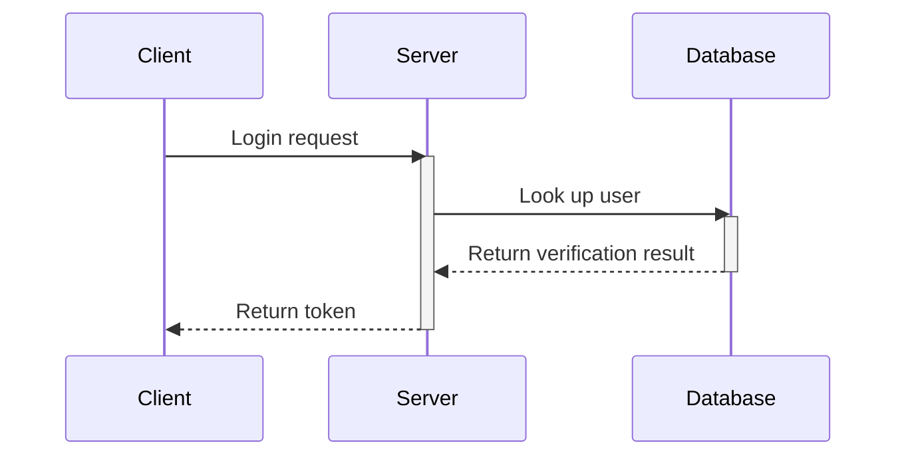
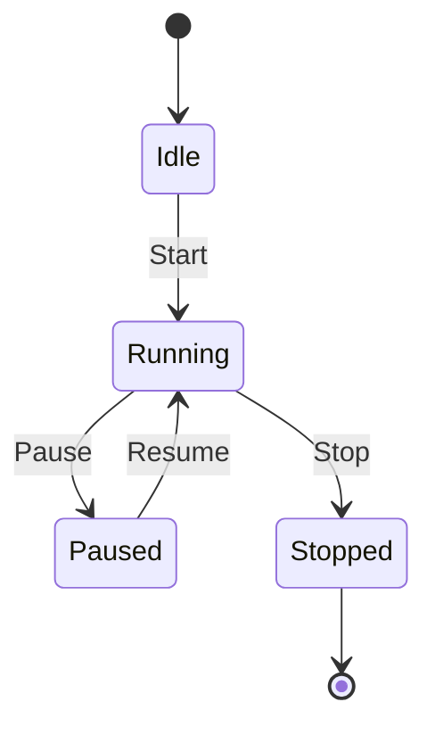

This document showcases basic Markdown, GitHub Flavored Markdown (GFM), and Mermaid diagram syntax.

## 1. Basic Markdown

### Headers

# H1

## H2

### H3

#### H4

### Emphasis

*italic* or _italic_
**bold** or __bold__
***bold italic*** or ___bold italic___

### Lists

**Unordered list:**

- Item A
- Item B
  - Sub-item B.1
  - Sub-item B.2

**Ordered list:**

1. First
2. Second
3. Third

### Links and Images

[SSJ's Blog](https://blog.shenshijun.space/)


### Inline Code

You can sprinkle short code in text, for example `console.log('Hello World')`.

### Horizontal Rule

---

## 2. GitHub Flavored Markdown (GFM)

### Task Lists

- [x] Finish requirements analysis
- [x] Draft example documentation
- [ ] Commit and deploy to production

### Tables

| Feature | Support | Notes |
| :--- | :---: | ---: |
| Tables | Perfect | Center and right alignment |
| Task list | Perfect | GFM standard |
| Strikethrough | Perfect | `~~text~~` |

### Strikethrough

This is some ~~struck-through text~~.

### Autolinks

You can visit my blog directly: https://blog.shenshijun.space/

### Blockquotes

> This is a first-level blockquote.
> > This is a nested second-level blockquote.
> >
> > **Note:** Other Markdown syntax also works inside blockquotes.

### Alerts

GitHub supports special blockquote syntax to render colored alert blocks with icons:

> [!NOTE]
> This is a Note that provides helpful supplementary information.

> [!TIP]
> This is a Tip with a suggestion or convenient shortcut.

> [!IMPORTANT]
> This is Important — highlighting critical context.

> [!WARNING]
> This is a Warning — be careful to avoid mistakes.

> [!CAUTION]
> This is a Caution — flagging potentially destructive actions.

### Syntax-Highlighted Code Blocks

```python
def fibonacci(n):
    if n <= 0:
        return []
    elif n == 1:
        return [0]
    result = [0, 1]
    while len(result) < n:
        result.append(result[-1] + result[-2])
    return result

print(fibonacci(10))
```

## 3. Mermaid Diagrams

### Flowchart



### Sequence Diagram



### State Diagram


