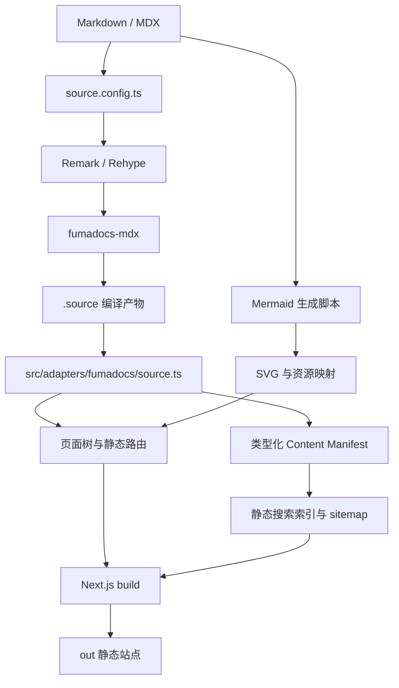

> [!DETAILS-AI] 本章 AI 摘要
> 项目把内容、站点组件、解析逻辑、生成脚本和样式明确分层。Fumadocs 将 `content/docs/{locale}/` 编译为类型安全内容源，Next.js 根据页面树生成全部 locale 与 slug，生产环境通过 `output: 'export'` 输出 `out/` 静态站点。搜索、文档源码、Mermaid 资源与站点级常量也在构建期或集中配置中完成。

## 一、目录职责

```text
Neoverse-Doc/
├── content/docs/
│   ├── zh/                       # 中文内容树
│   └── en/                       # 英文内容树
├── public/
│   └── mermaid/                  # 生成的 Mermaid SVG
├── scripts/
│   └── generate-mermaid-assets.ts
├── src/
│   ├── app/                      # 路由、数据读取与页面组合
│   ├── content/                  # Schema、MDX 插件、搜索索引与 Manifest
│   ├── features/                 # Search、Reading、Tasks、Mermaid、Transition、Community
│   ├── runtime/                  # Navigation、Motion 与 Interaction 外部 Store
│   ├── adapters/fumadocs/        # Source、Layout 与第三方 DOM 适配
│   ├── ui/                       # Token、Surface 与全局样式
│   ├── components/               # 未迁移的共享组件与 MDX 注册表
│   ├── dictionaries/             # 项目 UI 字典
│   └── lib/                      # i18n、SEO 与站点配置等低耦合工具
├── source.config.ts              # 内容源、Schema 与 MDX Pipeline 组装
├── next.config.ts                # 静态导出与 Next.js 配置
└── package.json                  # 依赖与项目命令
```

### 内容与实现分离

`content/docs/` 是内容的唯一主要入口。页面导航由各级 `meta.json` 显式声明，单篇元数据由 Frontmatter 声明；React 组件和解析插件不分散到内容目录中。

`src/components/mdx/` 是统一增强层。每篇文档都通过同一个组件注册表获得代码块、Mermaid、任务项、Tabs、文档卡片和文件层级，不需要逐页导入。

成熟业务能力收敛到 `src/features/`，跨 Feature 的导航、动效和交互状态由 `src/runtime/` 提供；Fumadocs 的 Loader、Layout、TOC 与复杂 DOM 选择器统一经过 `src/adapters/fumadocs/`。`scripts/` 只负责开发或构建前需要批量完成的工作，生成产物分别进入 `public/mermaid/`、`src/features/mermaid/generated/`、`.source/` 与 `out/`。

## 二、路由与布局

```text
src/app/[lang]/
├── (home)/
│   ├── (index)/page.tsx          # 首页
│   └── guestbook/page.tsx        # 留言墙
├── docs/
│   ├── layout.tsx                # DocsLayout
│   └── [...slug]/page.tsx        # 文档正文
└── docs-source/
    └── [...slug]/route.ts        # Markdown 源码端点
```

路由组让首页与文档页共享 locale，却使用不同布局：

- 首页使用顶部导航和内容门户，不加载文档侧栏；
- 文档页使用 Fumadocs `DocsLayout`，包含侧栏、正文与本页目录；
- 留言墙复用首页布局，但使用独立页面；
- `docs-source` 为每篇内容生成可静态访问的原始 Markdown。

根路径是静态语言分流入口：浏览器根据 `navigator.languages` 选择中文或英文，未知语言回退到英文；无脚本环境仍可使用页面中的两个显式入口。自动判断只发生在 `/`，不会改写读者主动访问的 `/zh` 或 `/en`。项目不使用 Middleware 在请求时判断 locale，因为生产部署没有长期运行的 Next.js 服务器。

## 三、内容源与页面树

`source.config.ts` 只组装内容源、`src/content/schema/docs.ts` 与 `src/content/plugins/mdx-options.ts`。`fumadocs-mdx` 把内容编译到 `.source/`，再由 `src/adapters/fumadocs/source.ts` 的 `loader()` 组合为页面树。

`src/lib/i18n.ts` 同时被内容 loader 和 Fumadocs UI 使用，是 locale 列表与默认语言的唯一来源。目录解析器以 `zh`、`en` 等一级目录分桶，因此同一个 slug 可以在不同 locale 下拥有独立内容。内容回退被显式关闭，缺失英文译文时不会在英文 URL 下重复输出中文页面。

页面树还负责：

- `meta.json` 中的章节标题、图标、分组与顺序；
- 上一篇 / 下一篇页面关系；
- 搜索索引需要的页面 slug 与 locale；
- `generateStaticParams()` 所需的全部静态路由参数。

## 四、文档页面装配

`src/app/[lang]/docs/[...slug]/page.tsx` 保持为 Server Component，并集中装配：

1. Frontmatter 中的标题、描述、作者和贡献者；
2. Markdown 源码与 GitHub 文件操作；
3. 可选任务进度卡片；
4. 共享 MDX 组件注册表；
5. 草稿门控；
6. Fumadocs 目录和分页；
7. canonical、真实译文的 `hreflang`、分享元数据与结构化数据；
8. 正文外的 Giscus 社区模块。

社区模块不嵌入 Fumadocs 正文容器，避免第三方 iframe 的高度变化影响正文卡片、目录与分页布局。

## 五、编译与输出管线



`src/content/generated/manifest.ts` 直接从编译后的 Source 派生只读内容清单，稳定 ID 使用 `docs:${slugs.join('/')}`，同路径多语言页面共享 ID。Manifest 保留草稿标记，由 sitemap 等消费者自行过滤，不存在第二份手写内容事实来源。生产构建还会生成 `robots.txt`、只包含已发布页面的 `sitemap.xml`，以及统一的 PNG 社交分享图。

不同命令承担不同验证范围：

| 命令 | 管线作用 |
| :--- | :--- |
| `bun dev` | 先生成 Mermaid，再启动 Turbopack 开发服务器 |
| `bun typecheck` | 生成路由类型、编译 Fumadocs 内容并执行 TypeScript 检查 |
| `bun run generate:mermaid` | 更新静态 SVG 与资源映射 |
| `bun run build` | 执行 Mermaid 生成与 Next.js 生产构建 |
| `bun run start` | 预览已经存在的 `out/` |

## 六、静态导出的约束与收益

静态导出带来几项明确约束：核心功能不能依赖请求时 Server Action、Middleware、数据库或用户会话；所有页面参数必须在构建时可枚举；图片和第三方能力也需要兼容无服务器托管。

这些约束换来了更简单的部署与故障边界：

- `out/` 可以部署到任意静态托管平台；
- 阅读正文不依赖后端可用性；
- 页面、搜索和图表在发布前已经生成；
- 轻量状态保存在浏览器，不需要账号系统；
- 第三方评论失败不会影响文档主体。

开发环境会暂时关闭 `output: 'export'`，从而保留 Next.js 对未知路径的正常 404 行为；生产构建仍然启用完整静态导出。

## 七、站点级常量与双协议

`src/lib/site-config.ts` 是仓库信息、作者、协议与 Giscus 配置的单一来源：

| 常量 | 用途 |
| :--- | :--- |
| `REPO_URL` | GitHub 仓库地址，用于源码链接、Issue 入口与 Giscus repo 配置 |
| `PROJECT_START_YEAR` | Footer 中显示的项目起始年份 |
| `AUTHOR_GITHUB_ID` | 主作者 GitHub ID，用于作者头像与链接 |
| `CODE_LICENSE_URL` | 代码 MIT 协议地址 |
| `DOCS_LICENSE_URL` | 文档 CC BY-NC-SA 4.0 协议地址 |
| `GISCUS_CONFIG` | Giscus `repo` / `repoId` / `category` / `categoryId` |
| `GISCUS_THEME_PATHS` | 自定义主题 CSS 的公共路径（`/giscus-light.css`、`/giscus-dark.css`） |
| `GISCUS_THEME_URLS` | 生产环境主题 URL，使用 jsDelivr CDN 镜像保证跨域可访问 |

项目采用双协议：代码使用 MIT，文档内容使用 CC BY-NC-SA 4.0。协议地址集中在配置中，不在各页面重复硬编码。

Giscus 主题在生产环境使用 jsDelivr CDN 镜像（`https://cdn.jsdelivr.net/gh/${repo}@main/public`），因为静态托管平台不一定提供 CSS 文件的跨域响应头，而 Giscus iframe 需要跨域加载主题。

## 八、MDX Preview 与编辑器对齐

VS Code 的 MDX Preview 扩展无法自动识别项目自定义组件，只内置了 Docusaurus、Starlight、Nextra 与 Next.js 的 shim。项目通过三处配置让编辑器预览与构建管线对齐：

| 文件 | 作用 |
| :--- | :--- |
| `.mdx-previewrc.json` | 注册 `remarkPlugins: ["remark-math"]` 与 `rehypePlugins: ["rehype-katex"]`，并把自定义组件名映射到 shim |
| `src/components/mdx/mdx-preview-shims.tsx` | 重新导出 `DocCard`、`DocGrid`、`FeatureCard`、`LearningPath`、`ResourceLink`、`File`、`Files`、`Folder` |
| `tsconfig.json` 的 `mdx.plugins` | 配置 `remark-math`，让 vscode-mdx 语言服务能解析 LaTeX 表达式 |

这样作者在 VS Code 中预览 MDX 时，能看到与构建产物一致的数学公式渲染和自定义组件样式。新增站点 MDX 组件时必须同步维护这三处，否则预览会将其识别为未知组件。

## 九、部署偏斜守卫

`src/components/deployment-skew-guard.tsx` 监听 `error` 与 `unhandledrejection` 事件，检测部署偏斜错误：

- `ChunkLoadError`、`dynamically imported module`、`RSC payload` 等模块加载失败；
- `/_next/static/` 路径下的 SCRIPT / LINK 资源加载失败。

检测到偏斜后，组件通过 `__reload` 参数强制刷新页面绕过缓存，并在 `sessionStorage` 中设置 30 秒冷却，避免刷新失败时进入无限重载循环。这是静态站点更新后旧页面引用失效的最后兜底。

## 十、路由加载场景

`src/styles/loading.css` 定义了 Next.js App Router 路由切换时的加载视觉：

- 视口宽数据流横幅，含 Orbitron 字体品牌标识、信号点、跑马灯文字与进度轨道；
- `route-loading-shell--handoff` 与 `--release` 类配合 App Router 的克隆与释放机制，避免两条独立跑马灯重影；
- 移动端调整 band 高度与文字尺寸。

加载场景只在路由切换的短暂窗口出现，不影响首屏渲染。

## 十一、关键文件

| 文件 | 职责 |
| :--- | :--- |
| `source.config.ts` | 内容源、Schema 与 MDX Pipeline 组装 |
| `src/content/schema/docs.ts` | Frontmatter Schema |
| `src/content/plugins/` | Remark / Rehype、代码标题与图标配置 |
| `src/content/generated/manifest.ts` | 从 Source 派生的类型化 Content Manifest |
| `next.config.ts` | 生产静态导出、图片与开发响应配置 |
| `src/adapters/fumadocs/` | Fumadocs Source、Layout、TOC 与 DOM 适配 |
| `src/features/` | 六个成熟功能边界 |
| `src/runtime/` | Navigation、Motion 与 Interaction 协调层 |
| `src/lib/i18n.ts` | locale 单一来源 |
| `src/lib/site-config.ts` | 仓库、作者、协议与 Giscus 配置 |
| `src/app/[lang]/docs/layout.tsx` | locale 页面树与 DocsLayout |
| `src/app/[lang]/docs/[...slug]/page.tsx` | 文档页面装配 |
| `src/app/[lang]/docs-source/[...slug]/route.ts` | Markdown 静态源码端点 |
| `src/components/deployment-skew-guard.tsx` | 部署偏斜检测与恢复 |
| `scripts/generate-mermaid-assets.ts` | Mermaid 静态资源生成 |
