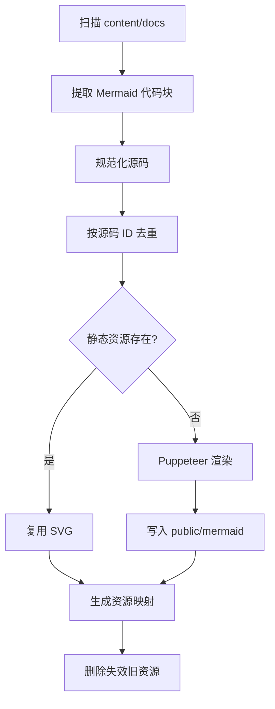

> [!DETAILS-AI] 本章 AI 摘要
> Mermaid 图表在构建期由 Puppeteer 预渲染为去重静态 SVG，浏览器正常路径不加载 Mermaid 运行时；客户端只负责视图切换、缩放、拖拽与最大化。性能策略集中在 Server-first、按需加载、离屏延迟绘制与客户端边界控制。设计系统与无障碍降级独立成 [专题](./design-system) 说明。

## 一、构建期优先的渲染策略

Mermaid 需要解析语法、计算图布局、测量文字并生成 SVG。若每位读者打开页面时都重复这些工作，会带来：

- Mermaid 与布局引擎的 JavaScript 下载；
- 长文档中多张图表同时解析的 CPU 峰值；
- 字体未就绪时的错误测量与二次布局；
- 图表出现前的骨架等待；
- 移动设备更明显的交互卡顿。

项目因此采用"构建期优先，运行时兜底"：发布前生成可以直接展示的 SVG，浏览器只有在静态资源缺失时才动态导入 Mermaid。

## 二、静态资源生成

`scripts/generate-mermaid-assets.ts` 在 `bun dev` 与 `bun run build` 之前自动执行，也可以通过 `bun run generate:mermaid` 单独运行。



### 稳定身份与缓存

`src/features/mermaid/asset-id.ts` 根据规范化 Mermaid 源码生成 source ID。最终文件名由全部渲染输入（Mermaid 浏览器 bundle、度量样式 `styles.css` 与共享配置）的内容哈希构成，任一输入变化都会自动产生新文件名，无需手工维护版本号，因此：

- 相同源码只生成一份资源；
- 未变化图表可以跨构建复用；
- Mermaid 升级、样式或影响测量的配置变化会自动重新渲染；
- 不再被任何内容引用的 SVG 可以安全清理。

`src/features/mermaid/generated/assets.ts` 是 source ID 到文件名的只读映射，由脚本生成，不应手工编辑。

### 与站点样式一致

生成脚本通过 Puppeteer 加载项目 Mermaid 配置、字体和 `src/features/mermaid/styles.css`。影响节点尺寸的样式在 Mermaid 测量阶段就生效，避免先用默认字体布局、再在站点中套样式造成裁剪。

渲染结果保留 Mermaid 图型自身的 `viewBox`，只有实际内容越界时才扩展边界。通用测量不会覆盖 `gitGraph` 等专用图型的布局。

## 三、浏览器渲染路径

`src/features/mermaid/hooks/use-mermaid-render.ts` 先查询静态资源映射：

1. 找到资源时直接加载 SVG；
2. 资源未到达视口附近时延迟非必要工作（`MERMAID_RENDER_ROOT_MARGIN = '1200px 0px'`，提前提升优先级）；
3. 静态资源缺失时进入调度器；
4. 调度器按优先级动态导入 Mermaid，并复用已经生成的结果。

共享空闲调度器 `mermaid-render-scheduler` 仅在源码变化时重新渲染。正常发布路径不会让浏览器下载 Mermaid / Dagre。运行时兜底用于开发偏差、资源部署不同步或异常缺失，不是默认渲染方式。

## 四、画布交互如何分层

单张 `Mermaid` 图表把能力拆到独立 Hook：

| Hook | 职责 |
| :--- | :--- |
| `useMermaidRender` | 静态资源与运行时兜底 |
| `useFitCanvasScale` | 按容器宽高计算自动适配 |
| `useZoomAndPan` | 用户缩放、拖拽与边界 |
| `useMermaidViewMode` | 渲染 / 源码视图偏好 |
| `useMermaidMaximize` | Portal 最大化、焦点和退出 |

自动适配和用户缩放是两套比例。大图可能先缩小以完整进入正文，但工具栏仍把这个适配结果视为 `100%`；用户随后放大、缩小或重置时，只操作内部画布。这避免"页面为了容纳大图自动缩小，工具栏一打开就显示 63%"之类的语义混乱。

### 拖拽性能优化

拖拽期间绕过 React 调度，直接操作 DOM：

- `pointerDown` 时缓存 `.mermaid-zoom-target` 元素引用；
- 移除 RAF 节流逻辑；
- `pointerMove` 中直接更新 CSS 变量（`--mermaid-pan-x/y`），立即应用 transform；
- 仅在拖拽结束时同步一次 React state。

这避免了每帧 React 调度和 reconciliation 的开销。捏合缩放冲突时，会先同步 pending pan 位置再切换状态。

### 页面内与最大化

- 页面内图表允许按钮缩放、拖拽和重置，但滚轮继续滚动文章；
- 最大化后，滚轮以指针位置为锚点缩放图表；
- `Esc` 退出最大化并恢复焦点；
- 源码视图使用自己的滚动区域，不把长源码撑高整个页面；
- 快捷键 `v` 只在图表区域获得焦点且不处于输入控件时切换视图。

## 五、工具栏与无障碍

工具栏按"视图、缩放、画布操作"分组，按钮状态来自图表实际能力：

- 达到缩放边界时禁用对应按钮；
- 只有平移或缩放偏离基线时才允许重置；
- 最大化按钮在弹层中切换为还原；
- 所有可见文案、Tooltip 与 `aria-label` 来自 locale 字典；
- 键盘操作和焦点恢复不依赖鼠标；
- 减少动态效果偏好会降低过渡与粒子反馈。

工具栏水平约束在 mermaid wrapper 边界内，使用 `minLeft` 与 `maxLeft` 计算防止溢出。Portal 工具栏额外设置 `max-width: calc(100vw - 1rem)` 防止极窄视口溢出。

图表、代码视图和工具栏共享内容尺寸，但不共享不必要的交互状态。退出最大化、切换页面或组件卸载时会清理监听器、Portal、RAF 和临时状态。

## 六、视图切换与最大化

### 视图切换

- 渲染视图与源码视图使用条件渲染（仅挂载活动视图），避免双层交叉淡入淡出闪烁；
- 切换时使用 fade-in 动画（无交叉淡出）；
- 源码视图 `max-height: 28rem`，使用沉浸式滚动条（默认隐藏，hover / focus 出现）；
- 源码视图 `padding-bottom: 3.5rem` 避免工具栏遮挡内容；
- 全屏源码视图 `max-width: 60rem`，`margin-inline: auto` 居中显示。

### 最大化

- 最大化使用 Portal 挂到 `document.body`；
- 动画仅使用 opacity 过渡（不使用 scale），避免复杂 SVG 与 backdrop-filter 的重绘闪烁；
- 退出最大化立即执行（无延迟与退出动画），避免感知延迟；
- 滚动条移除 transition，避免不可靠的动画闪烁。

## 七、性能策略

### 让正文先出现

- 文档页面和大多数 MDX 外壳保持服务端渲染；
- Mermaid、搜索索引与路由数据尽可能构建期生成；
- Giscus、Mermaid 兜底等重型能力按需加载；
- 离屏高成本 MDX 区块使用浏览器 containment 延迟布局和绘制；
- `DocsCommunity` 与正文隔离，iframe 高度变化不触发正文内部布局。

### 控制持续工作

- 持续动画优先使用 `transform` 与 `opacity`；
- 首页环境效果复用共享时钟和帧率预算；
- 指针移动和拖拽事件按帧合并；
- 粒子按批次写入 DOM，不在每个原始事件中立即更新；
- 页面离开或组件卸载时清理 Timer、RAF、Observer、监听器和临时节点。

### 控制客户端边界

项目不因为某个任务复选框或复制按钮，把整个文档页面声明为 `"use client"`。交互状态保持在最小组件内，能从 Props、DOM、URL 或内容源推导的数据不重复进入 React State。

## 八、移动端降级

移动端优先保证正文宽度、导航可达和触控目标：

- 大面积环境效果和持续粒子降低密度或关闭；
- 图表先完整适配容器，复杂操作可以进入最大化；
- 工具栏保持紧凑分组，不依赖 Hover 才能完成操作；
- 评论 iframe 使用自然高度，避免嵌套滚动；
- 侧栏、目录与页面操作在小屏使用对应触发器。

`prefers-reduced-motion` 会关闭非必要位移和持续动画；减少透明度偏好会让玻璃表面回退到更实的背景。降级只减少装饰与过渡，不移除正文、焦点、按钮标签或关键状态。无障碍降级的完整规则见 [设计系统与主题](./design-system#七、无障碍降级)。

## 九、构建与排查

修改 Mermaid 源码、数量、主题测量样式或渲染配置后，应运行：

```bash
bun run generate:mermaid
```

并检查：

- 控制台中的生成、复用和清理数量；
- `public/mermaid/` 新增与删除是否符合内容变化；
- `src/features/mermaid/generated/assets.ts` 是否只包含生成映射；
- 浅色 / 深色下节点、标签和边界是否完整；
- 大图、小图、源码视图与最大化操作是否正常。

较大变更继续运行 `bun run build`，确保 Puppeteer 生成、Fumadocs 编译和静态导出在同一生产管线中通过。

## 十、关键文件

| 文件 | 职责 |
| :--- | :--- |
| `scripts/generate-mermaid-assets.ts` | 扫描、去重、渲染与清理 |
| `src/features/mermaid/asset-id.ts` | 稳定源码 ID |
| `src/features/mermaid/generated/assets.ts` | 静态资源映射 |
| `src/features/mermaid/components/mermaid.tsx` | 图表外壳与工具栏 |
| `src/features/mermaid/hooks/use-mermaid-render.ts` | 静态资源与兜底 |
| `src/features/mermaid/hooks/use-fit-canvas-scale.ts` | 自动适配 |
| `src/features/mermaid/hooks/use-zoom-and-pan.ts` | 画布交互 |
| `src/features/mermaid/styles.css` | 图表主题 |
