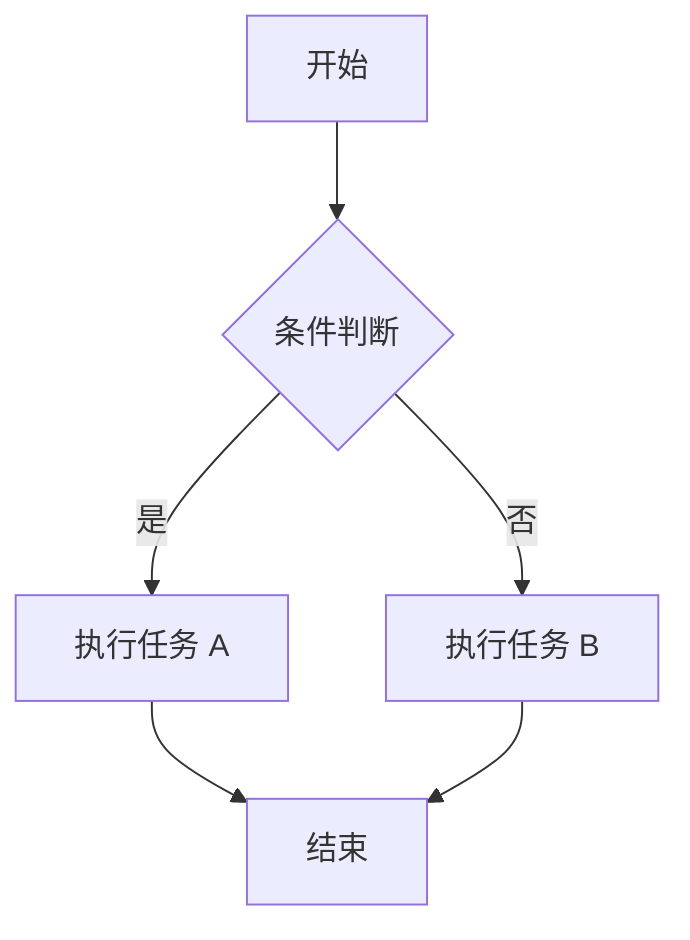
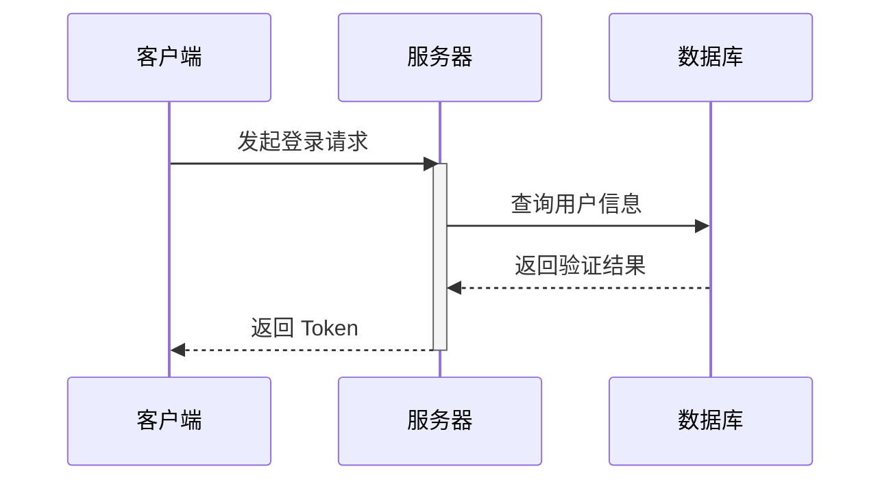
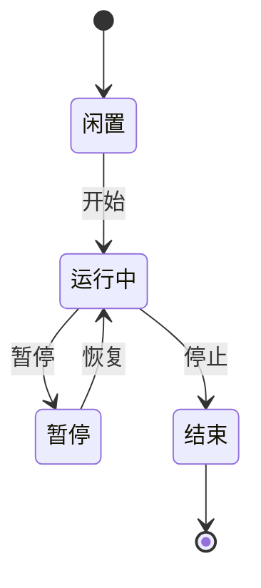

本文档按功能分类展示本项目支持的 Markdown 写法。基础内容适合日常文档编写，项目增强语法适合需要提示框、折叠块、代码标题、数学公式或图表的页面。

## 语法速查

| 分类 | 语法能力 | 适用场景 |
| :--- | :--- | :--- |
| [基础 Markdown](#1-基础-markdown) | [标题与段落](#11-标题与段落)、[文本强调](#12-文本强调与换行)、[列表](#14-列表)、[链接与图片](#15-链接图片与分隔线)、[行内代码](#13-行内代码)、[分隔线](#15-链接图片与分隔线) | 普通正文结构 |
| [GFM 扩展](#2-github-flavored-markdown) | [任务列表](#21-任务列表)、[表格](#22-表格)、[删除线](#23-删除线)、[引用](#24-引用) | 协作说明与结构化信息 |
| [项目增强](#3-项目增强语法) | [GitHub Alert 提示框](#31-github-alert-提示框)、[基础可折叠块](#32-基础可折叠块)、[语义可折叠块](#33-语义可折叠块) | 提示、补充说明、摘要内容 |
| [代码块与文件层级](#4-代码块与文件层级) | [语法高亮](#41-基础代码块)、[文件路径标题栏](#42-文件路径标题栏)、[无路径代码块](#43-无文件路径代码块)、[文件层级](#44-文件层级)、复制按钮 | 代码示例、配置片段与目录结构 |
| [数学与图表](#5-latex-公式) | [LaTeX 公式](#5-latex-公式)、[Mermaid 流程图](#61-流程图)、[时序图](#62-时序图)、[状态图](#63-状态图) | 公式、流程图、时序图、状态图 |

## 1. 基础 Markdown

### 1.1 标题与段落

文档页标题来自 frontmatter 的 `title` 字段，正文标题建议从 `##` 开始，保持页面目录结构清晰。

```md
## 二级标题

普通段落之间使用空行分隔。

### 三级标题

继续编写正文内容。
```

### 1.2 文本强调与换行

*斜体文字*

**粗体文字**

***粗斜体文字***

```md
*斜体文字*

**粗体文字**

***粗斜体文字***

需要强制分隔内容时，优先拆成独立段落或列表项。
```

### 1.3 行内代码

在正文中引用命令、变量、文件名或短代码片段时，使用反引号包裹，例如 `bun run check`、`src/app/globals.css`、`console.log()`。

```md
运行 `bun run check` 完成格式化与检查。
```

### 1.4 列表

无序列表适合并列信息，有序列表适合步骤说明。

```md
* 安装依赖
* 启动开发服务器
  * 默认地址为 `http://localhost:3000`

1. Fork 仓库
2. 创建功能分支
3. 提交 Pull Request
```

### 1.5 链接、图片与分隔线

```md
[SSJ 的博客](https://blog.shenshijun.space/)


---
```

---

## 2. GitHub Flavored Markdown

### 2.1 任务列表

* [x] 完成需求分析
* [x] 编写示例文档
* [ ] 提交 Pull Request

```md
* [x] 完成需求分析
* [x] 编写示例文档
* [ ] 提交 Pull Request
```

### 2.2 表格

| 特性 | 支持度 | 备注 |
| :--- | :---: | ---: |
| 表格 | 完整 | 支持左、中、右对齐 |
| 任务列表 | 完整 | 使用 GFM 写法 |
| 删除线 | 完整 | 使用 `~~文字~~` |

```md
| 特性 | 支持度 | 备注 |
| :--- | :---: | ---: |
| 表格 | 完整 | 支持左、中、右对齐 |
```

### 2.3 删除线

这是一段 ~~被删除的文本~~。

```md
这是一段 ~~被删除的文本~~。
```

### 2.4 引用

> 这是一级引用。
> > 这是嵌套引用。
> > **提示：** 引用块中也可以使用强调、链接与行内代码。

```md
> 这是一级引用。
> > 这是嵌套引用。
```

## 3. 项目增强语法

### 3.1 GitHub Alert 提示框

提示框适合突出补充信息、建议、重要上下文、风险提醒或危险操作。标记后同一行的文本会作为自定义标题显示，例如 `[!INFO] 自定义标题`。

> [!NOTE]
> 注记：提供补充信息。

> [!TIP]
> 提示：提供建议或快捷方法。

> [!IMPORTANT]
> 重要：突出关键上下文。

> [!WARNING]
> 警告：提醒需要小心操作。

> [!CAUTION]
> 危险：告知可能造成破坏性后果的操作。

> [!INFO] 自定义标题
> `INFO` 可用于一般信息提示，标题会替换默认类型文字。

```md
> [!NOTE]
> 注记：提供补充信息。

> [!WARNING]
> 警告：提醒需要小心操作。

> [!INFO] 自定义标题
> `INFO` 可用于一般信息提示，标题会替换默认类型文字。
```

### 3.2 基础可折叠块

可折叠块适合隐藏补充说明、进阶内容或较长注释。

> [!DETAILS] 折叠说明
> 这是一个默认折叠的详情块。读者可以按需展开查看。

> [!DETAILS+] 默认展开的折叠说明
> 在 `DETAILS` 后追加 `+`，即可让折叠块默认展开。

```md
> [!DETAILS] 折叠说明
> 这是一个默认折叠的详情块。

> [!DETAILS+] 默认展开的折叠说明
> 在 `DETAILS` 后追加 `+`，即可让折叠块默认展开。
```

### 3.3 语义可折叠块

语义折叠块使用 `[!DETAILS-XXX]` 写法，标题行可以直接跟在标记后面。

| 语法 | 默认标题 | 用途 |
| :--- | :--- | :--- |
| `[!DETAILS-FAQ]` | 常见问题 | 提问类内容 |
| `[!DETAILS-ANSWER]` | 答案 | FAQ 的回答 |
| `[!DETAILS-EXAMPLE]` | 示例 | 代码或用法示例 |
| `[!DETAILS-HINT]` | 提示 | 快捷技巧 |
| `[!DETAILS-AI]` | AI 摘要 | AI 生成摘要 |

#### 常见问题与答案

> [!DETAILS-FAQ] 什么是 Neoverse？
> Neoverse 是一个面向未来的文档平台，致力于提供优雅的文档阅读体验。

> [!DETAILS-ANSWER] 如何参与贡献？
> 你可以通过提交 Pull Request、报告 Issue 或改进文档来参与项目贡献。

#### 示例与提示

> [!DETAILS-EXAMPLE] 使用折叠块组织代码示例
> 可以将较长代码示例放入折叠块中，让读者按需展开查看。
>
> ```cpp
> // src/example.cpp
> #include <iostream>
> int main() {
>     std::cout << "Hello, Neoverse!" << std::endl;
>     return 0;
> }
> ```

> [!DETAILS-HINT] 快捷键技巧
> 使用 `Ctrl + K` 可以快速打开搜索对话框。

#### AI 摘要

AI 摘要折叠块适合放置 AI 生成的摘要内容。展开后，正文会以打字机效果分批显示；当可打字字符数达到 `360` 时会进入中等长度速度档，达到 `900` 时会进入长内容速度档，避免读者等待过久。

> [!DETAILS-AI] AI 生成摘要
> 这类折叠块适合放置 AI 生成的摘要内容。展开后，正文会按短片段逐渐显示，并且光标会跟随最新生成的文字移动。

```md
> [!DETAILS-AI] AI 生成摘要
> 这里填写 AI 生成的摘要正文。
```

## 4. 代码块与文件层级

### 4.1 基础代码块

代码围栏请带上语言标识，以便启用语法高亮。

```javascript
// src/utils/helper.js
export function greet(name) {
  return `Hello, ${name}!`;
}
```

````md
```javascript
// src/utils/helper.js
export function greet(name) {
  return `Hello, ${name}!`;
}
```
````

### 4.2 文件路径标题栏

代码块顶部的文件路径注释会被自动提取到标题栏，并从正文代码中移除。

| 语言类型 | 支持的顶部注释 |
| :--- | :--- |
| JavaScript / TypeScript / C++ | `// src/example.ts` |
| CSS | `/* src/styles/example.css */` |
| Shell / Python | `# scripts/example.sh` |
| HTML | `<!-- public/index.html -->` |

```typescript
// src/components/Button.tsx
type ButtonProps = {
  label: string;
};

export function Button({ label }: ButtonProps) {
  return <button type="button">{label}</button>;
}
```

### 4.3 无文件路径代码块

不带顶部文件路径注释的代码块也会正常高亮，只是不显示路径标题。

```css
.container {
  display: flex;
  align-items: center;
  justify-content: center;
  padding: 20px;
}
```

### 4.4 文件层级

使用 `Files`、`Folder` 和 `File` 组件展示目录结构，避免用字符手动画树形层级。需要默认展开的目录添加 `defaultOpen`，没有子项的目录添加 `disabled`。

<Files>
  <Folder name="app" defaultOpen>
    <Folder name="api" defaultOpen>
      <File name="route.ts" />
    </Folder>
    <File name="layout.tsx" />
    <File name="page.tsx" />
  </Folder>
  <File name="package.json" />
</Files>

```mdx
<Files>
  <Folder name="app" defaultOpen>
    <Folder name="api" defaultOpen>
      <File name="route.ts" />
    </Folder>
    <File name="layout.tsx" />
    <File name="page.tsx" />
  </Folder>
  <File name="package.json" />
</Files>
```

## 5. LaTeX 公式

### 5.1 行内公式

行内公式写在 `$...$` 中，例如勾股定理 $a^2 + b^2 = c^2$。

```md
行内公式写在 `$...$` 中，例如勾股定理 $a^2 + b^2 = c^2$。
```

### 5.2 块级公式

块级公式写在独立的 `$$...$$` 中，适合展示推导或重点公式。

$$
\int_{-\infty}^{\infty} e^{-x^2}\,dx = \sqrt{\pi}
$$

```md
$$
\int_{-\infty}^{\infty} e^{-x^2}\,dx = \sqrt{\pi}
$$
```

## 6. Mermaid 图表

### 6.1 流程图



### 6.2 时序图



### 6.3 状态图


