> [!DETAILS-AI] 本节 AI 摘要
> 本节介绍 Mermaid 图表工具：流程图（Flowchart）、时序图（Sequence）、类图（Class）、状态图（State）、实体关系图（ER）、Git 图（Git Graph）、甘特图（Gantt）、饼图（Pie）、思维导图（Mindmap）与时间轴（Timeline）等常用类型的语法与用法，并总览其余类型。学完能用纯文本绘制各类结构化图表，配合 Markdown 写出图文并茂的文档。

> [!INFO]
> [Mermaid](https://mermaid.js.org/) 使用文本语法描述图表结构，由渲染器生成图形。图表源码可以与 Markdown 一起进入版本控制，结构变化也能通过文本差异审查。配合 [1.8 Markdown](/zh/docs/ch1/1.8-Markdown) 使用，可以在文档中维护流程、交互与状态关系；数学公式与版式文档则可参考 [1.9 LaTeX](/zh/docs/ch1/1.9-LaTeX)。

## 一、Mermaid 是什么

Mermaid 是一种用文本描述图表的工具：通过 `flowchart`、`sequenceDiagram` 等关键字，用纯文本定义流程、时序、类结构等图表，再由渲染器生成对应的图形。图表源文件就是普通文本，通常直接写在 Markdown 的代码块里。

正因为图表用文本描述，相比用画图软件（Visio、draw.io）拖拽，它有几个天然优势：

- **纯文本**：能写进 Markdown，用 Git 管理版本
- **可维护**：改图只需改文本，不用重新截图
- **可搜索**：图表内容能被 grep 到
- **便于复用**：GitHub、GitLab 与许多文档工具都能渲染常见图表

> [!INFO] Mermaid 的定位
> Mermaid 适合表达流程、交互、关系和状态等结构化信息。需要精确控制布局、自由绘制或制作 UI 草图时，draw.io、Excalidraw 等画布工具通常更合适；结构清晰的架构关系仍可使用 Mermaid。

## 二、在 Markdown 中使用

把 Mermaid 代码放在 ` ```mermaid ` 代码块里即可：

````markdown
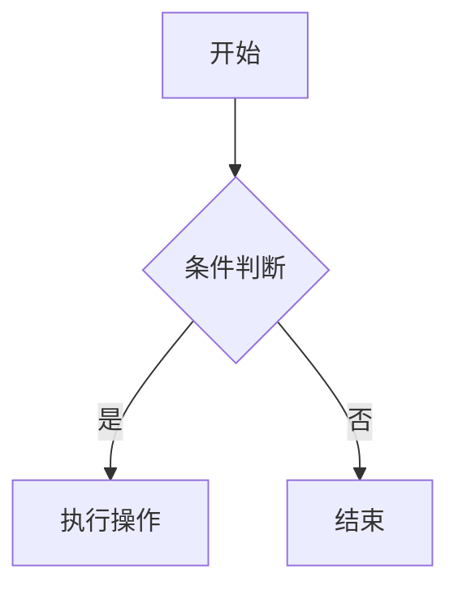
````

效果：


> [!TIP] 渲染支持
> 本项目文档站点和 GitHub 支持 Mermaid；VS Code 的内置预览能力及扩展配置可能不同。如果图表无法渲染，先检查代码块语言，再确认目标平台支持当前的图表类型和语法版本。

Mermaid 提供二十余种图表类型，常用类型见下表：

| 图表类型 | 关键字 | 主要用途 |
| :--- | :--- | :--- |
| 流程图 | `flowchart` | 流程、决策与步骤 |
| 时序图 | `sequenceDiagram` | 对象间的消息交互顺序 |
| 类图 | `classDiagram` | 面向对象的类结构与类关系 |
| 状态图 | `stateDiagram-v2` | 状态转换与状态机 |
| 实体关系图 | `erDiagram` | 数据库实体与关系 |
| Git 图 | `gitGraph` | 提交历史、分支与合并 |
| 甘特图 | `gantt` | 项目计划与时间进度 |
| 饼图 | `pie` | 单项占比展示 |
| 思维导图 | `mindmap` | 主题层级拆解与头脑风暴 |
| 时间轴 | `timeline` | 按时间顺序的事件 |
| 用户旅程图 | `journey` | 用户交互流程与体验 |
| 象限图 | `quadrantChart` | 四象限定位与对比 |

上表之外还有需求图（Requirement）、C4 架构图、ZenUML、Sankey、XY 图表、看板（Kanban）等面向特定领域的类型，本文档中较少涉及。下面逐一介绍常用类型。

## 三、流程图（Flowchart）

流程图是最常用的图表类型，用来表示流程、决策、步骤。

### 3.1 方向

| 关键字 | 方向 |
| :--- | :--- |
| `TB` / `TD` | 从上到下（Top to Bottom） |
| `BT` | 从下到上 |
| `LR` | 从左到右 |
| `RL` | 从右到左 |

### 3.2 节点形状

不同括号表示不同的形状：

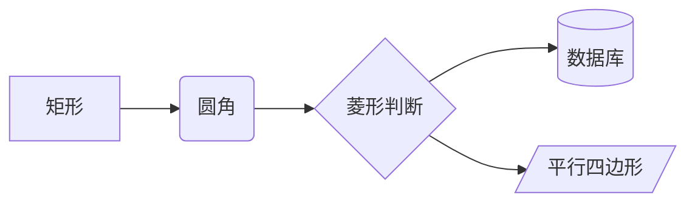

| 语法 | 形状 | 常用场景 |
| :--- | :--- | :--- |
| `A[文字]` | 矩形 | 普通步骤 |
| `A(文字)` | 圆角矩形 | 开始 / 结束 |
| `A{文字}` | 菱形 | 条件判断 |
| `A[(文字)]` | 圆柱 | 数据库 |
| `A[/文字/]` | 平行四边形 | 输入 / 输出 |
| `A((文字))` | 圆形 | 连接点 |

### 3.3 连线

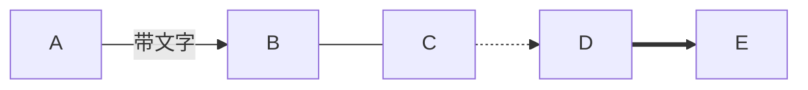

| 语法 | 样式 |
| :--- | :--- |
| `-->` | 实线箭头 |
| `---` | 实线无箭头 |
| `-.->` | 虚线箭头 |
| `==>` | 粗线箭头 |
| `-->\|文字\|` | 带标签的箭头 |

### 3.4 子图

用 `subgraph` 把相关节点分组：

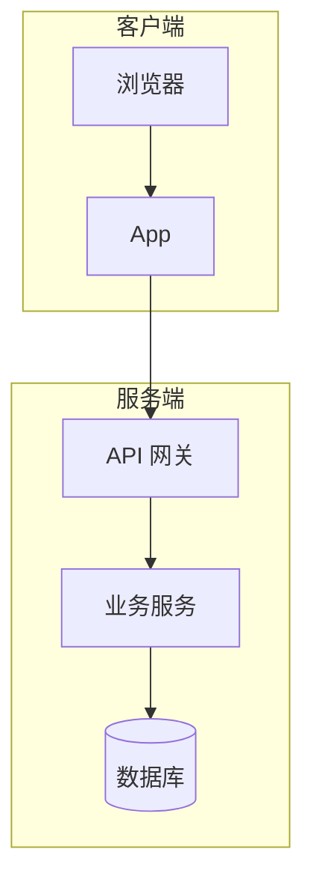

## 四、时序图（Sequence Diagram）

时序图描述多个对象之间的消息交互与先后顺序，适合表达 API 调用、请求-响应流程：

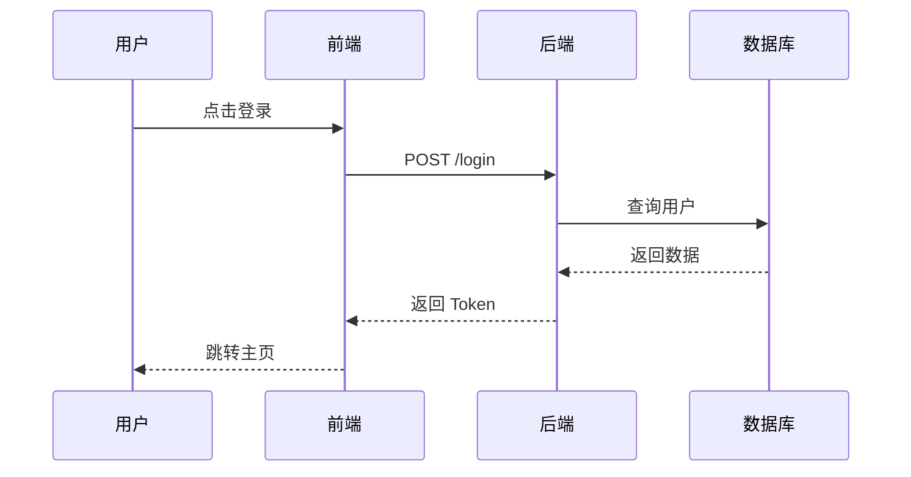

### 4.1 消息类型

| 语法 | 含义 |
| :--- | :--- |
| `A->>B:` | 实线实心箭头，常用于发送消息 |
| `A-->>B:` | 虚线实心箭头，常用于响应返回 |
| `A-)B:` | 实线开放箭头，可用于异步 |
| `A--xB:` | 虚线末段带叉，可用于失败或终止 |

### 4.2 添加备注

用 `Note over` 给一段交互添加说明：

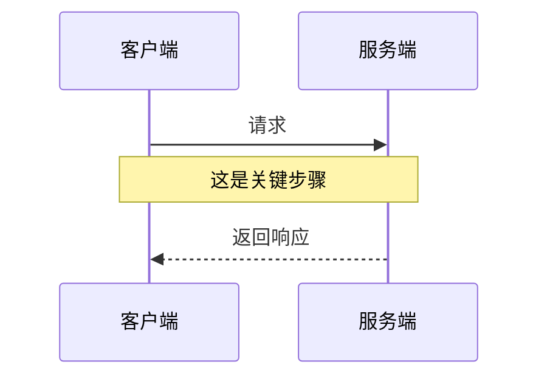

类图可用于描述面向对象设计的类型成员与类之间的关系。

## 五、类图（Class Diagram）

用于描述对象的类结构、字段、方法以及类与类之间的关系：

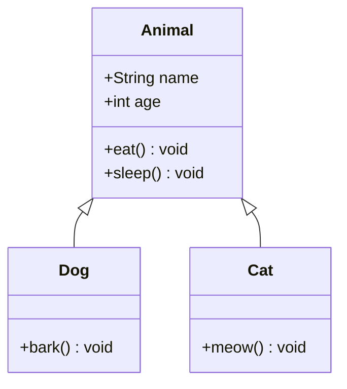

### 5.1 关系符号

| 语法 | 含义 |
| :--- | :--- |
| `\<\|--` / `--\|>` | 泛化 / 继承（实线空心三角） |
| `*--` | 组合（实线实心菱形） |
| `o--` | 聚合（实线空心菱形） |
| `-->` | 单向关联（实线箭头） |
| `..\|>` | 实现（虚线空心三角） |

Mermaid 还提供甘特图、饼图和状态图，分别适合表达计划、占比和状态转换。

## 六、甘特图（Gantt）

甘特图适合做项目计划、安排时间线：

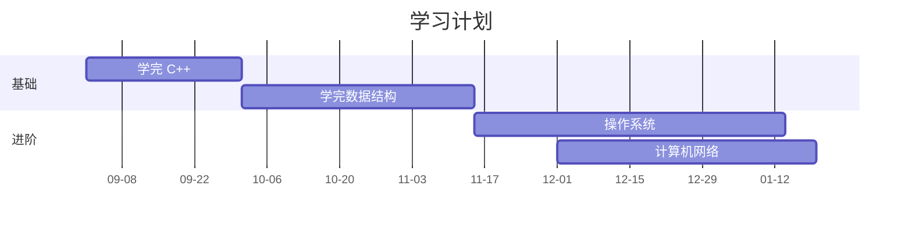

> [!TIP] 甘特图的实用场景
> 甘特图不只是“项目管理工具”，也适合规划自己一学期的学习进度。把课程、实验、复习时间画成甘特图，能直观看到哪段时间任务最重，提前预留时间。

## 七、饼图（Pie）

用于展示每个部分在整体中的占比：

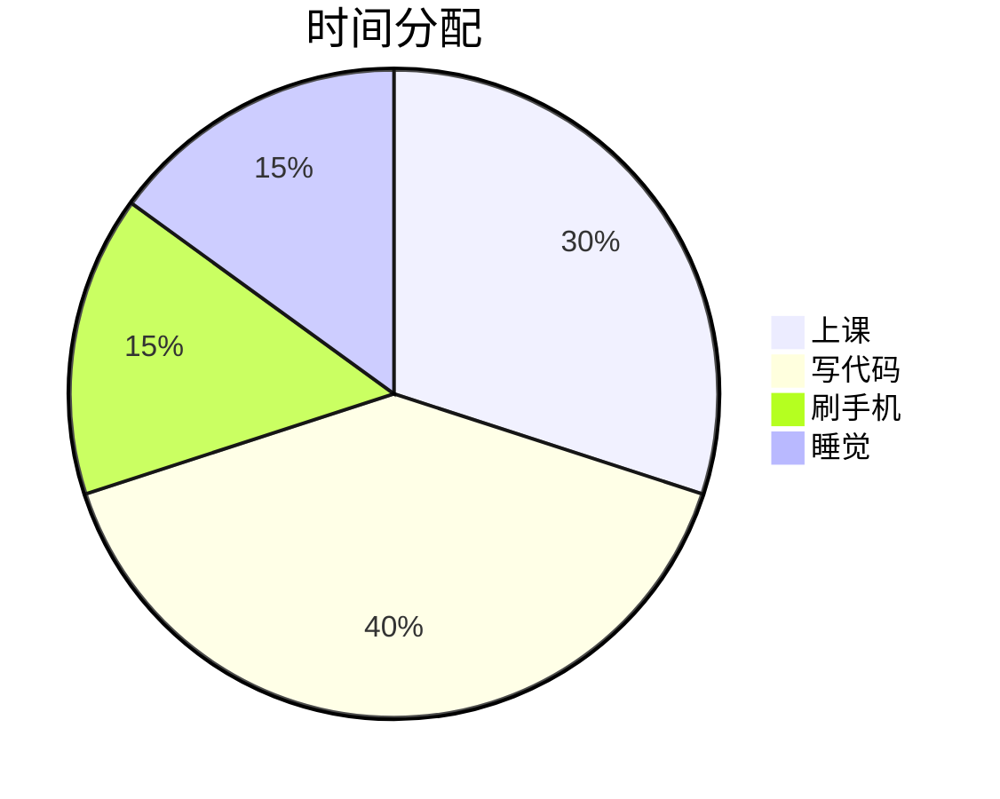

## 八、状态图（State Diagram）

用于描述对象的状态转换，适合表达协议、状态机等：

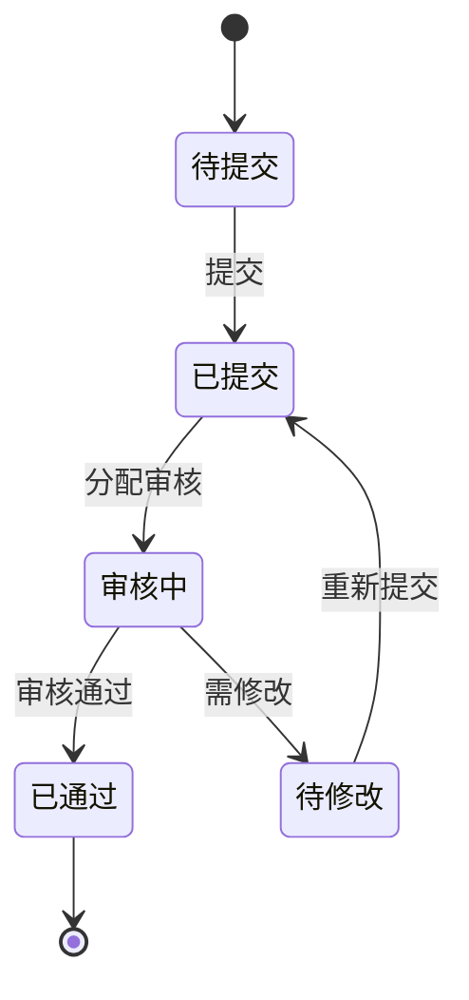

## 九、其他图表类型

除了前面介绍的高频类型，Mermaid 还有几类同样会用到的高频图表。

### 9.1 实体关系图（Entity Relationship，ER 图）

描述实体（如数据库表）以及实体之间的数量关系，数据库课程中常用：

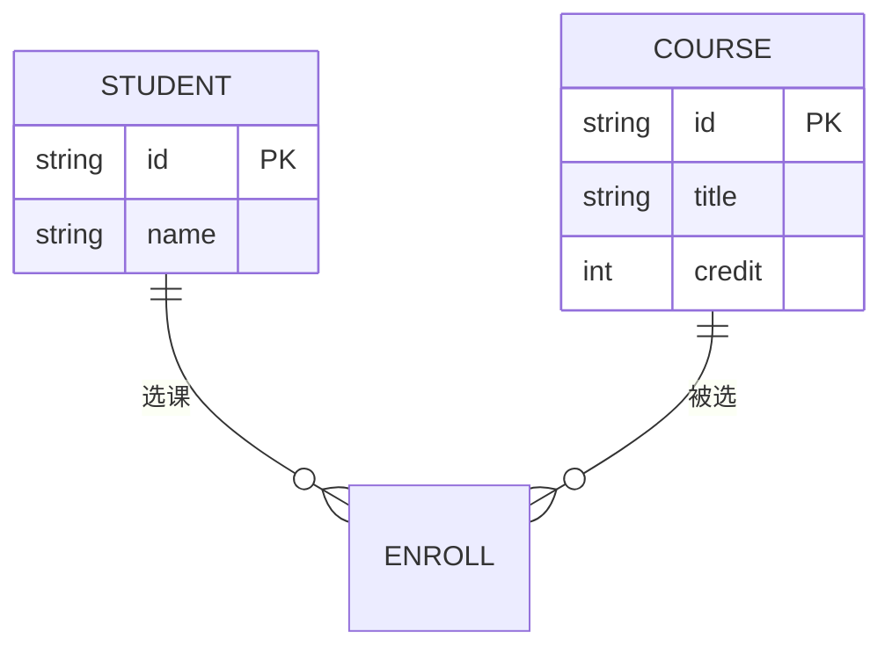

连线两端的符号表示数量约束：`||` 表示恰好一个，`o{` 表示零个或多个，连起来读作“一个学生可以选择多门课程、一门课程可以被多名学生选择”。实体属性写在花括号内，`PK` 表示主键。

### 9.2 Git 图（Git Graph）

用提交、分支与合并直观展示仓库历史，可配合 [1.15 版本控制与 Git](/zh/docs/ch1/1.15-Version-Control-Git) 一起阅读：

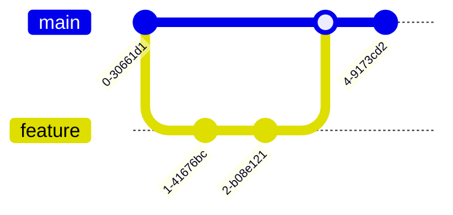

### 9.3 思维导图（Mindmap）

从中心主题逐层展开，适合梳理知识体系、整理学习笔记：

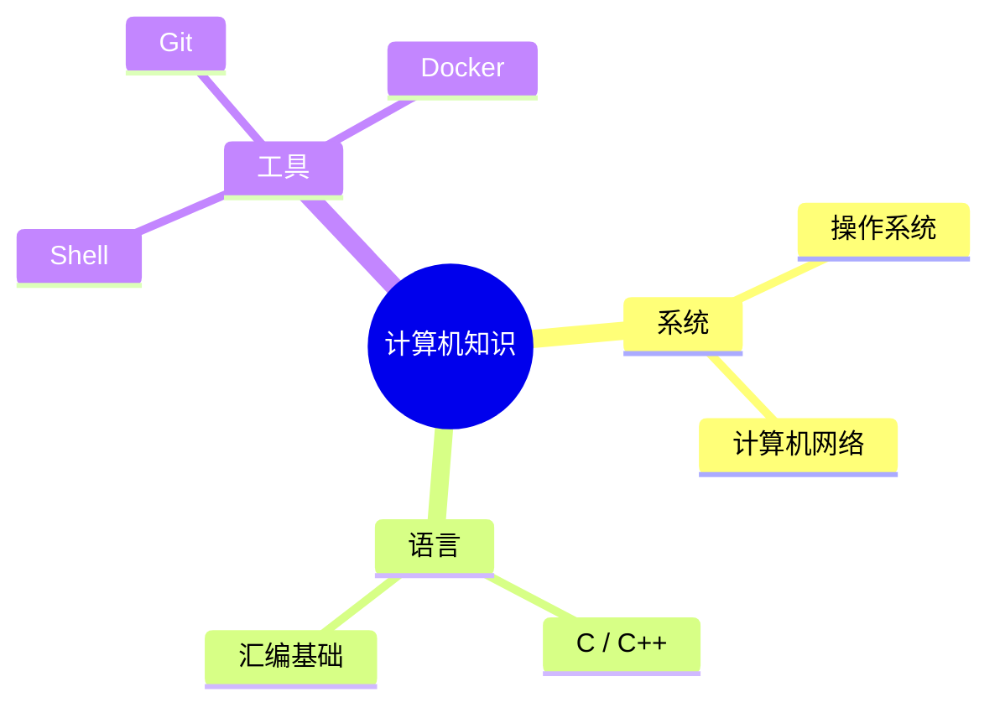

### 9.4 时间轴（Timeline）

按时间顺序排列事件，适合课程计划、项目里程碑与个人记录：

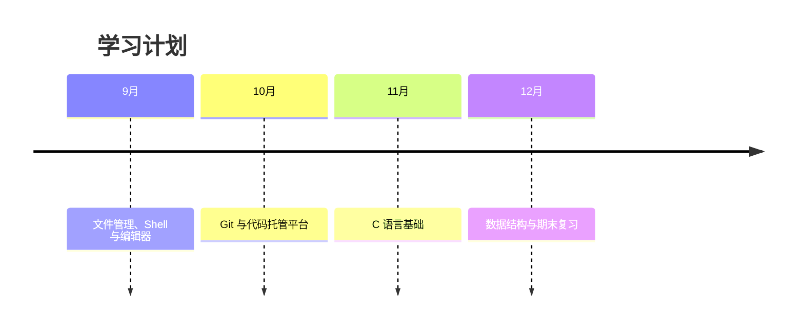

上面这些类型已经覆盖日常学习与工作中的绝大多数场景，其余面向特定领域的类型用到时再查阅官方文档即可。掌握常用类型之后，再了解几个实用技巧，会让图表更专业。

## 十、实用技巧

### 10.1 节点 ID 与文字分离

节点可以用 `id[文字]` 的形式定义，后续引用只需写 `id`，不必重复文字：

```text
flowchart TD
    A[开始] --> B[处理]
    B --> A
```

### 10.2 注释

用 `%%` 写注释，不会渲染到图中：

```text
flowchart TD
    %% 这是注释，不会显示在图中
    A --> B
```

### 10.3 样式定制

可以用 `classDef` 定义样式，再通过 `:::` 应用到节点：

```text
flowchart LR
    A:::highlight --> B
    classDef highlight stroke-width:3px
```

具体颜色要同时检查浅色与深色主题；若发布平台提供主题变量或站点级样式，应优先复用，避免节点说明与背景失去对比度。

### 10.4 避免图表过于复杂

> [!CAUTION] 控制图表复杂度
> 图表是否易读，取决于节点数量、连线交叉、标签长度和展示尺寸，并没有统一的节点上限。读者难以沿主线阅读时，应拆成多个小图、用子图分组，或省略与当前问题无关的分支。

## 十一、在线编辑与调试

| 工具 | 用途 |
| :--- | :--- |
| [Mermaid Live Editor](https://mermaid.live/) | 官方在线编辑器，实时预览，支持导出 PNG / SVG |
| VS Code + Markdown Preview Mermaid Support | 在编辑器中预览 Mermaid |
| GitHub | 原生支持，提交后自动渲染 |

> [!NOTE] 不必死记语法
> Mermaid 的语法与支持范围会随版本而变化。以 [官方文档](https://mermaid.js.org/intro/) 和目标平台的实际渲染结果为准；复杂图表可先在 [Mermaid Live Editor](https://mermaid.live/) 中验证。

## 十二、TODO 清单

- [ ] 能根据信息特点选择合适的图表类型（流程、交互、结构、状态、时间、占比等）
- [ ] 能写清节点文字与 ID，保持结构清晰
- [ ] 能对复杂图表进行拆分、精简，主线依旧清晰
- [ ] 能在 AI 辅助下，完成图表的绘制

## 十三、值得我们思考的问题

> [!DETAILS-FAQ] Mermaid 与手绘图表的区别是什么？
> 文本描述图表（如 Mermaid）与手绘图表的核心区别在于“可维护性”：文本可以进入版本控制、逐行 diff、被搜索和复用，也能通过脚本批量生成。
>
> 手绘图表的优势在于自由排版与细节控制，因此在结构化图表场景用 Mermaid、自由排版场景用 draw.io 或 Excalidraw，才是合理搭配。
