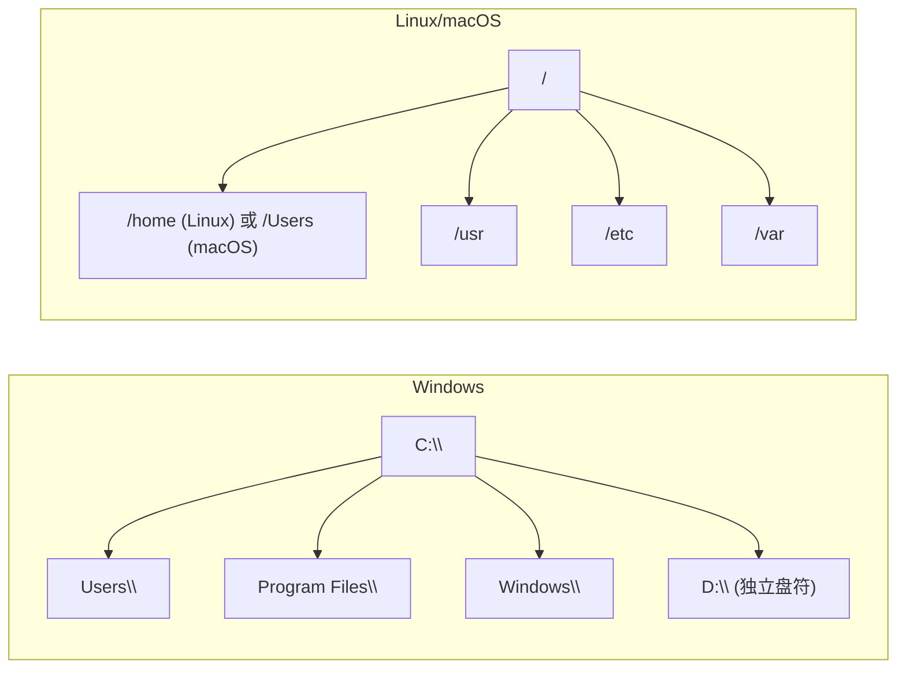
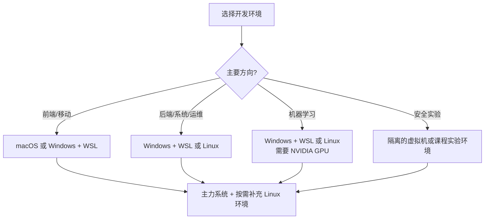

> [!DETAILS-AI] 本节 AI 摘要
> 本节从操作系统的职责出发，对比 Windows、Linux 与 macOS 三大系统，并介绍 Linux 内核与发行版的关系及常见发行版分类。学完能根据课程、工具链和部署环境选择合适方案。

> [!INFO]
> 日常使用中，操作系统的差异常体现在界面和软件生态；进入开发、部署与远程运维场景后，路径、权限、工具链和系统接口也会直接影响程序行为。

## 一、操作系统负责什么

操作系统（Operating System, OS）是管理计算机硬件与软件资源的程序。我们点鼠标、敲键盘、开软件，都要经过操作系统调度。

为什么要关心系统差异？至少这几个原因：

| 原因 | 说明 |
| :--- | :--- |
| 开发体验不同 | 同一段代码在不同系统上行为可能不同 |
| 部署环境不同 | Linux 广泛用于服务器与云平台，部署时经常需要接触 |
| 工具链不同 | 有些工具只在特定系统上有 |
| 课程需要 | 操作系统、计算机网络等课程会涉及 Linux |

> [!INFO] 开发环境的差异来自哪里
> 桌面、移动端、服务器和嵌入式设备的系统生态不同。开发者不必追求只用一种系统，但需要理解目标程序运行在哪个环境，以及文件系统、权限和工具链有哪些差异。

## 二、三大主流系统

### 2.1 Windows

Windows 拥有成熟的桌面软件、游戏和硬件生态，也可以通过 PowerShell、Windows Terminal 与 WSL 获得现代开发体验。

| 优点 | 注意事项 |
| :--- | :--- |
| 桌面软件与硬件兼容范围广 | 部分教程默认 Linux 命令和目录结构 |
| Visual Studio、Office 等工具集成成熟 | Windows 与 Linux 的权限、路径和换行规则不同 |
| WSL 可提供 Linux 开发环境 | 需要分清 Windows 与 WSL 中安装的工具 |

适合场景：日常使用、文档办公、桌面开发、游戏娱乐，以及配合 WSL 的跨平台开发。

### 2.2 Linux

Linux 是内核；Ubuntu、Debian、Fedora 等发行版在其上组合了系统工具、软件包和桌面环境。它广泛用于服务器、容器、嵌入式设备和开发环境。

| 优点 | 注意事项 |
| :--- | :--- |
| 命令行、自动化和服务器工具链成熟 | 不同发行版的软件包与配置方式可能不同 |
| 开源生态丰富，便于理解系统组成 | 某些商业桌面软件或硬件支持有限 |
| 容器与云端环境中常见 | 权限和系统配置错误同样会造成安全风险 |

适合场景：服务器、系统开发、云原生、嵌入式，以及操作系统课程实践。

### 2.3 macOS

macOS 运行在 Apple 硬件上，提供 Unix 用户空间和成熟的桌面体验；很多程序员也用它进行 Web、后端和日常开发，开发 Apple 平台应用时则需要 macOS 与 Xcode。

| 优点 | 注意事项 |
| :--- | :--- |
| Unix 命令行环境，常见开发工具易于使用 | 硬件与系统选择范围有限 |
| Apple 软硬件生态集成紧密 | 部分游戏、驱动和行业软件支持不同 |
| 适合 Apple 平台开发 | 默认文件系统通常不区分文件名大小写，仍需注意跨平台问题 |

适合场景：Apple 平台开发、设计剪辑、音乐创作与日常使用。

> [!TIP] 选型原则
> 系统选择取决于课程要求、目标平台、工具链和可用硬件。很多开发者会在桌面系统之外使用 Linux 服务器、容器、WSL 或虚拟机，但不必为了学习而同时维护所有环境。

## 三、Linux 发行版

Linux 不是一个单一系统，而是一系列基于 Linux 内核的发行版（Distribution，简称 distro）。下面按用途分为三类：桌面 / 入门、服务器、进阶 / 特殊用途。

### 3.1 桌面 / 入门

| 发行版 | 特点 | 适合 |
| :--- | :--- | :--- |
| Ubuntu | 社区与教程丰富，提供长期支持版本 | 第一次接触 Linux |
| Linux Mint | 基于 Ubuntu，默认桌面布局接近传统桌面系统 | 从 Windows 迁移 |
| Fedora | 发布节奏较快，较早提供新版本软件 | 想接触较新的 Linux 技术 |

### 3.2 服务器

| 发行版 | 特点 |
| :--- | :--- |
| Ubuntu Server | 云平台常见选项之一，文档与社区资源丰富 |
| Debian | Ubuntu 的上游发行版，重视稳定性与自由软件 |
| Rocky Linux / AlmaLinux | 与 RHEL 兼容的社区企业级发行版 |
| CentOS Stream | 位于 Fedora 与 RHEL 之间的持续交付发行版，并非已停止维护的 CentOS Linux 的直接替代版本 |
| Alpine | 使用 musl libc 与 BusyBox，体积较小，常用于容器；兼容性需要单独验证 |

### 3.3 进阶 / 特殊用途

| 发行版 | 特点 |
| :--- | :--- |
| Arch Linux | 滚动更新、高度可定制，Arch Wiki 资料丰富 |
| openSUSE | Leap 与 Tumbleweed 采用不同发布模式，管理工具完善 |
| Manjaro | 基于 Arch，提供图形化安装与独立的软件包发布节奏 |

> [!NOTE] 新手建议
> 初次学习可选择课程指定的发行版；没有要求时，Ubuntu LTS 通常资料较多。Kali Linux 面向安全测试场景，不适合作为普通入门桌面系统。

## 四、文件系统对比

三大系统的文件系统结构不同，理解差异有助于跨平台开发。

| 概念 | Windows | Linux / macOS |
| :--- | :--- | :--- |
| 根目录 | `C:\`（多盘符） | `/`（单一树） |
| 路径分隔符 | `\`（反斜杠） | `/`（正斜杠） |
| 用户目录 | `C:\Users\用户名` | `/home/用户名`（Linux） / `/Users/用户名`（macOS） |
| 大小写敏感 | 默认通常不敏感 | Linux 通常敏感；macOS 默认通常不敏感 |
| 可执行方式 | `.exe`、`.com` 等可执行格式及 `.bat`、`.cmd` 等脚本 | 可执行文件格式或解释器脚本配合执行权限；扩展名通常不是执行依据 |

> [!WARNING] 大小写陷阱
> Linux 文件系统通常区分大小写；Windows 和 macOS 的默认文件系统通常不区分。跨平台项目应统一命名规则，并确保导入路径与文件名的大小写完全一致。

> [!DETAILS-HINT] 路径转换小技巧
> 在 WSL 中访问 Windows 文件可用 `/mnt/c/` 前缀，例如 `C:\Users\用户名` 对应 `/mnt/c/Users/用户名`。在 Windows 资源管理器中，可通过 `\\wsl$` 或 `\\wsl.localhost` 访问 WSL 文件系统。跨系统访问前先确认当前命令运行在哪一侧。

## 五、系统选择建议

对许多使用 Windows 的同学，**Windows + WSL** 是维护成本较低的组合：

- 日常用 Windows（Office、游戏、通信软件）
- 开发用 WSL（Linux 环境，命令行强大）
- 一台机器兼顾两种世界

使用 macOS 的同学可以直接学习 Unix 命令行；需要验证 Linux 特有行为时，再使用容器、虚拟机或远程 Linux 环境。

## 六、TODO 清单

- [ ] 能说明操作系统、Linux 内核与 Linux 发行版的区别
- [ ] 能根据桌面、服务器、容器等环境和维护成本选择合适的发行版
- [ ] 能根据课程或项目要求选择 Windows、Linux 或 macOS 环境
- [ ] 能解释路径分隔符和文件名大小写带来的跨平台问题

## 七、值得我们思考的问题

> [!DETAILS-FAQ] 什么时候不该选择 WSL？
> 当实验依赖完整桌面、特定内核模块、复杂网络拓扑、严格隔离或与生产环境完全一致的系统配置时，虚拟机、实体机或云主机通常更合适。

> [!DETAILS-FAQ] 为什么服务器环境几乎都是 Linux？
> Linux 可按需要裁剪，拥有成熟的命令行、自动化、网络服务与容器生态，并得到云平台和服务器硬件的广泛支持。许多发行版可以自由获取，也有提供商业支持与认证的企业版本，因此常用于长期运行的服务器。
>
> 桌面端生态更多由软件与硬件兼容性决定，Windows 和 macOS 各有优势。理解“开发环境”与“部署环境”的差异，是选择系统组合的重要依据。
