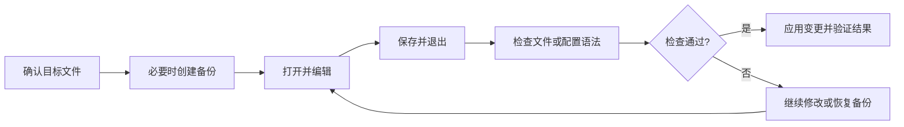
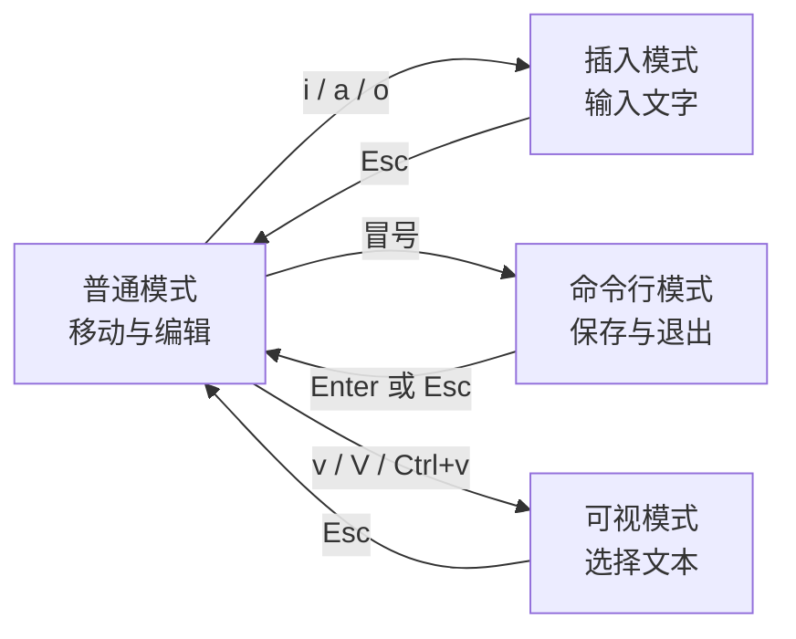

> [!DETAILS-AI] 本节 AI 摘要
> 本节以“打开、编辑、保存、退出、验证”为主线，介绍 `nano` 与 `Vim` 的基本操作，并用配置修改示例说明备份、语法检查和应用变更的顺序。

> [!INFO]
> 通过 `SSH` 登录服务器时，图形化远程开发工具不一定可用，终端编辑器却常能直接使用。修改配置、编写 Git 提交信息或查看临时脚本，都需要掌握最基本的打开、保存和退出操作。



> [!INFO] 前置知识
> 本节假设已经掌握路径、权限和常用 Shell 命令。如果还不熟悉，请先阅读 [1.12 Shell 基础](/zh/docs/ch1/1.12-Shell-Basics)。

> [!IMPORTANT] 先学会退出
> 第一次打开终端编辑器前，先记住退出方法：
>
> `nano` 使用 `Ctrl + X`。
>
> `Vim` 先按 `Esc` 回到普通模式，再输入 `:q`。

## 一、编辑器选择

`nano` 和 `Vim` 都能完成终端文本编辑，但学习成本和适用场景不同。

| 维度 | `nano` | `Vim` |
| :--- | :--- | :--- |
| 上手难度 | 低，底部会显示常用快捷键 | 较高，需要理解模式 |
| 适合场景 | 临时修改、初次接触终端编辑 | 频繁编辑、远程开发、键盘工作流 |
| 操作方式 | 接近普通文本编辑器 | 以普通、插入、命令行等模式协作 |
| 学习建议 | 先掌握保存、搜索和退出 | 先掌握最小命令集，再逐步扩展 |

> [!NOTE] 编辑器不一定已经安装
> 不同发行版和服务器镜像提供的工具不同。精简系统可能只有 `vi`，也可能没有 `nano` 或完整的 `Vim`。可先运行 `command -v nano`、`command -v vim` 和 `command -v vi` 检查。

## 二、`nano` 快速编辑

### 2.1 打开文件

`nano` 的界面直观，适合第一次接触终端编辑器的读者。

```bash
nano notes.txt
nano ~/.gitconfig
```

如果文件不存在，保存时会创建它；如果文件已经存在，`nano` 会加载原内容。

> [!WARNING] 谨慎编辑系统文件
> 只有在确认目标路径和改动内容后，才应使用管理员权限。编辑系统文件时优先考虑 `sudoedit /path/to/file`：它会在临时副本中编辑，再以管理员权限写回，能够减少编辑器本身以高权限运行的时间。

### 2.2 看懂快捷键提示

界面底部会显示当前可用的操作，例如：

```text
^G Help      ^O Write Out      ^W Where Is      ^K Cut
^X Exit      ^R Read File      M-R Replace      ^U Paste
```

其中，`^` 表示 `Ctrl`，`M-` 表示 `Meta`；在多数键盘和终端中，`Meta` 对应 `Alt`。

### 2.3 常用快捷键

| 快捷键 | 作用 |
| :--- | :--- |
| `Ctrl + O` | 写出文件；随后按 `Enter` 确认文件名 |
| `Ctrl + X` | 关闭当前缓冲区；存在未保存修改时会询问是否保存 |
| `Ctrl + W` | 向前搜索 |
| `Alt + W` | 查找下一个匹配项 |
| `Alt + R` | 进入替换流程 |
| `Ctrl + K` | 剪切当前行或已选区域 |
| `Ctrl + U` | 粘贴剪切缓冲区中的内容 |
| `Alt + G` | 跳转到指定行和列 |
| `Ctrl + G` | 打开帮助 |

> [!DETAILS-HINT] `Alt` 快捷键没有反应怎么办？
> 某些终端会拦截 `Alt` 组合键。可以先按一次 `Esc`，松开后再按对应字母；例如，依次按 `Esc`、`G` 也可以触发跳转操作。

> [!DETAILS-EXAMPLE] 实践：创建并检查第一份终端笔记
> 运行 `nano shell-note.txt`，写入三行刚刚掌握的命令并保存退出。随后运行 `cat shell-note.txt` 检查内容，再次打开文件并尝试使用 `Ctrl + W` 搜索其中一个命令。

## 三、`Vim` 的模式

`Vim` 的核心不是记住大量快捷键，而是理解“不同模式负责不同任务”。打开文件后，默认处于普通模式；此时按键会被解释为编辑命令，而不是直接输入文字。



| 模式 | 主要用途 | 常见进入方式 |
| :--- | :--- | :--- |
| 普通模式 | 移动、删除、复制、粘贴和组合命令 | 启动后默认进入，或按 `Esc` 返回 |
| 插入模式 | 输入和修改文字 | 在普通模式中按 `i`、`a` 或 `o` |
| 命令行模式 | 保存、退出、替换和设置选项 | 在普通模式中按 `:` |
| 可视模式 | 按字符、行或矩形区域选择文本 | 在普通模式中按 `v`、`V` 或 `Ctrl + V` |

> [!TIP] 把普通模式当作“安全位置”
> 不确定当前处于什么模式时，先按 `Esc`。有时需要按两次；如果已经在普通模式，`Vim` 最多发出提示音，不会修改文件内容。

## 四、`Vim` 基本操作

### 4.1 打开、保存与退出

```bash
vim notes.txt
vim +10 notes.txt
```

第二条命令会打开文件并将光标定位到第 `10` 行。

在普通模式中输入下列命令：

| 命令 | 作用 | 适用情况 |
| :--- | :--- | :--- |
| `:w` | 写入文件 | 保存后继续编辑 |
| `:q` | 关闭当前窗口 | 内容未修改或已经保存 |
| `:wq` | 写入并退出 | 保留修改后退出 |
| `:q!` | 放弃未保存修改并退出 | 明确不需要当前修改 |
| `ZZ` | 写入并退出 | 普通模式下的快捷操作 |
| `ZQ` | 放弃修改并退出 | 普通模式下的快捷操作 |

> [!CAUTION] `:q!` 会丢弃修改
> `!` 表示强制执行。使用 `:q!` 前，请确认当前未保存内容确实不再需要。

### 4.2 进入插入模式

| 按键 | 进入插入模式的位置 |
| :--- | :--- |
| `i` | 当前字符之前 |
| `a` | 当前字符之后 |
| `I` | 当前行首个非空白字符之前 |
| `A` | 当前行末尾 |
| `o` | 在下方新建一行 |
| `O` | 在上方新建一行 |

完成输入后按 `Esc`，返回普通模式。

### 4.3 移动光标

| 按键 | 移动方式 |
| :--- | :--- |
| `h` / `j` / `k` / `l` | 左 / 下 / 上 / 右 |
| `w` / `b` | 下一个 / 上一个单词开头 |
| `0` / `$` | 行首 / 行末 |
| `gg` / `G` | 文件开头 / 文件末尾 |
| `数字 + G` | 跳到指定行，例如 `20G` |
| `Ctrl + D` / `Ctrl + U` | 向下 / 向上滚动半页 |

方向键通常也能使用，不必在第一天强迫自己掌握全部移动命令。先熟悉 `i`、`Esc`、`:w` 和 `:q`，再逐步加入 `hjkl`。

### 4.4 编辑、撤销与重复

| 按键 | 作用 |
| :--- | :--- |
| `x` | 删除当前字符 |
| `dd` | 删除并保存当前行到寄存器 |
| `dw` | 从光标处删除到单词末尾 |
| `yy` | 复制当前行 |
| `p` | 在光标后粘贴；整行内容会粘贴到下一行 |
| `u` | 撤销 |
| `Ctrl + R` | 重做 |
| `.` | 重复上一次修改 |

`Vim` 命令可以和数字组合。例如，`3dd` 表示删除三行，`5j` 表示向下移动五行。这种“数量 + 动作”的组合方式是提高效率的关键。

### 4.5 搜索与替换

| 命令 | 作用 |
| :--- | :--- |
| `/keyword` | 向下搜索 `keyword` |
| `?keyword` | 向上搜索 `keyword` |
| `n` / `N` | 跳到下一个 / 上一个匹配项 |
| `:%s/old/new/g` | 在全文中将 `old` 替换为 `new` |
| `:%s/old/new/gc` | 全文替换，并在每一处修改前确认 |

`:%s/old/new/g` 中的 `old` 是 Vim 正则表达式，`new` 是替换文本；两者的转义规则并不相同。Vim 默认正则语法下，“一个或多个数字”可写成 `\d\+`，启用 very magic 模式后可写成 `\v\d+`。细节可在 Vim 中运行 `:help pattern` 查看，正则基础见 [1.7 文本编辑](/zh/docs/ch1/1.7-Text-Editing#53-正则表达式)。

> [!DETAILS-EXAMPLE] 实践：完成一次 `Vim` 最小闭环
> 1. 运行 `vim vim-note.txt`。
> 2. 按 `i` 进入插入模式，输入一行文字。
> 3. 按 `Esc` 返回普通模式。
> 4. 输入 `:w` 并按 `Enter` 保存。
> 5. 使用 `/文字` 搜索刚才输入的内容。
> 6. 输入 `:q` 并按 `Enter` 退出。

### 4.6 使用可视模式选择文本

| 按键 | 选择方式 |
| :--- | :--- |
| `v` | 按字符选择 |
| `V` | 按整行选择 |
| `Ctrl + V` | 按矩形区域选择 |

进入可视模式后，可以用移动命令扩大选区，再按 `y` 复制或按 `d` 删除。

## 五、`vimtutor` 互动教程

与其一次背完命令，不如使用 `Vim` 自带的交互式教程：

```bash
vimtutor
```

教程会在一个可编辑的练习文件中引导完成移动、删除、插入、撤销和搜索等操作。不同版本的内容和所需时间可能有所差异，建议完整练习一次。

> [!TIP] 找不到 `vimtutor`
> `vimtutor` 通常随完整的 `Vim` 软件包安装。如果系统提示命令不存在，请先确认是否只安装了精简版 `vi`，再根据发行版的软件包管理方式安装 `Vim`。

## 六、`.vimrc` 配置

完成基础操作后，可以在 `~/.vimrc` 中加入少量设置，改善默认体验：

```vim
" ~/.vimrc
set number
set expandtab
set tabstop=4
set shiftwidth=4
set autoindent
set hlsearch
set incsearch
set ignorecase
set smartcase
syntax enable
```

这些设置会显示行号、统一基础缩进宽度，并改善搜索与语法高亮体验。具体项目的缩进规则仍应以仓库内的格式化工具和编辑器配置为准。

修改配置后，可以在已经打开的 `Vim` 中重新加载：

```vim
:source ~/.vimrc
```

> [!DETAILS-HINT] 先保持配置简单
> 插件和复杂映射会提高迁移与排障成本。先用默认功能建立稳定习惯；只有在明确遇到重复问题时，再引入对应配置或插件。

## 七、默认终端编辑器

部分命令会主动打开编辑器，例如不带 `-m` 的 `git commit`。可以只为 `Git` 设置编辑器：

```bash
git config --global core.editor "nano"
git config --global --get core.editor
```

如果选择 `Vim`，将第一条命令中的 `"nano"` 改为 `"vim"`。

也可以在 Shell 配置中设置通用的 `VISUAL` 和 `EDITOR` 环境变量：

```bash
# ~/.bashrc
export VISUAL=nano
export EDITOR="$VISUAL"
```

重新打开终端，或运行 `source ~/.bashrc` 后生效。

> [!NOTE] 图形化编辑器需要等待参数
> 如果将 `VS Code` 等图形化程序设置为 Git 编辑器，需要让命令等待编辑窗口关闭，例如 `git config --global core.editor "code --wait"`。否则 Git 可能在我们完成编辑前继续执行。

## 八、TODO 清单

- [ ] 能在 `nano` 中打开文件、搜索、保存并退出
- [ ] 能解释 `Vim` 普通模式与插入模式的区别
- [ ] 能在 `Vim` 中完成打开、编辑、撤销、保存和退出
- [ ] 尝试使用 `vimtutor` 进行练习
- [ ] 在修改重要配置前进行创建备份

## 九、值得我们思考的问题

> [!DETAILS-FAQ] 为什么终端编辑器在今天仍不可替代？
> 图形化编辑器已经支持远程开发，但服务器、容器和应急环境未必具备完整的图形工具链。掌握 `nano` 或 `Vim` 的最小操作，可以在这些环境中完成必要修改，也能读懂 Git 等程序临时打开的编辑界面。

## 十、值得我们进一步阅读的资料

- [GNU nano 快捷键速查](https://www.nano-editor.org/dist/latest/cheatsheet.html)
- [Vim 用户手册：首次编辑](https://vimhelp.org/usr_02.txt.html)
