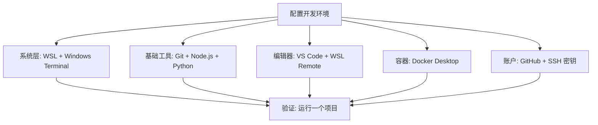

> [!DETAILS-AI] 本节 AI 摘要
> 本节在 Windows 上安装 WSL 2，并在 Ubuntu 里配置 Git、Node.js、Python、C / C++ 工具链、VS Code 远程开发、SSH 密钥与 Docker，每一步都带验证命令。仅使用 Windows 工具链的读者请看 [1.14 Windows 环境配置](/zh/docs/ch1/1.14-Environment-Setup-Windows)。

> [!INFO]
> 前面的章节介绍了文件管理、Shell 与编辑器。本节把这些能力串起来，在 Windows + WSL 上搭一套最小、可验证的 Linux 开发环境。版本控制的完整工作流在 [1.15 版本控制与 Git](/zh/docs/ch1/1.15-Version-Control-Git) 中介绍；Windows 原生环境（scoop、MSYS2 等）见 [1.14 Windows 环境配置](/zh/docs/ch1/1.14-Environment-Setup-Windows)。

## 一、总体思路



原则：**够用就好，边用边加**。不要一次装几十个工具，先搭最小可用集，遇到具体需求再扩展。工具会持续更新，重点是掌握“怎么装、怎么验证、坏了怎么重来”，而不是追求一次安装永久不变。

> [!TIP] 逐项验证
> 每装完一个工具，立即用版本命令验证。全部装完再统一测试，出问题时难以定位是哪一步出错。

## 二、第一步：WSL + Windows Terminal

课程或项目需要 Linux 工具链时，先在 Windows 上准备 WSL；只依赖 Windows 工具的项目不必为了形式额外装。

### 2.1 安装 WSL 2

先核对[微软的 WSL 安装条件](https://learn.microsoft.com/windows/wsl/install)。在受支持的 Windows 10 / 11 上，以管理员身份打开 PowerShell：

```powershell
wsl --install
```

尚未安装 WSL 的系统上，该命令会启用所需组件，并默认安装使用 WSL 2 的 Ubuntu；也可以先运行 `wsl --list --online` 查看其他发行版，再用 `wsl --install -d 发行版名称` 指定。WSL 已存在时命令行为可能不同，先运行 `wsl --status` 看当前状态。

按提示重启并完成发行版初始化后，在 PowerShell 中确认版本：

```powershell
wsl --list --verbose
```

目标发行版的 `VERSION` 应为 `2`。若不是，按微软当前文档检查系统条件，再用 `wsl --set-version 发行版名称 2` 转换。首次启动时要创建 Linux 用户名和密码；输入密码时终端不会回显字符。

> [!NOTE] WSL 与虚拟机
> WSL 2 在轻量虚拟机里跑 Linux 内核，但由 Windows 统一集成文件、网络和生命周期。它适合本机开发，不等同于一台与生产环境完全一致的独立 Linux 主机。

**验证安装：**

```bash
# 在 Ubuntu 终端运行
cat /etc/os-release     # 查看 Ubuntu 版本
uname -r                # 查看内核版本
```

### 2.2 安装 Windows Terminal

Windows 11 通常自带 Windows Terminal；其他受支持系统可从 Microsoft Store 安装。可以把常用的 WSL 发行版设为默认配置，也可以保留 PowerShell 作为默认入口、按需切换。

**验证：** 打开 Windows Terminal，配置列表中应能选到已安装的 WSL 发行版。

> [!TIP] macOS 用户跳过 WSL
> macOS 属于 Unix 系统，不需要 WSL，用系统终端即可。但它的软件包管理、系统接口和默认命令版本与 Linux 并不完全相同，安装时以对应平台说明为准。

## 三、第二步：基础工具链

进入 WSL Ubuntu 终端，安装开发必备工具。

### 3.1 更新系统

```bash
sudo apt update
```

### 3.2 Git

```bash
# 安装 Git
sudo apt install git -y

# 验证安装
git --version
```

Git 只安装这一次。用户名、邮箱等身份配置，以及日常用法，见 [1.15 版本控制与 Git](/zh/docs/ch1/1.15-Version-Control-Git) 的「初始配置」一节。

### 3.3 Node.js（前端 / JS 开发）

不同项目可能要求不同版本的 Node.js。先看仓库里的 `.nvmrc`、`package.json` 或 README；需要在项目间切换版本时，再按 [nvm 官方 README](https://github.com/nvm-sh/nvm) 安装版本管理器。安装脚本和版本号会更新，这里不复制一条长期不变的远程脚本命令。

```bash
command -v nvm

# 项目已有 .nvmrc 时
nvm install
nvm use

# 没有项目版本约束，只想装当前 LTS
nvm install --lts
```

安装后重新打开终端再执行。`nvm install` 在当前目录找到 `.nvmrc` 时会安装其中声明的版本；团队项目应把版本约束写进仓库，而不是只依赖个人机器上的默认版本。

**验证安装：**

```bash
nvm current
node --version
npm --version
```

### 3.4 Python

Ubuntu 会给系统工具提供 Python，**不要删除或替换系统 Python**。先安装虚拟环境支持，再为每个项目创建独立环境：

```bash
sudo apt install -y python3 python3-venv
python3 --version
```

确实需要多个解释器版本时，再按 [pyenv 官方说明](https://github.com/pyenv/pyenv) 安装构建依赖与 pyenv，并选择项目要求的完整版本号。pyenv 管理解释器版本，虚拟环境隔离项目依赖，两者解决的问题不同。

```bash
python3 -m venv .venv
source .venv/bin/activate
python --version
python -m pip --version
```

命令提示符通常会出现 `(.venv)`。完成工作后运行 `deactivate` 退出。依赖安装命令以项目 README 和锁文件为准，不要把包直接装进系统 Python。

### 3.5 C/C++ 工具链

```bash
sudo apt install -y build-essential gdb cmake
```

**验证安装：**

```bash
gcc --version
g++ --version
```

> [!NOTE] 在 VS Code 里用 clangd 补全
> VS Code 的 C/C++ 插件依赖微软的 IntelliSense；若改用 clangd 语言服务器（`sudo apt install clangd`），需要像 Windows 篇一样关闭 `C_Cpp.intelliSenseEngine`，配置方式见 [1.14 Windows 环境配置](/zh/docs/ch1/1.14-Environment-Setup-Windows) 中的 C/C++ 部分。

### 3.6 常用小工具

```bash
sudo apt install -y curl wget tree htop jq
```

### 3.7 按需配置 zsh、fish 与 Starship

完成 Bash 基础练习后，可以按交互习惯安装 zsh 或 fish；脚本仍应通过 shebang 明确解释器。Ubuntu / Debian 可从发行版仓库安装：

```bash
sudo apt update
sudo apt install zsh fish
zsh --version
fish --version
```

先分别运行 `zsh`、`fish` 体验，不必立即改默认 Shell。确认配置和工具链正常后，如需修改登录 Shell，先 `command -v zsh` 或 `command -v fish` 拿到实际路径，检查它是否列在 `/etc/shells` 里，再用 `chsh -s 实际路径`。WSL、容器、远程主机和受管设备可能不允许也不需要修改登录 Shell。

[Starship](https://starship.rs/) 能为 Bash、zsh、fish 提供一致的提示符。安装遵循[官方指南](https://starship.rs/guide/)对应操作系统的软件包方式，避免直接执行未审阅的远程安装脚本。安装后，根据所用 Shell 在 `~/.bashrc`、`~/.zshrc` 或 `~/.config/fish/config.fish` 中加入初始化语句，具体示例见 [1.12 Shell 基础](/zh/docs/ch1/1.12-Shell-Basics)。

```bash
starship --version
mkdir -p ~/.config
```

Starship 的共享配置默认在 `~/.config/starship.toml`，这份不含秘密的文件可以当 dotfiles 管理；Shell 专用的初始化语句仍留在各自配置文件里。

> [!INFO] 为什么用 nvm / pyenv
> 不同项目可能需要不同版本的 Node.js 或 Python。nvm / pyenv 能按目录切换解释器版本，Python 虚拟环境还能隔离项目依赖；是否采用以团队约定、操作系统和项目要求为准。

## 四、第三步：VS Code 与 WSL 远程开发

### 4.1 安装 VS Code

在 Windows 上安装 [VS Code](https://code.visualstudio.com/)（Windows 篇有 scoop 安装方式）。它运行在 Windows 上，同时能连接 WSL 里的代码。

### 4.2 按项目安装扩展

| 扩展 | 作用 |
| :--- | :--- |
| **WSL** | 从 VS Code 连接 WSL 时安装 |
| C/C++ | C/C++ 开发支持（使用 clangd 时关闭 IntelliSense） |
| Python | Python 开发支持 |
| GitLens | 需要增强 Git 历史浏览时按需安装 |
| Prettier | 前端项目使用且仓库已采用时安装 |
| Live Server | 简单静态页面需要本地预览时安装 |

### 4.3 WSL 远程开发

1. 在 WSL 终端进入项目目录：`cd ~/projects/my-app`
2. 输入 `code .`（自动在 Windows 上打开 VS Code，并连接到 WSL）
3. 左下角显示 “WSL: Ubuntu”，表示已连接

此时界面运行在 Windows，工作区扩展、终端和项目命令在 WSL 环境中运行；具体扩展装在哪一侧，可在扩展面板中确认。

**验证：** 在 VS Code 终端运行 `uname`，应显示 Linux，而非 Windows。

> [!WARNING] 项目要放 WSL 文件系统
> 用 Linux 工具链处理大量文件时，项目通常应放在 WSL 文件系统（如 `~/projects/`），以获得更合适的性能、文件监听和权限语义。若项目主要由 Windows 工具处理，则应结合实际工作流选择位置，避免同一项目被两侧工具以不同权限和换行规则反复改写。

## 五、第四步：GitHub 与 SSH 密钥

注册 GitHub 账号、生成 SSH 密钥、把公钥添加到 GitHub 并测试连接的完整流程，见 [1.16 代码托管平台](/zh/docs/ch1/1.16-Code-Hosting-Platform) 的「注册与配置」一节，这里不再重复。环境这边只需记住两点：

> [!CAUTION] 密钥文件权限
> SSH 私钥是身份凭证，不要发给任何人，也不要上传到任何仓库。私钥文件权限应保持默认；Linux 上若提示 `UNPROTECTED PRIVATE KEY FILE`，恢复 `~/.ssh` 目录与私钥文件的受限权限，例如 `chmod 700 ~/.ssh`、`chmod 600 ~/.ssh/id_ed25519`。

## 六、第五步：Docker

Docker 可以把应用依赖与启动方式记录为镜像和配置，但仍需管理宿主机、架构、数据与密钥差异。Windows / macOS 上安装 **Docker Desktop**（Linux 上则按 [Docker 官方文档](https://docs.docker.com/) 安装 Docker Engine），然后打开 Docker Desktop 的 **WSL 集成**，让 WSL 里也能用 `docker` 命令。

**验证 Docker：**

```bash
docker --version
docker compose version
docker run --rm hello-world
```

若 `hello-world` 无法拉取，先检查网络与镜像源配置，再继续后续章节。

> [!TIP] 镜像源问题
> 无法访问 Docker Hub 时，先检查网络、代理和组织策略。需要镜像代理时，使用组织或课程明确提供的可信服务，并核对镜像命名空间与摘要；Docker Desktop 与 Linux Docker Engine 的配置入口和重启方式不同。详见 [1.17 Docker 基础](/zh/docs/ch1/1.17-Docker-Basics)。

## 七、组合起来：在 WSL 里跑一个项目

环境配置的目标是明确运行条件，让其他人在满足相同前提时能复现。

### 7.1 拉取项目

把示例中的 `仓库地址` 替换为项目提供的 HTTPS 或 SSH 地址：

```bash
cd ~/projects
git clone 仓库地址 my-app
cd my-app
```

### 7.2 用 Docker 起依赖服务

```yaml
# compose.yaml
services:
  db:
    image: postgres:16-alpine
    restart: unless-stopped
    environment:
      POSTGRES_USER: app
      POSTGRES_PASSWORD: ${POSTGRES_PASSWORD:?请在未提交的 .env 或当前环境中设置 POSTGRES_PASSWORD}
      POSTGRES_DB: app
    ports:
      - "5432:5432"
    volumes:
      - pgdata:/var/lib/postgresql/data

volumes:
  pgdata:
```

在未提交的 `.env` 或当前 Shell 中设置 `POSTGRES_PASSWORD`，再检查并启动服务：

```bash
docker compose config
docker compose up -d
docker compose ps
```

### 7.3 验证环境是否就绪

在项目内运行开发命令（以项目 README 为准），例如：

```bash
npm install
npm run build
```

然后让应用在本机 `localhost` 端口跑起来，用浏览器验证。确认无报错后，把完整步骤写进 `README`，环境就变成了可复现的资产。

### 7.4 清理

```bash
docker compose down        # 停止容器
docker compose down -v     # 同时清理卷（数据会丢失，确认后再执行）
```

## 八、目录总规划

环境建好后，把文件和工具在系统中的位置定下来：

```text
~/.ssh/                 # SSH 密钥和连接配置，不整体进入仓库
~/.config/              # 应用配置目录，逐项判断是否含账号、令牌或机器状态
~/.gitconfig            # 用户级 Git 配置
~/projects/             # 项目目录
~/projects/my-app/.nvmrc # 项目内声明 Node.js 版本
~/notes/                # 个人笔记与文档（按备份策略管理）
```

规划的价值在于“可预期”：新项目放哪、配置文件在哪、不用时清理什么，都有明确答案。

## 九、换电脑时如何恢复

环境会坏，也会迁移。核心思想是**配置进仓库，密钥单独管理**。

| 配置 | 托管方式 |
| :--- | :--- |
| `~/.gitconfig` | 关键字段手动记录，或放入个人配置仓库 |
| Shell 配置（`~/.bashrc`、`~/.zshrc`、`~/.config/fish/config.fish`） | 不含秘密的通用部分放入私有或公开配置仓库，真实令牌与机器专用值单独管理 |
| SSH 密钥 | 用 `ssh-keygen` 生成新密钥，不再复制私钥 |
| `~/projects/` | 全部项目推送到远程仓库，`git clone` 恢复 |
| `~/notes/` | 推送到仓库或使用个人云盘 |

```bash
# 换新电脑后的示例步骤（以 Ubuntu 为例）
sudo apt update && sudo apt install -y git
ssh-keygen -t ed25519 -C "新机器"
cat ~/.ssh/id_ed25519.pub   # 将公钥添加到对应托管平台
eval "$(ssh-agent -s)"
ssh-add ~/.ssh/id_ed25519
git clone git@github.com:你的用户名/dotfiles.git ~/dotfiles
cd ~/dotfiles
git status                 # 审阅来源、README 与安装脚本后再按仓库说明执行
```

> [!IMPORTANT] 密钥不再复制
> SSH 私钥是身份凭证，不是普通配置文件。换电脑时通常为新设备生成独立密钥并注册公钥，便于单独撤销访问权限；组织使用受管密钥或硬件密钥时，遵循对应的迁移与恢复策略。

配置迁移完成后，按前文的验证清单逐项执行一遍，新环境就可以接手工作了。

## 十、小结

```text
操作系统  -> WSL/原生终端
版本控制  -> Git + GitHub/CNB
语言环境  -> nvm/pyenv + 虚拟环境
编辑器    -> VS Code + WSL Remote
容器      -> Docker + Compose
SSH 密钥  -> 身份凭证
```

环境配置的核心不是“一次装对”，而是**能够按记录重建并验证**。将非敏感配置、版本约束和操作步骤纳入适当的版本控制，能降低迁移与排错成本。

## 十一、TODO 清单

- [ ] 了解 WSL 与虚拟机的区别
- [ ] 尝试进行 WSL 安装与 Ubuntu 初始化（设置密码登录）
- [ ] 可根据项目声明选择 Node.js / Python 版本，并了解 Python 虚拟环境隔离依赖
- [ ] 尝试在 VS Code 中连接 WSL 完成编辑与运行
- [ ] 尝试用 Docker Compose 部署一个数据库或感兴趣的应用服务
- [ ] 尝试在一个容器或项目里完成“克隆、安装、运行、使用”全流程
- [ ] 尝试在自己的计算机中配置一套可用的开发环境

## 十二、值得我们思考的问题

> [!DETAILS-FAQ] 什么时候需要版本管理器？
> 同一台机器需要维护多个 Node.js 或 Python 版本时，nvm、pyenv 等工具可以按项目切换解释器；只有一个版本需求时，系统包或官方安装器可能更简单。无论采用哪种方式，团队都应在仓库中声明版本，Python 项目还要用虚拟环境隔离依赖。

> [!DETAILS-FAQ] 配置放进仓库会不会有安全风险？
> 仓库会保留完整历史，令牌、密码和私钥一旦提交就难以彻底清除。配置文件若需要敏感变量，只提交不含真实值的模板，通过环境变量或专门的秘密管理工具注入；再用 `.gitignore` 排除本地文件。任何情况下都不要把私钥内容提交到仓库。
