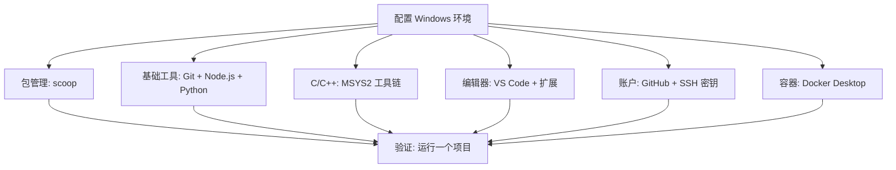

> [!DETAILS-AI] 本节 AI 摘要
> 本节介绍用 scoop 在 Windows 上安装 Git、Node.js、Python 与 VS Code，再按 [Shenshijun 的 C/C++ 配置指南](https://blog.shenshijun.space/posts/tutorials/vscode-cpp-setup/) 安装 MSYS2 工具链并配置 VS Code 插件，最后配置 SSH 密钥与 Docker。每一步都带验证命令。需要 Linux 工具链的读者请看 [1.14 WSL 环境配置](/zh/docs/ch1/1.14-Environment-Setup-WSL)。

> [!INFO]
> 只依赖 Windows 工具的项目，可以直接在 Windows 上搭环境，不必为了形式装 WSL。本节用 **scoop** 这个包管理器装工具：免管理员权限、自动处理 PATH、卸载干净。C / C++ 工具链参考 [Shenshijun 的 C/C++ 配置指南](https://blog.shenshijun.space/posts/tutorials/vscode-cpp-setup/)（仅适用于 Windows，面向算法竞赛 / 练习题场景）。需要 Linux 工具链时，先看 [1.14 WSL 环境配置](/zh/docs/ch1/1.14-Environment-Setup-WSL)。

## 一、总体思路



原则：**够用就好，边用边加**。先搭最小可用集，遇到具体需求再扩展。

> [!TIP] 逐项验证
> 每装完一个工具，立即用版本命令验证。全部装完再统一测试，出问题时无法定位是哪一步。

## 二、为什么用 scoop

scoop 是 Windows 上的命令行包管理器，功能类似 `apt`、`brew`：一条命令装软件、自动加入 PATH、升级时不会在系统里留下散落的安装目录。

它和传统安装包最大的区别是：

| 对比 | 传统安装包 | scoop |
| :--- | :--- | :--- |
| 安装位置 | 各软件自己决定，默认安装在 `C:\Program Files` | 统一放进用户目录 `%USERPROFILE%\scoop` |
| 管理员权限 | 经常弹出 UAC 提示 | 一般不需要 |
| PATH 配置 | 有的需手动添加，有的还会加错 | 自动处理 |
| 卸载 | 有的卸载器会留下较多残留 | `scoop uninstall` 删干净 |
| 升级 | 逐个软件手动更新 | `scoop update *` 一键 |

## 三、安装 scoop

在 PowerShell（不是 CMD）中运行：

```powershell
Set-ExecutionPolicy -ExecutionPolicy RemoteSigned -Scope CurrentUser
irm get.scoop.sh | iex
```

第一行放行本地脚本（scoop 需要），第二行下载并执行安装脚本。安装完成后在 PowerShell 中验证：

```powershell
scoop --version
```

**常用命令：**

| 命令 | 作用 |
| :--- | :--- |
| `scoop search 关键词` | 搜索软件 |
| `scoop install 软件名` | 安装 |
| `scoop update *` | 升级所有软件 |
| `scoop status` | 查看哪些软件有新版本 |
| `scoop list` | 列出已安装的软件 |
| `scoop uninstall 软件名` | 卸载 |
| `scoop cleanup` | 清理旧版本缓存 |

**Bucket 是什么：** scoop 把软件按“源”分组，称为 bucket。默认只有 `main`（核心工具）；需要更多软件时用 `scoop bucket add extras` 添加社区维护的 `extras` 源，`scoop bucket add versions` 可以装多个版本（如不同版本的 Node.js）。

> [!NOTE] scoop 装在哪
> 默认安装目录是 `%USERPROFILE%\scoop\apps`，可执行文件的快捷入口（shim）在 `%USERPROFILE%\scoop\shims`，安装时已自动加入 PATH，不需要手动配置环境变量。

## 四、基础工具：Git、Node.js 与 Python

在 PowerShell 中安装：

```powershell
scoop install git
scoop install nodejs-lts
scoop install python
```

> [!NOTE] Node.js 版本
> `nodejs-lts` 是当前 LTS（长期支持）版本。项目需要其它版本时，先看仓库里的 `.nvmrc`、`package.json` 或 README；需要多版本共存时，再研究 `scoop bucket add versions` 或 nvm-windows，不要默认安装多个版本。

**验证安装：**

```powershell
git --version
node --version
npm --version
python --version
```

Git 只安装这一次。用户名、邮箱等身份配置，以及日常用法，见 [1.15 版本控制与 Git](/zh/docs/ch1/1.15-Version-Control-Git) 的「初始配置」一节。

## 五、C/C++ 工具链（参考 Shenshijun 的指南）

Windows 上 C/C++ 的配置方式，本节直接参考 [Shenshijun 的 C/C++ 环境配置指南](https://blog.shenshijun.space/posts/tutorials/vscode-cpp-setup/)（仅适用于 Windows，面向算法竞赛 / 练习题场景）。下面是最关键的部分，细节（含截图）以原指南为准。

### 5.1 安装 MSYS2

前往 [MSYS2 官网](https://www.msys2.org/)，根据处理器架构下载安装包：

| 架构 | 判断方法 | 安装包 |
| :--- | :--- | :--- |
| x64 | `设置` → `系统` → `系统信息` → 系统类型显示“基于 x64” | x86_64 版本 |
| ARM64 | 同上，显示“基于 ARM” | ARM64 版本 |

依次点击“下一步”完成安装，默认路径为 `C:\msys64`，请记住这个路径。安装完成后打开 `MSYS2 MSYS` 终端，先更新软件包：

```bash
pacman -Syu
```

### 5.2 安装 C/C++ 工具链

在 **MSYS2 UCRT64** 终端（在开始菜单中打开 `MSYS2 UCRT64`）中执行：

```bash
pacman -S --needed --noconfirm mingw-w64-ucrt-x86_64-toolchain mingw-w64-ucrt-x86_64-clang-tools-extra mingw-w64-ucrt-x86_64-cmake mingw-w64-ucrt-x86_64-ninja
```

各包的作用：

| 包 | 作用 |
| :--- | :--- |
| `mingw-w64-ucrt-x86_64-toolchain` | GCC / G++ 编译器、GDB 调试器等核心工具 |
| `mingw-w64-ucrt-x86_64-clang-tools-extra` | Clangd 语言服务器（代码补全、语法检查） |
| `mingw-w64-ucrt-x86_64-cmake`、`mingw-w64-ucrt-x86_64-ninja` | 构建工具（大型项目才需要） |

**验证安装：**

```bash
clangd --version   # 显示版本即成功
where clangd       # 应显示路径，而不是提示未找到
where g++          # 应显示路径，而不是提示未找到
```

### 5.3 配置环境变量

把 `C:\msys64\ucrt64\bin` 加入系统环境变量 `Path`（若改了安装路径，请替换为实际路径）：

1. `Win + I` 打开设置 → `系统` → `系统信息` → `高级系统设置`
2. 点击 `环境变量` → 在 `系统变量` 中找到 `Path` → `编辑` → `新建`
3. 粘贴 `C:\msys64\ucrt64\bin` → `确定` 保存
4. 重新打开终端

**验证：** 在新终端中执行 `clangd --version`、`g++ --version`，能显示版本即配置成功。环境变量的原理见 [1.2 Windows 设置](/zh/docs/ch1/1.2-Windows-Settings#七环境变量)。

### 5.4 常见问题预案

| 报错 | 处理 |
| :--- | :--- |
| `The 'clangd' language server was not found on your PATH` | 检查环境变量是否配置正确；或在 clangd 插件设置中指定可执行文件绝对路径 |
| `fatal error: 'iostream' file not found` | 环境变量未正确配置，或工具链未按上文安装完整，重新检查第 5.2、5.3 步 |
| 输出中文乱码 | 在 `C/C++ Compile Run` 插件设置中添加编译参数 `-fexec-charset=GBK` |

## 六、VS Code 与 C/C++ 插件

### 6.1 安装 VS Code

用 scoop 安装（`extras` bucket）：

```powershell
scoop bucket add extras
scoop install vscode
```

也可以去 [VS Code 官网](https://code.visualstudio.com/) 下载 System Installer 安装。VS Code 的基础使用见 [1.7 文本编辑](/zh/docs/ch1/1.7-Text-Editing)。

### 6.2 安装插件

按 [Shenshijun 的 C/C++ 指南](https://blog.shenshijun.space/posts/tutorials/vscode-cpp-setup/) 安装以下插件：

| 插件 | 作用 |
| :--- | :--- |
| C/C++ | 微软官方 C/C++ 支持 |
| C/C++ Compile Run | 一键编译运行（默认快捷键 `F6`） |
| clangd | 语言服务器，提供补全与语法检查 |
| Clang-Format | 代码格式化（`Shift + Alt + F`） |
| Chinese (Simplified) 语言包 | 可选的简体中文界面 |

### 6.3 配置 clangd 并关闭 IntelliSense

打开任意 `.cpp` 文件后，clangd 通常会提示与微软 C/C++ 插件的 IntelliSense 冲突，点击 **Disable IntelliSense** 即可；若误点了，可在 VS Code 设置（JSON）中添加：

```json
"C_Cpp.intelliSenseEngine": "disabled"
```

### 6.4 编译运行与调试

- **编译运行：** 右上角运行按钮或快捷键 `F6`（由 C/C++ Compile Run 提供）
- **调试：** 先设置断点，再按 `F5` 启动调试
- **格式化：** `Shift + Alt + F`，首次使用需在弹出的选择框中选 Clang-Format

> [!NOTE] 详细步骤
> 插件的完整配置流程、`.clang-format` 风格文件、CPH / Luogu 等刷题插件、主题美化与推荐设置，全部见 [Shenshijun 的 C/C++ 环境配置指南](https://blog.shenshijun.space/posts/tutorials/vscode-cpp-setup/)，这里不重复搬运。

## 七、GitHub 与 SSH 密钥

注册 GitHub 账号、生成 SSH 密钥、把公钥添加到 GitHub 并测试连接的完整流程，见 [1.16 代码托管平台](/zh/docs/ch1/1.16-Code-Hosting-Platform) 的「注册与配置」一节，这里不再重复。环境这边只需记住一点：

> [!CAUTION] 密钥文件权限
> SSH 私钥是身份凭证，不要发给任何人，也不要上传到任何仓库。私钥文件权限应保持默认，不要把密钥文件复制进共享盘或仓库。

## 八、Docker

容器开发环境见 [1.17 Docker 基础](/zh/docs/ch1/1.17-Docker-Basics)。在 Windows / macOS 上安装 **Docker Desktop**，再打开 WSL 2 后端（若使用 WSL 2，先按 [1.14 WSL 环境配置](/zh/docs/ch1/1.14-Environment-Setup-WSL) 装好 WSL）。

**验证 Docker：**

```powershell
docker --version
docker compose version
docker run --rm hello-world
```

若 `hello-world` 无法拉取，先检查网络与镜像源配置。

> [!TIP] 镜像源问题
> 无法访问 Docker Hub 时，先检查网络、代理和组织策略。需要镜像代理时，使用组织或课程明确提供的可信服务，并核对镜像命名空间与摘要；Docker Desktop 与 Linux Docker Engine 的配置入口和重启方式不同。详见 [1.17 Docker 基础](/zh/docs/ch1/1.17-Docker-Basics)。

## 九、目录总规划

把文件和工具在系统中的位置定下来：

```text
%USERPROFILE%\.ssh\    # SSH 密钥，不整体进入仓库
%USERPROFILE%\scoop\   # scoop 安装的软件，坏了可重装
D:\Projects\           # 项目目录（全英文、无空格，见 1.1 文件管理）
D:\Notes\              # 个人笔记与文档
```

规划的价值在于“可预期”：新项目放哪、配置文件在哪、不用时清理什么，都有明确答案。

## 十、换电脑时如何恢复

**先记录，再迁移。** 换新电脑时：

1. 用 `scoop list` 记录已安装的软件清单
2. 项目全部推送到远程仓库，新机器 `git clone` 恢复
3. SSH 密钥**不要复制**，用 `ssh-keygen` 生成新密钥并重新注册公钥
4. 配置文件（如 `.clang-format`、Starship 配置）放入个人配置仓库

```powershell
# 换新电脑后的示例步骤
Set-ExecutionPolicy -ExecutionPolicy RemoteSigned -Scope CurrentUser
irm get.scoop.sh | iex
scoop install git nodejs-lts python
# 按上文第 5、6 节安装 MSYS2 工具链与 VS Code 插件
ssh-keygen -t ed25519 -C "新机器"
git clone git@github.com:你的用户名/dotfiles.git ~/dotfiles
```

> [!IMPORTANT] 密钥不再复制
> SSH 私钥是身份凭证，不是普通配置文件。换电脑时通常为新设备生成独立密钥并注册公钥，便于单独撤销访问权限；组织使用受管密钥或硬件密钥时，遵循对应的迁移与恢复策略。

配置迁移完成后，按前文的验证清单逐项执行一遍，新环境就可以接手工作了。

## 十一、小结

```text
包管理    -> scoop
版本控制  -> Git + GitHub/CNB
语言环境  -> nodejs-lts / python（scoop 管理）
C/C++    -> MSYS2 + clangd
编辑器    -> VS Code + 插件
容器      -> Docker Desktop
SSH 密钥  -> 身份凭证
```

环境配置的核心不是“一次装对”，而是**能够按记录重建并验证**。将非敏感配置、版本约束和操作步骤纳入适当的版本控制，能降低迁移与排错成本。

## 十二、TODO 清单

- [ ] 了解 scoop 与手动安装的区别
- [ ] 安装 scoop，并用 `scoop install` 安装 Git、Node.js 与 Python
- [ ] 安装 MSYS2 工具链并配置环境变量，`clangd --version`、`g++ --version` 验证通过
- [ ] 在 VS Code 中配置 clangd 与 C/C++ Compile Run，能编译运行并调试一个 C++ 程序
- [ ] 生成 SSH 密钥并添加到 GitHub，`ssh -T git@github.com` 验证通过
- [ ] 尝试用 Docker Desktop 运行一个容器
- [ ] 尝试在自己的计算机中配置一套可用的开发环境

## 十三、值得我们思考的问题

> [!DETAILS-FAQ] scoop 和直接下载安装包有什么区别？
> 手动安装时，软件各自决定安装位置、PATH 和卸载方式，时间一长系统里全是“不知道哪来的目录”。scoop 把软件统一放进用户目录，自动处理 PATH，卸载也干净。代价是多学一个工具、依赖社区维护的 bucket，且部分软件（如需要 GUI 安装向导或深度系统集成的）并不适合用 scoop 装。

> [!DETAILS-FAQ] 为什么 C/C++ 要单独用 MSYS2，而不是 scoop？
> scoop 本身就能装一部分 C/C++ 工具，但算法竞赛 / 练习题场景常用的完整 MinGW-w64 工具链 + clangd 组合，用 MSYS2 的 pacman 管理更省心，这也是 [Shenshijun 的指南](https://blog.shenshijun.space/posts/tutorials/vscode-cpp-setup/) 采用的方式。两种包管理器可以共存：scoop 管理日常工具，pacman 管理 C/C++ 工具链。

> [!DETAILS-FAQ] 配置放进仓库会不会有安全风险？
> 仓库会保留完整历史，令牌、密码和私钥一旦提交就难以彻底清除。配置文件若需要敏感变量，只提交不含真实值的模板，通过环境变量或专门的秘密管理工具注入；再用 `.gitignore` 排除本地文件。任何情况下都不要把私钥内容提交到仓库。
