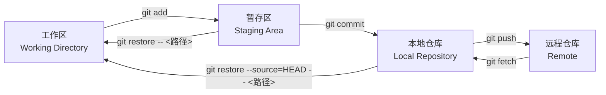
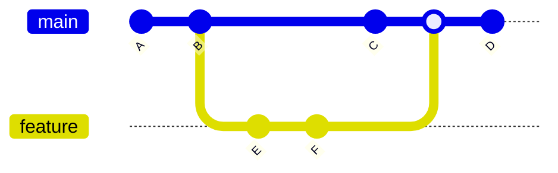
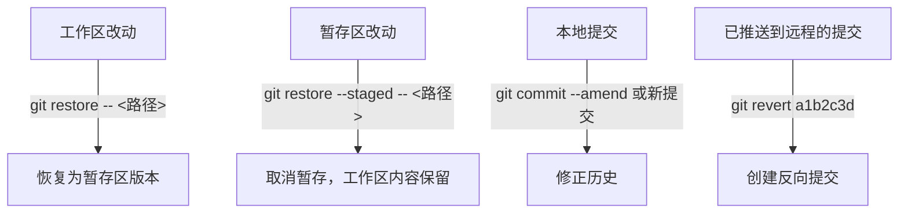
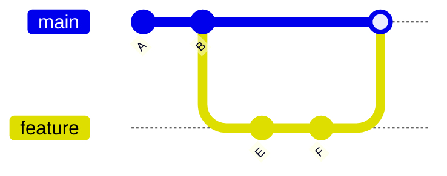
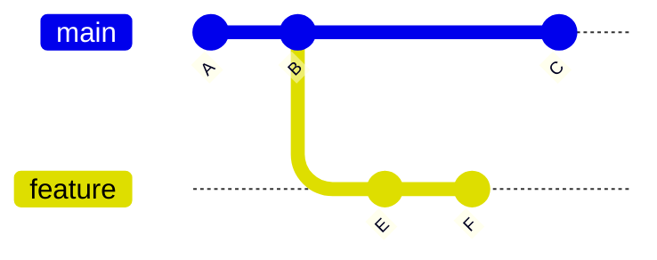
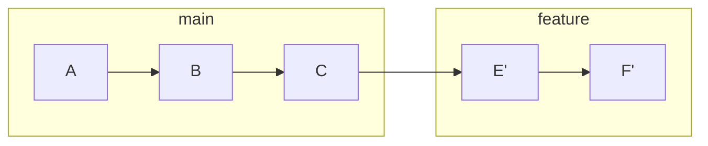

> [!DETAILS-AI] 本节 AI 摘要
> 本节围绕工作区、暂存区和提交历史，介绍 Git 的日常提交、分支协作、冲突处理与撤销方法。重点是先判断改动位于哪里，再选择不会误伤其他内容的命令。

## 一、版本控制

版本控制（Version Control）用于记录我们主动提交的文件状态，便于比较、回溯和协作。它不会自动保存每一次按键，也不能代替未提交文件的备份。

### 1.1 版本控制的演进

| 阶段 | 代表工具 | 特点 |
| :--- | :--- | :--- |
| 手动版 | 复制文件夹改名 `v1`、`v2` | 原始，容易乱 |
| 本地版本控制 | RCS | 单机，无法协作 |
| 集中式 | SVN、CVS | 主要历史保存在中央服务器，离线操作能力受限 |
| 分布式 | Git、Mercurial | 每人都有完整历史，离线可用 |

### 1.2 Git 是什么

版本控制是一个概念，Git 是其中最流行的一个具体实现。

Git 诞生于 2005 年，作者是 Linux 内核创始人 Linus Torvalds，最初用于管理 Linux 内核这样的大型代码库。它属于上一节表格里的“分布式”一类，主要有两个特点：

- **每人都有完整历史**：克隆仓库时，不仅拿到最新文件，也拿到全部提交历史。没有网络也能提交、查看历史、创建分支，联网后再同步。
- **按快照记录**：每次提交保存一份当时的文件快照，而不是只记录文件之间的差异。因此切换分支、回到任意历史版本都很快。

与集中式系统（如 SVN）相比，客户端不再依赖中央服务器才能查看历史或提交；服务器宕机也不会让你丢失本地历史。这些特性让 Git 成为当前使用最广泛的版本控制系统。本节后续内容围绕 Git 的核心工作流展开。

> [!NOTE] 为什么要用 Git？
> 其实你不一定要用 Git，也不一定要用任何源码管理系统。只需要满足以下条件：
>
> - 有足够的脑力，清楚自己在干嘛、一周前干了啥、当时为啥这么干
> - 有足够的耐心，在不小心删掉写了一整天的代码之后重新写一遍
> - 有足够的能力独立开发，不需要深入合作；或者能接受用微信、邮件等互相发代码来同步更改
>
> 这些要求显然是很容易达到的~~个鬼~~。
>
> Git 为我们提供了更好的解决方案，如：
>
> - `git blame`：查看每一行代码是谁写的、什么时候改的
> - `git log` / `git cherry-pick`：回滚更改，或将某些更改应用到其他分支
> - `git branch`：在不同分支上开发不同功能，多人协作互不干扰
>
> <div className="text-right">—— 引自 [SAST Summer Training 2024 · Git](https://summer24.net9.org/basic/linux_git/Git/#intro)。</div>

## 二、Git 的核心概念

### 2.1 三个区域

Git 把文件分为三个区域，理解这三个区域是掌握 Git 的关键。



| 区域 | 说明 | 对应位置 |
| :--- | :--- | :--- |
| 工作区 | 我们正在编辑的目录 | 实际文件 |
| 暂存区 | 准备提交的快照 | `.git/index` |
| 本地仓库 | 已提交的版本历史 | `.git/` 目录 |
| 远程仓库 | 托管在服务器上的仓库 | GitHub / CNB 等 |

> [!INFO]
> 暂存区让我们能精细控制“哪些改动一起提交”。一次改动可能涉及多个功能，我们可以分多次暂存、分多次提交，让历史清晰可读。

### 2.2 提交（Commit）

提交是 Git 的基本单位，每次提交记录一个完整的快照，包含：

- 改动的内容
- 作者、时间
- 提交信息（message）
- 指向父提交的引用；合并提交可以有多个父提交

提交通过父子关系形成有向无环图。没有分支合并时看起来像一条时间线，发生分叉与合并后则形成多条相互关联的历史线。

### 2.3 分支（Branch）

分支是指向某个提交的可移动引用。开发者可以从当前提交创建分支，在独立的提交历史上工作，再按项目流程合并或变基。



`main` 是主分支，`feature` 从 B 分出，独立开发 E、F 两个提交，完成后合并回 `main`。

> [!TIP] 分支的代价很小
> Git 分支本身只是一个引用，创建成本很低。是否为每项工作创建分支，应遵循仓库的协作流程；团队项目通常会用短生命周期分支隔离功能、修复或实验性改动。

## 三、初始配置

安装 Git 后（安装步骤见 [1.14 环境配置](/zh/docs/ch1/1.14-Environment-Setup)），第一件事是配置身份：

```bash
# 配置用户名和邮箱 (每次提交都会带上)
git config --global user.name "<你的名字>"
git config --global user.email "<你的邮箱>"
```

`git pull` 的整合策略应按团队约定选择 merge、rebase 或仅快进，不必在尚未理解差异时写入全局配置。后文会分别说明这些方式。

**验证配置：**

```bash
git config --list --show-origin
```

### 3.1 三层配置与覆盖关系

Git 配置可以来自系统级、全局级和仓库级文件。更具体的配置通常覆盖更宽范围的配置：

| 层级 | 常见文件 | 影响范围 |
| :--- | :--- | :--- |
| 系统级 | `/etc/gitconfig` 或 Git 安装目录中的配置文件 | 机器上的所有用户和仓库 |
| 全局级 | `~/.gitconfig` 或 `~/.config/git/config` | 当前用户的所有仓库 |
| 本地级 | 当前仓库的 `.git/config` | 当前仓库 |

查看某一层级的配置来源：

```bash
git config --system --list --show-origin
git config --global --list --show-origin
git config --local --list --show-origin
```

`--system` 可能需要管理员权限；没有对应文件或权限不足时命令可能失败。项目专属设置应写入本地级配置，个人默认值写入全局级配置。涉及身份、代理和凭据时，先确认当前来源，再修改。

> [!WARNING] 提交邮箱与账户关联
> 如果希望提交关联到 GitHub 账户，应使用 GitHub 账户中已验证的邮箱或 GitHub 提供的 `noreply` 邮箱（未添加个人邮箱到 GitHub 账户时，不推荐）。提交身份与登录凭据两者并不同，修改前可用 `git config --global --get user.email` 检查本地配置的邮箱。

## 四、基本工作流

### 4.1 方法一：从零开始一个项目

> [!DETAILS-EXAMPLE] 从零初始化并推送一个项目
> 先在代码托管平台（如 GitHub、CNB 等）创建一个不含初始提交的空仓库，再在本地执行：
>
> ```bash
> # 创建新目录并初始化仓库
> mkdir my-project && cd my-project
> git init
>
> # 创建文件
> printf '# My Project\n' > README.md
>
> # 查看状态
> git status
>
> # 暂存
> git add README.md         # 暂存指定文件
>
> # 提交
> git commit -m "Initial commit"
>
> # 关联远程仓库并推送
> git remote add origin https://github.com/你的用户名/项目名.git
> git branch -M main
> git push -u origin main
> ```

**验证：** 运行 `git log --oneline`，应看到刚才的提交记录。

### 4.2 方法二：克隆已有项目

```bash
# 克隆远程仓库到本地
git clone https://github.com/用户/项目名.git
cd 项目名
```

**验证：** 运行 `git remote -v`，应看到 `origin` 远程地址。

### 4.3 日常循环

绝大多数时候我们在重复这个循环：

```bash
# 改代码...
git status              # 看改了什么
git diff                # 看具体改动
git add <文件>             # 暂存
git commit -m "<说明>"     # 提交
git push                # 推送到远程
```

## 五、查看历史与差异

### 5.1 git log：查看提交历史

```bash
git log                 # 完整历史
git log --oneline       # 每条一行，简洁显示
git log --oneline --graph  # 图形化显示分支 (推荐)
git log -5              # 最近 5 条
git log --author="SSJ"  # 按作者过滤
```

每次提交都会获得一个唯一的哈希值（SHA-1），`git log --oneline` 每行开头的 `a1b2c3d` 就是它的缩写。后续命令示例中的 `a1b2c3d` 只是占位，实际使用时替换为 `git log` 中查到的真实哈希。

### 5.2 git diff：查看差异

```bash
git diff               # 工作区 vs 暂存区
git diff --staged      # 暂存区 vs 最新提交
git diff HEAD          # 工作区 vs 最新提交
git diff v1 v2         # 两个提交之间的差异
```

> [!TIP] 关于 `--graph` 选项
> `git log --oneline --graph --all` 会用文本图展示各引用之间的提交关系。经常使用时可配置别名：`git config --global alias.lg "log --oneline --graph --all"`，之后运行 `git lg`。

## 六、暂存更改

不必一次暂存所有改动，可以只选择一部分内容暂存：

```bash
git add file1.txt file2.txt      # 暂存指定文件
git add -- '*.py'                # 按 Git 路径规格暂存仓库中的 .py 文件
git add -p                       # 交互式选择要暂存的代码块 (推荐)
```

> [!TIP] 关于 `git add -p`
> `git add -p`（patch 模式）会把差异分成若干块，逐块询问是否暂存。一次工作混有多个目的时，可以借此拆分提交；如果同一差异块仍包含两类改动，还可以继续拆分或先回到编辑器整理。

## 七、提交信息规范

好的提交信息让历史可读、可追溯。推荐 Conventional Commits 规范：

```text
<类型>: <简短描述>

<可选的详细说明>
```

常见类型：

| 类型 | 说明 | 示例 |
| :--- | :--- | :--- |
| `feat` | 新功能 | `feat: 添加用户登录功能` |
| `fix` | 修复 bug | `fix: 修复登录页面闪烁问题` |
| `docs` | 文档改动 | `docs: 更新 README 安装步骤` |
| `style` | 格式调整（不影响代码逻辑） | `style: 统一缩进为 2 空格` |
| `refactor` | 重构（非新功能、非修 bug） | `refactor: 抽离用户验证逻辑` |
| `test` | 测试相关 | `test: 补充登录单元测试` |
| `chore` | 构建、依赖等维护工作 | `chore: 更新构建配置` |

示例：

```text
feat: 添加用户登录功能

实现 JWT 认证，新增 /login 接口
```

> [!NOTE] 本项目的提交规范
> 本项目也采用类似规范，详见 [提交信息规范](/zh/docs/about/contributing#提交信息)。

提交前后都可能需要修正改动。应先判断内容位于工作区、暂存区还是提交历史。

## 八、撤销与回退

先运行 `git status` 和 `git diff` 判断改动位于工作区、暂存区还是提交历史，再选择命令。名称相似的命令作用范围不同，不要靠试错使用。



| 场景 | 建议命令 | 是否改写历史 |
| :--- | :--- | :--- |
| 取消暂存，保留工作区内容 | `git restore --staged -- <文件>` | 否 |
| 丢弃某个文件尚未暂存的改动 | `git restore -- <文件>` | 否，但文件内容会丢失 |
| 修正尚未共享的最近提交 | `git commit --amend` | 是 |
| 撤销已推送到远程的提交 | `git revert a1b2c3d` | 否，新增一条反向提交 |

> [!CAUTION] `git restore` 也可能丢失内容
> `git restore -- <文件>` 会覆盖尚未提交的工作区改动。执行前先查看 `git diff -- <文件>`；不确定时，复制补丁、创建临时分支或先提交一个可识别的临时版本。

> [!DETAILS-HINT] `reset --hard` 什么时候用？
> `git reset --hard` 会同时移动分支并覆盖工作区和暂存区，初学阶段通常没有必要使用。若确有需要，先确认目标提交、备份未提交内容，并理解它会改写哪些引用；已推送到远程的历史优先使用 `git revert`。

## 九、分支操作

### 9.1 基本分支命令

```bash
git branch                    # 查看本地分支
git branch -a                 # 查看所有分支 (含远程)
git branch feature            # 创建 feature 分支
git checkout feature          # 兼容旧教程：切换到 feature
git checkout -b feature       # 兼容旧教程：创建并切换
git switch feature            # 使用专用命令切换分支
git switch -c feature         # 创建并切换

git branch -d feature         # 删除已合并的分支
git branch -D feature         # 强制删除
```

### 9.2 合并（Merge）

把分支的改动合到当前分支：

```bash
git switch main               # 先切到目标分支
git merge feature             # 合并 feature
```

如果要合并的分支已经包含当前分支的全部提交，Git 可能执行 **fast-forward**：只移动当前分支引用，不创建新的合并提交。如果两条分支在分叉点之后都产生了新提交，Git 通常需要基于分叉点执行 **three-way merge**，并可能创建一个合并提交；无法自动决定的文件会产生冲突（见下节）。是否强制创建合并提交，可按项目约定使用 `--no-ff`。

```bash
git merge --ff-only feature   # 只能快进；不能快进时失败，不自动创建合并提交
git merge --no-ff feature     # 即使能快进也创建合并提交
```

**fast-forward：main 在分叉点之后没有新提交时**



`main` 只是把引用直接移到 `feature` 顶端（F），不产生新的合并提交。

**three-way merge：两条分支在分叉点之后都产生了新提交**


两条分支在分叉点 B 之后各自前进，Git 基于分叉点做三方合并，产生合并提交 M。

### 9.3 变基（Rebase）

`rebase` 是另一种整合改动的方式，它把我们的提交“搬到”目标分支末尾，让历史保持线性。

```bash
git switch feature
git rebase main               # 把 feature 的提交基于 main 重新应用
```

**rebase 前：feature 从 B 分叉，main 已有新提交 C**



**rebase 后：E、F 被搬到 C 之后重新应用，历史从分叉变为一条直线**



rebase 后 `feature` 看起来像从 `main` 顶端（C）接着开发，E'、F' 是重新生成的新提交（ID 与原 E、F 不同），所以不要擅自变基已推送到远程的分支。

| 方式 | 历史 | 冲突处理 |
| :--- | :--- | :--- |
| merge | 保留分支结构，有合并节点 | 一次解决 |
| rebase | 线性历史，更整洁 | 可能逐个提交解决 |

> [!CAUTION] 不要擅自改写共享历史
> `rebase` 会为被重放的提交生成新的提交 ID。已经有人基于旧提交继续工作的分支，不应在没有协调的情况下变基并强制推送。个人分支是否允许整理后使用 `--force-with-lease`，以项目约定为准。初学阶段先在尚未推送的本地分支上练习。

### 9.4 detached HEAD

通常 `HEAD` 指向当前分支。

执行 `git checkout a1b2c3d` 或 `git switch --detach a1b2c3d` 后，`HEAD` 会直接指向某个提交，处于 **detached HEAD** 状态。此时可以查看历史或临时测试，但直接创建的新提交不属于任何分支，离开前应创建分支保存它：

```bash
git switch --detach a1b2c3d
# 临时查看或测试

git switch -c experiment       # 从当前提交创建分支并保存后续提交
# 或回到已有分支
git switch main
```

查看当前状态：

```bash
git status
```

## 十、解决冲突

当两个人改了同一行代码，合并时 Git 无法自动决定保留哪个，就会产生冲突。

```text
$ git merge feature
Auto-merging main.py
CONFLICT (content): Merge conflict in main.py
```

打开冲突文件，会看到：

```text
def hello():
<<<<<<< HEAD
    print("Hello from main")
=======
    print("Hello from feature")
>>>>>>> feature
```

- `<<<<<<< HEAD` 到 `=======` 是当前分支的内容
- `=======` 到 `>>>>>>> feature` 是传入分支的内容

解决方法：手动编辑保留想要的版本（或两者结合），删掉冲突标记，然后：

```bash
git add main.py        # 标记冲突已解决
git commit             # 完成合并
```

> [!TIP] VS Code 可视化解决冲突
> VS Code 可以识别冲突标记，并提供合并编辑器或行内操作。按钮名称和界面会随版本与语言设置变化；无论使用哪种界面，完成后都要检查最终文件，确认冲突标记已经删除，再运行测试并执行 `git add`。

## 十一、远程仓库操作

> [!DETAILS-EXAMPLE] 远程仓库常用命令速查
> ```bash
> # 查看远程
> git remote -v
>
> # 添加远程（注意：此处的 GithubName 为实际用户名不是昵称！）
> git remote add origin https://github.com/GithubName/ProjectName.git
>
> # 修改远程地址
> git remote set-url origin 新地址
>
> # 推送
> git push origin main           # 推送 main 分支
> git push -u origin feature     # 首次推送并建立追踪
> git push --force-with-lease origin feature  # 谨慎覆盖远程分支，先检查远程跟踪状态
>
> # 拉取
> git pull                       # 获取远程更新后按配置执行 merge、rebase 或仅快进
> git fetch                      # 只更新远程跟踪引用，不整合当前分支
> ```

| 命令 | 行为 | 适用场景 |
| :--- | :--- | :--- |
| `git fetch` | 更新远程跟踪引用，不自动整合当前分支 | 想先检查远程变化 |
| `git pull` | 先 fetch，再按参数或配置整合当前分支 | 已明确 merge、rebase 或仅快进策略时 |
| `git push` | 推送本地提交到远程 | 提交后同步 |
| `git remote -v` | 查看远程仓库地址 | 确认远程配置 |

> [!TIP] 先 fetch 再 merge
> 不确定远程变化时，可以先 `fetch`，再用 `git log --oneline --graph --all` 或 `git diff` 检查分支差异。使用 `git pull` 前应明确仓库约定的整合策略，避免意外创建合并提交或改写本地提交。

## 十二、忽略文件：.gitignore

有些文件不该进版本控制（临时文件、密钥、构建产物），用 `.gitignore` 指定：

> [!DETAILS-EXAMPLE] 常用 .gitignore 模板
> ```text
> # .gitignore
> # 编译产物
> *.o
> *.exe
> build/
>
> # 依赖
> node_modules/
> __pycache__/
>
> # IDE 本地状态；是否忽略共享配置由团队决定
> .idea/
>
> # 系统文件
> .DS_Store
> Thumbs.db
>
> # 敏感信息
> .env
> .env.*
> !.env.example
> *.pem
> ```

> [!IMPORTANT] 不要把敏感信息提交进仓库
> 私钥、密码、访问令牌，以及包含这些信息的配置文件（如 `.env`），都不应进入版本控制。敏感信息一旦提交，即使随后删除，仍可能存在于历史、分支、缓存或克隆中；发现泄露后应立即撤销或轮换凭据，再按平台指引清理历史。不含敏感信息的模板文件（如 `.env.example`）可以按项目需要提交。

`.gitignore` 只影响尚未跟踪的路径，不能让已跟踪文件自动退出版本控制。可参考 github/gitignore 的模板，再根据项目实际产物和编辑器配置调整。

## 十三、常用技巧

### 13.1 stash：临时保存改动

工作到一半要切分支处理紧急问题，又不想提交半成品：

```bash
git stash push         # 保存已跟踪文件的工作区与暂存区改动；默认不含未跟踪文件
git switch main        # 切走处理别的事
# ...处理完...
git switch feature     # 切回来
git stash list         # 确认要恢复的条目
git stash pop          # 应用最近条目，成功后从 stash 列表删除
```

### 13.2 tag：打标签

发布版本时打标签：

```bash
git tag v1.0.0                 # 轻量标签
git tag -a v1.0.0 -m "发布说明"  # 附注标签 (推荐)
git push origin v1.0.0         # 推送标签到远程
```

### 13.3 cherry-pick：摘取单个提交

只要某个分支的某一次提交，不要整个合并：

```bash
git cherry-pick a1b2c3d
```

### 13.4 reflog：查找引用的历史位置

`reflog` 会记录本地引用曾经指向的位置，可用于定位误操作前的提交：

```bash
git reflog                         # 查看 HEAD 的本地变动记录
git show HEAD@{2}                  # 先检查目标内容
git branch recovery HEAD@{2}      # 创建恢复分支，不覆盖当前工作区
```

> [!TIP] reflog 是本地线索，不是备份
> 可达 reflog 条目默认保留时间通常为 90 天，不可达条目通常为 30 天，具体还受配置和垃圾回收影响。它不记录从未提交的内容，也不会同步到远程；重要工作仍需及时提交并备份。

## 十四、TODO 清单

- [ ] 熟练使用 `git status` 与两种 `git diff` 判断改动所在区域
- [ ] 尝试使用 `git add -p` 组织一条内容聚焦的提交
- [ ] 了解创建分支、合并分支并说明冲突标记的含义
- [ ] 了解 `restore`、`revert`、`reset` 与 `reflog` 的用途
- [ ] 推送前检查提交历史、远程地址和待推送分支
- [ ] 尝试创建或阅读一个项目的 `.gitignore` 并识别不该提交的敏感文件

## 十五、值得我们思考的问题

> [!DETAILS-FAQ] rebase 和 merge 有什么区别？什么时候使用？
> `merge` 保留分支结构并产生合并提交，历史如实记录分支何时汇合。
>
> `rebase` 把提交重新应用到目标分支顶端，得到线性历史，但会生成新的提交哈希。
>
> 判断依据主要是历史是否已被共享：已经推送到远程或多人协作的分支，优先使用 `merge` 而不是改写历史。
>
> 尚未推送的本地分支，可以根据项目约定选择，想要整洁的线性历史时用 `rebase`。冲突处理上 `merge` 一次解决，`rebase` 可能需要在重放的每个提交上逐个解决。具体取舍仍以项目约定为准。

## 十六、值得我们进一步阅读的资料

- [Pro Git](https://git-scm.com/book/zh/v2)
- [Git 官方文档](https://git-scm.com/docs)
- [Conventional Commits 规范](https://www.conventionalcommits.org/)
- [github/gitignore 模板](https://github.com/github/gitignore)

## 十七、值得我们观看的视频

Bilibili 合集「从零开始深入 git」（UP 主：寰宇牛奶unimilk，[合集链接](https://space.bilibili.com/3706985490942278/lists/8128583?type=season)），按照视频标题与本节知识结构列出对应关系：

| 期数 | 主题 | 对应本节章节 |
| :--- | :--- | :--- |
| 01 | Git 设计理念与版本控制历史 | 一、版本控制；二、Git 的核心概念 |
| 02 | Git 安装与配置、三层配置文件 | 三、初始配置 |
| 03 | 仓库基本使用、提交、文件更改与暂存 | 四、基本工作流；六、选择性暂存 |
| 04 | IDE 中使用 Git、提交信息规范 | 五、查看历史与差异；七、提交信息规范 |
| 05 | 多分支开发：Branching 与 DAG | 二、Git 的核心概念；九、分支操作 |
| 06 | 多分支开发：Merging、冲突、three-way 与 fast-forward | 九、分支操作；十、解决冲突 |
| 07 | Git Workflow、语义化版本号、分支模型 | 九、分支操作；十三、常用技巧 |
| 08 | Rebase：用 merge 或变基跟进分支 | 九、分支操作 |
| 09 | amend、stash、detached HEAD、gitignore、revert、reset | 八、撤销与回退；十二、忽略文件；十三、常用技巧 |
| 10 | Remote、clone、简单推拉与协作准备 | 四、基本工作流；十一、远程仓库操作 |
| 11 | fetch、push、pull、force push、force-with-lease | 十一、远程仓库操作 |
| 12 | 小团队、企业与大型开源项目的协作 Workflow | 十一、远程仓库操作；十五、值得我们思考的问题 |
| 13-A | GitHub 账户授权、分支保护、PR、Issue、Releases | [1.16 代码托管平台](/zh/docs/ch1/1.16-Code-Hosting-Platform) |
| 13-B | 参与大型开源项目 | [1.16 代码托管平台](/zh/docs/ch1/1.16-Code-Hosting-Platform) |
