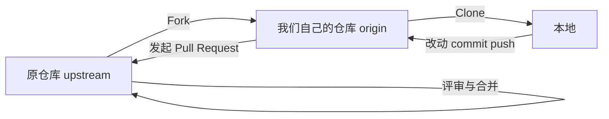

> [!DETAILS-AI] 本节 AI 摘要
> 本节介绍 GitHub 与 CNB 的仓库托管和协作流程，包括账户授权、Pull Request、分支保护、Issue、Pages、Releases、CI/CD 与多平台同步。平台功能和额度可能调整，操作步骤以当前界面与官方文档为准。

## 一、代码托管平台

本地 Git 仓库已经能保存历史；代码托管平台进一步提供远程仓库、权限控制、代码评审、Issue 和自动化能力，方便备份已推送的提交并开展协作。

[1.15 版本控制与 Git](/zh/docs/ch1/1.15-Version-Control-Git) 阐述了本地操作；代码托管平台则围绕远程仓库增加权限、评审和自动化能力。常见功能包括：

- **远程仓库存储**：保存已经推送的 Git 对象和引用；未提交文件仍需另行备份
- **协作功能**：多人共同开发、代码审查、Issue 管理
- **项目发现**：通过 Star、Fork、话题与搜索发现和参与公开项目
- **持续集成**：自动测试、构建、部署（CI/CD）
- **项目展示**：通过 README、Releases 和 Pages 说明项目用途与成果

[1.6 社区与相关平台](/zh/docs/ch1/1.6-Community-Platforms) 简要介绍过 GitHub，本节会深入实际使用，并介绍国内平台 CNB。

> [!NOTE] 平台选择
> 代码托管平台有很多，本节只挑选了国内外各一个知名度较高且各具特点的平台——GitHub 与 CNB，不代表平台清单或推荐。其他平台的操作步骤和功能可能不同，但相似功能相差不大，还请以各自官方文档为准。

## 二、GitHub

### 2.1 GitHub 的常见使用场景

[GitHub](https://github.com/) 汇集了大量开源项目，并提供仓库托管、Pull Request、Issue、Actions、Pages 等协作能力。具体套餐、额度和学生权益会调整，使用前应查看当前官方说明。常见场景包括：

- 托管公开或私有 Git 仓库
- 参与开源项目的 Issue、Fork 与 Pull Request
- 使用 GitHub Actions 执行自动化流程
- 使用 GitHub Pages 发布静态站点
- 符合条件时申请 GitHub Education 权益

### 2.2 注册与配置

#### 2.2.1 注册账号

到 [github.com](https://github.com/) 注册账号，用户名建议用英文，会出现在仓库地址里。

> [!WARNING] 用户名与公开链接绑定
> 用户名会出现在个人仓库地址（`github.com/用户名/项目`）和用户 Pages 域名（`用户名.github.io`）中。GitHub 支持修改用户名，但旧链接、Git remote、Pages 地址以及依赖用户名的集成可能需要更新。选择便于识别、长期使用且不泄露不必要个人信息的名称即可。

注册后应启用[双重身份验证（2FA）](https://docs.github.com/authentication/securing-your-account-with-two-factor-authentication-2fa/configuring-two-factor-authentication)，并把恢复码保存在密码管理器或其他受控位置。恢复码与 SSH 私钥一样属于敏感凭据，不应上传到仓库或公开网盘。

#### 2.2.2 配置 SSH 密钥

配置 SSH 密钥能免去每次推送都输密码的麻烦：

```bash
# 生成密钥；确认保存位置，并设置安全口令
ssh-keygen -t ed25519 -C "你的邮箱@example.com"

# 查看公钥
cat ~/.ssh/id_ed25519.pub
```

复制公钥内容，到 GitHub → Settings → SSH and GPG keys → New SSH key 粘贴。首次连接时，还应将终端显示的主机指纹与 [GitHub 公布的 SSH 指纹](https://docs.github.com/authentication/keeping-your-account-and-data-secure/githubs-ssh-key-fingerprints) 核对。

**验证连接：**

```bash
ssh -T git@github.com
# 出现 "Hi 用户名! You've successfully authenticated" 即成功
```

测试成功时，GitHub 还会说明不提供 Shell 访问；该命令可能返回状态码 `1`，应以消息中的账户名与认证结果判断。

> [!TIP] SSH vs HTTPS
> SSH 与 HTTPS 都可以安全访问仓库。SSH 使用密钥认证；私钥设置口令后，可能需要输入口令或由 `ssh-agent` 管理。HTTPS 通常配合 GitHub CLI、Personal Access Token 或凭据管理器。应根据网络限制、组织 SSO 和本机凭据管理方式选择远程地址。

### 2.3 创建仓库

网页上点击 `New repository`，有以下选项：

| 选项 | 说明 | 建议 |
| :--- | :--- | :--- |
| Repository name | 仓库名，英文，用连字符分隔 | `my-awesome-project` |
| Description | 一句话描述 | 建议填写，便于识别仓库用途 |
| Public / Private | 公开 / 私有 | 按课程、组织、保密与开源要求选择 |
| Add README | 自动创建初始提交 | 新项目可勾选；已有本地历史准备推送时通常留空 |
| .gitignore | 选择语言或工具模板 | 新项目可选；已有项目应检查现有规则 |
| License | 开源许可证 | 仅在确认有权授权且许可证适合项目时选择 |

### 2.4 README：项目入口

README 是别人打开我们仓库看到的第一样东西，好的 README 应包含：

> [!DETAILS-EXAMPLE] README 模板示例
>
> ```markdown
> <!-- README.md -->
> # 项目名称
>
> 一句话说明这是什么。
>
> ## 功能
> - 功能 1
> - 功能 2
>
> ## 安装
> \`\`\`bash
> git clone https://github.com/你/项目.git
> cd 项目
> \`\`\`
>
> ## 使用
> \`\`\`bash
> npm start
> \`\`\`
>
> ## 许可证
> MIT
> ```

> [!INFO] README 是项目入口
> README 应让目标读者快速判断项目用途、前置条件、安装与使用方法。复杂项目还可补充截图、示例、文档入口、贡献方式和维护状态；内容应与当前版本保持一致。

### 2.5 开源协议（License）

开源并不等于“随便用”，协议规定了别人能如何使用我们的代码：

| 协议 | 特点 | 适合场景 |
| :--- | :--- | :--- |
| MIT | 宽松许可；分发时保留版权和许可声明 | 希望允许闭源再分发且义务较少 |
| Apache 2.0 | 宽松许可；包含明确专利授权，并要求保留声明、标注修改 | 需要明确专利条款的项目 |
| GPLv3 | 强 Copyleft；分发受 GPL 覆盖的程序或修改版时通常需要提供对应源码并保留 GPL 条款 | 希望下游分发继续提供源码的项目 |
| 无许可证 | 默认版权规则适用，公众通常没有复制、修改或分发授权 | 暂不对外授权或尚未完成许可证决策 |

到 [choosealicense.com](https://choosealicense.com/) 选择，或仓库创建时直接选。

> [!NOTE] 无许可证时的默认规则
> 未附许可证时，默认版权规则仍然适用，公开源码不等于授权他人复制、修改或分发。许可证义务还会受到依赖、组合方式和发布方式影响；不确定时参考 Choose a License、许可证原文或咨询项目负责人。本文表格不是法律意见。

### 2.6 账户授权

访问 GitHub 的授权方式不止 SSH 密钥一种。除 2.2 配置的 SSH 密钥外，常用的还有：

| 方式 | 用途 | 说明 |
| :--- | :--- | :--- |
| SSH 密钥 | 命令行推送与拉取 | 2.2 已配置；私钥留在本机，公钥注册到账户 |
| Personal Access Token（PAT） | HTTPS 推送、脚本与 CLI | 替代密码；可限制权限范围与有效期 |
| OAuth / GitHub App 授权 | 第三方工具访问账户 | VS Code、GitHub CLI 等工具申请权限时授权 |

为脚本或 CLI 生成 PAT 时，应使用细粒度令牌，只授予完成任务所需的最小权限并设置过期时间。授权第三方应用前先确认它申请的权限范围；不再使用的授权可以在 `Settings` → `Applications` 中撤销。SSH 私钥、令牌等凭据一旦泄露，应立即撤销并重新生成。

> [!TIP] GitHub CLI
> [GitHub CLI](https://cli.github.com/)（`gh`）可以在命令行完成仓库、Issue、PR 等操作，不需要在网页上逐页点击。首次运行 `gh auth login` 完成授权，之后 `gh pr create`、`gh issue list` 等命令即可直接使用。

### 2.7 Releases：发布版本

1.15 介绍的 `tag` 用于标记版本；GitHub Releases 在 tag 之上提供发布页：

- 基于已有 tag 创建 Release，填写版本号与 Release notes
- 可以附带安装包、二进制文件等资产
- 预发布版本标记为 `Pre-release`，正式版本标记为 `Latest`
- 发布后仓库主页显示 Releases 入口，方便用户查看版本说明与下载

CNB 的版本管理提供类似能力（见 5.3），命名与操作路径以当前界面为准。

### 2.8 GitHub Actions 与 CI/CD

**CI（持续集成）**：每次推送或创建 Pull Request 时自动运行构建与测试，尽早发现问题。

**CD（持续交付 / 部署）**：测试通过后自动发布到目标环境。

两者常合称 CI/CD。

GitHub Actions 是 GitHub 的自动化服务。工作流文件放在仓库的 `.github/workflows/` 目录，由事件（`push`、`pull_request`、定时等）触发，按 `jobs` 与 `steps` 顺序执行。最小示例：

```yaml
# .github/workflows/test.yml
name: Test
on: [push, pull_request]
jobs:
  test:
    runs-on: ubuntu-latest
    steps:
      - uses: actions/checkout@v4
      - run: npm test
```

Actions 市场提供大量现成 Action，可以按需拼装流水线。运行额度对公开仓库免费，私有仓库按账户套餐计算；具体限制以当前计费说明为准。CI/CD 的入口文件、运行环境与依赖安装方式应以仓库声明为准，不轻信网上复制的工作流。CNB 的云原生构建提供类似能力（见 5.3）。

## 三、Fork + Pull Request 协作工作流

许多开源项目使用 Fork + Pull Request 接收外部贡献；拥有仓库写权限的团队也可能直接从同一仓库的分支发起 Pull Request。提交前应先阅读项目的 `CONTRIBUTING`、行为准则和分支要求。



### 3.1 完整流程

> [!DETAILS-EXAMPLE] Fork + Pull Request 完整流程
>
> ```bash
> # 1. 在网页上 Fork 别人的仓库到自己账号
>
> # 2. 克隆你的 fork
> git clone https://github.com/你/项目.git
> cd 项目
>
> # 3. 关联原仓库（用于同步更新）
> git remote add upstream https://github.com/原作者/项目.git
>
> # 4. 创建分支开发
> git switch -c fix-typo
>
> # 5. 改代码，提交
> git add .
> git commit -m "docs: 修复 README 错别字"
>
> # 6. 推送到你的 fork
> git push origin fix-typo
>
> # 7. 在 GitHub 网页上发起 Pull Request
> ```

**验证：** 推送分支后，从仓库的 Pull requests 页面确认 base 仓库、base 分支、head 仓库和 head 分支，再填写标题、说明与验证结果。页面是否显示快捷提示取决于仓库状态和界面版本。

### 3.2 同步上游更新

原仓库更新后，我们要把改动同步到自己的 fork：

```bash
git fetch upstream
git switch main
git merge upstream/main
git push origin main
```

> [!TIP] 同步上游
> 开发新功能前，先同步上游，避免基于过时代码开发，减少冲突。

### 3.3 分支保护

分支保护是仓库级规则，用来防止改动直接进入受保护分支（通常是 `main`），或绕过必要检查。配置位置：仓库 `Settings` → `Branches` → `Add branch protection rule`。

| 常用规则 | 作用 |
| :--- | :--- |
| Require a pull request before merging | 禁止直接推送，改动必须通过 PR 进入 |
| Require approvals | 合并前需要至少 N 个评审通过 |
| Require status checks to pass | 需要 CI 检查（测试、构建等）通过后才能合并 |
| Restrict who can push | 限制可以推送到受保护分支的成员与团队 |
| Do not allow bypassing the above settings | 管理员也不绕过上述规则 |

分支保护解决的是流程问题：没有它，任何有推送权限的人都可以绕过评审直接改动 `main`。是否需要启用、启用哪些规则，取决于团队的协作约定，而不是平台本身的要求。

## 四、Issue 与 Pages

### 4.1 Issue：任务与 Bug 跟踪

Issue 用于报告 Bug、提出建议或讨论问题。较完整的 Issue 通常包含（参见 [1.5 如何提问](/zh/docs/ch1/1.5-Asking-Questions)）：

- 问题描述
- 复现步骤
- 期望行为与实际行为
- 环境信息

仓库维护者会打标签（bug、enhancement、good first issue 等）并分配处理。

> [!TIP] good first issue 是新手入口
> 可以使用 `label:"good first issue"` 查找维护者标记的入门任务，但标签不保证工作量小或无人处理。开始前应阅读 Issue 讨论和贡献指南，确认任务仍开放，并按项目习惯留言沟通。

### 4.2 GitHub Pages：免费建站

GitHub Pages 可以发布静态网站，是否支持私有仓库以及 Actions 用量取决于账户套餐。用户站点仓库使用 `用户名.github.io` 命名，项目站点也可以从普通仓库发布：

1. 创建或选择用于站点的仓库；用户站点需命名为 `用户名.github.io`
2. 准备 `index.html`、`index.md`、`README.md` 或由静态站点生成器产出的入口文件
3. 在仓库 Settings → Pages 中配置分支目录或 GitHub Actions 发布源
4. 查看部署工作流结果，再通过 Pages 设置中的站点链接验证

Pages 站点的可见性取决于账户套餐与组织策略，不能因为源仓库是私有仓库就假定站点也保持私有。任何准备发布的产物都不应包含令牌、内部地址或其他敏感内容。

文档站点常用 [VitePress](https://vitepress.dev/)、[Docusaurus](https://docusaurus.io/)、本项目的 [Fumadocs](https://fumadocs.vercel.app/) 等框架生成。

### 4.3 GitHub Education 学生权益

符合条件的在读学生可以申请 [GitHub Education](https://docs.github.com/education)。申请通常需要 GitHub 个人账户、当前在读证明，并满足年龄要求；学校邮箱是否必需取决于验证流程。

获批后可在 Education Portal 查看当前权益。GitHub 自有权益与第三方优惠的内容、额度和有效期可能变化，应以申请页面及各提供方条款为准。

## 五、CNB

### 5.1 CNB 简介

[CNB](https://cnb.cool/) 是面向云原生开发的协作平台，代码托管是其核心能力之一。根据 CNB 官方文档，仓库支持 Git 版本控制、代码浏览、Pull Request 评审、Issue、版本管理与分支保护。

平台功能、免费额度和计费规则会调整，使用云原生开发、构建或制品库前，应查看当前定价与用量说明。

### 5.2 CNB 与 GitHub 对比

| 特性 | GitHub | CNB |
| :--- | :--- | :--- |
| 仓库与社区 | 大量国际开源项目和第三方集成 | 提供 Git 仓库与代码协作，项目规模和社区分布不同 |
| 自动化构建 | GitHub Actions | CNB 云原生构建 / 流水线 |
| 扩展能力 | Actions、Apps 等 | 云原生开发、构建与制品库等 |
| 权益与额度 | Education 权益按资格申请 | 以当前定价与活动页面为准 |

### 5.3 CNB 的云原生能力

除了代码托管，CNB 围绕云原生开发提供了一组一体化能力（功能清单与命名以 CNB 官方文档当前版本为准）：

| 能力 | 说明 |
| :--- | :--- |
| 云原生构建 | 流水线 + 插件市场，通过 `.cnb.yml` 等配置在云端执行构建、测试与发布 |
| 云原生开发 | WebIDE 在线编写代码；默认开发环境与自定义开发环境；业务端口预览；云端智能体；工作区回收机制 |
| 制品库 | 托管构建产物，配合流水线完成发布流程 |
| 代码协作 | Pull Request 逐行对比与评论、Issue、版本管理和分支保护 |
| 其他平台能力 | WebIDE、AI、CLI、Open API 等能力以当前官方文档、账户权限和套餐为准 |

> [!NOTE] 云端能力的边界
> WebIDE、流水线与制品库等能力属于云端服务，存在配额、回收策略与计费规则，与本地环境行为也不完全相同。正式使用前，请阅读当前官方文档与定价页面，确认额度、保留期和迁移路径。

> [!TIP] 按需组合平台能力
> 可以只使用代码托管，也可以按项目需要组合构建、开发环境和制品库。各能力是否能独立启用、如何计费以及数据如何迁移，应以当前账户和官方文档为准。

## 六、多平台同步

### 6.1 在 CNB 上托管代码

注册 [cnb.cool](https://cnb.cool/) 账号后，流程与 GitHub 类似：

```bash
# 创建仓库 (网页操作)

# 克隆
git clone https://cnb.cool/你的组织/项目名.git

# 或添加为第二个远程 (同时推送到 GitHub 和 CNB)
git remote add cnb https://cnb.cool/你的组织/项目名.git
git push cnb main
```

### 6.2 方法一：分别推送

最简单的方式是配置两个 remote，手动分别推送：

```bash
git remote add origin https://github.com/你的用户名/项目.git
git remote add cnb https://cnb.cool/你的组织/项目.git

git push origin main    # 推到 GitHub
git push cnb main       # 推到 CNB
```

### 6.3 方法二：一次推送多平台

配置 Git 让一次 `push` 同时推送到多个远程：

```bash
# 添加一个名为 all 的远程，并显式设置两个 push URL
git remote add all https://github.com/你的用户名/项目.git
git remote set-url --add --push all https://github.com/你的用户名/项目.git
git remote set-url --add --push all https://cnb.cool/你的组织/项目.git

# 之后推送
git push all main
```

**验证：** 运行 `git remote get-url --all --push all`，应看到两个 push URL。一次推送会依次尝试各地址，但不会形成跨平台事务：某个地址成功、另一个失败时，已成功的平台不会自动回滚。

> [!TIP] 多平台镜像的边界
> 多远程能提高已推送 Git 对象的可用性，但不替代本地未提交文件、Issue、Release、CI 密钥和平台设置的备份。应明确主仓库、同步方向和失败后的补推流程，避免在两个平台同时接受互相冲突的改动。

## 七、TODO 清单

- [ ] 注册 Github 与 CNB 的账号，上传 SSH **公钥**
- [ ] 为账户开启多因素认证（MFA），并安全保管恢复方式
- [ ] 尝试创建一个仓库，编写一份 README、添加 `.gitignore` 与合适的许可证
- [ ] 能区分 SSH、PAT 与 OAuth 授权方式，遵循最小权限原则
- [ ] 了解分支保护常见规则能解决什么问题
- [ ] 了解 CI/CD 的作用，并读懂一个最小 GitHub Actions 工作流
- [ ] 能为一次发布创建 tag 与 Release
- [ ] 在多平台同步时明确主仓库、同步方向和备份范围
- [ ] 了解 CNB 云原生构建、云原生开发与制品库各解决什么问题

## 八、值得我们进一步阅读的资料

- [Choose a License（开源许可证选择器）](https://choosealicense.com/)
- [GitHub 官方文档](https://docs.github.com/zh)
- [GitHub 分支保护](https://docs.github.com/zh/repositories/configuring-branches-and-merges-in-your-repository/managing-protected-branches/about-protected-branches)
- [GitHub Releases](https://docs.github.com/zh/repositories/releasing-projects-on-github/about-releases)
- [GitHub Actions 文档](https://docs.github.com/zh/actions)
- [GitHub Education](https://docs.github.com/education)
- [CNB 官方文档](https://docs.cnb.cool/zh/)
- [CNB 定价与用量说明](https://docs.cnb.cool/zh/pricing.html)
