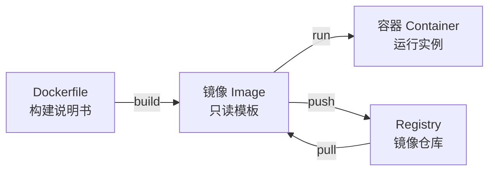

> [!DETAILS-AI] 本节 AI 摘要
> 本节介绍镜像、容器、Dockerfile、Compose 与数据挂载。示例以本地开发为主，同时说明镜像来源、版本标签、权限和持久化数据的边界。

## 一、Docker 的用途与边界

> SSJ：“我这能跑啊，你那边怎么不行？”
>
> SSSJ：“我不知道啊，报错说缺什么库……”
>
> SSSSJ：~~“这都装不明白？你缺…你%￥#\*……？”~~

这类问题的原因多数不在代码本身，而在环境——操作系统、CPU 架构、依赖库版本、配置、环境变量，哪一处不一样都可能导致结果不同。而 Docker 能把运行环境里的相当一部分固化下来、打包带走，但解决不了所有差异。

Docker 是一个开源的容器化平台。它把“应用 + 运行环境”一起打包成**镜像**，放进**仓库**分发；别人把镜像拉下来，就能在装有 Docker 的机器上用**容器**跑起来，省掉的正是装依赖、配环境这一步。具体机制在 2.2 展开。

镜像把应用和它依赖的用户空间一起打包，至少解决了“依赖版本对不上”这类问题。但容器共享的是宿主机的 Linux 内核，CPU 架构、挂载的文件、环境变量、网络、外部服务这些仍然会影响结果，所以“用同一个镜像”并不等于“跑出来的结果一定一模一样”。

> [!INFO] Docker 解决的场景
> - **环境可描述**：用 Dockerfile 与 Compose 把应用的依赖和启动方式写清楚
> - **统一启动方式**：一条命令或一份 Compose 就能拉起一组服务
> - **进程隔离**：减少不同项目之间依赖打架，但别把它当成天然的安全边界
> - **便于分发**：镜像带着用户空间依赖走，但运行之前仍要确保架构、配置、数据和外部服务都适合目标环境

## 二、核心概念

### 2.1 容器 vs 虚拟机

| 特性 | 虚拟机 | 容器 |
| :--- | :--- | :--- |
| 内核 | 客户机操作系统通常运行自己的内核 | Linux 容器共享运行它们的 Linux 内核；Docker Desktop 会通过虚拟化提供 Linux 环境 |
| 隔离机制 | 虚拟化硬件并运行来宾操作系统 | 使用命名空间、控制组等机制隔离进程与资源 |
| 启动与体积 | 通常包含完整的客户机操作系统，开销较高 | 通常只包含应用及用户空间依赖，开销较低 |
| 适用场景 | 需要不同内核、完整系统或更强边界 | 应用打包、开发环境、服务部署与任务隔离 |

容器一般不含一整套来宾操作系统，所以启动和占用通常比虚拟机小。

不过差距有多大，最终还是看镜像、工作负载和运行在哪台机器上。

### 2.2 四个核心概念



| 概念 | 说明 |
| :--- | :--- |
| Dockerfile | 描述镜像构建步骤的文本文件 |
| 镜像（Image） | 由只读层和元数据组成的打包产物，可分发、可复用 |
| 容器（Container） | 基于镜像创建的运行实例，拥有独立的可写层和运行配置 |
| Registry | 存储和分发镜像的服务，Docker Hub 是其中之一 |

> [!NOTE] 镜像与容器的关系
> 一个镜像可以创建多个互相独立的容器。停掉容器不会删掉镜像，删掉容器也不会顺手删掉命名卷。
>
> 镜像、容器和持久化数据三者的生命周期要分开理解。

## 三、安装 Docker

### 3.1 Windows / macOS

装 [Docker Desktop](https://www.docker.com/products/docker-desktop/) 就行，它把图形界面、Docker CLI、Compose 等一揽子带齐了。装之前先核对系统要求、组织许可和你要用的虚拟化后端。

> [!IMPORTANT] Windows 后端
> Docker Desktop 在 Windows 上默认用 WSL 2 后端，部分版本和场景也支持 Hyper-V 后端。若采用 WSL 2，请先按 [1.14 WSL 环境配置](/zh/docs/ch1/1.14-Environment-Setup-WSL) 装好 WSL，并在 Docker Desktop 里确认 WSL 集成已开启。

### 3.2 Linux

不同发行版的安装和升级方式不一样。Ubuntu 请照着 [Docker Engine 官方安装文档](https://docs.docker.com/engine/install/ubuntu/) 配置 Docker 的 `apt` 仓库，再装 Engine、Buildx 与 Compose 插件。

别把发行版自带包、第三方脚本和官方仓库混着用。

> [!CAUTION] `docker` 组具有高权限
> 把用户加进 `docker` 组，基本等于给了他通过 Docker 守护进程拿到接近 root 的宿主机权限。个人开发机理解了风险再配。
>
> 共享服务器最好由管理员统一管权限，或评估 rootless 模式。

### 3.3 验证安装

```bash
docker --version          # 查看版本
docker run --rm hello-world # 运行测试镜像，退出后删除测试容器
```

容器正常退出并打印欢迎语，就说明 Docker 客户端、守护进程和镜像拉取这条链路都通了。

## 四、基本操作

### 4.1 镜像操作

```bash
# 搜索镜像
docker search nginx

# 使用项目选定的版本标签，避免无意间跟随 latest
docker pull python:3.12
docker pull python:3.12-slim     # 精简版，体积较小

# 查看本地镜像
docker images

# 删除镜像
docker rmi python:3.12
```

### 4.2 容器操作

> [!DETAILS-EXAMPLE] 容器常用命令速查
> ```bash
> # 运行容器
> docker run hello-world                # 运行并退出
> docker run -it ubuntu:24.04 bash          # 交互式进入 Ubuntu
> docker run -d nginx:1.28-alpine           # 后台运行
> docker run --name myweb nginx:1.28-alpine # 给容器起名
> docker run -p 8080:80 nginx:1.28-alpine   # 端口映射（主机 8080 → 容器 80）
> docker run --rm -v "$(pwd):/app" node:22 node --version # 绑定挂载当前目录并运行明确版本镜像
>
> # 查看容器
> docker ps                # 运行中的容器
> docker ps -a             # 所有容器（含已停止）
>
> # 控制容器
> docker start 容器名/ID    # 启动
> docker stop 容器名/ID     # 停止
> docker restart 容器名/ID  # 重启
> docker rm 容器名/ID       # 删除容器
>
> # 进入运行中的容器
> docker exec -it 容器名 sh              # 镜像未必包含 bash
>
> # 查看日志
> docker logs 容器名
> docker logs -f 容器名       # 持续追踪
> ```

### 4.3 run 命令参数详解

`docker run` 是最常用的命令，参数含义：

| 参数 | 作用 | 示例 |
| :--- | :--- | :--- |
| `-d` | 后台运行（detached） | `docker run -d nginx` |
| `-it` | 交互式 + 分配终端 | `docker run -it ubuntu bash` |
| `--name` | 命名容器 | `--name mydb` |
| `-p 主机:容器` | 端口映射 | `-p 8080:80` |
| `-v 主机:容器` | 卷或绑定挂载 | `-v ./data:/var/lib/mysql` |
| `-e 变量` / `--env-file` | 从当前环境或文件传入变量 | `-e MYSQL_ROOT_PASSWORD` |
| `--rm` | 退出后自动删除容器 | 适合临时容器 |

> [!TIP] -it 和 -d 的区别
> `-i` 保持标准输入打开，`-t` 分配伪终端，两者常一起用于交互式调试。
>
> `-d` 让容器在后台跑。它能不能上生产，取决于健康检查、重启策略、日志、资源限制、密钥、网络和监控，光看一个 `-d` 判断不了。

**验证：** 运行 `docker run --rm -p 127.0.0.1:8080:80 nginx:1.28-alpine`，浏览器打开 `http://localhost:8080`，看到 nginx 欢迎页就说明通了。绑到 `127.0.0.1` 是避免把这个练习服务暴露到局域网。

用完按 `Ctrl + C` 停掉容器。

## 五、Dockerfile：构建自己的镜像

### 5.1 基本结构

Dockerfile 就是一份文本说明书，告诉 Docker 怎么在基础镜像之上拼出我们自己的镜像。示例：

> [!DETAILS-EXAMPLE] Python 应用 Dockerfile 示例
> ```dockerfile
> # Dockerfile
> # 基础镜像
> FROM python:3.12-slim
>
> # 设置工作目录
> WORKDIR /app
>
> # 复制依赖文件并安装（利用缓存层）
> COPY requirements.txt .
> RUN pip install --no-cache-dir -r requirements.txt
>
> # 复制项目代码
> COPY . .
>
> # 声明端口
> EXPOSE 8000
>
> # 启动命令
> CMD ["python", "app.py"]
> ```

示例假设构建上下文里已经有 `requirements.txt` 和 `app.py`，只用来说明指令顺序。它按基础镜像里的默认用户运行，没处理健康检查、非 root 用户、依赖哈希和生产级启动服务器，所以不能直接当生产模板用。

### 5.2 常用指令

| 指令 | 作用 |
| :--- | :--- |
| `FROM` | 基础镜像 |
| `WORKDIR` | 设置工作目录 |
| `COPY` | 复制主机文件到镜像 |
| `RUN` | 构建时执行命令（安装依赖等） |
| `ENV` | 设置环境变量 |
| `EXPOSE` | 声明端口（文档作用，不实际映射） |
| `CMD` | 提供默认命令或默认参数；`docker run 镜像 ...` 可覆盖 |
| `ENTRYPOINT` | 配置主要可执行程序；运行参数通常追加到其后，也可用 `--entrypoint` 覆盖 |

### 5.3 构建与运行

```bash
# 构建镜像（-t 设置名称，. 表示上下文目录）
docker build -t myapp:1.0 .

# 运行
docker run -p 8000:8000 myapp:1.0
```

**验证：** 跑完 `docker images` 应能看到 `myapp`。再访问 `http://localhost:8000`，应用有响应就说明构建和运行都正常。

### 5.4 构建技巧

#### 5.4.1 利用缓存层

把变化少的步骤放前面。`COPY requirements.txt` + `RUN pip install` 放在 `COPY . .` 之前，这样改代码不会把依赖重装一遍，构建快很多。

#### 5.4.2 用 .dockerignore

跟 `.gitignore` 一个道理，把不该进镜像的文件挡在外面：

```text
# .dockerignore
node_modules
.git
__pycache__
.env
.venv
```

> [!TIP] 镜像体积优化
> `slim` 这类变体通常能移除不少用不上的软件包。
>
> `alpine` 用 musl libc，体积更小，但原生依赖、调试工具和兼容性需要单独验证。多阶段构建可以把最终要运行的产物单独复制到干净镜像里，体积能减多少，取决于具体项目。

> [!DETAILS-HINT] Dockerfile 最佳实践
> - 必须在同一层完成的安装与缓存清理合并写，但不要为了少几层牺牲可读性和缓存命中
> - 不常变的层放前面（安装依赖），常变的层放后面（复制代码）
> - 用 `.dockerignore` 排除无关文件，加快构建
> - 基础镜像要兼顾兼容性与安全更新；需要字节级复现时，记下镜像摘要

## 六、Docker Hub：镜像仓库

[Docker Hub](https://hub.docker.com/) 是 Docker 官方的公共镜像仓库，里面有官方镜像、认证发布者镜像，也有大量社区镜像。拉之前看清楚命名空间、维护者、标签、支持架构和更新频率——名字好听不等于能信。

```bash
# 登录
docker login

# 给镜像打标签 (用户名/镜像名:版本)
docker tag myapp:1.0 你的用户名/myapp:1.0

# 推送
docker push 你的用户名/myapp:1.0

# 拉取
docker pull 你的用户名/myapp:1.0
```

> [!TIP] 国内拉取慢的解决方案
> 镜像拉取快慢受网络和公司策略影响。优先用组织认可的 Registry 或镜像代理，并核对镜像来源、命名空间和摘要。
>
> 不要把搜索到的不明镜像站直接写入守护进程配置。

## 七、数据持久化

容器一删，它的可写层也跟着没了。要跨容器生命周期保留的数据，得放进**卷（Volume）**、**绑定挂载**或外部存储，并且单独做备份。

> [!CAUTION] 容器删除数据丢失
> 删容器会带走它的可写层。
>
> 命名卷一般不被普通 `docker rm` 顺手删掉，但也可能被显式清掉。数据库这类有状态服务要用卷或外部存储，并另外做备份和 recovery 演练——卷本身不是备份。

```bash
# 命名卷 (Docker 管理)
docker volume create mydata
docker run -d --name mysql-demo \
  -e MYSQL_ROOT_PASSWORD="$MYSQL_ROOT_PASSWORD" \
  -v mydata:/var/lib/mysql \
  mysql:8.4

# 绑定挂载 (把当前项目以只读方式挂到容器)
docker run --rm -v "$PWD:/app:ro" -w /app node:22 ls
```

跑数据库示例前，先在当前 Shell 里设好非空的 `MYSQL_ROOT_PASSWORD`。直接写在命令行里的密码还会留在历史记录里。

这里用已有的环境变量传进去，只适合本地练习，正式环境请用平台提供的密钥管理。

| 方式 | 说明 | 适用 |
| :--- | :--- | :--- |
| 命名卷 | 由 Docker 管理存储位置，独立于容器生命周期 | 数据库等应用数据 |
| 绑定挂载 | 将指定主机路径直接映射进容器，默认可写 | 开发时同步代码或配置 |

## 八、Docker Compose：多容器编排

真实项目往往由多个服务组合而成（Web + 数据库 + 缓存），逐个执行 `docker run` 较为繁琐。Docker Compose 用一份 YAML 描述全部服务，一条命令启动整套环境。

### 8.1 示例：`compose.yaml`

> [!DETAILS-EXAMPLE] Web + 数据库编排示例
> ```yaml
> # Define a web service and a database with persistent storage.
> # 定义 Web 服务与带持久化存储的数据库。
> services:
>   web:
>     build: .
>     ports:
>       - "8000:8000"
>     depends_on:
>       db:
>         condition: service_healthy
>     environment:
>       DB_HOST: db
>
>   db:
>     image: mysql:8.4
>     environment:
>       MYSQL_ROOT_PASSWORD: ${MYSQL_ROOT_PASSWORD:?请设置 MYSQL_ROOT_PASSWORD}
>     volumes:
>       - dbdata:/var/lib/mysql
>     healthcheck:
>       test: ["CMD-SHELL", "mysqladmin ping -h localhost -p\"$$MYSQL_ROOT_PASSWORD\""]
>       interval: 5s
>       timeout: 5s
>       retries: 10
>       start_period: 20s
>
> volumes:
>   dbdata:
> ```

### 8.2 操作命令

```bash
docker compose up -d        # 启动所有服务 (后台)
docker compose ps           # 查看状态
docker compose logs -f      # 查看日志
docker compose down         # 停止并删除容器与默认网络
docker compose build        # 重新构建
```

运行之前在未提交的 `.env` 或安全的密钥管理里给 `MYSQL_ROOT_PASSWORD` 赋值，不要把真实密码写入 Compose 文件。

`depends_on` 配 `service_healthy` 会等示例里的数据库健康检查过了才继续。短写法只控制启动顺序，不保证服务已经可用。**验证：** 先 `docker compose config --quiet` 检查配置，再启动并用 `docker compose ps` 看状态。`docker compose down` 默认不删这里的命名卷，只有显式加 `--volumes` 才会连数据一起清掉。

> [!NOTE] Docker Desktop 内置 Compose
> 现在的 Docker Desktop 自带 Compose 插件，命令是 `docker compose`。个别老环境只有独立的 `docker-compose`，版本、功能和维护状态都可能不同。
>
> 本文示例以当前插件为准。

## 九、学生常见场景

### 9.1 按配置启动课程实验环境

课程提供了 Dockerfile 或 `compose.yaml`，按照配置构建或启动环境即可，省去手动安装大量用户空间依赖的步骤：

```bash
docker compose up
```

镜像版本、配置、架构和输入数据一致时，实验环境更容易复现。

不过最后还是要对一下课程要求和实际运行结果。

### 9.2 不污染本机装数据库

想学 MySQL、Redis、PostgreSQL，又不想在本机装一堆：

```bash
docker volume create mysql-data
docker run -d --name mysql \
  -p 127.0.0.1:3306:3306 \
  -e MYSQL_ROOT_PASSWORD="$MYSQL_ROOT_PASSWORD" \
  -v mysql-data:/var/lib/mysql \
  mysql:8.4
```

先在当前 Shell 里设好 `MYSQL_ROOT_PASSWORD` 再跑。用完 `docker stop mysql` 停掉进程——停了的容器不再吃运行时 CPU 和内存，但容器元数据、可写层、镜像和卷仍占着磁盘。删 `mysql-data` 会连数据库内容一起没了。

### 9.3 部署个人项目

项目打成镜像推到 Registry 后，服务器就能按固定镜像版本运行起来。但生产部署还要处理访问控制、密钥、网络、数据迁移、健康检查、日志、监控、资源限制与回滚，这些 Docker 本身不会替你处理。

> [!IMPORTANT] 入门学习范围
> 入门阶段先熟练掌握镜像来源、容器生命周期、Dockerfile、Compose 和数据持久化。网络、安全、资源限制和编排系统，等项目真正用到时再学。
>
> 来历不明的镜像和来历不明的安装包一样，使用之前先核对来源和内容。

## 十、TODO 清单

- [ ] 了解镜像、容器、Registry 与卷之间的关系
- [ ] 尝试运行带明确版本标签的镜像，并检查日志和退出状态
- [ ] 尝试编写一个包含 `.dockerignore` 的简单 Dockerfile
- [ ] 尝试用 `docker compose config` 检查 Compose 配置
- [ ] 确保密码和令牌没有写进镜像、Dockerfile 或仓库
- [ ] 确保重要数据具有独立于容器和卷的备份方案

## 十一、值得我们思考的问题

> [!DETAILS-FAQ] “我本机能跑，你那边怎么不行？”——Docker 到底解决了什么、没解决什么？
> 镜像把应用和它的用户空间依赖（库、运行时、配置文件）一起打包，“缺库”“版本对不上”这类问题确实被解决了。但镜像并没有封装一切，下面这几种都不在镜像里：
> - 内核：镜像和宿主机共享同一个内核，依赖特定内核模块或系统调用的程序，换台内核不同的机器就可能行为不同。
> - 架构：`amd64` 的镜像在 `arm64` 机器上跑不起来。
> - 运行环境：卷、端口、环境变量、DNS 和外部服务都由部署方提供，镜像管不到。
> - 系统设定：容器里的时区、`/etc/hosts`、证书信任，用的是镜像自己的配置，未必和宿主机一致。
> 所以“在我这儿能跑”只能说明依赖问题解决了，不代表换台机器一定能跑。跨机器交付时，架构、数据、网络和配置都要单独核对。

> [!DETAILS-FAQ] 镜像为什么要分层？“删了文件，镜像为什么不变小？”
> 镜像由只读的层叠加而成，每层只记录相对上一层的差异，运行容器时再盖上一层可写层。层有两个特点：
> - 层可以复用：多个镜像共用同一基础层时，磁盘只存一份，拉取也更快；构建时没变过的层能直接命中缓存，所以“不常变的层放前面”可以明显加快构建。
> - 层不可变：删除某个文件，只是在更上层的记录里写上“已删除”，被删的内容仍然留在历史层中。所以“装完依赖再删缓存”不会让镜像变小，除非安装和清理发生在同一层，或者用多阶段构建把最终产物单独复制到干净的镜像里。
> 想让镜像更小，关键是别把用不上的东西装进来，而不是事后删除。多阶段构建、挑更小的基础镜像、安装包时加上 `--no-install-recommends`，都比“删文件”有效。

> [!DETAILS-FAQ] `latest` 标签能用于生产吗？什么才是“可复现”的镜像标识？
> `latest` 只是“最近一次推送”的指针，随时可能被重新指向，普通版本标签（如 `python:3.12`）也可能被覆盖或删除。标签只能表示大概范围，不能代表具体内容，两次拉同一个标签，拿到的未必是同一个镜像。
>
> 要精确复现，得用镜像摘要（Digest）锁定。摘要是根据镜像内容计算出来的，内容不变摘要就不变。
>
> 不过摘要只是其中一环。基础镜像的来源、构建时的依赖锁文件、构建参数，甚至运行时的卷和环境变量，都会影响最终结果。这些信息最好都记录下来，才能保证换台机器、换个时间还能得到同样的环境。

> [!DETAILS-FAQ] 容器默认是安全的隔离边界吗？共享内核意味着什么？
> 不是。容器和宿主机共享同一个内核，命名空间负责隔离进程视角，cgroups 负责限制资源用量，和“独立的操作系统”是两回事。容器里默认还是 root 用户，一旦有内核漏洞，或者挂载、权限配置不当，隔离就可能被突破。
>
> 想降低风险，可以这样做：
> - 用非 root 用户运行
> - 把根文件系统设为只读
> - 去掉用不到的 capabilities
> - 限制资源和网络
> - 及时更新基础镜像
> 如果确实要跑不可信代码或做多租户隔离，虚拟机或独立主机会更稳妥。

> [!DETAILS-FAQ] 容器一删数据就没了，卷能解决一切吗？
> 卷让数据独立于容器的生命周期，删掉容器、重新创建容器，数据都还在，解决的是“容器可以随时换”的问题。但卷不等于备份：
> - 卷本身放在宿主机上，宿主机坏了、`docker volume rm` 删错了、`docker compose down -v` 把卷一起清了，数据照样会丢。
> - 卷和绑定挂载在权限、路径上的行为不一样，混着用容易踩坑。
> - 数据库这类有状态服务，还涉及初始化、迁移和备份恢复，这些 Docker 都不会替你处理。
> 想确认备份可靠，别拿正在用的卷做实验。先把备份恢复到临时卷或新目录里，检查数据是否完整，再决定正式的备份方案。直接把卷删掉来“测试”，数据就真的回不来了。

## 十二、值得我们进一步阅读的资料

- [Docker 官方文档](https://docs.docker.com/)
- [Docker Hub](https://hub.docker.com/)
- [Dockerfile 参考](https://docs.docker.com/reference/dockerfile/)
- [Compose 文档](https://docs.docker.com/compose/)
- [Docker Engine 安装文档](https://docs.docker.com/engine/install/)
