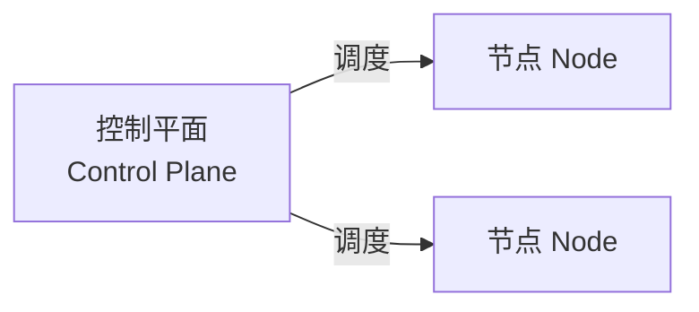

> [!DETAILS-AI] 本节 AI 摘要
> 本节介绍 Kubernetes 的控制平面与节点，以及 Pod、Deployment、Service、Namespace 等基本对象，并通过本地练习应用配置、观察滚动更新并验证 Service，不涉及生产集群搭建。

## 一、编排的用途与边界

Docker Engine 能管理单机上的容器，Compose 能描述一组服务。但它们并不会自动变成一个跨节点的控制系统。Kubernetes（一般叫它 K8s）最早由 Google 开源，现在是云原生计算基金会（CNCF）的毕业项目。它是一个开源的**容器编排**平台：在一组机器（集群）上统一调度容器——放在哪台机器、缺了补多少个、服务之间怎么互相发现、升级时怎么平滑替换，都由它接手。

Kubernetes 关心的核心问题只有一个：**集群当前的状态，怎么持续地靠近你期望的状态。**下面表格列的就是它最常被用到的地方：

| 场景 | Kubernetes 可以提供的机制 | 生效条件 |
| :--- | :--- | :--- |
| 实例退出或节点失效 | 控制器创建新的 Pod，恢复期望副本数 | 工作负载由 Deployment 等控制器管理；应用状态另行持久化 |
| 跨节点运行 | 调度器按资源请求、约束和可用节点选择位置 | 节点、网络和容器运行时已经正确配置 |
| 服务发现 | Service 为一组后端提供稳定名称和访问入口 | 标签选择器与端口配置正确，后端通过就绪检查 |
| 滚动发布 | Deployment 逐步替换旧 Pod | 更新策略、就绪探针和应用兼容性设置合理 |
| 自动扩缩容 | HPA 等控制器调整副本数 | 已安装指标链路并配置扩缩容策略 |

不过不必被它吓倒——不是所有项目都需要它。单机开发或少量服务，Docker 加 Compose 通常就够了。只有当你确实需要跨节点调度、固定维持副本数、滚动发布或者统一的服务发现时，才值得承担 K8s 的这套复杂度。

> [!NOTE] 云原生
> “云原生”不等于“把程序塞进 Kubernetes”。它牵扯应用架构、自动化交付、可观测性、弹性以及组织流程。Kubernetes 只是可选的基础设施之一，不是用来判断一个项目先不先进的标签。

## 二、核心概念

### 2.1 集群架构

Kubernetes 跑在一组机器上，合起来叫集群（Cluster）：

| 角色 | 说明 |
| :--- | :--- |
| 控制平面（Control Plane） | 提供 Kubernetes API，保存集群状态，并运行调度器和控制器 |
| 节点（Node） | 运行 Pod；节点上的 kubelet 负责与控制平面协调实际状态 |



控制平面里的 API Server 是主要入口，集群状态一般存在 etcd 中。Scheduler 给还没分配节点的 Pod 选位置，Controller Manager 跑各种控制循环。节点侧通常包含 kubelet、容器运行时，以及负责 Service 转发的数据平面组件。

托管 Kubernetes 会替我们维护其中一部分，但这些职责本身仍在。

> [!IMPORTANT] “自愈”有边界
> Kubernetes 能重建 Pod，却修不了应用逻辑、恢复被覆盖的数据，也判断不了一回发布到底符不符合业务预期。持久化、备份、探针、监控和回滚策略，照样得单独设计。

### 2.2 核心对象

Kubernetes 对象通过 API 创建和管理。实际项目一般把 YAML 或 JSON 清单纳入版本控制，临时资源也能用命令行直接建。常见对象：

| 对象 | 作用 | 常见用途 |
| :--- | :--- | :--- |
| Pod | Kubernetes 可部署的最小计算单元，包含一个或多个共享网络与存储上下文的容器 | 运行应用实例 |
| Deployment | 管理一组无状态 Pod 的副本与滚动更新，底层通过 ReplicaSet 维持数量 | Web 服务、API |
| Service | 为一组后端端点提供稳定的网络入口和服务发现 | 集群内访问、端口暴露 |
| Namespace | 为名称和部分策略提供作用域；不是天然的完整安全边界 | 按团队或环境组织资源 |

同一 Pod 内的容器共享网络命名空间，能直接用 `localhost` 互访，也能共享声明的卷。只有生命周期和资源关系绑得很紧的辅助容器才该放进同一个 Pod，别把所有服务都塞进一个 Pod。

### 2.3 声明式配置：Deployment 与 Service 示例

Kubernetes 的核心理念是**声明式**：提交期望状态，控制器不断比对实际状态、试着把它拉回来。下面这份清单包含两个对象——Deployment 维持两个 Nginx Pod，Service 按标签 `app: nginx` 挑出就绪的后端，提供稳定入口：

```yaml
apiVersion: apps/v1
kind: Deployment
metadata:
  name: nginx-demo
spec:
  replicas: 2
  selector:
    matchLabels:
      app: nginx
  template:
    metadata:
      labels:
        app: nginx
    spec:
      containers:
        - name: nginx
          image: nginx:1.28-alpine
          ports:
            - containerPort: 80
          readinessProbe:
            httpGet:
              path: /
              port: 80
            initialDelaySeconds: 2
            periodSeconds: 5
---
apiVersion: v1
kind: Service
metadata:
  name: nginx-demo
spec:
  selector:
    app: nginx
  ports:
    - name: http
      port: 80
      targetPort: 80
```

读这份 YAML 时，先看 `apiVersion` 与 `kind`，确认对象类型；再看 `metadata.name` 与标签；最后读 `spec`。不确定字段含义时，用 `kubectl explain deployment.spec.template` 查当前集群的 API Schema，而不是照着另一篇教程猜。

> [!NOTE] 标签不是不可变版本
> `nginx:1.28-alpine` 比 `latest` 明确，但镜像标签仍可能被发布者重新指向。要精确复现，记下镜像摘要。
>
> 升级前还要核对架构支持、安全公告和应用兼容性。

## 三、本地体验

### 3.1 安装 kubectl 与集群工具

先按 Kubernetes 的 [工具安装页](https://kubernetes.io/docs/tasks/tools/) 装好 `kubectl`，再挑一种本地集群工具：

| 工具 | 特点 | 适合 |
| :--- | :--- | :--- |
| [minikube](https://minikube.sigs.k8s.io/docs/) | 可选择 Docker、Podman 或虚拟机等驱动，在本机跑单节点或多节点集群 | 学习与功能实验 |
| [kind](https://kind.sigs.k8s.io/) | 把 Kubernetes 节点跑在 Docker 或 Podman 容器里 | 快速测试、CI 环境 |

kind 需要 Docker 或 Podman（容器基础见 [1.17 Docker 基础](/zh/docs/ch1/1.17-Docker-Basics)）；minikube 的依赖看所选驱动。别把两套安装命令混着抄，下面以 kind 为例。

### 3.2 创建集群并应用配置

装完建一个专用练习集群：

```bash
kind create cluster --name neoverse-lab
kubectl config current-context
kubectl cluster-info
kubectl get nodes
```

当前上下文应该是 `kind-neoverse-lab`。把 2.3 的 YAML 存成 `deploy.yaml`，应用并等 Deployment 就绪：

```bash
kubectl apply -f deploy.yaml
kubectl rollout status deployment/nginx-demo --timeout=120s
kubectl get pods -o wide
kubectl get service nginx-demo
```

Service 默认是 `ClusterIP`，只能在集群网络内部访问。本地练习可以临时转发端口：

```bash
kubectl port-forward service/nginx-demo 8080:80
```

命令保持运行，浏览器打开 `http://localhost:8080`。验证完按 `Ctrl + C` 停掉转发。

### 3.3 观察滚动更新

Deployment 的典型用法是滚动发布：新版本 Pod 逐个就绪后，再替换旧的。改镜像版本触发一次更新：

```bash
kubectl set image deployment/nginx-demo nginx=nginx:1.29-alpine
kubectl rollout status deployment/nginx-demo --timeout=120s
kubectl rollout history deployment/nginx-demo
kubectl get pods -o wide
```

`rollout status` 会等滚动完成；`get pods -o wide` 能同时看到新旧两批 Pod 交替的过程。滚动期间新 Pod 通过就绪检查才会接管流量，旧 Pod 会继续服务到替换完成。

> [!TIP] 回滚
> 发布不符合预期时，`kubectl rollout undo deployment/nginx-demo` 可以回滚到上一个版本，`kubectl rollout undo deployment/nginx-demo --to-revision=1` 则回到指定版本。

### 3.4 常用命令

```bash
kubectl get nodes              # 查看节点
kubectl get pods               # 查看 Pod
kubectl get deployments        # 查看 Deployment
kubectl apply -f deploy.yaml   # 应用配置
kubectl delete -f deploy.yaml  # 删除配置
kubectl logs pod-name          # 查看指定 Pod 的日志
kubectl describe pod pod-name  # 查看指定 Pod 的详细信息
kubectl get events --sort-by=.metadata.creationTimestamp # 按创建时间查看事件
kubectl explain deployment.spec # 从 API Schema 查看字段说明
kubectl get all                # 查看当前命名空间的一组常见资源，并非“全部对象”
```

> [!TIP] kubectl 写操作前先确认目标
> `kubectl` 通过 Kubernetes API 跟集群交互。它一般从 `~/.kube/config` 读集群、用户和上下文，也可能受 `KUBECONFIG` 和命令行参数影响。执行 `apply`、`delete` 这类写操作前，先用 `kubectl config current-context` 和 `kubectl config view --minify` 确认目标集群和 Namespace 无误。

练习结束，确认当前上下文还是 `kind-neoverse-lab`，再清理练习资源：

```bash
kubectl delete -f deploy.yaml
kind delete cluster --name neoverse-lab
```

## 四、TODO 清单

- [ ] 了解集群中控制平面与节点的分工
- [ ] 了解 Pod、Deployment、Service 三个对象各自的作用
- [ ] 尝试阅读一个最简单的 Deployment YAML 并了解它声明了什么

## 五、值得我们进一步阅读的资料

- [Kubernetes 组件](https://kubernetes.io/zh-cn/docs/concepts/overview/components/)
- [Pod 与工作负载](https://kubernetes.io/zh-cn/docs/concepts/workloads/pods/)
- [Deployment](https://kubernetes.io/zh-cn/docs/concepts/workloads/controllers/deployment/)
- [Service](https://kubernetes.io/zh-cn/docs/concepts/services-networking/service/)
- [安装 kubectl、kind 与 minikube](https://kubernetes.io/zh-cn/docs/tasks/tools/)
