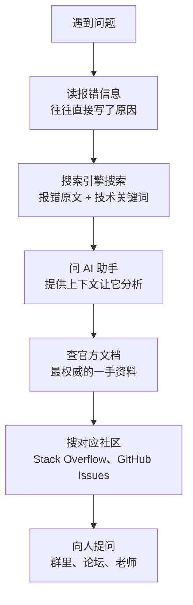

> [!DETAILS-AI] 本节 AI 摘要
> 本节讲解如何高效提问：先搜索再提问的原则、提问前的自查清单、结构化提问模板（环境、问题、尝试、期望）、最小可复现示例的制作、提问礼仪与常见误区。学完能减少沟通成本，更快获得帮助。

> [!INFO]
> 提问是我们每天都会做的事情，但「会不会提问」，往往决定了别人是否愿意花时间帮我们。
>
> 本节的内容主要源自开源社区流传已久的经典文章 [《提问的智慧》](https://github.com/ryanhanwu/How-To-Ask-Questions-The-Smart-Way)，我们结合常见的场景做了整理并加了与 AI 有关的内容。有兴趣的话，强烈建议通读原文。

## 一、先搜索，再提问

### 1.1 为什么先搜索

在我们遇到问题之前，大概率已经有人遇到过同样的问题，并且得到了回答。直接搜索往往比提问更快，「自己找到答案」的过程本身就是学习。

> [!NOTE] 换位思考
> 提问本质上是在占用别人的时间。先自己搜索、查阅文档，既是高效的学习方式，也是对回答者时间的尊重。
>
> 反过来想：如果别人没查过就来问我们，我们自己也会希望对方先做点功课，对吧？

> [!TIP] “RTFM 与 STFW 你很有可能搞杂了”：
> 在技术社区里，我们可能会看到两个流传已久的缩写——`RTFM`（Read The Fucking Manual，去读他妈的手册）与 `STFW`（Search The Fucking Web，他妈的网上搜索）。
>
> 温和一点的表达，也可以把它们说成 `Read The Friendly Manual` 与 `Search The Friendly Web`。
>
> 字面虽然有点不雅，但这其实是《提问的智慧》里最直白的提醒：提问之前，务必先自己读一读相关手册，先自己到搜索引擎上搜一搜。

### 1.2 搜索的顺序

遇到问题时，可以按下面的梯度逐级查找：



每一步花的时间不超过 10 分钟，都没找到答案再进入下一步。多数问题在前三步就能解决。

### 1.3 搜索技巧

搜索技巧的完整说明见 [1.3 浏览器](/zh/docs/ch1/1.3-Browser) 中的「搜索运算符」，这里强调几点：

| 技巧 | 说明 | 示例 |
| :--- | :--- | :--- |
| 复制完整报错 | 不要只搜「程序报错了」，把关键报错文本整段粘进搜索框 | `Segmentation fault (core dumped)` |
| 用英文搜技术问题 | 中文社区技术内容质量参差，英文搜索往往一步到位 | `c++ segmentation fault linked list` |
| 加版本号 | 加上软件版本能过滤掉过时答案 | `Node.js 20 EACCES error` |
| 限定网站 | 加 `site:stackoverflow.com`，答案质量更高 | `python csv 乱码 site:stackoverflow.com` |

## 二、提问的结构

搜索了、试过了，还是没解决，这时候才需要向人提问。但「怎么问」同样有讲究。

### 2.1 好问题 vs 坏问题

先看两个对比，直观感受差距：

> [!DETAILS-EXAMPLE] 群聊常见坏问题
> 在吗？我的代码跑不了，谁能帮看看？
>
> ``
>
> 急，在线等！

问题在哪：

- 「在吗」是无效信息，浪费别人时间
- 没说是什么语言、什么环境、什么报错
- 截图看不到关键信息（完整代码、完整报错）
- 「急」不是别人优先帮我们的理由

> [!DETAILS-EXAMPLE] 结构化的好问题
> 我在写一个 C++ 的链表删除函数，编译时遇到报错，已经搜过但没找到解决办法。
>
> **环境**: Windows 11, g++ 13.2, VS Code
> **目标**：删除链表中指定值的节点
> **报错**: `error: no match for 'operator!=' (operand types are 'Node' and 'int')`
> **相关代码**:
>
> ```cpp
> void remove(Node* head, int val) {
>     while（head != val） {  // 这里报错
>         head = head->next;
>     }
> }
> ```
>
> **我的理解**：我以为 `head != val` 能比较节点值，但报错说类型不匹配。是不是应该用 `head->data != val`?
>
> **已尝试**：搜过「C++ linked list remove」，但示例里用的都是 `head->val`，我的结构体里字段叫 `data`，改了之后还是报错。

好在哪里：一句话说清目标、环境、问题，给出完整报错，贴了相关代码，说了自己的理解和已尝试的办法，让回答者一眼就知道问题在哪。

| 维度 | 坏问题 | 好问题 |
| :--- | :--- | :--- |
| 开场 | 「在吗？」「求助！」 | 直接说目标与环境 |
| 报错 | 「报错了」「跑不了」 | 完整报错原文 |
| 代码 | 截图 / 不贴 | 代码块，标注语言 |
| 已尝试 | 不提 | 列出搜过什么、试过什么 |
| 标题 | 「新手求助」 | 技术栈 + 问题现象 + 关键错误 |
| 态度 | 「急，在线等」 | 平等交流，不催促 |

### 2.2 提问的标准模板

把上面的好问题提炼成模板，以后提问照着填：

> [!DETAILS-EXAMPLE] 提问标准模板
>
> ```text
> 【背景】我在做什么，用了什么技术栈 / 版本
> 【目标】我期望达到什么效果
> 【现状】实际发生了什么，完整报错是什么
> 【复现】怎样能重新触发这个问题（最小步骤）
> 【代码】最小可复现代码（贴在代码块里，不要截图）
> 【已尝试】我搜过什么、试过什么、为什么不 work
> 【理解】我目前对问题的猜测
> ```

> [!TIP] 四项是底线
> 不必每条都写，但「背景、现状、代码、已尝试」这四项是底线。缺任何一项，回答者都要反复追问，双方都累。

## 三、最小可复现示例

模板里的「最小可复现代码」不是从项目中随意截取一段代码，而是一个经过验证、能让他人独立重现问题的示例。Stack Overflow 当前使用 **Minimal, Reproducible Example（MRE）**；我们也可能在旧资料中看到 MCVE 或 MWE 等名称。

### 3.1 MRE 的三个要求

| 要求 | 含义 | 自检问题 |
| :--- | :--- | :--- |
| **Minimal** | 只保留触发问题所必需的内容 | 删除这一段后，问题仍会出现吗？ |
| **Complete** | 包含复现所需的代码、数据、依赖和命令 | 别人能在新目录中独立运行吗？ |
| **Reproducible** | 已重新测试，能够稳定得到所描述的结果 | 实际结果和预期结果是否写清楚？ |

> [!INFO] 精简本身就是调试
> 逐步删除无关代码、固定输入并重复运行，常常能缩小问题范围，甚至在提问前找到原因。即使没有找到答案，我们也会得到一个更容易讨论和测试的样例。

### 3.2 制作步骤

1. 复制问题代码到一个新的最小目录，不要直接破坏原项目。
2. 记录运行环境、依赖版本和完整命令。
3. 逐步删除无关功能，每次删除后重新确认问题仍然存在。
4. 用固定、非敏感的输入替代数据库、网络服务和个人文件。
5. 从全新目录或另一台设备再次执行，确认步骤没有依赖隐藏状态。

> [!WARNING] 发布前清理敏感信息
> 删除访问令牌、密码、学号、真实数据、内网地址和私有仓库链接。不要只把密钥替换成星号后继续使用原密钥；如果秘密已经公开，应立即撤销并轮换。

### 3.3 用代码块，不要截图

代码截图无法复制、搜索或直接运行，也不利于屏幕阅读器。代码、配置和日志应使用带语言标识的代码块；只有界面布局、图形渲染等无法用文本表达的问题才需要截图。

````markdown
```cpp
#include <iostream>

int main() {
    std::cout << "hello";
    return 0;
}
```
````

> [!DETAILS-EXAMPLE] MRE 发布前检查
>
> - 示例能否从空目录按步骤运行？
> - 是否写明预期结果与实际结果？
> - 是否保留了完整错误文本和首个相关堆栈？
> - 是否删除了所有隐私与凭据？

### 3.4 橡皮鸭调试法

在动手制作 MRE 之前，还有一个更轻量的小技巧值得先试：找一只「橡皮鸭」，把问题讲一遍。

最早的来源可以追溯到《程序员修炼之道》（The Pragmatic Programmer）一书，作者以此讽刺程序员对 bug 的困惑往往在自己「开口解释」的过程中就消失了：

> [!DETAILS-EXAMPLE] 橡皮鸭调试法
> 拿一只橡皮鸭（桌子上的任何玩偶、水杯都行），把它放在显示器旁边。
>
> 开始调试时，对着橡皮鸭逐行解释我们的代码：这一行在做什么、我们期望它做什么、实际发生了什么。讲解的过程中，往往还没讲完，我们就已经发现 bug 在哪了。

为什么会有效？「讲出来」和「在脑子里想」是两回事：大脑很容易「脑补」掉自己不确定的部分，而开口说话时，每一行都必须被明确地说出来，任何偷懒的假设都会暴露。

> [!TIP] 提问前，先对橡皮鸭讲一遍
> 如果对着鸭子讲完，还是说不清楚问题出在哪，往往说明「还没完全想清楚」——这正是先整理好提问模板、把现象与预期写清楚的时机。这也能在提问前过滤掉大部分问题，让回答者拿到的是真正经过梳理的困惑。

## 四、提问的礼仪

结构对了、代码够精简，还差最后一步：在对的地方、用对的态度提问。

### 4.1 选择合适的场合

| 场合 | 适合的问题 | 响应速度 |
| :--- | :--- | :--- |
| 搜索引擎 | 几乎所有问题 | 即时 |
| Stack Overflow | 具体的技术问题 | 几小时到几天 |
| GitHub Issues | 某个项目的 bug 或疑问 | 取决于维护者 |
| 课程群 / 班级群 | 课业相关、共享性问题 | 取决于群活跃度 |
| 私聊老师 / 助教 | 课程要求、个人成绩 | 1-2 个工作日 |
| 论坛（知乎、V2EX） | 开放性、讨论性问题 | 几小时到几天 |

> [!TIP] 能公开问就别私聊
> 能在公开场合问的，就不要私聊。公开提问能让更多人受益，也方便后人搜索到答案。私聊只在涉及个人隐私或成绩时使用。更多平台介绍见 [1.6 社区与相关平台](/zh/docs/ch1/1.6-Community-Platforms)。

### 4.2 标题要具体

在论坛或邮件里提问，标题是别人决定是否点进来的第一道门。

| 坏标题 | 好标题 |
| :--- | :--- |
| 求助！ | C++ 链表删除节点时出现 segmentation fault |
| 代码跑不了 | Node.js 20 运行 `npm install` 报 EACCES 权限错误 |
| 新手问题 | Python 读取 CSV 时中文乱码，已设置 utf-8 仍无效 |

好标题包含：**技术栈 + 问题现象 + 关键错误**，让人一眼判断自己能不能帮上忙。

### 4.3 不做「伸手党」

「伸手党」指那些只想索取、不愿自己动手的人。典型表现：

- 直接发题目要求别人给答案
- 伸手要源码、要笔记、要破解软件
- 问「有没有 xxx 教程」（搜索引擎一搜就有）
- 收到答案后从不反馈、从不道谢

> [!TIP] 展示我们的努力
> 提问时展示我们已经做过的努力，是对回答者最基本的尊重。反过来，别人愿意花时间帮我们，也值得我们认真对待。

### 4.4 回应答案

得到回答后：

| 步骤 | 说明 |
| :--- | :--- |
| 及时反馈 | 试了有没有用，告诉对方 |
| 说明结果 | 解决了就说解决了，没解决就说卡在哪 |
| 表达感谢 | 一句「谢谢，解决了」足矣，但很重要 |
| 分享经验 | 如果用了别的方法解决，回来补充一下，帮助后来人 |

## 五、提问中的常见误区

掌握了正确的提问方法，还得知道哪些坑不能踩。下面三种是最常见的提问误区，看起来是小问题，实际上会让我们的问题石沉大海。

### 5.1 XY 问题

「XY 问题」是指：我们想解决 X，我们觉得方法 Y 能解决，于是我们问「怎么做 Y」，但 Y 其实是错的思路，真正该问的是 X。

> 例如：我们问「怎么用正则提取 HTML 里的所有 `<div>`」，但真正目标是「解析 HTML 并取得所有 `div` 的内容」。前者用正则极易出错，后者用 HTML 解析库一句话搞定。

避免 XY 问题的办法：提问时同时说明「我想做什么（X）」和「我打算怎么做（Y）」，让回答者有机会指出更优解。

### 5.2 「不 work」式提问

「不 work」式提问只说“不 work”这个现象，不带任何上下文，等于把排查责任全推给回答者，好像别人欠我们一个解释。更好的说法是「我期望 A，实际得到 B，差距可能在哪里」，把问题描述清楚，而不是要别人替我们 debug。

### 5.3 一问多题

一次问五六个不相关的问题，会让回答者望而却步。一次只问一个核心问题，解决了再问下一个。

## 六、向 AI 提问

到目前为止讲的都是「向人提问」，但如今我们还有一个全年无休的「回答者」——AI 助手。好消息是，上面的原则几乎全部适用；坏消息是，AI 有 AI 自己的坑——不过其中不少已经被更强的新模型填平了。

### 6.1 AI 也是「回答者」

AI 助手（ChatGPT、Claude 等）也是「回答者」，同样适用上面的原则。给 AI 提问时：

| 原则 | 说明 |
| :--- | :--- |
| 给上下文 | 说明我们在做什么、用什么技术栈 |
| 给约束 | 说明我们不能用什么、有什么限制 |
| 分步问 | 复杂问题拆成小步骤，一步一步确认 |
| 要解释 | 不只问「怎么写」，还要问「为什么这么写」 |
| 验证 | AI 会幻觉，代码一定要自己跑一遍 |

### 6.2 能力与注意力的边界

AI 助手的能力更新得很快。过去常见的短板——知识有截止时间、默认不能上网、算术容易出错、上下文很短——在如今的主流模型中大多已经逐渐解决：内置联网搜索、更大的上下文窗口和更强的推理能力，都已成为或正在成为标配。先看这些曾经的短板如今怎么样了：

| 曾经的短板 | 现状 | 仍需注意 |
| :--- | :--- | :--- |
| 知识有截止时间 | 训练数据仍有截止日期，但内置联网搜索可以查到最新内容 | 涉及新版本、新功能时，明确要求它联网搜索并核对来源 |
| 默认不联网 | 主流助手大多已内置联网搜索 | 确认真实联网：让它给出引用来源，重要内容再查官方文档 |
| 不擅长算术 | 新一代推理模型在数学与逻辑上已经相当可靠 | 关键数字、行号、文件名等精确信息，仍建议自己核对一遍 |
| 上下文窗口有限 | 窗口已扩展到十万级甚至更大，常见代码与日志都能容纳 | 超长材料仍建议精简、分段给出 |

短板在填平，但还有两条边界始终需要我们自己把握：**幻觉**（见 6.3）与**注意力稀释**。先说注意力：即使信息都在上下文窗口内，对话越长、内容越多，模型对每一个细节的关注度就越低——尤其是夹在中间位置的早期内容，往往最容易「被忽略」。

和 AI 聊久了，我们会遇到一个「客服腔」的梗：它开篇总要先来一段安抚，把注意力最集中的位置让给承诺——

> “我会稳稳妥妥地接住你，详细地、认真地、逐条地为你分析问题，并给你最合适解决方案！”
>
> “我会认真地、仔细地帮你分析这个问题。”
>
> “我的看法是完全可行的，我们来一步步解决。”
>
> “请放心的交给我，我会一步步给你解决的方案。”

一个信息量都没有，但每次看到还是忍不住会心一笑——跳过它，直接看后面的正题就好。

> [!TIP] 关键信息要「重述」，不要指望它一直记得
> 长对话中，开头提到的关键细节（技术栈、目录、报错文本）可能已被模型「遗忘」。
>
> 实践中更可靠的做法是：开新对话，并把关键信息重新完整地写在最新一条消息里。这不代表我们记忆差，而是我们照顾到模型注意力的边界。

### 6.3 幻觉：一本正经地胡说八道

「幻觉」（Hallucination）指模型生成出看似合理、实则子虚乌有的内容。更强的模型降低了幻觉的出现频率，但并没有根除它——因为模型的任务是「续写最像样的文字」，而不是查证事实：当信息不在训练数据中时，它不一定会说「不知道」，而是可能编一个听上去很专业的答案。

典型表现：

| 幻觉类型 | 示例 |
| :--- | :--- |
| 编造函数 / API | 推荐一个不存在的函数，参数却写得煞有其事 |
| 编造论文 / 引用 | 给出看起来真实、实际不存在的文献或链接 |
| 编造快捷键 / 配置项 | 声称某版本支持某项功能，实际并无 |
| 自信地胡说 | 对错误答案用斩钉截铁的语气表达，毫无「不确定」的痕迹 |

> [!WARNING] 自信 ≠ 正确
> 幻觉最麻烦的地方在于：它犯错时往往非常自信，读起来和正确答案毫无区别。
>
> 任何重要的代码、命令和配置，都要自己运行验证一遍，并和官方文档交叉核对。这也是 6.1 里「验证」原则存在的原因。

### 6.4 给 AI 的好提示词示例

> [!DETAILS-EXAMPLE+]
>
> ```text
> 我在学 C++ 数据结构，刚接触链表。
> 环境：g++ 15.2, Windows 11。
> 我写了一个反转单链表的函数，但输出不对（原样输出）。
> 代码如下：
> [贴代码]
> 
> 请帮我：
> 1. 指出 bug 在哪
> 2. 解释为什么会导致原样输出
> 3. 给出修正后的代码
> ```

> [!TIP] 让 AI 当我们的助教
> 最好的用法是让 AI「引导」而非「代劳」。明确告诉它「先给提示，不要直接给答案」，这样我们能从 AI 那学到思路，而不是养成依赖。

## 七、TODO 清单

- [ ] 遇到问题时，按「报错信息 → 搜索引擎 → AI 助手 → 官方文档 → 社区 → 人」的顺序排查一次
- [ ] 把最近遇到的某个问题，用标准模板改写成一份完整提问
- [ ] 制作一个可独立复现的 MRE，并在全新目录中验证一遍
- [ ] 在课程群或社区，帮朋友回答一个我们会的问题
- [ ] 把本节内容讲给一位朋友听，互相检查提问中的常见误区😉

## 八、值得我们思考的问题

> [!DETAILS-FAQ] 为什么不同人向 AI 提问，得到的结果质量会有所差异？
> AI 会根据我们提供的问题、背景和上下文来理解需求。描述得越清楚，提供的信息越完整，它就越容易给出符合预期的回答。
>
> 与其刻意研究复杂的“提示词技巧”，不如先把「我想做什么、现在是什么情况、有哪些困境」说明白。很多时候，提问质量的差距，本质上就是信息表达质量的差距。
>
> 同时，AI 的生成具有一定随机性，不同模型、不同上下文和可用工具，也都会影响最终结果。
