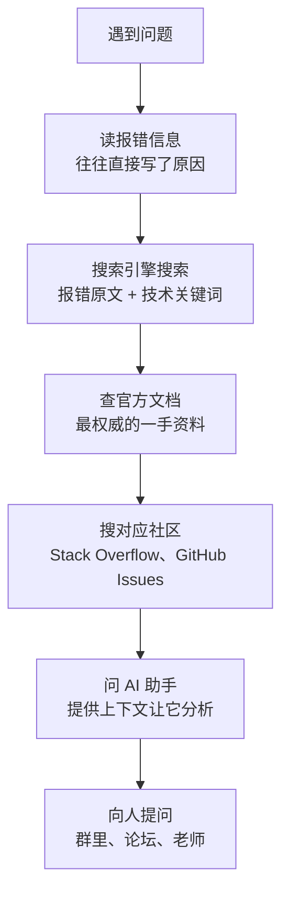

> [!DETAILS-AI] 本节 AI 摘要
> 本节讲解如何高效提问：先搜索再提问的原则、提问前的自查清单、结构化提问模板（环境、问题、尝试、期望）、最小可复现示例的制作、给 AI 提问的 Prompt 技巧。学完能减少沟通成本，更快获得帮助。

提问是一种能力。同样一个问题, 问得好的人三分钟就能得到答案, 问得差的人在群里发十遍也没人理。差别不在问题难度, 而在提问的方式。计算机领域有一篇经典文章 [《提问的智慧》](https://github.com/ryanhanwu/How-To-Ask-Questions-The-Smart-Way), 本节的核心思想源自于此, 强烈建议通读原文。

---

## 一、先搜索, 再提问

### 1. 为什么先搜索

在你遇到问题之前, 世界上大概率已经有人遇到过同样的问题, 并且已经得到了回答。直接搜索往往比提问更快, 而且 "自己找到答案" 的过程本身就是学习。

> [!WARNING] 提问前没有搜索等于不尊重
> 提问前没有搜索过, 等于在说: "我的时间比你的时间宝贵, 你去帮我查吧"。这种态度会让愿意帮你的人敬而远之。

### 2. 搜索的顺序

遇到问题时的查找顺序, 按下面这个梯度走:



每一步花的时间不超过 10 分钟, 都没找到答案再进入下一步。90% 的问题在前三步就能解决。

### 3. 搜索技巧

搜索技巧的完整说明见 [1.3 浏览器](/zh/docs/ch1/1.3-Browser) 中的 "搜索运算符", 这里强调几点:

| 技巧 | 说明 | 示例 |
| :--- | :--- | :--- |
| 复制完整报错 | 不要只搜 "程序报错了", 把关键报错文本整段粘进搜索框 | `Segmentation fault (core dumped)` |
| 用英文搜技术问题 | 中文社区技术内容质量参差, 英文搜索往往一步到位 | `c++ segmentation fault linked list` |
| 加版本号 | 加上软件版本能过滤掉过时答案 | `Node.js 20 EACCES error` |
| 限定网站 | 加 `site:stackoverflow.com`, 答案质量更高 | `python csv 乱码 site:stackoverflow.com` |

---

## 二、提问的结构

### 1. 好问题 vs 坏问题

先看两个对比, 直观感受差距:

#### 坏问题 (群聊常见版)

> [!DETAILS-EXAMPLE] 群聊常见坏问题
> 在吗? 我的代码跑不了, 谁能帮看看?
> 
> 急, 在线等!!!

问题在哪:

- "在吗" 是无效信息, 浪费别人时间
- 没说是什么语言、什么环境、什么报错
- 截图看不到关键信息 (完整代码、完整报错)
- "急" 不是别人优先帮你的理由

#### 好问题

> [!DETAILS-EXAMPLE] 结构化的好问题
> 我在写一个 C++ 的链表删除函数, 编译时遇到报错, 已经搜过但没找到解决办法。
>
> **环境**: Windows 11, g++ 13.2, VS Code
> **目标**: 删除链表中指定值的节点
> **报错**: `error: no match for 'operator!=' (operand types are 'Node' and 'int')`
> **相关代码**:
>
> ```cpp
> void remove(Node* head, int val) {
>     while (head != val) {  // 这里报错
>         head = head->next;
>     }
> }
> ```
>
> **我的理解**: 我以为 `head != val` 能比较节点值, 但报错说类型不匹配。是不是应该用 `head->data != val`?
>
> **已尝试**: 搜过 "C++ linked list remove", 但示例里用的都是 `head->val`, 我的结构体里字段叫 `data`, 改了之后还是报错。

好在哪里: 一句话说清目标、环境、问题, 给出完整报错, 贴了相关代码, 说了自己的理解和已尝试的办法, 让回答者一眼就知道问题在哪。

### 2. 好问题 vs 坏问题对比

| 维度 | 坏问题 | 好问题 |
| :--- | :--- | :--- |
| 开场 | "在吗?" "求助!!!" | 直接说目标与环境 |
| 报错 | "报错了" "跑不了" | 完整报错原文 |
| 代码 | 截图 / 不贴 | 代码块, 标注语言 |
| 已尝试 | 不提 | 列出搜过什么、试过什么 |
| 标题 | "新手求助" | "技术栈 + 问题现象 + 关键错误" |
| 态度 | "急, 在线等" | 平等交流, 不催促 |

### 3. 提问的标准模板

把上面的好问题提炼成模板, 以后提问照着填:

> [!DETAILS-EXAMPLE] 提问标准模板
>
> ```text
> 【背景】我在做什么, 用了什么技术栈 / 版本
> 【目标】我期望达到什么效果
> 【现状】实际发生了什么, 完整报错是什么
> 【复现】怎样能重新触发这个问题 (最小步骤)
> 【代码】最小可复现代码 (贴在代码块里, 不要截图)
> 【已尝试】我搜过什么、试过什么、为什么不 work
> 【理解】我目前对问题的猜测
> ```

> [!IMPORTANT] 四项是底线
> 不必每条都写, 但 "背景、现状、代码、已尝试" 这四项是底线。缺任何一项, 回答者都要反复追问, 双方都累。

---

## 三、MCVE: 最小可复现示例

### 1. 什么是 MCVE

MCVE 是 **Minimal, Complete, Verifiable Example** (最小、完整、可验证示例) 的缩写, 是 Stack Overflow 提出的提问标准:

| 字母 | 含义 | 要求 |
| :--- | :--- | :--- |
| **M**inimal | 最小 | 去掉一切与问题无关的代码, 只保留触发问题的部分 |
| **C**omplete | 完整 | 别人复制粘贴就能运行, 不缺依赖、不缺定义 |
| **V**erifiable | 可验证 | 确实能复现你说的问题, 而不是 "在我这好好的" |

> [!INFO] MCVE 的隐藏价值
> 制作 MCVE 的过程本身就是 debug。据统计, 在精简代码复现问题的过程中, 一半的 bug 会自己浮出来。很多时候你还没把代码精简完, 就已经发现问题在哪了。

### 2. 为什么要做 MCVE

1. **帮别人帮你**: 回答者不用花时间装环境、猜上下文
2. **帮自己找 bug**: 在精简代码的过程中, 一半的 bug 会自己浮出来
3. **尊重他人时间**: 一个 500 行的项目丢过去, 多数人会选择无视

### 3. 怎么做 MCVE

| 步骤 | 操作 |
| :--- | :--- |
| 1. 复制完整代码到新文件 | 确保能跑 |
| 2. 删掉与问题无关的部分 | 每删一段就重新运行, 确认问题还在 |
| 3. 用硬编码替代外部输入 | 把 `cin >> n` 换成 `int n = 5;`, 减少运行步骤 |
| 4. 加必要注释 | 标注 "这里报错"、"这里期望输出 X" |
| 5. 放到在线平台验证 | 用 [Compiler Explorer](https://godbolt.org/)、[CodePen](https://codepen.io/) 等, 确认别人能直接打开运行 |

### 4. 用代码块, 不要截图

代码截图无法复制、无法搜索、无法被屏幕阅读器识别。**永远用代码块贴代码**, 并标注语言:

````markdown
```cpp
#include <iostream>
int main() {
    std::cout << "hello";
    return 0;
}
```
````

> [!IMPORTANT] 何时用截图
> 例外: 如果是 UI 显示问题、报错弹窗, 截图比代码更直观, 这时截图是合适的。但代码本身仍然要用代码块贴一份。

---

## 四、提问的礼仪

### 1. 选择合适的场合

| 场合 | 适合的问题 | 响应速度 |
| :--- | :--- | :--- |
| 搜索引擎 | 几乎所有问题 | 即时 |
| Stack Overflow | 具体的技术问题 | 几小时到几天 |
| GitHub Issues | 某个项目的 bug 或疑问 | 取决于维护者 |
| 课程群 / 班级群 | 课业相关、共享性问题 | 取决于群活跃度 |
| 私聊老师 / 助教 | 课程要求、个人成绩 | 1-2 个工作日 |
| 论坛 (知乎、V2EX) | 开放性、讨论性问题 | 几小时到几天 |

> [!TIP] 能公开问就别私聊
> 能在公开场合问的, 就不要私聊。公开提问能让更多人受益, 也方便后人搜索到答案。私聊只在涉及个人隐私或成绩时使用。更多平台介绍见 [1.7 社区与相关平台](/zh/docs/ch1/1.7-Community-Platforms)。

### 2. 标题要具体

在论坛或邮件里提问, 标题是别人决定是否点进来的第一道门。

| 坏标题 | 好标题 |
| :--- | :--- |
| 求助!!! | C++ 链表删除节点时出现 segmentation fault |
| 代码跑不了 | Node.js 20 运行 `npm install` 报 EACCES 权限错误 |
| 新手问题 | Python 读取 CSV 时中文乱码, 已设置 utf-8 仍无效 |

好标题包含: **技术栈 + 问题现象 + 关键错误**, 让人一眼判断自己能不能帮上忙。

### 3. 不要做 "伸手党"

"伸手党" 指那些只想索取、不愿自己动手的人。典型表现:

- 直接发题目要求别人给答案
- 伸手要源码、要笔记、要破解软件
- 问 "有没有 xxx 教程" (搜索引擎一搜就有)
- 收到答案后从不反馈、从不道谢

> [!CAUTION] 信誉会被消耗完
> 这种行为会迅速消耗你在社区里的信誉, 最终你会发现没人愿意理你。提问时展示你已经做过的努力, 是对回答者最基本的尊重。

### 4. 回应答案

得到回答后:

| 步骤 | 说明 |
| :--- | :--- |
| 及时反馈 | 试了有没有用, 告诉对方 |
| 说明结果 | 解决了就说解决了, 没解决就说卡在哪 |
| 表达感谢 | 一句 "谢谢, 解决了" 足矣, 但很重要 |
| 分享经验 | 如果用了别的方法解决, 回来补充一下, 帮助后来人 |

---

## 五、常见反模式

### 1. XY 问题

"XY 问题" 是指: 你想解决 X, 你觉得方法 Y 能解决, 于是你问 "怎么做 Y", 但 Y 其实是错的思路, 真正该问的是 X。

> 例子: 你问 "怎么用正则提取 HTML 里的所有 `<div>`", 但其实你是想 "解析 HTML 拿到所有 div 的内容"。前者用正则极易出错, 后者用 HTML 解析库一句话搞定。

避免 XY 问题的办法: 提问时同时说明 "我想做什么 (X)" 和 "我打算怎么做 (Y)", 让回答者有机会指出更优解。

### 2. "为什么不 work"

"为什么不 work" 这种问法把责任推给了回答者, 好像别人欠你一个解释。更好的说法是 "我期望 A, 实际得到 B, 差距可能在哪里", 把问题描述清楚, 而不是要别人替你 debug。

### 3. 一问多题

一次问五六个不相关的问题, 会让回答者望而却步。一次只问一个核心问题, 解决了再问下一个。

---

## 六、向 AI 提问

### 1. AI 也是 "回答者"

AI 助手 (ChatGPT、Claude 等) 也是 "回答者", 同样适用上面的原则。给 AI 提问时:

| 原则 | 说明 |
| :--- | :--- |
| 给上下文 | 说明你在做什么、用什么技术栈 |
| 给约束 | 说明你不能用什么、有什么限制 |
| 分步问 | 复杂问题拆成小步骤, 一步一步确认 |
| 要解释 | 不只问 "怎么写", 还要问 "为什么这么写" |
| 验证 | AI 会幻觉, 代码一定要自己跑一遍 |

### 2. 给 AI 的好 prompt 示例

> [!DETAILS-EXAMPLE] 给 AI 的好 Prompt 示例
>
> ```text
> 我在学 C++ 数据结构, 刚接触链表。
> 环境: g++ 13.2, Windows 11。
> 我写了一个反转单链表的函数, 但输出不对 (原样输出)。
> 代码如下:
> [贴代码]
> 请帮我:
> 1. 指出 bug 在哪
> 2. 解释为什么会导致原样输出
> 3. 给出修正后的代码
> 不要直接给答案, 先给我提示让我自己想。
> ```

> [!TIP] 让 AI 当你的助教
> 最好的用法是让 AI "引导" 而非 "代劳"。明确告诉它 "先给提示, 不要直接给答案", 这样你能从 AI 那学到思路, 而不是养成依赖。

> [!NOTE] 提问能力终身受益
> 提问的能力不会天生, 但一旦掌握, 终身受益。它不仅让你在技术社区如鱼得水, 也会渗透到你的求职、汇报、沟通的方方面面。
