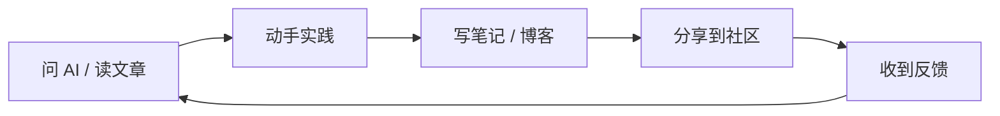

> [!DETAILS-AI] 本节 AI 摘要
> 本节介绍我们应关注的社区平台：GitHub 代码托管与开源协作、Stack Overflow 问答社区、学术资源，以及博客平台与 RSS 订阅等「上个时代的方式」。向 AI 提问属于 [1.5 提问的智慧](/zh/docs/ch1/1.5-Asking-Questions) 的范畴，本节不再重复。学完能建立自己的技术信息源与学习圈子。

> [!INFO]
> 如何向 AI 提问、如何验证 AI 的答案，详见 [1.5 提问的智慧](/zh/docs/ch1/1.5-Asking-Questions)。
>
> 本节只介绍 AI 替代不了的社区：代码托管与开源协作、问答社区、学术资源与内容平台。

## 一、GitHub：代码托管与开源协作

代码本身的托管、协作、历史与社区，集中在 GitHub 上。它是我们接触真实工程的一扇窗。

### 1.1 GitHub 是什么

[GitHub](https://github.com/) 是全球最大的代码托管平台（之一），基于 Git 版本控制系统。它以 Git 仓库为基础，提供代码审查、Issue、自动化和项目协作功能。远程仓库不是普通网盘：只有已经提交并推送的内容才会进入版本历史。

几乎所有知名开源项目（Linux、VS Code、React、Vue...）都在 GitHub 上。Git 的基础用法见 [1.15 版本控制与 Git](/zh/docs/ch1/1.15-Version-Control-Git)。
但现在，我们并不需要了解它。

### 1.2 核心概念

| 概念 | 说明 |
| :--- | :--- |
| Repository（仓库） | 一个项目的代码集合，简称 repo |
| Star（星标） | 相当于「点赞 + 收藏」，表示我们喜欢这个项目 |
| Fork（派生） | 把别人的仓库复制一份到自己账号下，可独立修改 |
| Pull Request（PR） | 请求把我们的改动合并到原仓库，是参与开源的核心动作 |
| Issue（议题） | 报告 bug、提建议、讨论问题 |
| Watch（关注） | 订阅仓库的动态，有新 issue / PR 会通知我们 |
| Gist | 存放代码片段，比 repo 更轻量 |

### 1.3 GitHub Student Developer Pack

通过 GitHub Education 验证的在读学生，可以申请 [GitHub Student Developer Pack](https://education.github.com/pack)。

申请通常需要学校邮箱或能够证明当前学籍的材料，具体资格以 GitHub 官方说明为准。

> [!IMPORTANT]
> 学生包中的第三方产品、额度和期限等可能会随时调整。申请成功后，记得为到期后的数据导出或迁移预留时间与方案。

## 二、学术资源

偏工程的问题靠 AI 和社区，但作为科班生，我们迟早要读论文、查文献。学术资源是另一个维度的知识来源。

| 平台 | 用途 |
| :--- | :--- |
| [Google Scholar](https://scholar.google.com/) | 学术搜索，跨数据库 |
| [arXiv](https://arxiv.org/) | CS、物理、数学预印本，免费看最新论文 |
| [DBLP](https://dblp.org/) | 计算机科学文献库，查作者发表记录 |
| [知网（CNKI）](https://www.cnki.net/) | 中文学术文献 |
| [IEEE Xplore](https://ieeexplore.ieee.org/) | IEEE 会议和期刊 |
| [ACM Digital Library](https://dl.acm.org/) | ACM 会议和期刊 |

## 三、上个时代的遗留产物

Stack Overflow、RSS 订阅、传统技术博客……这些方式仍然在运行，仍然有价值，但已然不是当下 Agentic AI 时代的第一选择。

### 3.1 Stack Overflow 与传统问答社区

[Stack Overflow](https://stackoverflow.com/) 是大型编程问答社区，内容通过投票、编辑和审核持续维护，积累了海量高质量历史问答。如今它的主要价值在于：当 AI 的答案存疑时，用它检索「人验证过的答案」。

> [!TIP] 怎么用更高效
> - 搜索优先，用英文关键词，加语言 / 框架名，看投票数高的答案
> - 注意答案的发布日期与评论，核对是否适用于当前版本
> - 提问门槛较高，先按 [1.5 提问的智慧](/zh/docs/ch1/1.5-Asking-Questions) 准备好完整信息再提问

### 3.2 技术博客与内容平台

博客提供「面状」的深度知识——教程、源码分析、技术选型、个人观点。

| 平台 | 特点 |
| :--- | :--- |
| [知乎](https://www.zhihu.com/)、[掘金](https://juejin.cn/)、[博客园](https://www.cnblogs.com/) | 国内主流平台，教程与经验分享，质量参差需甄别 |
| [CSDN](https://www.csdn.net/) | 内容多、低质重复也多，谨慎采纳 |
| [Dev.to](https://dev.to/)、[Medium](https://medium.com/) | 国际博客社区，适合阅读与练习英文写作 |
| [Hacker News](https://news.ycombinator.com/) | 技术新闻聚合，行业风向标 |

> [!CAUTION] 谨慎采纳 CSDN 内容
> CSDN 上有大量「复制粘贴」的低质内容，看到文章先看作者和点赞数，谨慎采纳。
> 搜索时加 `-site:csdn.net` 能暂时过滤掉它，优先看更优质来源。

### 3.3 RSS 订阅

RSS 是一种订阅协议，让我们主动「拉取」博客等网站的更新，而不是被算法推送裹挟。
如果想掌控自己的信息流，可以用 Inoreader、Feedly 等阅读器订阅几个高质量博客，每天花 10 分钟扫一眼标题。
或接入 AI Agent，每日自动总结这些博客内容。

> [!DETAILS-HINT] AI：RSS 是对抗信息焦虑的利器
> 与其被算法推送裹挟，不如主动订阅几个高质量源。RSS 让我们「拉」信息而不是「被推」，时间和注意力都更可控。

## 四、高效利用社区

### 4.1 设定「信息预算」

| 频率 | 行为 |
| :--- | :--- |
| 日常 | 只查看与当前课程或项目相关的少量来源 |
| 每周 | 利用 AI Vibe Coding（“氛围”编程） 一个自己感兴趣的项目 |
| 阶段性 | 输出笔记、回答问题或提交一个范围合适的贡献 |

### 4.2 建立「输入 → 输出」闭环

只看不实践，学到的很快会忘，也很难获得正向反馈。

哪怕只是在群里分享一个我们刚学会的小技巧，也是输出。“输出”能倒逼我们把知识内容理解清楚，也让别人认识我们 :) 。

### 4.3 关于「信息焦虑」...

看到别人什么都懂、项目在 Github 上成千上万的 Star（当然，Star 可以通过奇技淫巧被“恶意添加”，但此处不探讨非标情况），容易产生「我是不是太菜了」的焦虑。
其实，也不必如此焦虑，~~因为我们的菜是毋庸置疑的事实。~~ 这也是一个撺动我们不断学习的激励。

> [!IMPORTANT] AI：别被「高光时刻」迷惑
> 别人展示的往往是「高光时刻」，背后的弯路我们看不到。技术领域广博，没人什么都懂，找准自己的方向即可。
> 与其焦虑，不如把时间花在「动手做点什么」上。

## 五、TODO 清单

- [ ] 注册 GitHub 账号，完善头像、Bio（个人简介）与同名仓库 README
- [ ] Star 几个我们感兴趣的仓库，用 `label:"good first issue"` 搜索一次新手任务
- [ ] 在 Stack Overflow 上用英文搜索一个我们感兴趣的问题，比如：为什么有时候 `Ctrl + C` 不会退出程序？[相关链接](https://stackoverflow.blog/2017/05/23/stack-overflow-helping-one-million-developers-exit-vim/)
- [ ] 把上述问题再以同样的问法发送给 AI，对比答案。

## 六、值得我们思考的问题

> [!DETAILS-FAQ] AI 都能回答了，为什么还要了解 Stack Overflow 这类社区？
> AI 的答案来自「概率预测」，可能幻觉、可能过时；
> 
> 而 Stack Overflow 的答案来自「验证过的人」，错了会被踩、会被编辑修正。
>
> 但不得不说的是，如今，AI 的能力，已经足够强大，它已经能够正确地回答大多数问题……
>
> [Stack Overflow 正在死亡……](https://www.digit.in/features/general/stack-overflow-is-dying-blame-it-on-chatgpt-and-ai-coding-tools.html) (2026-01-06)
