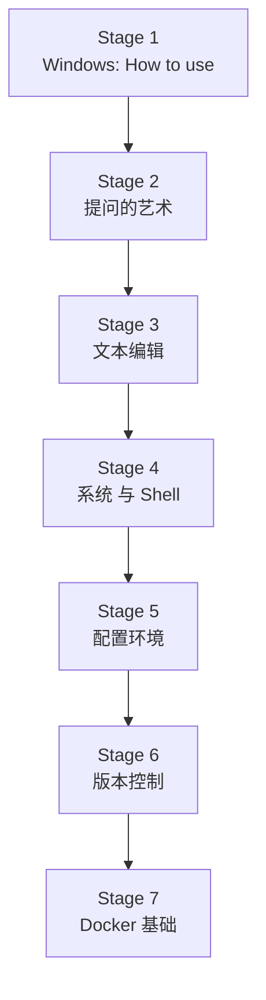

> [!DETAILS-AI] 本章 AI 摘要
> 本章共 7 个阶段、N/A 节内容，覆盖计算机科班生应知应会的基础能力，从文件管理、Windows 设置、浏览器与常用工具，到文本编辑、Markdown、Shell、Git、Docker 与完整开发环境搭建。按顺序学习可补齐大学课程中 "缺失" 的常识性工具技能。

## 一、前言

诚然，我国的绝大多数计算机科班生在上大学前甚至可能从未接触过计算机，他们或许因各种各样的原因，走入了这类专业。然而，大多数科班生的课程培养方案，往往假设他们已经具备了基本的计算机操作能力，同时也并不包含一些如 Git、Docker 等 “现代化内容” 的教学。

> [!DETAILS-FAQ] 为什么叫 “缺失的一学期”
> 如果你注意到本章的名字，可能会好奇为什么叫 “缺失的一学期” ？  
> 其实，本章最初编写的灵感来源于 `MIT` 的一门课程 [Missing Semester of Your CS Education](https://missing.csail.mit.edu/)，该课程的目标是弥补计算机科班生在大学课程中缺失的一些基础能力。  
> 我们在此基础上，结合我们所处大环境的实际情况，编写了本章。

## 二、章节内容流程图

| Stage | 小节 | 主题 |
| :--- | :--- | :--- |
| 1 Windows: How to use | [1.1 文件管理](./1.1-File-Management) | 路径、扩展名与文件组织 |
| 1 | [1.2 Windows 设置](./1.2-Windows-Settings) | 系统配置与终端环境 |
| 1 | [1.3 浏览器](./1.3-Browser) | 高效搜索与标签管理 |
| 1 | [1.4 常用工具](./1.4-Common-Tools) | VS Code、Git、截图等 |
| 2 提问的艺术 | [1.5 良好的计算机使用习惯](./1.5-Good-Habits) | 备份、安全与快捷键 |
| 2 | [1.6 如何提问](./1.6-Asking-Questions) | 搜索先行与提问规范 |
| 2 | [1.7 社区与相关平台](./1.7-Community-Platforms) | GitHub、Stack Overflow |
| 3 文本编辑 | [1.9 文本编辑](./1.9-Text-Editing) | 编码、换行符与编辑器 |
| 3 | [1.10 Markdown](./1.10-Markdown) | 轻量标记语言 |
| 3 | [1.11 Mermaid](./1.11-Mermaid) | 流程图与图表 |
| 4 系统 与 Shell | [1.12 主流操作系统分类](./1.12-Operating-Systems) | Windows/Linux/macOS |
| 4 | [1.13 Shell 基础](./1.13-Shell-Basics) | 命令行与脚本 |
| 4 | [1.14 Shell 中的文本编辑](./1.14-Shell-Text-Editing) | Vim、Nano 等 |
| 5 配置环境 | [1.15 配置环境](./1.15-Environment-Setup) | 开发环境搭建 |
| 6 版本控制 | [1.16 版本控制 Git](./1.16-Version-Control-Git) | 分支、合并与远程 |
| 6 | [1.17 GitHub 与 CNB](./1.17-GitHub-CNB) | 代码托管与协作 |
| 7 Docker基础 | [1.18 Docker 基础](./1.18-Docker-Basics) | 容器化开发环境 |

## 三、分阶段详解

### 1. Stage 1：Windows: How to use

| 小节 | 你会学到什么 |
| :--- | :--- |
| [1.1 文件管理](./1.1-File-Management) | 理解路径、扩展名、隐藏文件，学会用目录树组织项目 |
| [1.2 Windows 设置](./1.2-Windows-Settings) | 显示扩展名、配置环境变量、安装 Windows Terminal |
| [1.3 浏览器](./1.3-Browser) | 掌握搜索引擎技巧、书签与标签管理、开发者工具 |
| [1.4 常用工具](./1.4-Common-Tools) | 认识 VS Code、终端、Git、截图、压缩等日常工具 |

### 2. Stage 2：提问的艺术

| 小节 | 你会学到什么 |
| :--- | :--- |
| [1.5 良好的计算机使用习惯](./1.5-Good-Habits) | 培养备份、安全、快捷键、命名规范等好习惯 |
| [1.6 如何提问](./1.6-Asking-Questions) | 学会先搜索再提问，掌握提问的规范与模板 |
| [1.7 社区与相关平台](./1.7-Community-Platforms) | 了解 GitHub、Stack Overflow、CNB 等平台的用法 |

### 3. Stage 3：文本编辑

| 小节 | 你会学到什么 |
| :--- | :--- |
| [1.9 文本编辑](./1.9-Text-Editing) | 理解字符编码（UTF-8）、换行符（LF/CRLF）与编辑器选择 |
| [1.10 Markdown](./1.10-Markdown) | 掌握标题、列表、代码块、表格、链接等基础语法 |
| [1.11 Mermaid](./1.11-Mermaid) | 用文本绘制流程图、时序图、甘特图 |

### 4. Stage 4：系统与 Shell

| 小节 | 你会学到什么 |
| :--- | :--- |
| [1.12 主流操作系统分类](./1.12-Operating-Systems) | 了解 Windows/Linux/macOS 的差异与适用场景 |
| [1.13 Shell 基础](./1.13-Shell-Basics) | 掌握文件操作、管道、重定向、权限等核心命令 |
| [1.14 Shell 中的文本编辑](./1.14-Shell-Text-Editing) | 学会 Vim、Nano 等终端编辑器的基本操作 |

### 5. Stage 5：环境配置

| 小节 | 你会学到什么 |
| :--- | :--- |
| [1.18 配置环境](./1.18-Environment-Setup) | 串联 WSL、Git、Node.js、Python、VS Code、Docker 搭建完整环境 |

### 6. Stage 6：版本控制

| 小节 | 你会学到什么 |
| :--- | :--- |
| [1.15 版本控制 Git](./1.15-Version-Control-Git) | 理解 Git 模型，掌握分支、合并、撤销、远程操作 |
| [1.16 GitHub 与 CNB](./1.16-GitHub-CNB) | 学会 GitHub/CNB 注册、SSH 配置、Fork+PR 协作流程 |

### 7. Stage 7：Docker 基础

| 小节 | 你会学到什么 |
| :--- | :--- |
| [1.17 Docker 基础](./1.17-Docker-Basics) | 用 Docker 容器化开发环境，掌握镜像、容器、Dockerfile |

## 四、阅读建议

**本章阅读清单:**

- [ ] 通读章节概览，了解本章覆盖的内容与学习路径
- [ ] 完成 Stage 1：练习文件管理、Windows 设置、浏览器与常用工具
- [ ] 完成 Stage 2：培养备份、安全习惯，学会提问与社区参与
- [ ] 完成 Stage 3：制定个人学习方向规划
- [ ] 完成 Stage 4：掌握文本编辑、Markdown 与 Mermaid 文档写作
- [ ] 完成 Stage 5：熟悉操作系统差异，掌握 Shell 基础与终端编辑
- [ ] 完成 Stage 6：学会 Git 版本控制、GitHub 协作与 Docker 容器化
- [ ] 完成 Stage 7：搭建完整的开发环境并通过验证清单
- [ ] 把学习过程中遇到的命令、配置整理成自己的速查表
