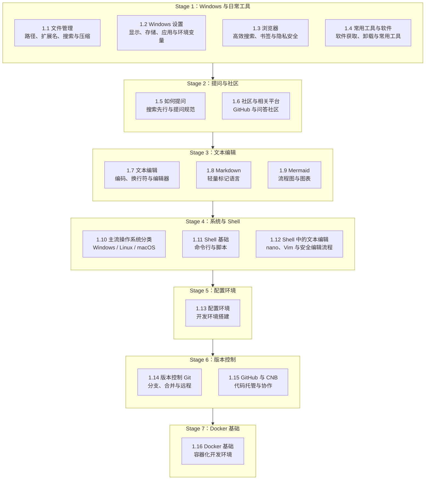

> [!DETAILS-AI] 本章 AI 摘要
> 本章包含 7 个阶段、16 节已发布内容，覆盖文件管理、Windows 设置、浏览器与常用工具，以及文本编辑、Markdown、Shell、开发环境、Git 和 Docker。既可以按阶段系统学习，也可以从当前问题对应的小节开始查阅。

## 一、前言

> 正所谓 —— **“文化工作者一定要有文化”**，**“科技联盟一定要懂科技”**，计算机科班生也一定要会使用计算机。

诚然，我国的绝大多数计算机科班生在上大学前甚至可能从未接触过计算机，他们或许因各种各样的原因，走入了这类专业。然而，大多数科班生的课程培养方案，往往假设他们已经具备了基本的计算机操作能力，同时也并不包含一些如 配置环境、Git、Docker、智能体编程 等 “现代化内容” 的教学。

> [!DETAILS-FAQ] 为何名为 “缺失的一学期” ？
> 如果我们注意到本章的标题，或许会好奇：为什么叫“缺失的一学期”？
>
> 而本章的编写灵感，最初源于 MIT 的一门课程：[The Missing Semester of Your CS Education](https://missing.csail.mit.edu/)。这门课程主要关注那些在传统课堂中较少被系统讲授，但会长期影响学习与开发效率的工具与实践能力。
>
> 在此基础上，我们结合所处大环境的实际情况，进一步补充了一些 `CSer` 在大学阶段较少接触，却又十分重要的基础能力。

## 二、章节导图

## 三、分阶段目标

### Stage 1：Windows 与日常工具

| 小节 | 目标 |
| :--------------------------------------- | :------------------------------- |
| [1.1 文件管理](./ch1/1.1-File-Management) | 理解路径与扩展名，学会组织、搜索与压缩文件 |
| [1.2 Windows 设置](./ch1/1.2-Windows-Settings) | 配置显示、存储、应用管理与环境变量，保持系统更新 |
| [1.3 浏览器](./ch1/1.3-Browser) | 掌握搜索技巧、书签与标签管理、隐私安全与开发者工具 |
| [1.4 常用工具与软件](./ch1/1.4-Common-Tools) | 按需选装输入法、PDF、笔记、截图、压缩等 Windows 常用软件 |

### Stage 2：提问与社区

| 小节 | 目标 |
| :--------------------------------------- | :---------------------------------- |
| [1.5 如何提问](./ch1/1.5-Asking-Questions) | 学会先搜索再提问，掌握提问规范与模板 |
| [1.6 社区与相关平台](./ch1/1.6-Community-Platforms) | 了解 GitHub、Stack Overflow 等社区平台的用法 |

### Stage 3：文本编辑

| 小节 | 目标 |
| :------------------------------- | :--------------------- |
| [1.7 文本编辑](./ch1/1.7-Text-Editing) | 理解字符编码、换行符与编辑器选择 |
| [1.8 Markdown](./ch1/1.8-Markdown) | 掌握标题、列表、代码块、表格、链接等基础语法 |
| [1.9 Mermaid](./ch1/1.9-Mermaid) | 用文本绘制流程图、时序图与甘特图 |

### Stage 4：系统与 Shell

| 小节 | 目标 |
| :--------------------------------------------- | :------------------------------ |
| [1.10 主流操作系统分类](./ch1/1.10-Operating-Systems) | 了解 Windows、Linux、macOS 的差异与适用场景 |
| [1.11 Shell 基础](./ch1/1.11-Shell-Basics) | 掌握文件操作、管道、重定向、权限等核心命令 |
| [1.12 Shell 中的文本编辑](./ch1/1.12-Shell-Text-Editing) | 使用 `nano` 与 `Vim` 安全地修改和验证文件 |

### Stage 5：环境配置

| 小节 | 目标 |
| :------------------------------------ | :------------------------------------------------ |
| [1.13 配置环境](./ch1/1.13-Environment-Setup) | 串联 WSL、Git、Node.js、Python、VS Code 与 Docker，搭建完整环境 |

### Stage 6：版本控制

| 小节 | 目标 |
| :------------------------------------------ | :------------------------------------ |
| [1.14 版本控制 Git](./ch1/1.14-Version-Control-Git) | 理解 Git 模型，掌握分支、合并、撤销与远程操作 |
| [1.15 GitHub 与 CNB](./ch1/1.15-GitHub-CNB) | 完成账号、SSH、仓库与 Fork + Pull Request 协作流程 |

### Stage 7：Docker 基础

| 小节 | 目标 |
| :------------------------------------- | :----------------------------------- |
| [1.16 Docker 基础](./ch1/1.16-Docker-Basics) | 使用镜像、容器、Dockerfile 与 Compose 管理可复现环境 |

以上七个阶段覆盖了从基础操作到开发工具链的核心内容。不必一口气读完：第一次阅读可以先建立全局认识，遇到实际问题时再回到对应小节复习和练习。

## 四、TODO 清单

> [!TIP] 以任务驱动阅读
> 每学完一节，立即完成一个小任务，例如整理下载目录、写一份 Markdown 笔记或创建一次 Git 提交。可验证的实践比单纯记忆命令更容易形成长期能力。

- [ ] 通读章节概览，了解本章覆盖的内容与学习路径
- [ ] 完成 Stage 1：[文件管理](./ch1/1.1-File-Management)、[Windows 设置](./ch1/1.2-Windows-Settings)、[浏览器](./ch1/1.3-Browser)与[常用工具与软件](./ch1/1.4-Common-Tools)
- [ ] 完成 Stage 2：[如何提问](./ch1/1.5-Asking-Questions)、[社区](./ch1/1.6-Community-Platforms)
- [ ] 完成 Stage 3：[文本编辑](./ch1/1.7-Text-Editing)、[Markdown](./ch1/1.8-Markdown)、[Mermaid](./ch1/1.9-Mermaid)
- [ ] 完成 Stage 4：[主流操作系统](./ch1/1.10-Operating-Systems)、[Shell 基础](./ch1/1.11-Shell-Basics)、[Shell 中的文本编辑](./ch1/1.12-Shell-Text-Editing)
- [ ] 完成 Stage 5：[环境配置](./ch1/1.13-Environment-Setup)
- [ ] 完成 Stage 6：[版本控制 Git](./ch1/1.14-Version-Control-Git)、[GitHub 与 CNB](./ch1/1.15-GitHub-CNB)
- [ ] 完成 Stage 7：[Docker 基础](./ch1/1.16-Docker-Basics)
