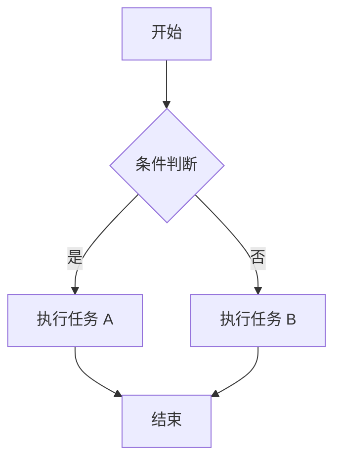
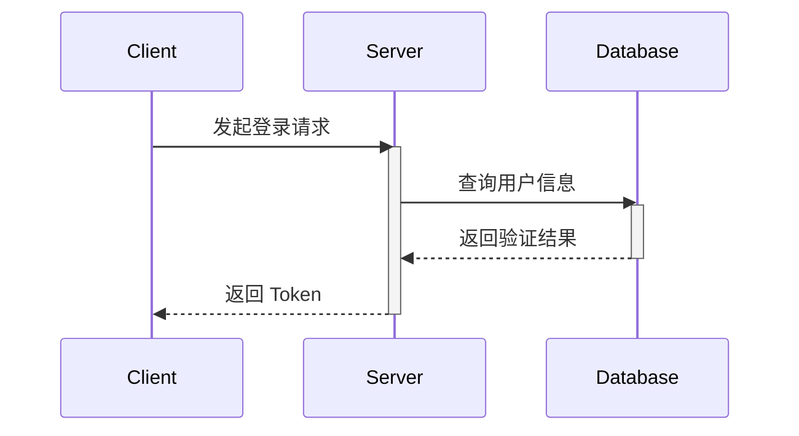
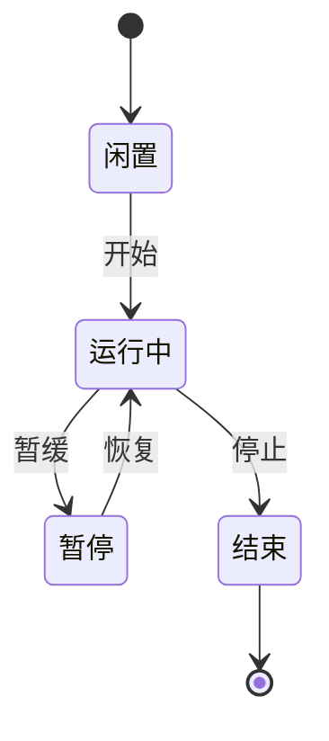

本文档展示了基础 Markdown、GitHub Flavored Markdown (GFM) 和 Mermaid 绘图的语法。

## 1. 基础 Markdown 语法

### 标题 (Headers)

# 一级标题

## 二级标题

### 三级标题

#### 四级标题

```md
# 一级标题
## 二级标题
### 三级标题
#### 四级标题
```

### 文本强调 (Emphasis)

*斜体文字*  
**粗体文字**  
***粗斜体文字***

```md
*斜体文字*
**粗体文字**
***粗斜体文字*** 
```

### 列表 (Lists)

**无序列表:**

* 项目 A
* 项目 B
  * 子项目 B.1
  * 子项目 B.2

**有序列表:**

1. 第一项
2. 第二项
3. 第三项

### 链接与图片 (Links & Images)

[SSJ的博客](https://blog.shenshijun.space/)


### 行内代码 (Inline Code)

文本中可以穿插一小段代码，比如 `console.log('Hello World')`。

### 分隔线 (Horizontal Rules)

---

```md
---
```

## 2. GitHub Flavored Markdown (GFM) 语法

### 任务列表 (Task Lists)

* [x] 完成需求分析
* [x] 编写示例文档
* [ ] 提交代码并在生产环境部署
3

### 表格 (Tables)

| 特性 | 支持度 | 备注 |
| :--- | :---: | ---: |
| 表格支持 | 完美 | 居中居右对齐 |
| 任务列表 | 完美 | GFM 标准 |
| 删除线 | 完美 | `~~文字~~` |

### 删除线 (Strikethrough)

这是一段~~被划掉的文本~~。

### 自动链接 (Autolinks)

你可以直接访问我的博客: <https://blog.shenshijun.space/>

### 引用强调 (Blockquotes)

> 这是一个一级引用文本。
> > 这是一个嵌套的二级引用。
> >
> > **注意:** 引用中也可以使用其他 Markdown 语法。

### 警告与提示 (Alerts)

GitHub 支持特殊的 Blockquote 语法来渲染带有颜色和图标的提示块：

> [!NOTE]
> 这是一个注记 (Note)，提供有用的补充信息。

---

> [!TIP]
> 这是一个提示 (Tip)，提供建议或简便方法。

---

> [!IMPORTANT]
> 这是一个重要信息 (Important)，突出关键上下文。

---

> [!WARNING]
> 这是一个警告 (Warning)，提醒需要小心操作以避免意外。

---

> [!CAUTION]
> 这是一个危险警告 (Caution)，告知可能会导致破坏性后果的操作。

### 可折叠块 (Collapsible Details)

支持可折叠的详情块，适合隐藏补充说明、进阶内容或长篇注释：

> [!DETAILS]
>
> 这是一个可折叠的内容块，默认处于折叠状态。你可以在这里放置额外的信息、示例代码或者长篇说明。

默认展开的详情块：
> [!DETAILS+] 默认展开折叠的详情块
>
> 使用 `[!DETAILS+]` 语法可以让折叠块默认处于展开状态。

### 可折叠块变体 (Collapsible Variants)

除了基础的 `[!DETAILS]` 之外，还支持多种语义化折叠块类型，使用 `[!DETAILS-XXX]` 语法：

#### 常见问题 (FAQ)

> [!DETAILS-FAQ] 什么是 Neoverse？
>
> Neoverse 是一个面向未来的文档平台，致力于提供优雅的文档阅读体验。

#### 解答 (Answer)

> [!DETAILS-ANSWER] 如何参与贡献？
>
> 你可以通过提交 Pull Request、报告 Issue 或改进文档来参与项目贡献。

#### 示例 (Example)

> [!DETAILS-EXAMPLE] 使用折叠块组织代码示例
>
> 你可以将较长的代码示例放入折叠块中，让读者按需展开查看，保持文档的简洁性。
>
> ```cpp
> // src/example.cpp
> #include <iostream>
> int main() {
>     std::cout << "Hello, Neoverse!" << std::endl;
>     return 0;
> }
> ```

#### 提示 (Hint)

> [!DETAILS-HINT] 快捷键技巧
>
> 使用 `Ctrl + K` 可以快速打开搜索对话框，提升文档浏览效率。

### 语法高亮代码块 (Code Blocks)

本文档中的代码块支持以下增强功能：

* 从代码顶部注释自动识别文件路径
* 在代码块标题栏显示文件路径
* 右上角内置复制按钮，支持一键复制
* 保留 fumadocs 原有的所有代码高亮和行号功能

### 示例 1：JavaScript 代码块

```javascript
// src/utils/helper.js
export function greet(name) {
  return `Hello, ${name}!`;
}

export const add = (a, b) => a + b;
```

### 示例 2：TypeScript 代码块

```typescript
// src/components/Button.tsx
import { ButtonHTMLAttributes, ReactNode } from 'react';

interface ButtonProps extends ButtonHTMLAttributes<HTMLButtonElement> {
  children: ReactNode;
  variant?: 'primary' | 'secondary';
}

export function Button({ children, variant = 'primary', ...props }: ButtonProps) {
  return (
    <button className={`btn btn-${variant}`} {...props}>
      {children}
    </button>
  );
}
```

### 示例 3：HTML 代码块

```html
<!-- public/index.html -->
<!DOCTYPE html>
<html lang="zh-CN">
<head>
  <meta charset="UTF-8">
  <title>我的项目</title>
</head>
<body>
  <div id="root"></div>
</body>
</html>
```

### 示例 4：Shell 脚本

```bash
# scripts/deploy.sh
#!/bin/bash

echo "开始部署..."
npm run build
rsync -avz ./dist/ user@server:/var/www/html
echo "部署完成！"
```

### 示例 5：Python 代码块

```python
# app/main.py
from fastapi import FastAPI

app = FastAPI()

@app.get("/")
def read_root():
    return {"Hello": "World"}

@app.get("/items/{item_id}")
def read_item(item_id: int, q: str | None = None):
    return {"item_id": item_id, "q": q}
```

### 示例 6：不带文件路径的代码块

普通的代码块（不带顶部注释）也能正常工作，只是不会显示文件路径标题：

```css
.container {
  display: flex;
  align-items: center;
  justify-content: center;
  padding: 20px;
  background: linear-gradient(135deg, #667eea 0%, #764ba2 100%);
  border-radius: 12px;
}
```

## 2. Mermaid 图表语法

### 流程图 (Flowchart)



### 时序图 (Sequence Diagram)



### 状态图 (State Diagram)


